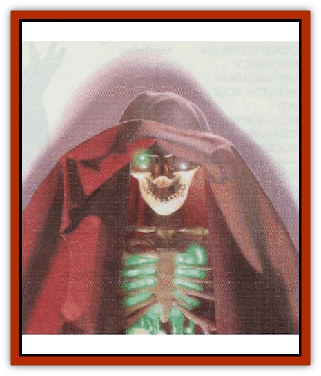
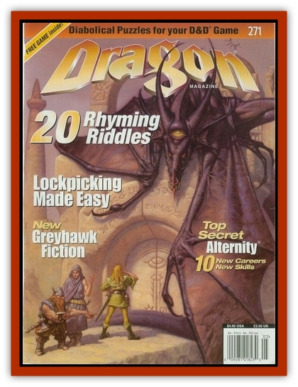

# Visceraith

| Statistic | **Visceraith** |
| --- | --- |
| **Activity Cycle:** | Any |
| **Alignment:** | Neutral (evil) |
| **Armor Class:** | 2 or 7 |
| **Climate/Terrain:** | Any |
| **Damage/Attack:** | 1-6/1-6 or by weapon type (&times;2) |
| **Diet:** | None |
| **Frequency:** | Very rare |
| **Hit Dice:** | 7+3 |
| **Intelligence:** | Exceptional (15-16) |
| **Magic Resistance:** | See below |
| **Morale:** | Champion (15-16) |
| **Movement:** | 12 or Fly 9 (D) |
| **No. Appearing:** | 1 |
| **No. of Attacks:** | 2 |
| **Organization:** | Solitary |
| **Size:** | M (4½-6½') |
| **Special Attacks:** | Bone control |
| **Special Defenses:** | +1 or better weapon to hit |
| **THAC0:** | 13 |
| **Treasure:** | W (&times;2) |
| **XP Value:** | 3,000 |

The visceraith, or bone spirit, exists in a twilight of shadows and whispers. The entity appears as a brain with eyes and a tongue. Nerves and tissue connect the brain to a dangling set of organs - heart, lungs, stomach, and so on - all glowing green. Visceraiths are formed only when the powerful yearning for life is combined with a wizard's use of magic. As a result, visceraiths are impossible to summon or create.

As hermit crabs use discarded shells for protection, visceraiths are usually found within humanoid skeletons they have assembled with their bone control ability. As with "normal" undead [[Skeleton|skeletons]], the bones are contiguous without connective tissue. The brain and glowing eyes inhabit the skull, and a whispering tongue finds residence in the jaw. The other organs arrange themselves within the torso. The visceraith can use any unbroken bone to augment itself as long as the framework can contain the creature. Insinuating itself into a skeleton requires 1 turn, but exiting takes only 1 round. Some bone spirits assemble specialized skeletons (with an animal skull that permits a bite attack, for example).

Supported in this fashion, the visceraith moves among the living, concealing its nature under robes. The bone spirit resides where it can lead a secluded existence, though it might hire servants or find companions. Living residents in the home of a visceraith are usually treated well, but the bone spirit is not above murder to protect its identity.

**Combat:** A visceraith is usually (95% chance) found "wearing" a skeleton (AC 2); otherwise it has an AC of 7. Any intelligent being seeing a visceraith free of its skeleton must make a successful saving throw vs. paralyzation or be stricken with fear for 1d4 rounds, suffering a -2 penalty on attack rolls and a +2 penalty to AC.

If the creature has claws, it inflicts 1d6 points of damage per hit. If it has "normal" hands, it employs weapons usable by mages, can attack with a weapon in each hand without penalty, but doesn't use armor or shields.

The visceraith's deadliest attack is its bone control ability, which has a range of 60'. The target must make a saving throw vs. death magic. If successful, there is no effect, but if the saving throw fails, the chosen bone snaps, resulting in a compound fracture and 1d6+4 points of damage. The victim is immobilized due to shock, loses 2 hit points per round until bleeding is stopped, and must make a Constitution check to avoid fainting for 1d12 rounds from the pain. The visceraith can use this attack form four times per day.

Visceraiths retain whatever spellcasting ability they had in life. They can learn the maximum number of spells allowable but cannot advance in level.

Like most undead, visceraiths are immune to *sleep*, *charm*, and *hold* spells, as well as to cold-based attacks. Fire-based attacks cause normal damage, nonmagical weapons are ineffective, and blunt weapons of +1 or greater enchantment cause normal damage. Slashing or piercing weapons of +1 or greater enchantment inflict half damage.

Visceraiths are unharmed by holy water and can't be turned.

**Habitat/Society:** Visceraiths seek out the company of living beings when possible and shun other undead. They do not despise the living, instead hoping to continue the life they left behind. These creatures are not always evil but will go to great lengths to avoid exposure or destruction.

**Ecology:** An undead being, the visceraith has no physiological functions, so it doesn't occupy a proper slot in any world's biosphere.

*by Richard Sanders*

---
## Discovery & Documentation

**Source Publication:** Dragon271 (2000)
**Campaign Setting:** Dragon Magazine
**Author(s):** Richard Sanders, Leon Chang, Talon Dunning, Dennis Caiero

### Other Creatures Found in This Source Book
   * [[Dvati|Dvati]]
