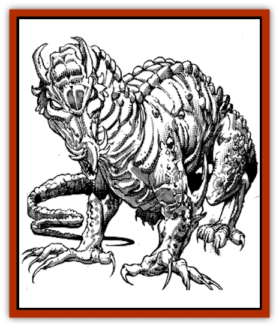

# Vishap

| Statistic | **Vishap** |
| --- | --- |
| **Activity Cycle:** | Any |
| **Alignment:** | Neutral evil |
| **Armor Class:** | 3 (base) |
| **Climate/Terrain:** | Tropical/Hills or desert |
| **Damage/Attack:** | 1-4/1-4/2-12 and 2-8 (+combat modifier) |
| **Diet:** | Carnivore |
| **Frequency:** | Rare |
| **Hit Dice:** | 8 (base) |
| **Intelligence:** | High (13-14) |
| **Magic Resistance:** | Varies |
| **Morale:** | Elite (14) |
| **Movement:** | 18, Jp 6 |
| **No. Appearing:** | 1 (2-9) |
| **No. of Attacks:** | 3 and 1 |
| **Organization:** | Solitary or clan |
| **Size:** | Huge (25' base) |
| **Special Attacks:** | Special |
| **Special Defenses:** | Varies |
| **THAC0:** | 13 |
| **Treasure:** | Special |
| **XP Value:** | Varies |

A vishap is a flightless Zakharan [[Dragon_General_Information|dragon]], a crafty and cowardly creature that preys on the weak and flees the strong. They are sly, cunning predators that fight through stealth and deceit. Like all dragons, vishaps are exceedingly vain and greedy.

Despite its great size, a vishap can run, climb, and jump with surprising agility, although it likes to foster a sedentary image in order to catch its opponents off-guard. The scales of a vishap can blend in perfectly with its surroundings (lending it a +4 bonus in surprise situations).

Like other dragons, the vishap has excellent sight, smell, and hearing. Its senses allow it to detect invisible creatures or objects in a 10' radius per age category. Vishaps are adept linguists; they can fluently speak Midani of Zakhara, and up to five additional languages.

Unlike their western cousins, vishaps have no *clairaudience* ability with respect to their lairs; they have no breath weapon nor can they cast spells. They exude no dragon fear. A vishap must survive by its wits alone. Given their penchant for destruction, however, most lead short, violent lives.

**Combat:** Using their camouflage ability, vishaps will watch a potential target for days, learning its strengths and weaknesses before attacking. After a vishap has surveyed its target, it will usually approach to speak with its target. Weak, fearful victims are immediately attacked. Weak victims that flatter the vishap might be spared if they swear to yield all treasure or serve the vishap as slaves. Victims who display a willingness for combat will be left alone after the interview and attacked at a later date when they can be caught by surprise.

A vishap can physically attack one creature with its teeth and claws; it can also lash its tail at up to four man-sized creatures, doing 2d4 points (base damage) to each victim. Victims must make a Dexterity check or lose their footing and be unable to attack during the subsequent round.

Vishaps are immune to all enchantment/charm spells from birth. As they age, they gain the following additional powers:

*Young:* *sleep* 2x/day; *Juvenile:* *invisibility* 1x/day; *Adult:* *suggestion* 1x/day; *Very old:* *charm monster* 1x/day; *Venerable:* *undetectable lie* 1x/day.

**Habitat/Society:** These dragons lair in shallow, open caverns where they have a commanding view of the approach and entry. Vishaps will always have at least one secret plan of escape should they be cornered in their lair.

**Ecology:** Vishaps are carnivores, although they may stoop to eating carrion or plants in order to survive. They greatly relish human and demihuman flesh. Vishaps have been known to work together and enslave entire villages, thriving on the villagers' fear-induced worship.

| Age | Body Lgth.(') | Tail Lgth.(') | AC | HD | MR | Treasure | XP Value |
| --- | --- | --- | --- | --- | --- | --- | --- |
| 1 | 1-4 | 1-5 | 7 | 2 | Nil | Nil | 420 |
| 2 | 4-12 | 5-10 | 6 | 4 | Nil | Nil | 975 |
| 3 | 12-20 | 10-18 | 5 | 6 | Nil | Nil | 3,000 |
| 4 | 20-28 | 18-26 | 4 | 8 | Nil | Nil | 5,000 |
| 5 | 28-35 | 26-32 | 3 | 9 | 5% | D | 8,000 |
| 6 | 35-42 | 32-40 | 2 | 10 | 10% | D,Y,U | 11,000 |
| 7 | 42-50 | 40-48 | 1 | 11 | 15% | D,Y,U | 12,000 |
| 8 | 50-58 | 48-56 | 0 | 12 | 20% | D,Y,U | 14,000 |
| 9 | 58-66 | 56-64 | -1 | 13 | 25% | D,Y,Ux2 | 15,000 |
| 10 | 66-72 | 64-70 | -2 | 14 | 30% | D,Y,Ux2 | 16,000 |
| 11 | 72-80 | 70-78 | -3 | 15 | 35% | D,Y,Ux2 | 17,000 |
| 12 | 80-88 | 78-86 | -4 | 16 | 40% | D,Y,Ux3 | 18,000 |

---
## Discovery & Documentation

**Source Publication:** MC13 Al-Qadim Appendix (1992)
**Campaign Setting:** Al-Qadim (Forgotten Realms)
**Author(s):** C. Terry Phillips

### Other Creatures Found in This Source Book
   * [[Ammut|Ammut]]
   * [[Ashira|Ashira]]
   * [[Asuras|Asuras]]
   * [[Black_Cloud_of_Vengeance|Black Cloud of Vengeance]]
   * [[Buraq|Buraq]]
   * [[Camel|Camel]]
   * [[Camel_of_the_Pearl|Camel of the Pearl]]
   * [[Centaur_Desert|Centaur, Desert]]
   * [[Copper_Automaton|Copper Automaton]]
   * [[Debbi|Debbi]]
   * [[Elephant_Bird|Elephant Bird]]
   * [[Gen|Gen]]
   * [[Genie_Noble_Dao|Genie, Noble Dao]]
   * [[Genie_Noble_Djinni|Genie, Noble Djinni]]
   * [[Genie_Noble_Efreeti|Genie, Noble Efreeti]]
   * [[Genie_Noble_Marid|Genie, Noble Marid]]
   * [[Genie_Tasked_Architect_Builder|Genie, Tasked, Architect/Builder]]
   * [[Genie_Tasked_Artist|Genie, Tasked, Artist]]
   * [[Genie_Tasked_Guardian|Genie, Tasked, Guardian]]
   * [[Genie_Tasked_Herdsman|Genie, Tasked, Herdsman]]
   * [[Genie_Tasked_Slayer|Genie, Tasked, Slayer]]
   * [[Genie_Tasked_Warmonger|Genie, Tasked, Warmonger]]
   * [[Genie_Tasked_Winemaker|Genie, Tasked, Winemaker]]
   * [[Ghost_Mount|Ghost Mount]]
   * [[Ghul|Ghul]]
   * [[Giant_Desert|Giant, Desert]]
   * [[Giant_Jungle|Giant, Jungle]]
   * [[Giant_Reef|Giant, Reef]]
   * [[Giant_Zakhara_General_Information|Giant (Zakhara), General Information]]
   * [[Hama|Hama]]
   * [[Heway|Heway]]
   * [[Living_Idol|Living Idol]]
   * [[Lycanthrope_Werehyena|Lycanthrope, Werehyena]]
   * [[Lycanthrope_Werelion|Lycanthrope, Werelion]]
   * [[Markeen|Markeen]]
   * [[Maskhi|Maskhi]]
   * [[Mason_Wasp_Giant|Mason Wasp, Giant]]
   * [[Nasnas|Nasnas]]
   * [[Pahari|Pahari]]
   * [[Rom|Rom]]
   * [[Sabu_Lord|Sabu Lord]]
   * [[Sakina|Sakina]]
   * [[Serpent_Lord|Serpent Lord]]
   * [[Serpent_Winged|Serpent, Winged]]
   * [[Silat|Silat]]
   * [[Simurgh|Simurgh]]
   * [[Stone_Maiden|Stone Maiden]]
   * [[Zaratan|Zaratan]]
   * [[Zin|Zin]]
