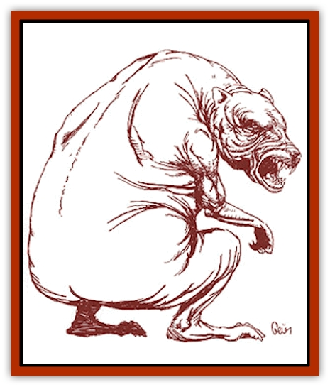

# Voat - Herathian

| Statistic | **Voat, Herathian** |
| --- | --- |
| **Activity Cycle:** | Any |
| **Alignment:** | Neutral |
| **Armor Class:** | 5 |
| **Climate/Terrain:** | Any forest or plains |
| **Damage/Attack:** | 1d6/1d6/2d10 |
| **Diet:** | Carnivore |
| **Frequency:** | Rare |
| **Hit Dice:** | 7+3 |
| **Intelligence:** | Semi- (2-4) |
| **Magic Resistance:** | Nil |
| **Morale:** | Fearless (20) |
| **Movement:** | 10 |
| **No. Appearing:** | 1d3 |
| **No. of Attacks:** | 3 (claw/claw/bite) |
| **Organization:** | Pack |
| **Size:** | L (7' tall) |
| **Special Attacks:** | Stun |
| **Special Defenses:** | Regeneration |
| **THAC0:** | 13 |
| **Treasure:** | Nil |
| **XP Value:** | 2,000 (+1,000 per Legacy) |

Also known as Slagovich juggernaut, this meat-eating horror is the product of yet another ancient Herathian experiment. It is also one of the Savage Coast's most destructive monsters.

Herathian voats are twisted, hairless [[Voat|voats]] grown into giant proportions. It is a bipedal monster which lumbers awkwardly along on two huge feet but is capable of short bursts of speed (Movement Rate of 18 for three rounds) if it drops down on all fours. It has no tail, but it has large, black eyes and a blunt muzzle filled with sharp teeth and an impressive set of fangs. Its arms are thin compared to its legs, though still corded with muscle and ending in a set of raking claws. The juggernaut's thick skin hangs loose as if portions of it might slough away at any time.

*The Red Curse:* The Slagovich juggernaut gains multiple Legacies, all from Region 1. Amber Paralysis, War Cry, and Weapon Hand are the most common. The creature does not require cinnabryl. In an attempt to overwhelm its opponents, the juggernaut often uses up all of its Legacies quickly.

**Combat:** The Slagovich juggernaut wades into battle with a high-pitched screeching, forcing all opponents within 30 yards to make a successful saving throw vs. paralyzation or be stunned for 1d4 rounds, losing all attacks. It can use this stun attack only once per turn. It depends on its tough skin for protection while attacking with its claws and teeth. The creature regenerates at a rate of one point per turn. Once battle has begun, the Herathian voat does not flee until its opponents are dead.

During the initial few rounds, if faced with more than one attacker, the creature will attack the largest opponent, perceiving it as the biggest threat and the better meal. If any opponent consistently inflicts large amounts of damage or ever hits for more than 15 points of damage in a single round, the juggernaut will turn on that opponent. Using this criteria, the creature moves from one attacker to another until none are left standing.

**Habitat/Society:** The Slagovich juggernaut was created to solve the Herathian voat problem. The juggernaut was infused with a taste for voats and was supposed to hunt them to extinction. This worked until the creatures learned that other food was more plentiful and just as good.

Over the centuries these creatures have developed their own migratory routine. They travel to Herath for one month in the spring to mate and roost within the forest. They then spread back out onto the Yazak Steppes and migrate back toward western Hule. It is fortunate for the races along the Savage Coast that very little of the juggernaut movement actually cross the borders of the various coastal kingdoms.

Herathian voats will attack and eat anything. They feed on [[Juhrion|juhrions]] and [[Neshezu|neshezu]] when in the right area for them. Juggernauts are also a problem for goblinoid settlements on the Yazak Steppes and communities in Western Hule.

**Ecology:** The Slagovich juggernaut is a predator of the highest order. Prides of [[Feliquine|feliquine]] occasionally take one down, but not without cost to themselves.

Perhaps because of the ancient magics which twisted their fates, Herathian voats appear to have no redeeming qualities at all. Alchemists cannot even find an application that takes advantage of its limited regenerative power. (Blood from other regenerating beasts is a prime ingredient in *potions of healing*.)

---
## Discovery & Documentation

**Source Publication:** Monstrous Compendium Savage Coast Appendix (Online Exclusive) (1995)
**Campaign Setting:** Mystara
**Author(s):** Loren L Coleman, Ted James, Thomas Zuvich, Cindi M. Rice

### Other Creatures Found in This Source Book
   * [[Aranea_Savage_Coast|Aranea (Savage Coast)]]
   * [[Arashaeem|Arashaeem]]
   * [[Batracine|Batracine]]
   * [[Cat_Marine|Cat, Marine]]
   * [[Cinnavixen|Cinnavixen]]
   * [[Clockwork_Swordsman|Clockwork Swordsman]]
   * [[Critter_Temple|Critter, Temple]]
   * [[Cursed_One|Cursed One]]
   * [[Deathmare|Deathmare]]
   * [[Dragon_Savage_Coast_Crimson|Dragon (Savage Coast), Crimson]]
   * [[Dragon_Savage_Coast_Red_Hawk|Dragon (Savage Coast), Red Hawk]]
   * [[Echyan|Echyan]]
   * [[Ee'aar|Ee'aar]]
   * [[Enduk|Enduk]]
   * [[Fachan_Savage_Coast|Fachan (Savage Coast)]]
   * [[Feliquine|Feliquine]]
   * [[Fiend_Narvaezan|Fiend, Narvaezan]]
   * [[Frelôn|Frelôn]]
   * [[Ghriest|Ghriest]]
   * [[Glutton_Sea|Glutton, Sea]]
   * [[Goatman|Goatman]]
   * [[Golem_Naâruk|Golem, Naâruk]]
   * [[Golem_Savage_Coast|Golem (Savage Coast)]]
   * [[Grudgling|Grudgling]]
   * [[Heraldic_Servant_I|Heraldic Servant I]]
   * [[Heraldic_Servant_II|Heraldic Servant II]]
   * [[Heraldic_Servant_III|Heraldic Servant III]]
   * [[Heraldic_Servant_IV|Heraldic Servant IV]]
   * [[Heraldic_Servant_V|Heraldic Servant V]]
   * [[Heraldic_Servant_General_Information|Heraldic Servant, General Information]]
   * [[Hermit_Sea|Hermit, Sea]]
   * [[Jorri|Jorri]]
   * [[Juhrion|Juhrion]]
   * [[Kla'a-tah|Kla'a-tah]]
   * [[Leech_Legacy|Leech, Legacy]]
   * [[Lich_Inheritor|Lich, Inheritor]]
   * [[Lizard_Kin_Savage_Coast|Lizard Kin (Savage Coast)]]
   * [[Lupasus|Lupasus]]
   * [[Lupin|Lupin]]
   * [[Lyra_Bird_Saragón|Lyra Bird, Saragón]]
   * [[Malfera|Malfera]]
   * [[Manscorpion_Nimmurian|Manscorpion, Nimmurian]]
   * [[Mythuínn_Folk|Mythuínn Folk]]
   * [[Neshezu|Neshezu]]
   * [[Nikt'oo|Nikt'oo]]
   * [[Nosferatu|Nosferatu]]
   * [[Omm-wa|Omm-wa]]
   * [[Omshirim|Omshirim]]
   * [[Parasite_Savage_Coast|Parasite (Savage Coast)]]
   * [[Phanaton|Phanaton]]
   * [[Plant_Savage_Coast|Plant (Savage Coast)]]
   * [[Pudding_Vermilion|Pudding, Vermilion]]
   * [[Rakasta|Rakasta]]
   * [[Ray_Forest|Ray, Forest]]
   * [[Shedu_Greater_Savage_Coast|Shedu, Greater (Savage Coast)]]
   * [[Shimmerfish|Shimmerfish]]
   * [[Skinwing|Skinwing]]
   * [[Spawn_of_Nimmur|Spawn of Nimmur]]
   * [[Spider-spy|Spider-spy]]
   * [[Spirit_Heroic|Spirit, Heroic]]
   * [[Spirit_Walleran|Spirit, Walleran]]
   * [[Succulus|Succulus]]
   * [[Swampmare|Swampmare]]
   * [[Symbiont_Shadow|Symbiont, Shadow]]
   * [[Tortle|Tortle]]
   * [[Troll_Legacy|Troll, Legacy]]
   * [[Trosip|Trosip]]
   * [[Tyminid|Tyminid]]
   * [[Utukku|Utukku]]
   * [[Voat|Voat]]
   * [[Vulturehound|Vulturehound]]
   * [[Wallara|Wallara]]
   * [[Wurmling|Wurmling]]
   * [[Wynzet|Wynzet]]
   * [[Yeshom|Yeshom]]
   * [[Zombie_Red|Zombie, Red]]
