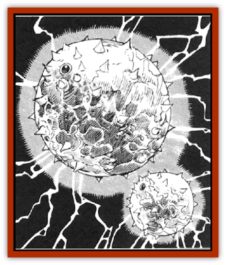

# Volt

| Statistic | **Volt** |
| --- | --- |
| **Activity Cycle:** | Any |
| **Alignment:** | Neutral |
| **Armor Class:** | 3 |
| **Climate/Terrain:** | Tropical or temperate land |
| **Damage/Attack:** | 1-4 |
| **Diet:** | Electricity and blood |
| **Frequency:** | Uncommon |
| **Hit Dice:** | 2+1 |
| **Intelligence:** | Animal (1) |
| **Magic Resistance:** | Nil |
| **Morale:** | Steady (11) |
| **Movement:** | Fl 6 (D) |
| **No. Appearing:** | 2-24 |
| **No. of Attacks:** | 1 |
| **Organization:** | Herd |
| **Size:** | S (about 2' diameter) |
| **Special Attacks:** | Electrified tail stinger, blood drain |
| **Special Defenses:** | Immune to electrical attacks |
| **THAC0:** | 19 |
| **Treasure:** | Nil |
| **XP Value:** | 420 |

Volts are curious little creatures, but bad-tempered and dangerous. These spherical animals hunt by sensing the electrical impulses of their prey. Volts are often found in or around areas of violent thunderstorm activity. Volts appear as nearly-spherical bundles of bristly grey hair. They see with two huge bulbous eyes on the top of their slightly-flattened bodies. They also possess two small curved horns just above their mouths. These mouths resemble suckers, and are full of tiny teeth, like the mouth of an [[Eel|eel]]. A 3' long, naked tail provides for balance while in flight. At the business end of the tail is a barbed stinger and an electricity-producing organ. Volts are surrounded by a faint blue electrical aura which is only visible in low-light conditions (torchlight, moonlight, or complete darkness) Furthermore, their bodies give off a curious, low humming sound, which can only be heard under the quietest of conditions. It has also been reported that small arcs of electricity snap and sizzle their way through the hairs of some individuals (5% chance).

**Combat:** Volts locate prey by detecting electrical impulses, such as nerve activity. Creatures with more complex nervous systems are attacked first, while creatures with less active nerve impulses (i.e., plant forms) or none at all (i.e., [[Golem_General_Information|golems]]) are ignored.

To attack, the volt first propels itself toward the intended victim and attempts to bite its neck, or other readily reachable body surface, for 1-4 points of damage. A succesful bite indicates that the volt has firmly attached itself to the victim's neck and cannot be detached until the victim or the volt is dead. Suction tendrils then snake out from the volt's mouth, so that it may drain blood from the victim for an addition 1-4 points of damage per round that it is attached.

Once attached, the volt will also lash out with its electrically-charged tail stinger, which hits automatically. A hit by the stinger results in 2-12 additional points of damage. A small percentage of the volt population (5%) may feed on the victim's nervous energy instead of blood. In this case, the mouth tendrils inflict 2-16 points of damage per round. After the volt is detached, this damage is recovered at a rate of 1 point per turn.

Volts tend to be rather touchy creatures, and will often attack any or all creatures present for no apparent reason.

**Habitat/Society:** Volts float by employing magic similar to that of a *levitation* spell. Mobility is provided by rapidly twitching the long tail, similar to the way in which a [[Snake|snake]] swims. Volts are rather slow and clumsy, moving at a rate of 6, and with maneuverability class D. They may be found close to the ground if hunting, or high in the air if thunderstorms are near.

Volts are drawn towards lightning sources (thunderstorms, *lightning bolt* spells, etc.) and tend to be more aggressive around such electrical discharges. During these times, but no more than once per year, they may reproduce by a sudden bright discharge of electrical energy. After 2 rounds, the crackling discharge coalesces into an immature volt. These immature volts (sometimes referred to as microvolts) stay near the lightning source, for they will become mature adults only if struck by lightning. Immature volts can survive for no more than 6 hours, and if not struck by lightning during that time, they will wither and die.

Lightning also mends 2-8 points of damage suffered by adult volts, while lesser electrical discharges such as the *shocking grasp* spell do not affect them. Volts drink blood so that they may extract substances from it (mostly salt) to charge their electrical organs.

Volt herds are led by a single creature who has been able to drain the blood (and thus the power) of other competing creatures of the same herd. The leader has 3 Hit Dice and AC 2, but is otherwise identical to other volts. The herd does not stay in or defend any particular territory, but rather follows weather fronts which have the promise of thunderstorm activity. The herds are most often found wherever and whenever thunderstorm activity is at a peak.

**Ecology:** Sages are unsure of the exact role of volts in the lands where they dwell. It is suspected that the electrical aura which surrounds them at all times helps to initiate thunderstorms. If the electrical organ is properly harvested from a dead volt, it can be useful in the creation of a *wand of lightning*.

---
## Discovery & Documentation

**Source Publication:** MC14 Fiend Folio Appendix (1992)
**Campaign Setting:** Fiends Folio
**Author(s):** Don Bingle, John Terra, Wes Nicholson, Tim Beach, Steve Hardinger, Kris Hardinger, Rob Nicholls, Greg Swedberg, Al Boyce, Vince Garcia, Norm Ritchie

### Other Creatures Found in This Source Book
   * [[Aballin|Aballin]]
   * [[Achaierai|Achaierai]]
   * [[Adherer|Adherer]]
   * [[Algoid|Algoid]]
   * [[Al-Mi'raj|Al-Mi'raj]]
   * [[Apparition|Apparition]]
   * [[Caterwaul|Caterwaul]]
   * [[Coffer_Corpse|Coffer Corpse]]
   * [[Crabman|Crabman]]
   * [[Dark_Creeper|Dark Creeper]]
   * [[Dark_Stalker|Dark Stalker]]
   * [[Darter|Darter]]
   * [[Denzelian|Denzelian]]
   * [[Dune_Stalker|Dune Stalker]]
   * [[Dwarf_Urdunnir|Dwarf, Urdunnir]]
   * [[Falcon_Fire|Falcon, Fire]]
   * [[Faux_Faerie|Faux Faerie]]
   * [[Flawder|Flawder]]
   * [[Fyrefly|Fyrefly]]
   * [[Gambado|Gambado]]
   * [[Garbug|Garbug]]
   * [[Giant_Fhoimorien|Giant, Fhoimorien]]
   * [[Gibberling|Gibberling]]
   * [[Gorbel|Gorbel]]
   * [[Grimlock|Grimlock]]
   * [[Hellcat|Hellcat]]
   * [[Ice_Lizard|Ice Lizard]]
   * [[Iron_Cobra|Iron Cobra]]
   * [[Khargra|Khargra]]
   * [[Mantari|Mantari]]
   * [[Penanggalan|Penanggalan]]
   * [[Pernicon|Pernicon]]
   * [[Phantom_Stalker|Phantom Stalker]]
   * [[Retriever|Retriever]]
   * [[Ruve|Ruve]]
   * [[Scathe|Scathe]]
   * [[Sheet_Ghoul_Sheet_Phantom|Sheet Ghoul/Sheet Phantom]]
   * [[Shocker|Shocker]]
   * [[Spanner|Spanner]]
   * [[Stwinger|Stwinger]]
   * [[Sussurus|Sussurus]]
   * [[Symbiotic_Jelly|Symbiotic Jelly]]
   * [[Terithran|Terithran]]
   * [[Thunder_Children|Thunder Children]]
   * [[Troll_Ice|Troll, Ice]]
   * [[Tween|Tween]]
   * [[Umpleby|Umpleby]]
   * [[Xill|Xill]]
   * [[Xvart|Xvart]]
   * [[Zygraat|Zygraat]]
