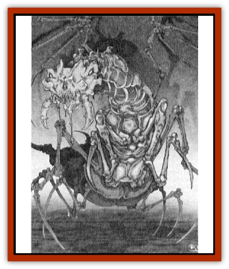
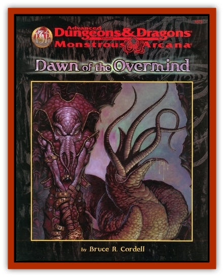

# Voor Larva

| Statistic | **Voor Larva** |
| --- | --- |
| **Activity Cycle:** | Any |
| **Alignment:** | Neutral evil |
| **Armor Class:** | -4 |
| **Climate/Terrain:** | Truespace nebulae |
| **Damage/Attack:** | 1d6&times;4/2d6 + special |
| **Diet:** | Omnivore |
| **Frequency:** | Rare |
| **Hit Dice:** | 12 |
| **Intelligence:** | Low (5-7) |
| **Magic Resistance:** | 25% |
| **Morale:** | Fearless (20) |
| **Movement:** | 16 |
| **No. Appearing:** | 1d10 |
| **No. of Attacks:** | 5 |
| **Organization:** | Hive |
| **Size:** | L (8' long) |
| **Special Attacks:** | Poison, trill |
| **Special Defenses:** | Immune to psionic influence, regeneration |
| **THAC0:** | 9 |
| **Treasure:** | Nil |
| **XP Value:** | 8,000 |

Voor larvae are 8-foot long [[Skeleton_Insectoid|skeletal insectoids]] whose "wings" are bare of any membrane, but instead serve as forward-swept, razor-tipped claws. Their bodies are composed of organic elements, often mixed with metallic, crystal, glass, stone, or other unlikely substances. More than any other creature, voor hate [[Mind_Flayer|illithids]], and break of any other activity in order to destroy any illithids sensed.

**Combat:** In combat, voor larvae use their naked, forward-swept "wings". Each is tipped with a terrible claw, which inflicts 1d6 hit points of damage with a successful attack. Voor larvae are also able to deliver a bite attack in the same round. In addition to the 2d6 hit points a succedsful bite attack delivers, voors also inject a poison that inflicts an additional 10 hp of damage to those that fail their saves.

Voor of all varieties are immune to direct mental attack by mind-affecting spells, items, or psionic abilities. This attribute makes them a particularly lethal foe against illithids. Unfortunately, voor larvae are too "programmed" to distinguish humanoid foes from illithids; in the absence of [[Mind_Flayer|mind flayers]], voor larvae attack anything else that lives.

Once per turn voor larvae can rub their "wings" together so quickly as to produce an unnerving trill. When making a trill, the voor larvae can take no other actions. The trill is a grating, piercing buzz, and all that hear it must make a Con check at a -5 penalty or act with a -2 penalty to all actions while the trill continues. Usually, one voor larva produces a trill, while other larvae in a group press the attack. Note that voor larvae are immune to this effect.

Because of their strange metabolism (see "Ecology"), voor larvae regenerate 1 hp per round, even if brought below 0 hp. A voor larva that is brought to 0 hp or below drops, but continues to regenerate, only to spring back into action after regenerating at least 20 hp. If a voor larva is brought below -20 hp, it is permanently destroyed.

**Habitat/Society:** Voor larvae represent only one form of the creatures that were once collectively known as the voor by ancient illithids. In the present, that entire race is long annihilated, and only small voor larvae eggs float in lonely silence between the stars, the last remnant of a murderous race.

**Ecology:** Great nebulas float in Truespace. Some of them are lightly seeded with the dust of the murdered voor race. If any object, living or inert, passes through these nebulas, there is a 10% chance that 1d10 specks of voor dust adheres. The dust are like spores, or seeds, and once contact is made with any medium, a particular speck sprouts tiny tendrils. These tendrils bore microscopic channels into the object to which it has adhered. Thus rooted, it begins to "grow", utilizing the material of the object itself as building blocks towards development. In only 1d4 hours, a chrysalis forms (if the object possess interior spaces, like a ship, the chrysalis forms in one of these hollows).

Chrysalises discovered before hatching are easy enough to destroy with physical weapons: a strong blow empties the chrysalis chamber of a sizable quantity of disgusting smelling liquid and a half-formed worm thing that dies the instant the chrysalis bursts. Chrysalises that remain unmolested eventually hatch in 1d6 hours after full chrysalis formation. That which emerges is a voor larva.

---
## Discovery & Documentation

**Source Publication:** Dawn of the Overmind (1998)
**Campaign Setting:** Advanced Dungeons & Dragons 2nd Edition
**Author(s):** Bruce R Cordel

### Other Creatures Found in This Source Book
   * [[Illithocyte|Illithocyte]]
