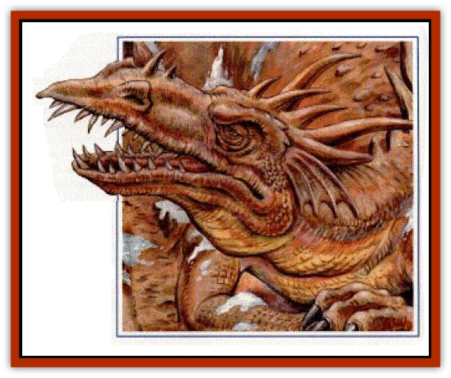

# Vore Lekiniskiy - Master Fire Worm

| Statistic | **Vore Lekiniskiy, Master Fire Worm** |
| --- | --- |
| **Activity Cycle:** | Any |
| **Alignment:** | Chaotic evil |
| **Armor Class:** | -7 |
| **Climate/Terrain:** | Vstaive Peak |
| **Damage/Attack:** | 1d12+10/1d12+10/2d10+10 or special |
| **Diet:** | Omnivorous |
| **Frequency:** | Unique |
| **Hit Dice:** | 25 (169 hp) |
| **Intelligence:** | Supra-genius (20) |
| **Magic Resistance:** | 75% |
| **Morale:** | Champion (15) |
| **Movement:** | Special |
| **No. Appearing:** | 1 |
| **No. of Attacks:** | 3 or special |
| **Organization:** | solitary |
| **Size:** | G (exact size unknown) |
| **Special Attacks:** | Breath weapon, spells |
| **Special Defenses:** | Fear aura, gaze, spells, invulnerability |
| **THAC0:** | 1 |
| **Treasure:** | Special |
| **XP Value:** | 28,000 |

Magically merged with the mountain known as Vstaive Peak, when Vore Lekiniskiy emerges, he only does so partially. His scaled skin is dotted with dirt, rock, and gems. White bone shows through patches where flesh has not completely returned, giving him the appearance of undeath. But Vore Lekiniskiy is alive, trapped in a madness of his own making.

Vore Lekiniskiy attacks using his foreclaws and bite, or he can execute any of the special attacks described in the [[Dragon_General_Information|Dragon]] entry of the MONSTROUS MANUAL tome except those that require flight or quick movement - Vore Lekiniskiy is tied to the mountain.

**Combat:** When Vore Lekiniskiy emerges from the mountainside, his head and either one or both of his claws rip free simultaneously. He may be able to free more of his body, but it is thought he cannot bring more than half of it out at any one time. He can attack with both his claws and his bite in the same round. 

Vore's breath weapon is like the erupting of a volcano. It is not just fire—but lava and molten rock as well. Because of his tie to the mountain, Vore may use his fiery breath once every three rounds, but it causes him 10 hp internal damage for every blast beyond the first. His breath is a 30' cone that extends at its widest point to 15 feet. It inflicts 25d6+25 hp damage on anything within that area, though victims may attempt to save vs. breath weapon for half. Nonmagical and magical objects must save vs. magical fire or be instantly burned to a crisp.

On the following round, anything or any creature within the path of Vore's breath weapon must make a saving throw again or be overcome by the lava that rushes down the mountainside (Vore is smart enough to never breathe uphill.) The lava inflicts 15d6+15 hp damage to anything in a 15' wide area within 100 feet of Vore's snout.

Vore cannot hunt or move from the mountain, but he can emerge anywhere on the mountain in 2d4 rounds. He can retreat the same way and at the same pace. He can attack while retreating, but he usually retracts his head first, making his claw attacks at 4 until they return to the mountain.

Vore's gaze attack forces opponents to save vs. paralyzation at 4 or be paralyzed for 1d3 turns. He uses this to trap unwary trespassers so that he may occasionally feed (he grows hungrier as he wins free of the mountain). He seldom troubles with the power to automatically use *geas*, *suggestion*, or *feeblemind* on anyone trapped in his gaze, but this may change.

When Vore erupts from the mountainside, he causes an earthquake that forces everyone on the mountain to save vs. paralyzation or be thrown to the ground. The DM may allow modifiers to the saving throw based on how close the characters are to where Vore is erupting. Any character that sees Master Fire Worm ready for battle must save vs. spell at 4 or succumb to a *fear* spell.

Vore Lekiniskiy can cast wizard spells at the 20th level of ability and has access to nearly any spell available on Cerilia. Recently, there is evidence that Vore has access to realm magic as well (see the BIRTHRIGHT Campaign Set), though this has yet to be confirmed. Fortunately, Vore seldom uses his magical energy to cast spells - he is too concerned with freeing himself from the mountain.

**Ecology:** Trapped in the mountainside, Vore Lekininskiy had forgotten about such things as "hunger" and "pain" for centuries. Now, he is remembering, and the dragon of Vstaive Peak grows increasingly frustrated with his existence. Chaotic evil in every way, this frustration could turn to mass destruction at any time.

---
## Discovery & Documentation

**Source Publication:** Dragon248 (1998)
**Campaign Setting:** Dragon Magazine
**Author(s):** Gregory W. Detwiler, Terry Dykstra

### Other Creatures Found in This Source Book
   * [[Amphitere|Amphitere]]
   * [[Cetus_Lesser|Cetus, Lesser]]
   * [[Dragonet|Dragonet]]
   * [[Dragon_Orange_Sodium|Dragon, Orange (Sodium)]]
   * [[Dragon_Purple_Energy|Dragon, Purple (Energy)]]
   * [[Dragon_Yellow_Salt|Dragon, Yellow (Salt)]]
   * [[Gargouille|Gargouille]]
   * [[Hai_Riyo|Hai Riyo]]
   * [[Peluda|Peluda]]
   * [[Sirrush|Sirrush]]
