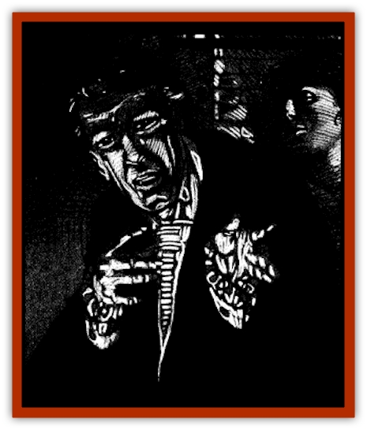

# Vorlog

| Statistic | **Vorlog** |
| --- | --- |
| **Activity Cycle:** | Night |
| **Alignment:** | Chaotic evil |
| **Armor Class:** | 3 |
| **Climate/Terrain:** | Any land |
| **Damage/Attack:** | 5-10 |
| **Diet:** | Special |
| **Frequency:** | Very rare |
| **Hit Dice:** | 6 |
| **Intelligence:** | High (13-14) |
| **Magic Resistance:** | Nil |
| **Morale:** | Steady (11) |
| **Movement:** | 12 |
| **No. Appearing:** | 1 |
| **No. of Attacks:** | 1 |
| **Organization:** | Solitary |
| **Size:** | M (5-6' tall) |
| **Special Attacks:** | <i>Charm</i>, sap Wisdom |
| **Special Defenses:** | +1 weapon to hit; immune to poison, <i>sleep</i>, <i>charm</i>, and <i>hold</i> spells; regeneration |
| **THAC0:** | 15 |
| **Treasure:** | C |
| **XP Value:** | 3,000 |

One of a [[Vampire_General_Information|vampire's]] most vulnerable moments is when the evil creature is attempting to complete its *dark kiss*, its bonding with a new vampire companion, creating a vampiric "bride" or "groom". As elaborated upon by Doctor Rudolph van Richten in his great treatise on vampires, the process of creating a vampire bride or groom is quite elaborate, involving a great expenditure of both passion and blood on the part of the monster. For approximately one hour after the monster has poured all of its energy into the erstwhile companion, the vampire lies helpless beside the bride's or groom's transforming body. If the vampire is slain during this time period, its victim does not complete the transformation, but becomes a creature caught between the world of the living and that of the dead - a sorry being known as a vorlog.

Physically the vorlog appears no different from a normal human, save for the budding fangs visible when the monster speaks. A vorlog has pale skin and always wears an expression of terrible pain and longing on its ashen face. Although the vorlog casts a shadow (unlike a true vampire), the monster can be recognized by a careful observer who notes that the creature appears translucent in mirrors and makes no noise when it moves.

Vorlogs speak the languages they knew in life. Those who have existed for a long time may have acquired other tongues as well.

**Combat:** Vorlogs have the same raw physical strength as their vampiric creators. A vorlog enjoys a Strength score of 18/76 and thus receives a bonus of +2 on its attack rolls and +4 on its damage rolls. The blows of a vorlog's hands inflict 1d6+4 points of damage to opponents.

The vorlog also gains the ability to use *charm person*, although the vorlog's charm inevitably causes its victims to feel something more akin to pity and sympathy. Otherwise, the ability is identical to the 1st level wizard spell of the same name. The vorlog can charm at will, and often employs the power to convince its chosen victims to visit its lair.

Although it is incapable of draining energy (experience) levels, the vorlog taps into its victim's spiritual energies. Each time a vorlog strikes a character, the victim must make a saving throw vs. spell. Failure indicates the character loses 2 points of Wisdom. This loss is temporary, and the victim will regain Wisdom points at the rate of 1 per hour. Characters whose Wisdom scores fall below 3 become so dazed that they perceive the vorlog to be a powerful protector. Such characters desire nothing more than to rest in the supposed sanctuary of the vorlog's embrace.

The vorlog is not actually an undead creature, nor is it truly alive. Thus, neither spells that detect the undead nor spells that detect life will sense the vorlog. The vorlog cannot be turned by a cleric, either. However, as with a true vampire, the vorlog is unaffected by poison, *sleep*, *charm*, and *hold* spells. Furthermore, the vorlog is immune to normal weapons, being harmed only by those of +1 or greater enchantment.

Vorlogs are capable of regeneration. While this ability is much less potent than that of a vampire, it is still a useful defense. When resting, they regenerate at the rate of 1 hit point per hour. However, while in the company of a charmed *surrogate* (see below), vorlogs regenerate far more rapidly, at the rate of 1 point per melee round.

If a vorlog is reduced to 0 hit points, it issues a mournful wail and melts into a pool of its own tears. The vorlog then attempts to flee the area and return to its lair to recuperate. In this form, the vorlog can climb wails and seep through any crack, no matter how small. The vorlog cannot assume this form at will.

After eight hours of rest, the vorlog again assumes a human form. Unlike a vampire, the vorlog is capable of recuperating in any dark haven, yet it prefers the safety of its own lair.

A vorlog can, at will, touch the minds of any beast within 50 feet. The vorlog's mind is filled with such intense anguish and loss that mental contact drives animals into berserk rages. Affected animals either attempt to flee from the vorlog (50%) or violently attack the nearest creature (50%).

Garlic and holy water have no effect on a vorlog. A vorlog will not approach a character presenting a lawful good holy symbol with courage and conviction. Although it is a nocturnal creature, a vorlog is not destroyed by the sun's rays. Sunlight does, however, cause intense pain, and the vorlog suffers 1d6 points of damage per round of direct exposure. If reduced to 0 hit points by such contact, the vorlog immediately collapses into a pool of tears and seeks shelter from the sun's rays. If unable to do so, the creature quickly dehydrates and dies within 1d4 hours.

**Habitat/Society:** Vorlogs are often left alive by vampire hunters, for the creatures initially appear human. Many valiant hunters have falsely congratulated themselves for saving a poor wretch when they have actually condemned him to a semilife of eternal torment.

The focus of the vorlog's entire existence centers on its utter anguish and bereavement at the death of its vampire lover. The creature had already given itself over to the vampire, body and mind, when the newly wrought bonds were ripped away by the creature's sudden demise. The shattering combination of psychic and physical blows is so devastating that the creature can never truly recover. Instead, it spends its eternal existence attempting to recreate its lost companion.

A vorlog spends much of its time searching for humans who resemble - even in only a remote fashion - its vampiric creator. Once a vorlog fixates on a particular individual, the monster becomes more and more convinced that the person actually is the vampire, reincarnated or otherwise restored. This fixation becomes so powerful that the vorlog will attempt anything to have the object of its obsession.

Once the vorlog has captured or charmed the individual in question, it makes the new "companion" dress and act like the yearned-for vampire lover. The vorlog also exchanges a small amount of blood with its new companion for three consecutive running, attempting to re-create the original and satisfying bond. At this point, the companion becomes the vorlog's surrogate. The surrogate gains no advantages from this bonding, although the vorlog can regenerate faster (see "Combat") while in the presence of a surrogate. The vorlog also feeds on its surrogate's Wisdom regularly, so that the poor thing never has more than half of his or her normal Wlsdom score at any time.

A vorlog can survive no more than three months without a surrogate to feed upon, and it is loathe to go for even a month without such a companion, as the loneliness of its existence is almost unbearable.

The vorlog can sense the location of its surrogate, no matter where he or she hides. Only an *amulet of proof against detection and location*, or a similar magical charm, can keep a vorlog from discovering its surrogate's whereabouts.

Over the course of a few weeks, or at most months, the vorlog grows dissatisfied with the hollow mockery of its original bonding. This dissatisfaction is inevitable, as no being can ever recreate the powerful relationship between the vorlog and its creator. The miserable creature grows bitter and anguished as it begins to restlessly search anew for its creator. Eventually, the creature finds a new object for its obsession, at which point the vorlog returns to its current surrogate and destroys him or her.

A vorlog is capable of bonding with only one surrogate at a time. It cannot create new vampires or even other vorlogs to ease the utter desolation of its existence.

Interestingly, when two or more vorlogs confront each other, they find no comfort in mutual commiseration or empathy. Instead, the creatures tend to f1y into rages and attack one another or their surrogates. Even if such a fight does not occur, the vorlogs spend the bulk of their energies comparing their dead vampire masters, with each vorlog insisting that its beloved was far superior. Such petty and pointless rivalries consume the vorlogs, causing them to remain distant from the only other beings that might truly understand the anguish of their own existence.

**Ecology:** Only a mortal in the final stages of the transformation into a vampiric bride or groom (see *Van Richten's Guide to to Vampires* - TSR product stock #9345) can ever become a vorlog. Other potential vampires merely recover or die as a result of the injuries inflicted upon them by their vampire attacker.

The vorlog must feed on both normal food and psychic energy to survive. The creature's body needs only one-tenth the amount of food it required while alive, and it can go months without being seriously affected by starvation. More important to the creature is the psychic energy it draws from its surrogates. Without such a surrogate, the vampire dies in three months.

The vorlog is a creature that was never meant to be. Caught on the razor's edge between life and undeath, the vorlog is trapped in a world of horror which no other being can truly understand. There is no known way to cure a vorlog; only death grants monster any the measure of release. The vorlog is a creature to be both pitied and feared.

**Surrogate**

  Once bonded to a vorlog, a surrogate automatically becomes charmed by the creature. Once so affected, the pitiful minion is unable to escape its master's essence on its own. No additional saving throws or the like are possible unless an outsider interferes with the foul relationship.

While serving a vorlog, a surrogate serves as both a companion and a source of psychic sustenance. Thus, a surrogate never has more than a half-normal Wisdom rating, due to the constant draining of mental energy.

The bond between a surrogate and a vorlog is not particularly powerful. If the vorlog dies, the bond is broken and the former surrogate becomes *confused* (as per the wizard spell). The surrogate automatically recovers from this confusion in 1d4 weeks, or sooner if the creature is *blessed* at some point. The bond can also be broken by submerging the surrogate in holy water.

While the vorlog is alive and the surrogate is bound to it, the latter will do everything power to protect the former. Although often convinced that there is something terribly wrong with his or her sudden change in lifestyle and companion, the surrogate will usually decide that he or she is simply not worthy of the newfound love and that it is necessary to strive all the harder to embody the appearance and behavior the vorlog craves. Such is the terrible mental trap in which the vorlog ensnares its surrogates.

Except for their drops in Wisdom scores, surrogates maintain all the abilities and aptitudes they normally possess - they are mortal and can be killed as such. Surrogates receive only pain, confusion, and eventually death for their services to a vorlog lover. It is a terrible existence, but one from which there is at least some hope of escape, however small. A vorlog's only escape is death's final embrace.

---
## Discovery & Documentation

**Source Publication:** Ravenloft Appendix III (1991)
**Campaign Setting:** Ravenloft
**Author(s):** Kirk Botulla

### Other Creatures Found in This Source Book
   * [[Akikage|Akikage]]
   * [[Animator_Common|Animator, Common]]
   * [[Animator_Greater|Animator, Greater]]
   * [[Animator_Minor|Animator, Minor]]
   * [[Animator_General_Information|Animator, General Information]]
   * [[Bakhna_Rakhna|Bakhna Rakhna]]
   * [[Baobhan_Sith|Baobhan Sith]]
   * [[Beetle_Scarab|Beetle, Scarab]]
   * [[Boneless|Boneless]]
   * [[Boowray|Boowray]]
   * [[Bruja|Bruja]]
   * [[Carrionette|Carrionette]]
   * [[Carrion_Stalker|Carrion Stalker]]
   * [[Cat_Midnight|Cat, Midnight]]
   * [[Cat_Skeletal|Cat, Skeletal]]
   * [[Cloaker_Resplendent|Cloaker, Resplendent]]
   * [[Cloaker_Shadow|Cloaker, Shadow]]
   * [[Cloaker_Undead|Cloaker, Undead]]
   * [[Corpse_Candle|Corpse Candle]]
   * [[Death's_Head_Tree|Death's Head Tree]]
   * [[Doppelganger_Ravenloft|Doppelganger (Ravenloft)]]
   * [[Familiar_Pseudo-|Familiar, Pseudo-]]
   * [[Familiar_Undead|Familiar, Undead]]
   * [[Feathered_Serpent|Feathered Serpent]]
   * [[Fenhound|Fenhound]]
   * [[Figurine_Ceramic|Figurine, Ceramic]]
   * [[Figurine_Crystal|Figurine, Crystal]]
   * [[Figurine_Ivory|Figurine, Ivory]]
   * [[Figurine_Obsidian|Figurine, Obsidian]]
   * [[Figurine_Porcelain|Figurine, Porcelain]]
   * [[Figurine_General_Information|Figurine, General Information]]
   * [[Fleas_of_Madness|Fleas of Madness]]
   * [[Furies|Furies]]
   * [[Geist|Geist]]
   * [[Ghost_Animal|Ghost, Animal]]
   * [[Golem_Flesh_Ravenloft|Golem, Flesh (Ravenloft)]]
   * [[Golem_Mist_Ravenloft|Golem, Mist (Ravenloft)]]
   * [[Golem_Wax_Ravenloft|Golem, Wax (Ravenloft)]]
   * [[Gremishka|Gremishka]]
   * [[Hag_Spectral|Hag, Spectral]]
   * [[Head_Hunter|Head Hunter]]
   * [[Hearth_Fiend|Hearth Fiend]]
   * [[Hebi-No-Onna|Hebi-No-Onna]]
   * [[Hound_Phantom|Hound, Phantom]]
   * [[Hound_Skeletal|Hound, Skeletal]]
   * [[Imp_Wishing|Imp, Wishing]]
   * [[Ivy_Crawling|Ivy, Crawling]]
   * [[Jack_Frost|Jack Frost]]
   * [[Jolly_Roger|Jolly Roger]]
   * [[Kizoku|Kizoku]]
   * [[Lashweed|Lashweed]]
   * [[Leech_Magical|Leech, Magical]]
   * [[Leech_Psionic|Leech, Psionic]]
   * [[Lich_Defiler|Lich, Defiler]]
   * [[Lich_Drow|Lich, Drow]]
   * [[Lich_Elemental|Lich, Elemental]]
   * [[Lich_Psionic|Lich, Psionic]]
   * [[Living_Tattoo|Living Tattoo]]
   * [[Lycanthrope_Loup-garou|Lycanthrope, Loup-garou]]
   * [[Lycanthrope_Werejackal|Lycanthrope, Werejackal]]
   * [[Lycanthrope_Werejaguar_Ravenloft|Lycanthrope, Werejaguar (Ravenloft)]]
   * [[Lycanthrope_Wereleopard|Lycanthrope, Wereleopard]]
   * [[Lycanthrope_Wereray|Lycanthrope, Wereray]]
   * [[Mist_Ferryman|Mist Ferryman]]
   * [[Moor_Man|Moor Man]]
   * [[Obedient|Obedient]]
   * [[Odem|Odem]]
   * [[Paka|Paka]]
   * [[Plant_Blood_Rose|Plant, Blood Rose]]
   * [[Plant_Fearweed|Plant, Fearweed]]
   * [[Radiant_Spirit|Radiant Spirit]]
   * [[Recluse|Recluse]]
   * [[Remnant_Aquatic|Remnant, Aquatic]]
   * [[Rushlight|Rushlight]]
   * [[Sea_Spawn_Master|Sea Spawn, Master]]
   * [[Sea_Spawn_Minion|Sea Spawn, Minion]]
   * [[Shadow_Asp|Shadow Asp]]
   * [[Shattered_Brethren|Shattered Brethren]]
   * [[Skeleton_Archer|Skeleton, Archer]]
   * [[Skeleton_Insectoid|Skeleton, Insectoid]]
   * [[Skin_Thief|Skin Thief]]
   * [[Spirit_Psionic|Spirit, Psionic]]
   * [[Strahd_Skeleton|Strahd Skeleton]]
   * [[Strahd_Zombie|Strahd Zombie]]
   * [[Unicorn_Shadow|Unicorn, Shadow]]
   * [[Vampire_Drow|Vampire, Drow]]
   * [[Vampire_Nosferatu|Vampire, Nosferatu]]
   * [[Vampire_Oriental|Vampire, Oriental]]
   * [[Virus_General_Information|Virus, General Information]]
   * [[Virus_I|Virus I]]
   * [[Virus_II|Virus II]]
   * [[Virus_III|Virus III]]
   * [[Will_O'Dawn|Will O'Dawn]]
   * [[Will_O'Deep|Will O'Deep]]
   * [[Will_O'Mist|Will O'Mist]]
   * [[Will_O'Sea|Will O'Sea]]
   * [[Zombie_Cannibal|Zombie, Cannibal]]
   * [[Zombie_Desert|Zombie, Desert]]
   * [[Zombie_Wolf|Zombie Wolf]]
   * [[Zombie_Fog|Zombie Fog]]
