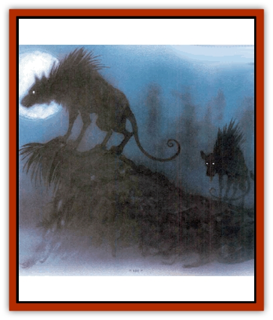

# Vorr

| Statistic | **Vorr** |
| --- | --- |
| **Activity Cycle:** | Night |
| **Alignment:** | Chaotic evil |
| **Armor Class:** | 6 |
| **Climate/Terrain:** | Carceri, Abyss, Outlands |
| **Damage/Attack:** | 1d3/1d3/2d4 |
| **Diet:** | Carnivore |
| **Frequency:** | Common |
| **Hit Dice:** | 3+4 |
| **Intelligence:** | Low (5-7) |
| **Magic Resistance:** | Nil |
| **Morale:** | Average (8-10) |
| **Movement:** | 15 |
| **No. Appearing:** | 3-12 |
| **No. of Attacks:** | 3 |
| **Organization:** | Pack |
| **Size:** | M (5' long) |
| **Special Attacks:** | Knockdown, thief abilities |
| **Special Defenses:** | Shadow form |
| **THAC0:** | 17 |
| **Treasure:** | Nil |
| **XP Value:** | 420 |

Travelers in the wilder regions of the Outlands and some of the Lower Planes'd be well-advised to be careful of vorrs. Vorrs are [[Hyena|hyena]]like creatures who originally came from the howling caverns of Pandemonium, but in recent years they've spread like a plague into the neighboring planes. Although a lone vorr isn't much of a threat to a well-armed and peery basher, vorrs don't travel alone - they travel and hunt in packs, and they're not afraid to attack anything when they're hungry.

A vorr stands about 3½ feet high at the shoulder, and shares the general build of a hyena. Its forequarters're larger and more powerful than its hindquarters, and its back slopes sharply from front to rear. A vorr's face is much more intelligent than a hyena's, but it's still got a large muzzle full of teeth that can crack bones. Vorrs are covered in short, bristly gray-and-black fur, and their tails are long and [[Rat|rat]]like. Their skin's coal black and leathery where exposed - the lips and gums, the pads of their feet, and their naked tails.

Vorrs are far more intelligent than they appear, and on an individual level they're as clever as a somewhat dim human. Their senses of hearing and smell're far keener than those of a human, and their eyes are well-adjusted to night vision. Vorrs may not be as smart as humans in most regards, but they're superb at coordinating hunts and tracking prey. In large packs, vorrs become extremely aggressive and dangerous.

**Combat:** Vorrs are surprised only on a roll of 1 due to their sharp hearing and sense of smell. In a fight, they attack with two forepaws for 1d3 points of damage each, and a powerful bite for 2d4 points of damage. If the vorr's bite attack hits by a margin of 4 or more, the victim has to make a Strength check or be dragged down to the ground. Prone characters're attacked with a +4 bonus to hit and suffer a -4 penalty to their own attacks, unless they spend a round getting back on their feet. Nearby vorrs often converge on a character that's been pulled down and make short work of the sod.

Vorrs are extremely stealthy and effectively have the thief abilities of move silently (60% chance) and hide in shadows (50% chance). If a vorr surprises its victim, it can make a silent spring that's equal to a backstab with a +4 attack bonus, inflicting double bite damage.

Centuries of exposure to the darkness of Pandemonium and the sinister energies of that plane have bred an unusual power into vorrs: They can take on the form of living shadows for short periods. A vorr can do this only once per night, and can maintain the form for no more than ten minutes. While in shadow-form, the vorr can't attack or be harmed by any physical means and is 90% invisible (75% invisible if moving). Vorrs use this ability to sneak up on prey or to get away from fights that aren't going well. A *light* or *continual light* spell cast on a vorr in shadow-form forces it back to its normal state and blinds it for 1 to 3 rounds with no saving throw.

**Habitat/Society:** A vorr pack travels quickly and covers a great deal of territory. They're most comfortable in open plains or scrubland, and it's unlikely that they'll be encountered in heavily forested or mountainous areas. By day, vorrs sleep in a secure cave or thicket, but they're active hunters all night long. Vorrs've got no reservations about attacking human homesteads or outposts wherever they find 'em, and they can be a serious danger in some parts of the Outlands.

Vorrs are pack creatures, and a great deal of their time and energy is directed toward social interactions with their packrnates. The oldest and strongest female (minimum 20 hp) of a vorr pack is the leader, but vorrs are unruly and rebellious creatures who constantly try each other's strength. The mate of the pack leader (also 20 hp or more) acts as the hunt leader, coordinating the pack�s hunting tactics.

**Ecology:** Vorrs are carnivores and scavengers. They prefer a fresh kill when possible, but they're not afraid to eat carrion. It's said that the vorr's digestive track is tough enough to derive nourishment from stones, but this's a bit of an exaggeration. In areas where prey is scarce, vorrs survive by banding together to drive other predators such as [[Bonespear|bonespears]] or [[Leomarh|leomarhs]] away from their kills. Vorr packs on the Lower Planes generally try to avoid the native fiends, but on accasion a least [[Tanar'ri_General_Information|tanar'ri]] or similar lowly creature'll fall prey to a pack of hungry vorrs.

**Vorr Shamans**

  About one-third of all vorr packs're led by an older female with some basic spellcasting powers. These vorrs are known as shamans. Shamans have at least 24 hp and are accompanied by two powerful male guards of at least 20 hp each. Vorrs are intelligent enough to have a dim understanding of a power that watches over them, and they perform ceremonial kills or howlings to venerate their protector. Most observers guess that the vorrs follow the tanar'ri lord Yeenoghu. Shamans cast spells as 3rd-level priests, with access to the spheres of Divination, Protection, and Animal.

---
## Discovery & Documentation

**Source Publication:** Planescape II (1996)
**Campaign Setting:** Planescape
**Author(s):** Rich Baker, Karen S. Boomgarden

### Other Creatures Found in This Source Book
   * [[Aasimar|Aasimar]]
   * [[Abrian|Abrian]]
   * [[Arcane|Arcane]]
   * [[Balaena|Balaena]]
   * [[Beholder-kin_Observer|Beholder-kin, Observer]]
   * [[Bloodthorn|Bloodthorn]]
   * [[Bonespear|Bonespear]]
   * [[Darkweaver|Darkweaver]]
   * [[Demarax|Demarax]]
   * [[Dhour|Dhour]]
   * [[Eater_of_Knowledge|Eater of Knowledge]]
   * [[Eladrin_Greater_Firre|Eladrin, Greater, Firre]]
   * [[Eladrin_Greater_Ghaele|Eladrin, Greater, Ghaele]]
   * [[Eladrin_Greater_Tulani|Eladrin, Greater, Tulani]]
   * [[Eladrin_Lesser_Bralani|Eladrin, Lesser, Bralani]]
   * [[Eladrin_Lesser_Coure|Eladrin, Lesser, Coure]]
   * [[Eladrin_Lesser_Noviere|Eladrin, Lesser, Noviere]]
   * [[Eladrin_Lesser_Shiere|Eladrin, Lesser, Shiere]]
   * [[Fhorge|Fhorge]]
   * [[Ghostlight|Ghostlight]]
   * [[Guardinal_Avoral|Guardinal, Avoral]]
   * [[Guardinal_Cervidal|Guardinal, Cervidal]]
   * [[Guardinal_General_Information|Guardinal, General Information]]
   * [[Guardinal_Equinal|Guardinal, Equinal]]
   * [[Guardinal_Leonal|Guardinal, Leonal]]
   * [[Guardinal_Lupinal|Guardinal, Lupinal]]
   * [[Guardinal_Ursinal|Guardinal, Ursinal]]
   * [[Hollyphant|Hollyphant]]
   * [[Incantifer|Incantifer]]
   * [[Ironmaw|Ironmaw]]
   * [[Keeper|Keeper]]
   * [[Khaasta|Khaasta]]
   * [[Leomarh|Leomarh]]
   * [[Monster_of_Legend|Monster of Legend]]
   * [[Mortai|Mortai]]
   * [[Noctral|Noctral]]
   * [[Quill|Quill]]
   * [[Razorvine|Razorvine]]
   * [[Reave|Reave]]
   * [[Retriever|Retriever]]
   * [[Rilmani_Abiorach|Rilmani, Abiorach]]
   * [[Rilmani_General_Information|Rilmani, General Information]]
   * [[Rilmani_Argenach|Rilmani, Argenach]]
   * [[Rilmani_Aurumach|Rilmani, Aurumach]]
   * [[Rilmani_Cuprilach|Rilmani, Cuprilach]]
   * [[Rilmani_Ferrumach|Rilmani, Ferrumach]]
   * [[Rilmani_Plumach|Rilmani, Plumach]]
   * [[Shadowdrake|Shadowdrake]]
   * [[Spellhaunt|Spellhaunt]]
   * [[Spider_Hook|Spider, Hook]]
   * [[Sunfly|Sunfly]]
   * [[Sword_Spirit|Sword Spirit]]
   * [[Tanar'ri_Lesser_Bulezau|Tanar'ri, Lesser, Bulezau]]
   * [[Tanar'ri_Lesser_Maurezhi|Tanar'ri, Lesser, Maurezhi]]
   * [[Tanar'ri_Lesser_Yochlol|Tanar'ri, Lesser, Yochlol]]
   * [[Tanar'ri_General_Information|Tanar'ri, General Information]]
   * [[Tanar'ri_True_Alkilith|Tanar'ri, True, Alkilith]]
   * [[Terlen|Terlen]]
   * [[Tso|Tso]]
   * [[T'uen-rin|T'uen-rin]]
   * [[Vaporighu|Vaporighu]]
   * [[Wastrel|Wastrel]]
   * [[Wraithworm|Wraithworm]]
   * [[Yugoloth_Lesser_Canoloth|Yugoloth, Lesser, Canoloth]]
   * [[Zoveri|Zoveri]]
