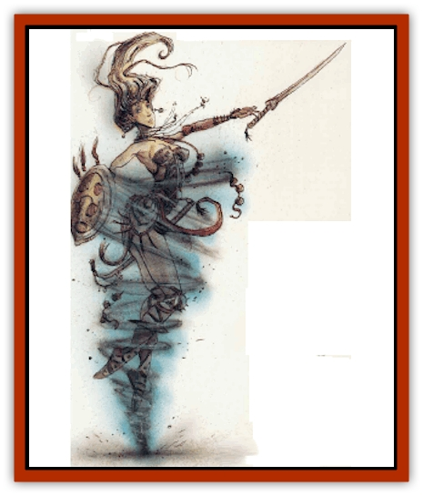

# Vortex

| Statistic | **Vortex** |
| --- | --- |
| **Activity Cycle:** | Any |
| **Alignment:** | Chaotic neutral |
| **Armor Class:** | 0 |
| **Climate/Terrain:** | Sky/Plane of Air |
| **Damage/Attack:** | See below |
| **Diet:** | Unknown |
| **Frequency:** | Very rare |
| **Hit Dice:** | 2+2 |
| **Intelligence:** | Non- (0) |
| **Magic Resistance:** | Nil |
| **Morale:** | Champion (16) |
| **Movement:** | 15 |
| **No. Appearing:** | 1 |
| **No. of Attacks:** | 1 |
| **Organization:** | Solitary |
| **Size:** | Variable |
| **Special Attacks:** | Nil |
| **Special Defenses:** | Nil |
| **THAC0:** | 19 |
| **Treasure:** | Nil |
| **XP Value:** | 270 |

Those few who have seen them usually think vortexes are miniature whirlwinds, little dust devils about the size of a small jug, but what they see is not the vortex itself. Rather, it's the air wrapped like a second skin around the being within. Peel the airy element away, still the mad motion, and underneath is a small round thing, sphere the size of a child's ball, which is the color of frozen mist. That's the true vortex.

Is it alive? The answer is: who knows? It has no eyes, no mouth, no features that reveal a spirit. It shows few signs of intelligence or consciousness. The vortex only spins, bobbles, and weaves like a sublime dervish. Perhaps it dreams only of the endless gyrations of the worlds.

**Combat:** The vortex poses a far greater threat than its small size would portend. It is far from malevolent - indeed, it seems blind to the presence of others - but in that blindness it is dangerous. Not surprisingly, straight lines are foreign to the creature, and when it moves, it changes directions quickly and without any discernable pattern. Spinning so randomly, there is a chance the vortex will hit any one creature within 5 feet of it. If there are multiple targets, the DM should randomly determine which one will be struck.

A vortex spins into a target by making an attack roll, ignoring the armor worn by the target. Only natural Armor Class and Dexterity bonuses are applied. If the hit is successful and the target is man-sized or smaller, the vortex engulfs the victim. Creatures larger than man sized are not enveloped, although the winds still swirl partially around them. If a character is engulfed by a vortex, he or she suffers no immediate damage, but is caught in the whirling cone of air and begins to spin with it.

The victim usually remains trapped until the vortex is killed. After the first round, the victim suffers 1d3 points of damage per round. There is also a 5% cumulative chance per round that the spinning victim will be instantly killed by a particularly violent current or by crashing into a solid object.

If the target too large and is struck but not engulfed, the vortex causes no damage. However, the whirling winds effectively prevent action for 1d4 rounds, as all effort is spent staying balanced and upright against the mini-cyclone. Creatures of huge size or greater are completely unaffected by the vortex's attack.

A victim trapped inside the whirlwind cannot break free of the winds without some form of outside anchor, like the hand of a companion or a tree limb. Securing a grip requires a successful attack roll with a -4 penalty, and once the anchor is seized, a bend bars/lift gates roll must be successfully rolled to break free of the vortex.

Alternatively, the victim can attempt to slay the x, thus ending the whirlwind. Only small weapons as a dagger can be used. Using spells, scrolls, potions, and most magical items is impossible. All attempts by the trapped person to hit the vortex suffer a -2 penalty on the attack roll. Those outside the whirlwind can also attack (without the penalty), but if any blow misses, a second attack roll must be made against the trapped character.

A vortex can hold only one victim at a time. Should it strike a second target after the first has been engulfed, another attack roll is made as described above. If the attack succeeds, the vortex "spit out" its previous victim and engulfs (if possible) the new target.

Its small size and speed of movement make the vortex difficult to hit, hence the low Armor class.

**Habitat/Society:** It can be said with confidence that vortexes are drawn from the Elemental Plane of Air, but are they living creatures there? Some argue that these pests are nothing but bubbles of elemental force, carrying in them all the energy of their plane. After all, they do not eat anything that can be seen, nor do they reproduce and spread their numbers.

Not so, claim others, who believe that the vortexes are the spawn of the plane itself, cast out to create a home of their own. Those sages argue that this is the act of an ungrateful parent, like Cronus devouring his children, for the plane must certainly know the vortexes will die in the void. For others it is an act of unfulfilled faith, that the impossible shall spawn and spread anew.

A more practical matter to consider is how the vortex escapes the prison of ether that binds its plane in the Inner regions. The secret may lie in the dervish-like whirling, as the vortex spins through the gaps in the web of the planes. Theoretically, if one twirls endlessly and perfectly, then one may suddenly be not there, but here.

**Ecology:** Unable to separate force from life, there can be no understanding of where these things belong. It is only certain that they cannot be summoned.

---
## Discovery & Documentation

**Source Publication:** Planescape Campaign Setting (1994)
**Campaign Setting:** Planescape
**Author(s):** David Cook

### Other Creatures Found in This Source Book
   * [[Aleax|Aleax]]
   * [[Astral_Searcher|Astral Searcher]]
   * [[Barghest|Barghest]]
   * [[Bariaur|Bariaur]]
   * [[Cranium_Rat|Cranium Rat]]
   * [[Dabus|Dabus]]
   * [[Magman|Magman]]
   * [[Minion_of_Set|Minion of Set]]
   * [[Modron|Modron]]
   * [[Nic'Epona|Nic'Epona]]
   * [[Spirit_of_the_Air|Spirit of the Air]]
   * [[Yugoloth_Lesser_Marraenoloth|Yugoloth, Lesser, Marraenoloth]]
