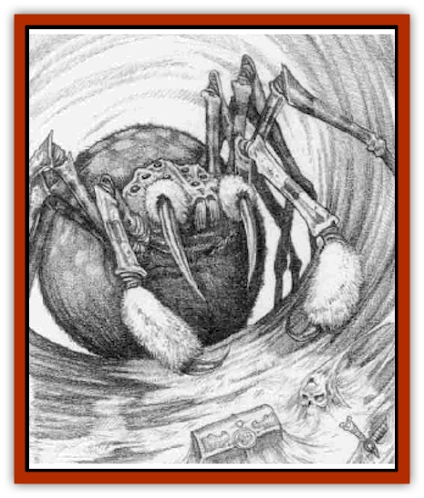

# Vortex Spider

| Statistic | **Vortex Spider** |
| --- | --- |
| **Activity Cycle:** | Any |
| **Alignment:** | Neutral |
| **Armor Class:** | 4 |
| **Climate/Terrain:** | Demiplane of Time |
| **Damage/Attack:** | 2d4 |
| **Diet:** | Carnivore |
| **Frequency:** | Uncommon |
| **Hit Dice:** | 7+4 |
| **Intelligence:** | Average (8) |
| **Magic Resistance:** | 15% |
| **Morale:** | Average (10) |
| **Movement:** | 9 (15 in web) |
| **No. Appearing:** | 1-4 |
| **No. of Attacks:** | 1 |
| **Organization:** | Solitary |
| **Size:** | Large (12' long) |
| **Special Attacks:** | Poison, web |
| **Special Defenses:** | Chameleon ability in web |
| **THAC0:** | 13 |
| **Treasure:** | Nil (E) |
| **XP Value:** | 2,700 |

Vortex [[Spider|spiders]] have the basic shape of the [[Spider|phase spider]], from which they evolved, but the similarities between the two species end there. Vortex spiders are covered with a thin chitin that is blue-gray in color but with several patches of a dull waxy color and texture. They are only seen in this fashion, though, when forced out of their natural habitat for some reason. Their color can change to blend in with their web when they are skittering about its edges or even resting within the central tangle of its magical strands.

**Combat:** The webbing of a vortex spider is completely invisible amidst the mist-smoke of the Demiplane of Time, and it is made resilient with pure temporal energy, spun from the mist-smoke that permeates the entire pseudo-plane. As such, it is detectable by a detect temporal anomaly spell, and to the caster of such a spell, it stands out sharply, even against the considerable background turbulence of a vortex.

The web usually spans a diameter of up to 50 feet, making it too small to fit entirely across any but the smallest vortices. Most often it can be found spread across a section of the vortex's wall. Once the web has been spun, the spider hides in one corner of it, its chameleonlike ability to alter its coloration to match that of the surrounding mist-smoke making it invisible to anyone who fails a saving throw vs. rod/staff/wand.

While a vortex is the most common place to find a vortex spider (thus the obvious source of the name), they can sometimes be found stringing their web among the lifelines of the Demiplane of Time as well. They are less commonly encountered here, though, due to the vastness of the timestream. One reason the spiders tend to stick to the vortices is that these are so heavily traveled. Another is that the swirling mist-smoke makes it even harder for a traveler to spot the spider's web. If the web is spun within a vortex, the save needed to spot the spider in it is made at -4. Another reason for the spider to make its home in a vortex is its ability to travel straight up and down the vortex sides, an option most creatures do not have.

The webbing is not adhesive in the way normal spider webs are, but any creature which touches it suffers from an effect similar to a *slow* spell, since time around them has been warped to move slower. Since this is different from a normal *slow* spell, the chronomancer immunity to chronomantic spells does not apply here. A bite from the spider causes only a small amount of damage, but the poison must be saved against at a penalty of -2. The poison causes instant death, and those who successfully save vs. poison still take 20 points of damage.

**Habitat/Society:** The vortex spider can create a home for itself anywhere on the Demiplane of Time, but it prefers to spin its web in a vortex. It traps other creatures for food, such as [[Dog_Temporal|temporal dogs]], small [[Temporal_Glider|temporal gliders]], and unwary time travelers. While it may be slow intellectually, the spider is not stupid, and it ignores large gliders or ohter creatures that are simply too big to net. If a [[Tether_Beast|tether beast]] manages to wander into a vortex spider's webbing, the spider immediatly takes off for parts unknown and seeks out a new home. Finding an empty web is uncommon, though, since the enchanted strands quickly disintegrate without the vortex spider's upkeep.

One comer of the vortex spider's webbing contains the remains of victims as well as their possessions. The spider likes to hide this section away from prying eyes, as humans who see the pile of bones and treasure should immediately realize just how much danger they might be in. Still, the spider knows the value of these trinkets, although it has little use for them personally. It is cunning enough to sometimes place an interesting-looking item or two in part of the web easily visible from the vortex's wall. More than one unwary adventurer has grabbed at such obvious bait, only to find himself outmatched by the web's devious owner.

**Ecology:** Vortex spiders evolved from the phase spider, and they can exist only on the Demiplane of Time. Some wizards have theorized that the origin of this rather unique species is rooted in a temporal accident in the far past. A colony of phase spiders must have been caught up in the eye of an impending timestorm while phasing, trapping them in the Demiplane of Time. Once they found themselves on this pseudo-plane, they carved out a niche for themselves in the local food chain and managed not only to adapt, but to survive and thrive.

---
## Discovery & Documentation

**Source Publication:** Monstrous Compendium, 1996 Annual, Volume 3 (1995)
**Campaign Setting:** Advanced Dungeons & Dragons 2nd Edition
**Author(s):** Jon Pickens

### Other Creatures Found in This Source Book
   * [[Alaghi|Alaghi]]
   * [[Alhoon|Alhoon]]
   * [[Aranea_Savage_Coast|Aranea (Savage Coast)]]
   * [[Arcane_Head|Arcane Head]]
   * [[Banedead|Banedead]]
   * [[Banelich|Banelich]]
   * [[Bat_Bonebat|Bat, Bonebat]]
   * [[Beetle|Beetle]]
   * [[Belgoi|Belgoi]]
   * [[Bladeling|Bladeling]]
   * [[Braxat|Braxat]]
   * [[Bunyip|Bunyip]]
   * [[Burbur|Burbur]]
   * [[Bvanen|Bvanen]]
   * [[Cat_Great_Snow_Tiger|Cat, Great, Snow Tiger]]
   * [[Chosen_One|Chosen One]]
   * [[Chronovoid|Chronovoid]]
   * [[Cildabrin|Cildabrin]]
   * [[Coffer_Corpse|Coffer Corpse]]
   * [[Disenchanter|Disenchanter]]
   * [[Dog_Temporal|Dog, Temporal]]
   * [[Dragon_Cerilia|Dragon (Cerilia)]]
   * [[Dragon_Ghost|Dragon, Ghost]]
   * [[Dragon_Lesser_Undead|Dragon, Lesser Undead]]
   * [[Dragon_Neutral_Amber|Dragon, Neutral, Amber]]
   * [[Dread_Warrior|Dread Warrior]]
   * [[Dreamweaver|Dreamweaver]]
   * [[Dream_Spawn_Greater_Ennui|Dream Spawn, Greater, Ennui]]
   * [[Dream_Spawn_Lesser_Morph|Dream Spawn, Lesser, Morph]]
   * [[Dwarf_Arctic|Dwarf, Arctic]]
   * [[Dwarf_Urdunnir|Dwarf, Urdunnir]]
   * [[Eel_Giant_Moray|Eel, Giant Moray]]
   * [[Elemental_Fire_Kin_Tome_Guardian|Elemental, Fire Kin, Tome Guardian]]
   * [[Elf_Rockseer|Elf, Rockseer]]
   * [[Ethyk|Ethyk]]
   * [[Faerie_Faerie_Fiddler|Faerie, Faerie Fiddler]]
   * [[Faerie_Petty_Bramble|Faerie, Petty, Bramble]]
   * [[Faerie_Petty_Gorse|Faerie, Petty, Gorse]]
   * [[Faerie_Petty|Faerie, Petty]]
   * [[Firenewt|Firenewt]]
   * [[Formian|Formian]]
   * [[Gargoyle_II|Gargoyle II]]
   * [[Giant_Cerilia|Giant (Cerilia)]]
   * [[Goblin_Cerilia|Goblin (Cerilia)]]
   * [[Golem_Magic|Golem, Magic]]
   * [[Golem_Shaboath|Golem, Shaboath]]
   * [[Hag_Bheur|Hag, Bheur]]
   * [[Hamadryad|Hamadryad]]
   * [[Hound_of_Ill-Omen|Hound of Ill-Omen]]
   * [[Human_Cerilia|Human (Cerilia)]]
   * [[Hybsil|Hybsil]]
   * [[Ibrandlin|Ibrandlin]]
   * [[Imp_Chaos|Imp, Chaos]]
   * [[Ixitxachitl_Ixzan|Ixitxachitl, Ixzan]]
   * [[Jabberwock|Jabberwock]]
   * [[Kyton|Kyton]]
   * [[Kyuss_Son_of|Kyuss, Son of]]
   * [[Lillend|Lillend]]
   * [[Life-Shaped_Creation_Guardian|Life-Shaped Creation, Guardian]]
   * [[Life-Shaped_Creation_Transport|Life-Shaped Creation, Transport]]
   * [[Lycanthrope_Werecrocodile|Lycanthrope, Werecrocodile]]
   * [[Lycanthrope_Werespider|Lycanthrope, Werespider]]
   * [[Magedoom|Magedoom]]
   * [[Manotaur|Manotaur]]
   * [[Mastiff_Shadow|Mastiff, Shadow]]
   * [[Meazel|Meazel]]
   * [[Mist_Scarlet_Dancer|Mist, Scarlet Dancer]]
   * [[Needleman|Needleman]]
   * [[Orc_Neo-Orog|Orc, Neo-Orog]]
   * [[Orc_Ondonti|Orc, Ondonti]]
   * [[Owlbear_II|Owlbear II]]
   * [[Pegataur|Pegataur]]
   * [[Phaerimm|Phaerimm]]
   * [[Reggelid|Reggelid]]
   * [[Render|Render]]
   * [[Saurial|Saurial]]
   * [[Scalamagdrion|Scalamagdrion]]
   * [[Sharn|Sharn]]
   * [[Snake_Messenger|Snake, Messenger]]
   * [[Spirit_Forest_Uthraki|Spirit, Forest, Uthraki]]
   * [[Spirit_Forest_Wood_Man|Spirit, Forest, Wood Man]]
   * [[Spirit_Ice_Orglash|Spirit, Ice, Orglash]]
   * [[Spirit_Rock_Thomil|Spirit, Rock, Thomil]]
   * [[Strider_Giant|Strider, Giant]]
   * [[Tembo|Tembo]]
   * [[Temporal_Glider|Temporal Glider]]
   * [[Temporal_Stalker|Temporal Stalker]]
   * [[Tether_Beast|Tether Beast]]
   * [[Thessalmonster|Thessalmonster]]
   * [[Time_Dimensional|Time Dimensional]]
   * [[Tomb_Tapper|Tomb Tapper]]
   * [[Undead_Dragon_Slayer|Undead Dragon Slayer]]
   * [[Unicorn_Black_Toril|Unicorn, Black (Toril)]]
   * [[Vaath|Vaath]]
   * [[Weredragon|Weredragon]]
   * [[Zhentarim_Spirit|Zhentarim Spirit]]
