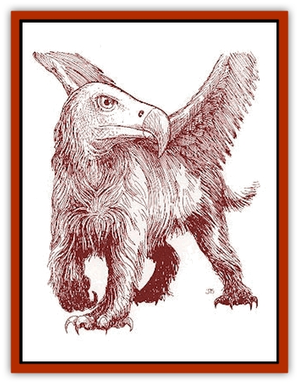

# Vulturehound

| Statistic | **Vulturehound** |
| --- | --- |
| **Activity Cycle:** | Day |
| **Alignment:** | Neutral |
| **Armor Class:** | 5 |
| **Climate/Terrain:** | Temperate, subtropical, or tropical steppes |
| **Damage/Attack:** | 1d3/1d3/1d4 |
| **Diet:** | Carnivore |
| **Frequency:** | Rare |
| **Hit Dice:** | 2 |
| **Intelligence:** | Animal (1) |
| **Magic Resistance:** | Nil |
| **Morale:** | Average (8-10) |
| **Movement:** | 10, Fl 18(C) |
| **No. Appearing:** | 4d6 |
| **No. of Attacks:** | 3 (talon/talon/beak) |
| **Organization:** | Pack |
| **Size:** | S (4' long) |
| **Special Attacks:** | Legacies |
| **Special Defenses:** | Nil |
| **THAC0:** | 19 |
| **Treasure:** | J&times;10,K&times;10,L&times;5,M,N |
| **XP Value:** | 65 |

A vulturehound is a bizarre combination of [[Vulture|vulture]] and wild [[Dog|dog]], perhaps engendered by some overly-curious Herathian mage. Vulturehounds have long, gray, shaggy hair on their bodies. Like vultures, they have naked heads, which are usually either black or red. They have doglike legs, ending in sharp, curved talons. Protruding from their sides are small, feathered wings, and they have sharp hooked beaks in place of muzzles.

Vulturehounds are scavengers found in Renardy and the Yazak Steppes.

*The Red Curse:* Although the vulturehounds that inhabit the Yazak Steppes are not directly under the influence of the Red Curse, those in Renardy do acquire Legacies. However, vulturehounds never suffer from Affliction. The most common Legacies for vulturehounds include Gas Breath, Acid Touch, Gaseous Form, and Sleep.

**Combat:** In battle, vulturehounds will rear up on their hind legs by flapping their wings, allowing them to attack with their two front talons and their beak. If unable to rear up, they can only employ their beaks. These creatures have a high Armor Class rating due to their speed and Dexterity.

Vulturehounds cannot fly after they lose more than 75% of their starting hit points. Vulturehounds are poor at aerial combat, but packs of them can manage it. In the air, vulturehounds rely on their front talon attacks.

**Habitat/Society:** Vulturehounds foray out from their dens (like hounds) in hunting packs to search for food, which they drag back to their lair to devour. The scant treasure found there will be from previous victims.

Vulturehound lairs have a 50% chance of containing 3d4 pups. Pups have 1d4 hit points, cannot fly, and bite for 1d2 points of damage. Pups, if taken young enough, can be trained for war or hunting. These animals have a keen sense of smell. A trained vulturehound tracks as a 5th-level ranger or adds a +3 bonus to any ranger companion's tracking skill.

Vulturehounds have a definite hierarchy. The smaller specimens have to wait to eat until the more powerful vulturehounds are finished.

Any given vulturehound is 50% likely to be infested with [[Parasite_Savage_Coast|cardinal ticks]].

**Ecology:** Vulturehounds feed on a mixture of carrion and live prey. They are known to attack sick or isolated prey, including [[Batracine|batracines]] and [[Caniquine|caniquines]]. Vulturehounds hunt using a combination of keen eyesight, soaring and watching for vultures descending to feed, and a keen sense of smell. Unlike most vultures, vulturehounds have well-developed voices, with a baying call similar to that of a hound.

Vulturehounds are immune to [[Parasite_Savage_Coast|vermilia]], and vulturehound blood can be used as a component for medicine used to combat vermilia infection. Each vulturehound yields enough blood to manufacture 1d6 doses of antivermilia medicine. Manufacturing the medicine requires a mage of at least 9th level with an alchemical laboratory. The finished medicine is very expensive, often commanding prices in excess of 150 gold pieces per dose. However, the medicine is very effective. A single dose will completely cure a man-sized or smaller creature of vermilia infection.

---
## Discovery & Documentation

**Source Publication:** Monstrous Compendium Savage Coast Appendix (Online Exclusive) (1995)
**Campaign Setting:** Mystara
**Author(s):** Loren L Coleman, Ted James, Thomas Zuvich, Cindi M. Rice

### Other Creatures Found in This Source Book
   * [[Aranea_Savage_Coast|Aranea (Savage Coast)]]
   * [[Arashaeem|Arashaeem]]
   * [[Batracine|Batracine]]
   * [[Cat_Marine|Cat, Marine]]
   * [[Cinnavixen|Cinnavixen]]
   * [[Clockwork_Swordsman|Clockwork Swordsman]]
   * [[Critter_Temple|Critter, Temple]]
   * [[Cursed_One|Cursed One]]
   * [[Deathmare|Deathmare]]
   * [[Dragon_Savage_Coast_Crimson|Dragon (Savage Coast), Crimson]]
   * [[Dragon_Savage_Coast_Red_Hawk|Dragon (Savage Coast), Red Hawk]]
   * [[Echyan|Echyan]]
   * [[Ee'aar|Ee'aar]]
   * [[Enduk|Enduk]]
   * [[Fachan_Savage_Coast|Fachan (Savage Coast)]]
   * [[Feliquine|Feliquine]]
   * [[Fiend_Narvaezan|Fiend, Narvaezan]]
   * [[Frelôn|Frelôn]]
   * [[Ghriest|Ghriest]]
   * [[Glutton_Sea|Glutton, Sea]]
   * [[Goatman|Goatman]]
   * [[Golem_Naâruk|Golem, Naâruk]]
   * [[Golem_Savage_Coast|Golem (Savage Coast)]]
   * [[Grudgling|Grudgling]]
   * [[Heraldic_Servant_I|Heraldic Servant I]]
   * [[Heraldic_Servant_II|Heraldic Servant II]]
   * [[Heraldic_Servant_III|Heraldic Servant III]]
   * [[Heraldic_Servant_IV|Heraldic Servant IV]]
   * [[Heraldic_Servant_V|Heraldic Servant V]]
   * [[Heraldic_Servant_General_Information|Heraldic Servant, General Information]]
   * [[Hermit_Sea|Hermit, Sea]]
   * [[Jorri|Jorri]]
   * [[Juhrion|Juhrion]]
   * [[Kla'a-tah|Kla'a-tah]]
   * [[Leech_Legacy|Leech, Legacy]]
   * [[Lich_Inheritor|Lich, Inheritor]]
   * [[Lizard_Kin_Savage_Coast|Lizard Kin (Savage Coast)]]
   * [[Lupasus|Lupasus]]
   * [[Lupin|Lupin]]
   * [[Lyra_Bird_Saragón|Lyra Bird, Saragón]]
   * [[Malfera|Malfera]]
   * [[Manscorpion_Nimmurian|Manscorpion, Nimmurian]]
   * [[Mythuínn_Folk|Mythuínn Folk]]
   * [[Neshezu|Neshezu]]
   * [[Nikt'oo|Nikt'oo]]
   * [[Nosferatu|Nosferatu]]
   * [[Omm-wa|Omm-wa]]
   * [[Omshirim|Omshirim]]
   * [[Parasite_Savage_Coast|Parasite (Savage Coast)]]
   * [[Phanaton|Phanaton]]
   * [[Plant_Savage_Coast|Plant (Savage Coast)]]
   * [[Pudding_Vermilion|Pudding, Vermilion]]
   * [[Rakasta|Rakasta]]
   * [[Ray_Forest|Ray, Forest]]
   * [[Shedu_Greater_Savage_Coast|Shedu, Greater (Savage Coast)]]
   * [[Shimmerfish|Shimmerfish]]
   * [[Skinwing|Skinwing]]
   * [[Spawn_of_Nimmur|Spawn of Nimmur]]
   * [[Spider-spy|Spider-spy]]
   * [[Spirit_Heroic|Spirit, Heroic]]
   * [[Spirit_Walleran|Spirit, Walleran]]
   * [[Succulus|Succulus]]
   * [[Swampmare|Swampmare]]
   * [[Symbiont_Shadow|Symbiont, Shadow]]
   * [[Tortle|Tortle]]
   * [[Troll_Legacy|Troll, Legacy]]
   * [[Trosip|Trosip]]
   * [[Tyminid|Tyminid]]
   * [[Utukku|Utukku]]
   * [[Voat|Voat]]
   * [[Voat_Herathian|Voat, Herathian]]
   * [[Wallara|Wallara]]
   * [[Wurmling|Wurmling]]
   * [[Wynzet|Wynzet]]
   * [[Yeshom|Yeshom]]
   * [[Zombie_Red|Zombie, Red]]
