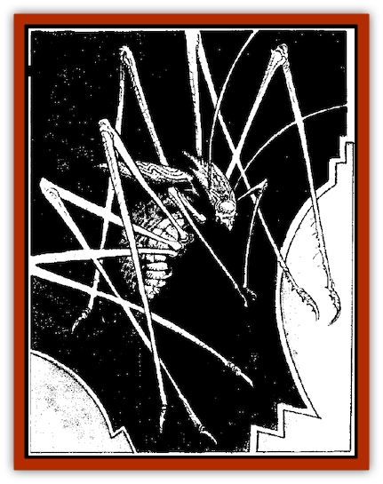

# Wall Walker

| Statistic | **Wall Walker** |
| --- | --- |
| **Activity Cycle:** | Any |
| **Alignment:** | Lawful evil |
| **Armor Class:** | 3 |
| **Climate/Terrain:** | Subterranean |
| **Damage/Attack:** | 2-12/2-12/2-8 |
| **Diet:** | Carnivore |
| **Frequency:** | Uncommon |
| **Hit Dice:** | 6 |
| **Intelligence:** | Low (5-7) |
| **Magic Resistance:** | Nil |
| **Morale:** | Elite (13-14) |
| **Movement:** | 9, Cl 12 |
| **No. Appearing:** | 1-2 |
| **No. of Attacks:** | 3 |
| **Organization:** | Hive |
| **Size:** | M (5' long) |
| **Special Attacks:** | Psionics, paralyzation |
| **Special Defenses:** | Psionics, immune to fire |
| **THAC0:** | 14 |
| **Treasure:** | B |
| **XP Value:** | 1,500 |

**Psionics Summary**

| Level | Dis/Sci/Dev | Attack/Defense | Score | PSPs |
| --- | --- | --- | --- | --- |
| 2 | 1/2/6 | -/M- | 11 | 80 |

**Clairsentience -** *Sciences:* nil; *Devotions:* feel light, feel sound.

**Psychometabolism -** *Science:* shadow form; *Devotions:* catfall, chameleon power.

**Telepathy -** *Sciences:* nil; *Devotions:* contact, mind blank.

Wall-walkers are subterranean hunters that live in the caverns and passages beneath Athas's burning surface. These insectoid creatures were named by the first generation [[Dray|dray]] that live in Kragmorta, who observed the wall-walkers' climbing ability and named them accordingly. Wall-walkers combine many of the characteristics of [[Spider|spiders]] and large reptiles. They have armored scales instead of chitinous plates, eight clawed legs, sharp fangs, and a stinging tail.

Wall-walkers communicate among themselves via sounds made by rubbing their legs together. The cavern of Kragmorta, for example, echoes with the haunting sounds well into the sleep period of the area's other inhabitants. No other intelligent creatures have yet learned to communicate with the wall-walkers or figured out how to interpret the sounds they make.

**Combat:** With its psionic powers, a wall-walker can blend into the scenery. Its scales take on the texture and color of any nearby rock surfaces, ruined walls, or fungi caps. It can take on the form of a shadow and move invisibly through the darkness of the underregion. A wall-walker delights in frightening and playing with its prey before moving in for the kill, and it uses all of its powers to accomplish this.

A wall-walker uses its special paralyzation attack first in many instances. It leaps forward and tries to strike with its stinger. A successful hit doesn't cause any appreciable damage, but the victim must make a saving throw versus poison or suffer from paralyzing venom for 1d6 rounds. Those affected by the venom cannot move for the duration of the effect. The wall-walker hopes to paralyze its prey so that it can then torment them for a time. The wall-walker gets very close to a paralyzed victim and stares into its eyes, moving its mandibles back and forth in a threatening manner.

If the stinger attack doesn't incapacitate prey, a wall-walker must resort to regular combat. A wall-walker makes three attacks in a round. The claws on its front legs cause 2d6 points of damage each. Its bite causes 2d4 points of damage. Because of the way the stinger is positioned, a wall-walker must turn away from its opponent to attempt a stinger strike. Once it gets into melee with its prey, a wall-walker usually abandons its stinger attack in favor of its claw/claw/bite routine. Whenever a wall-walker makes a stinger attack, if the victim is not hit or makes its save, then the opponent can return the attack with a bonus. In the round after a wall-walker uses its stinger (successfully or not), its opponent receives a +2 bonus to its attack rolls for that round.

Wall-walkers hunt alone or in pairs. They use their climbing skills to best advantage, following prey from overhead or along a side wall. When an opportunity to attack with surprise presents itself, the wall-walkers strike.

When operating as a pair, the wall-walkers strike in separate rounds. This is to make best use of their surprise bonuses (while on the wall or ceiling and in the shadows, wall-walkers receive a +2 surprise bonus) and stinger attacks. When alone, a wall-walker waits until its prey is separated from any companions before attacking.

These predators use their psionic powers to track and stalk victims. Many visitors to the under-region display a look of shock when a wall-walker jumps from the shadows or steps away from a wall the same color as it is to deliver three devastating attacks or a stinger strike.

**Habitat/Society:** Wall-walkers build hives inside the walls of caverns. They use their powerful claws to scoop out rock and dirt, which then is deposited in great heaps at the base of the wall. They range far and wide through the under-regions, seeking prey to feast upon and bring back to their hives. Wall-walkers can be encountered not only in the larger caverns, but in the tunnels connecting the caverns to each other as well. All of the under-region is their home and hunting ground, and they consider everything that passes near them to be prey.

One hive is known to exist in Kragmorta. The wallwalkers of this hive make constant trouble for the first generation dray who live within the cavern. The two species are almost in a state of war with each other - each looking on the other as prey.

Like all predators, the wall-walker seeks to survive. It constantly looks for a steady supply of food, and it takes great pains to protect its hive and its young from other predators. Its one true competitor for the same ecological niche is the [[Kalin|kalin]]. If a wall-walker and kalin come within sight of each other, a terrible battle usually breaks out. In fact, a pair of wall-walkers will go out of their way to attack a nearby kalin.

**Ecology:** The subterranean world beneath Athas is home to a wide variety of creatures. The wall-walker feasts on them all. It relies on stealth, cunning, and its natural weapons to survive. It prefers to be predator, but sometimes finds itself in the role of prey. If faced by a foe it cannot defeat, a wall-walker will flee to find other, more easily bested prey.

The scaly hide of the wall-walker can be used to craft armor and weapons, and is a primary source of materials for the dray of Kragmorta. In many ways, the scaly hide of a wall-walker is superior to many other hides due to its toughness, suppleness, and relatively light weight.

---
## Discovery & Documentation

**Source Publication:** Monstrous Compendium, 1995 Annual, Volume 2 (1995)
**Campaign Setting:** Advanced Dungeons & Dragons 2nd Edition
**Author(s):** Jon Pickens

### Other Creatures Found in This Source Book
   * [[Aboleth_Savant|Aboleth, Savant]]
   * [[Addazahr|Addazahr]]
   * [[Amiq_Rasol|Amiq Rasol]]
   * [[Arch-Shadow|Arch-Shadow]]
   * [[Automaton_Scaladar|Automaton, Scaladar]]
   * [[Automaton_Trobriand's|Automaton, Trobriand's]]
   * [[Bat_Sporebat|Bat, Sporebat]]
   * [[Beetle_Dragon|Beetle, Dragon]]
   * [[Bi-nou|Bi-nou]]
   * [[Boggle|Boggle]]
   * [[Brownie_Dobie|Brownie, Dobie]]
   * [[Brownie_Quickling|Brownie, Quickling]]
   * [[Cat_Crypt|Cat, Crypt]]
   * [[Cat_Great_Cath_Shee|Cat, Great, Cath Shee]]
   * [[Centaur-kin_Dorvesh|Centaur-kin, Dorvesh]]
   * [[Centaur-kin_Gnoat|Centaur-kin, Gnoat]]
   * [[Centaur-kin_Ha'pony|Centaur-kin, Ha'pony]]
   * [[Centaur-kin_Zebranaur|Centaur-kin, Zebranaur]]
   * [[Chronolily|Chronolily]]
   * [[Curst|Curst]]
   * [[Darktentacles|Darktentacles]]
   * [[Dinosaur_Aquatic|Dinosaur, Aquatic]]
   * [[Dinosaur_II|Dinosaur II]]
   * [[Dinosaur_III|Dinosaur III]]
   * [[Doppelganger_Greater|Doppelganger, Greater]]
   * [[Dragon_Brine|Dragon, Brine]]
   * [[Dragon_Half-|Dragon, Half-]]
   * [[Dragon-kin_Sea_Wyrm|Dragon-kin, Sea Wyrm]]
   * [[Dwarf_Wild|Dwarf, Wild]]
   * [[Ekimmu|Ekimmu]]
   * [[Elemental_Nature|Elemental, Nature]]
   * [[Elf_Winged|Elf, Winged]]
   * [[Fish_Great_Glacier|Fish (Great Glacier)]]
   * [[Fish_Subterranean|Fish, Subterranean]]
   * [[Fish_Toril|Fish (Toril)]]
   * [[Flareater|Flareater]]
   * [[Flumph|Flumph]]
   * [[Froghemoth|Froghemoth]]
   * [[Ghost_Casurua|Ghost, Casurua]]
   * [[Ghost_Ker|Ghost, Ker]]
   * [[Ghul|Ghul]]
   * [[Ghul-Kin|Ghul-Kin]]
   * [[Giant_Half-giant|Giant, Half-giant]]
   * [[Golem_Burning_Man|Golem, Burning Man]]
   * [[Golem_Phantom_Flyer|Golem, Phantom Flyer]]
   * [[Gulguthhydra|Gulguthhydra]]
   * [[Hakeashar|Hakeashar]]
   * [[Horse_Moon-|Horse, Moon-]]
   * [[Human_Dragonslayer|Human, Dragonslayer]]
   * [[Human_Vistana|Human, Vistana]]
   * [[Jellyfish_Giant|Jellyfish, Giant]]
   * [[Kalin|Kalin]]
   * [[Kholiathra|Kholiathra]]
   * [[Laerti|Laerti]]
   * [[Leucrotta_Greater|Leucrotta, Greater]]
   * [[Lich_Suel|Lich, Suel]]
   * [[Lurker_Shadow|Lurker, Shadow]]
   * [[Lycanthrope_Werepanther|Lycanthrope, Werepanther]]
   * [[Lycanthrope_Wereshark|Lycanthrope, Wereshark]]
   * [[Mammal_Herd_II|Mammal, Herd II]]
   * [[Marl|Marl]]
   * [[Meenlock|Meenlock]]
   * [[Mimic_Greater|Mimic, Greater]]
   * [[Mold_II|Mold II]]
   * [[Mummy_Creature|Mummy, Creature]]
   * [[Nyth|Nyth]]
   * [[Ooze_Slime_Jelly_Ghaunadan|Ooze/Slime/Jelly, Ghaunadan]]
   * [[Palimpsest|Palimpsest]]
   * [[Peltast|Peltast]]
   * [[Plant_Dangerous_II|Plant, Dangerous II]]
   * [[Pleistocene_Animal|Pleistocene Animal]]
   * [[Pudding_Subterranean|Pudding, Subterranean]]
   * [[Raggamoffyn|Raggamoffyn]]
   * [[Snake_Serpent|Snake, Serpent]]
   * [[Snake_Serpent_Vine|Snake, Serpent Vine]]
   * [[Sphinx_Draco-|Sphinx, Draco-]]
   * [[Sprite_Seelie_Faerie|Sprite, Seelie Faerie]]
   * [[Sprite_Unseelie_Faerie|Sprite, Unseelie Faerie]]
   * [[Squealer|Squealer]]
   * [[Turtle_Giant|Turtle, Giant]]
   * [[Umpleby|Umpleby]]
   * [[Vizier's_Turban|Vizier's Turban]]
   * [[Webbird|Webbird]]
   * [[Yak-Man|Yak-Man]]
   * [[Zorbo|Zorbo]]
