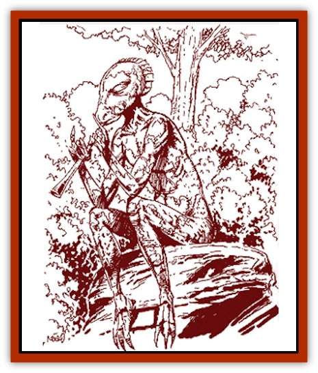

# Wallara

| Statistic | **Wallara** |
| --- | --- |
| **Activity Cycle:** | Any |
| **Alignment:** | Neutral or good, usually lawful |
| **Armor Class:** | 9 |
| **Climate/Terrain:** | Nonarctic woods, plains, or caverns |
| **Damage/Attack:** | By weapon |
| **Diet:** | Omnivore |
| **Frequency:** | Rare |
| **Hit Dice:** | 2 |
| **Intelligence:** | Average to Exceptional (8-16) |
| **Magic Resistance:** | Nil (10%) |
| **Morale:** | Average (8-10) |
| **Movement:** | 12 |
| **No. Appearing:** | 2d4 |
| **No. of Attacks:** | 1 |
| **Organization:** | Clan |
| **Size:** | M (7' tall) |
| **Special Attacks:** | Vanish |
| **Special Defenses:** | Mimic surroundings |
| **THAC0:** | 19 |
| **Treasure:** | E (Q,S) |
| **XP Value:** | 175 / Bodyguard: 270 / Leader: 420 |

The wallaras (sometimes called chameleon men) are the oldest of the [[Lizard_Kin_Savage_Coast|lizard kin]] races and are descended from [[Dragon_General_Information|dragons]]. Once a proud and wise race, the wallaras were reduced to their current primitive state through the action of the [[Aranea_Savage_Coast|araneas]]. (See the Savage Coast Campaign Book.) The wallaras inhabit the extensive grasslands on the northern shore of the Orc's Head Peninsula, far from human and demihuman civilizations, so the reclusive wallara do not have to work too hard to avoid contact with strangers.

Wallaras stand seven feet tall, and their spindly arms and legs make them look quite thin. Some folk think that they resemble tall, slender humans. They move with a stride that other races find gangling and awkward. Wallaras have multicolored, somewhat scaly skin with stripes of various shades of red, blue, indigo, green, yellow, violet, brown, orange, black, and white. Few wallaras have every hue; most have three or four predominant colors. The colors seem to shift and swirl when they walk. Wallaras never show any sign of discoloration from the Red Curse.

Wallaras speak their own language, Risil, and many also speak common.

**Combat:** Wallaras usually arm themselves with light weapons: daggers, spears with wommeras (throwing holders), or clubs called nulla-nullas. They prefer to use nonmetal weapons and equipment. They never wear armor, as it interferes with their natural abilities; whenever possible, they would rather blend into the scenery than fight openly.

Their most useful ability by far is their vanishing ability, which they use to avoid combat or surround opponents. Each round, a wallara can vanish and reappear up to 120 feet away. The ability is essentially the *dimension door* spell with a 120-foot range. They wield such precise control over the ability that they never reappear in midair or inside solid objects. Of course, they cannot appear in the exact spot as someone or something else, neither can they attack and use this ability in the same round.

Wallaras also have the ability to emulate a *ring of chameleon power*. Whenever a wallara desires, it is able to blend in with the surroundings, enabling 90% invisibility in most surroundings. If the wallara mingles with creatures of Intelligence 4 or greater, the wallara seems to be one of those creatures, but each turn of such an association carries a 5% cumulative chance that the creatures will detect the wallara. Creatures with a 16 or greater Intelligence use their Intelligence score as an addition to the base chance of detection. For example, a creature with a 16 Intelligence would have a base chance of (16 + 5%) = 21% at the end of the first turn, 26% at the end of the second turn, and so forth.

Wallara leaders in smaller settlements are usually called Lords of Shade and Hue. They have 4 Hit Dice and 1d20+10 constant bodyguard/warriors with 3 Hit Dice. Many wallaras may become even stronger, with rangers of up to 15th level, and Mendoo (priests) of up to 10th level. These great leaders are found in larger settlements and in the Lost City of Risilvar, the capital of Wallara.

**Habitat/Society:** All wallaran settlements feature a magical site called a tookoo. The tookoo of a clan is the equivalent of a temple to many other races. The tookoo of a cave-dwelling clan might be a special grotto that glistens with arcane crystals. Forest dwellers might revere an ancient tree of strong magic. These sites always radiate magic and enable chameleon men to fight with a +2 bonus for both attack and damage rolls. When fighting for their tookoos or homes, their morale rises to Fearless (20).

Wallaran government, such as it is, also centers around the tookoo. If a clan has an important decision to make, all the members of the clan will gather in the tookoo. They will remain there until they reach a decision by consensus. They will carefully explore all the issues and ramifications of a decision, one that is best for everyone involved.

Once a year, chameleon men shed their skins, much as lizards do. They save the skin for a vital purpose: reproduction. As the race has no female gender, they reproduce by placing their old skins in their clan's tookoo. Each offering has a 5% chance of magically budding into a young wallara, which grows to maturity in just eight weeks. The new wallara then stays with the tribe for at least a year to learn a trade.

Wallaras, like their dragon ancestors, are a long-lived race. A lucky wallara can live as long as 250 years. Wallaras who are older than 200 years develop 10% magic resistance, a holdover from their dragon ancestry.Wallara live in quiet harmony with nature. A Herathian spell reduced them to a stone-age level of development, and they are just now beginning to rediscover their past. They enjoy games of all sorts. When they war among themselves, the battle is stylized and designed to let out frustrations and grievances without causing a great deal of harm to anyone.

At some point during their lives, most wallaras experience a sort of wanderlust and leave for a period of time to explore the world. This is known as going on walkabout. Even while on walkabout, wallaras rarely leave the grasslands. A wallara on walkabout is almost always accompanied by a [[Spirit_Walleran|wallaran spirit]].

**Ecology:** Wallaras enjoy watching over old woods, caverns, and places of natural beauty. They attempt to maintain the harmony of nature while piecing together the puzzle of their past. Individual wallaras will often devote their entire lives to nurturing and caring for a particular location, type of animal, or species of plant. They subsist on small game, fish, and crops they grow. Less scrupulous wizards prize wallaran skin as a component for making *robes of blending*.

---
## Discovery & Documentation

**Source Publication:** Monstrous Compendium Savage Coast Appendix (Online Exclusive) (1995)
**Campaign Setting:** Mystara
**Author(s):** Loren L Coleman, Ted James, Thomas Zuvich, Cindi M. Rice

### Other Creatures Found in This Source Book
   * [[Aranea_Savage_Coast|Aranea (Savage Coast)]]
   * [[Arashaeem|Arashaeem]]
   * [[Batracine|Batracine]]
   * [[Cat_Marine|Cat, Marine]]
   * [[Cinnavixen|Cinnavixen]]
   * [[Clockwork_Swordsman|Clockwork Swordsman]]
   * [[Critter_Temple|Critter, Temple]]
   * [[Cursed_One|Cursed One]]
   * [[Deathmare|Deathmare]]
   * [[Dragon_Savage_Coast_Crimson|Dragon (Savage Coast), Crimson]]
   * [[Dragon_Savage_Coast_Red_Hawk|Dragon (Savage Coast), Red Hawk]]
   * [[Echyan|Echyan]]
   * [[Ee'aar|Ee'aar]]
   * [[Enduk|Enduk]]
   * [[Fachan_Savage_Coast|Fachan (Savage Coast)]]
   * [[Feliquine|Feliquine]]
   * [[Fiend_Narvaezan|Fiend, Narvaezan]]
   * [[Frelôn|Frelôn]]
   * [[Ghriest|Ghriest]]
   * [[Glutton_Sea|Glutton, Sea]]
   * [[Goatman|Goatman]]
   * [[Golem_Naâruk|Golem, Naâruk]]
   * [[Golem_Savage_Coast|Golem (Savage Coast)]]
   * [[Grudgling|Grudgling]]
   * [[Heraldic_Servant_I|Heraldic Servant I]]
   * [[Heraldic_Servant_II|Heraldic Servant II]]
   * [[Heraldic_Servant_III|Heraldic Servant III]]
   * [[Heraldic_Servant_IV|Heraldic Servant IV]]
   * [[Heraldic_Servant_V|Heraldic Servant V]]
   * [[Heraldic_Servant_General_Information|Heraldic Servant, General Information]]
   * [[Hermit_Sea|Hermit, Sea]]
   * [[Jorri|Jorri]]
   * [[Juhrion|Juhrion]]
   * [[Kla'a-tah|Kla'a-tah]]
   * [[Leech_Legacy|Leech, Legacy]]
   * [[Lich_Inheritor|Lich, Inheritor]]
   * [[Lizard_Kin_Savage_Coast|Lizard Kin (Savage Coast)]]
   * [[Lupasus|Lupasus]]
   * [[Lupin|Lupin]]
   * [[Lyra_Bird_Saragón|Lyra Bird, Saragón]]
   * [[Malfera|Malfera]]
   * [[Manscorpion_Nimmurian|Manscorpion, Nimmurian]]
   * [[Mythuínn_Folk|Mythuínn Folk]]
   * [[Neshezu|Neshezu]]
   * [[Nikt'oo|Nikt'oo]]
   * [[Nosferatu|Nosferatu]]
   * [[Omm-wa|Omm-wa]]
   * [[Omshirim|Omshirim]]
   * [[Parasite_Savage_Coast|Parasite (Savage Coast)]]
   * [[Phanaton|Phanaton]]
   * [[Plant_Savage_Coast|Plant (Savage Coast)]]
   * [[Pudding_Vermilion|Pudding, Vermilion]]
   * [[Rakasta|Rakasta]]
   * [[Ray_Forest|Ray, Forest]]
   * [[Shedu_Greater_Savage_Coast|Shedu, Greater (Savage Coast)]]
   * [[Shimmerfish|Shimmerfish]]
   * [[Skinwing|Skinwing]]
   * [[Spawn_of_Nimmur|Spawn of Nimmur]]
   * [[Spider-spy|Spider-spy]]
   * [[Spirit_Heroic|Spirit, Heroic]]
   * [[Spirit_Walleran|Spirit, Walleran]]
   * [[Succulus|Succulus]]
   * [[Swampmare|Swampmare]]
   * [[Symbiont_Shadow|Symbiont, Shadow]]
   * [[Tortle|Tortle]]
   * [[Troll_Legacy|Troll, Legacy]]
   * [[Trosip|Trosip]]
   * [[Tyminid|Tyminid]]
   * [[Utukku|Utukku]]
   * [[Voat|Voat]]
   * [[Voat_Herathian|Voat, Herathian]]
   * [[Vulturehound|Vulturehound]]
   * [[Wurmling|Wurmling]]
   * [[Wynzet|Wynzet]]
   * [[Yeshom|Yeshom]]
   * [[Zombie_Red|Zombie, Red]]
