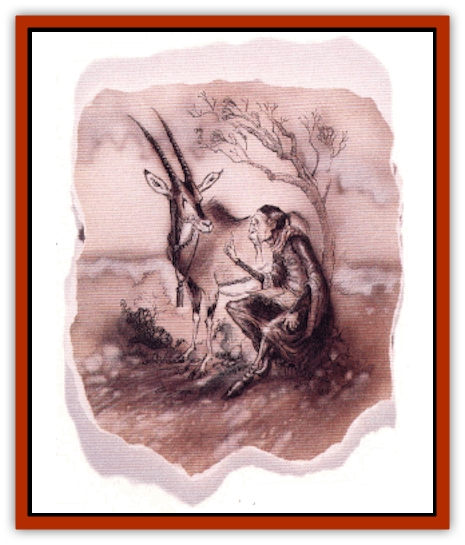

# Warden Beast

| Statistic | **Warden Beast** |
| --- | --- |
| **Activity Cycle:** | As animal type |
| **Alignment:** | Neutral |
| **Armor Class:** | 4 |
| **Climate/Terrain:** | Beastlands |
| **Damage/Attack:** | As animal type +2 |
| **Diet:** | As animal type |
| **Frequency:** | Rare |
| **Hit Dice:** | 6 or as animal type's +3 (whichever is higher) |
| **Intelligence:** | Average (8-10) |
| **Magic Resistance:** | 25% |
| **Morale:** | Steady (11-12) |
| **Movement:** | As animal type |
| **No. Appearing:** | 1 |
| **No. of Attacks:** | As animal type |
| **Organization:** | Solitary (but found with other animals) |
| **Size:** | As animal type, but 25% higher |
| **Special Attacks:** | Spells |
| **Special Defenses:** | Spells, call animal lord |
| **THAC0:** | 15 (or better) |
| **Treasure:** | Nil |
| **XP Value:** | 8,500 + animal type |

Warden beasts are powerful, spiritual representations of animal groups on the Beastlands. They are the protectors, purveyors, and proliferators of their species, serving as leaders and champions. Each warden beast holds dominion over one select, general group of animals (such as [[Bear|bears]], [[Wolf|wolves]], deer, insects, [[Lizard|lizards]], [[Bird|birds]], and so on), but there are many warden beasts for each group.

Only animals found on the Beastlands have a warden beast. That is, no creatures with magical powers or other criteria excluding them from the Beastlands are represented. Thus, there are no [[Basilisk|basilisk]], [[Chimera|chimera]], or [[Dragon_General_Information|dragon]] warden beasts.

In appearance, each warden beast resembles the animal that it guards and masters. The warden beast is the epitome of its animal "type", however, appearing as a slightly larger, perfect specimen. They are graceful, beautiful, and powerful in form. An observer can also see their intelligence and wisdom simply by looking into their eyes.

Warden beasts can speak with all creatures, and can always sense the true emotions of those around them.

**Combat:** Despite their position as stewards and guardians of their selected group of animals, the warden beasts generally attempt to avoid combat. The exception to this is the warden beasts that have dominion over a predatory species. These warden beasts, like their charges, stalk and attack prey in order to eat. When they must fight, warden beasts use the same attack forms and patterns of the animals they represent, although with greater power behind their claws, teeth, kicks, and strikes. Each attack from a warden beast inflicts +2 hit points beyond the damage caused by a normal animal on their damage rolls. Any warden beast can inflict damage upon creatures that can only be harmed by magical weapons of up to +2 enchantment.

A warden beast has a minimum of 6 HD, but if the animal (or any of the varieties if the general type encompasses more than one) that it epitomizes has 6 HD or more to begin with, the warden beam has 3 HD more than that. Therefore, a [[Bear|bear]] warden beast has 11+8 HD (three more than than a [[Bear|polar bear]], the largest type of bear listed in the *Monstrous Manual* tome) and an [[Elephant|elephant]] warden beast has 14 HD.

Due to their spiritual nature, warden beasts have the following spell-like abilities, usable one per round at will, at 10th level of spell use: *animal friendship*, *animal summoning I*, *detect snare and pits*, *entangle*, *protection from evil*, *plant growth* (3 times/day), *animal growth* (1 time/day), *commune with nature* (1 time/day), and *cure light wounds* (1 time/day on any given being).

Because they are not just focused on their own animal subjects but are tied in with all of nature on a basic primal level, warden beasts are 90% likely to become aware of any major event that occurs within 5 miles of their home. Because of this link with their ecosystem, the warden beast is also able to contact (again, on a very basic level) any animal within this radius of 5 miles. The guardian may raise an alarm to cause all animals in this area to flee, swarm, calm, or take some other very basic action. The warden beasts use this only in times of dire need, such as during a forest fire. They will not use this power to simply save their own lives - and, in fact, will never put one of their charges in danger to further their own ends.

If a warden beast cries out in time of utmost emergency, there is a 35% chance that the [[Animal_Lord|animal lord]] of the general animal group that it represents comes to its aid. A warden beast can attempt this only one time per day.

**Habitat/Society:** Famed naturalist Vearth Ennois states: "If an animal lord is on one end of some vast, natural spectrum, and the animals they represent are on the other, then warden beasts fall somewhat in the middle. I believe the warden beast to be some son of extension of the inherent power within the Beastlands itself. They are independent of any power that resides there, fully autonomous in their dominion, yet are (on most levels) simply animals. They seem to be of both the humble animal and the all-pervasive energies of the planes themselves - both nothing and everything. Divinity and beast in one."

Unless some threat to their wards is present, warden beasts act as the animals they resemble and represent. These symbols of nature incarnate usually do not interact with each other, rarely needing to coordinate their actions. One warden beast never looks upon another as potential prey, however.

**Ecology:** Warden beasts are intimately tied into the ecology around them. They embody and personify the ecosystem. Though they inhabit the Beastlands, their alignment is neutral, for they act out of the good of the animals - taking whatever steps necessary to ensure their safety and well being. They are not concerned with the greater good, and react to outsiders as their respective animal type would (timidly, aggressively, and so on). Though not evil by any measure, they do not exemplify many of the commonly held ideals of "goodness" such as mercy or compassion.

Warden beasts keep the same diet as the animals they epitomize. They can have offspring with other warden beasts, animal lords, or normal animals, but the offspring are always warden beasts. These purveyors of animalkind are not subject to the ravages of time, living forever unless slain.

---
## Discovery & Documentation

**Source Publication:** MC8 Outer Planes Appendix (1990)
**Campaign Setting:** Planescape
**Author(s):** Timothy B. Brown, Jamie LaFountain

### Other Creatures Found in This Source Book
   * [[Aasimon_Agathinon|Aasimon, Agathinon]]
   * [[Aasimon_Deva|Aasimon, Deva]]
   * [[Aasimon_Light|Aasimon, Light]]
   * [[Aasimon_General_Information|Aasimon, General Information]]
   * [[Aasimon_Planetar|Aasimon, Planetar]]
   * [[Aasimon_Solar|Aasimon, Solar]]
   * [[Air_Sentinel|Air Sentinel]]
   * [[Animal_Lord|Animal Lord]]
   * [[Archon|Archon]]
   * [[Baatezu_Lesser_Abishai|Baatezu, Lesser, Abishai]]
   * [[Baatezu_Greater_Amnizu|Baatezu, Greater, Amnizu]]
   * [[Baatezu_Lesser_Barbazu|Baatezu, Lesser, Barbazu]]
   * [[Baatezu_Greater_Cornugon|Baatezu, Greater, Cornugon]]
   * [[Baatezu_Lesser_Erinyes|Baatezu, Lesser, Erinyes]]
   * [[Baatezu_General_Information|Baatezu, General Information]]
   * [[Baatezu_Greater_Gelugon|Baatezu, Greater, Gelugon]]
   * [[Baatezu_Lesser_Hamatula|Baatezu, Lesser, Hamatula]]
   * [[Baatezu_Lemure|Baatezu, Lemure]]
   * [[Baatezu_Least_Nupperibo|Baatezu, Least, Nupperibo]]
   * [[Baatezu_Lesser_Osyluth|Baatezu, Lesser, Osyluth]]
   * [[Baatezu_Greater_Pit_Fiend|Baatezu, Greater, Pit Fiend]]
   * [[Baatezu_Least_Spinagon|Baatezu, Least, Spinagon]]
   * [[Balaena|Balaena]]
   * [[Bariaur|Bariaur]]
   * [[Bebilith|Bebilith]]
   * [[Bodak|Bodak]]
   * [[Dog_Moon|Dog, Moon]]
   * [[Dragon_Adamantite|Dragon, Adamantite]]
   * [[Einheriar|Einheriar]]
   * [[Gehreleth|Gehreleth]]
   * [[Githyanki|Githyanki]]
   * [[Githzerai|Githzerai]]
   * [[Hordling|Hordling]]
   * [[Lammasu_Celestial|Lammasu, Celestial]]
   * [[Larva|Larva]]
   * [[Maelephant|Maelephant]]
   * [[Marut|Marut]]
   * [[Mediator|Mediator]]
   * [[Mortai|Mortai]]
   * [[Night_Hag|Night Hag]]
   * [[Nightmare|Nightmare]]
   * [[Noctral|Noctral]]
   * [[Per|Per]]
   * [[Phoenix|Phoenix]]
   * [[Slaad|Slaad]]
   * [[Tanar'ri_Greater_Babau|Tanar'ri, Greater, Babau]]
   * [[Tanar'ri_Greater_Chasme|Tanar'ri, Greater, Chasme]]
   * [[Tanar'ri_Greater_Nabassu|Tanar'ri, Greater, Nabassu]]
   * [[Tanar'ri_Least_Dretch|Tanar'ri, Least, Dretch]]
   * [[Tanar'ri_Least_Manes|Tanar'ri, Least, Manes]]
   * [[Tanar'ri_Least_Rutterkin|Tanar'ri, Least, Rutterkin]]
   * [[Tanar'ri_Lesser_Alu-Fiend|Tanar'ri, Lesser, Alu-Fiend]]
   * [[Tanar'ri_Lesser_Bar-Lgura|Tanar'ri, Lesser, Bar-Lgura]]
   * [[Tanar'ri_Lesser_Cambion|Tanar'ri, Lesser, Cambion]]
   * [[Tanar'ri_Lesser_Succubus|Tanar'ri, Lesser, Succubus]]
   * [[Tanar'ri_Guardian_Molydeus|Tanar'ri, Guardian, Molydeus]]
   * [[Tanar'ri_General_Information|Tanar'ri, General Information]]
   * [[Tanar'ri_True_Balor|Tanar'ri, True, Balor]]
   * [[Tanar'ri_True_Glabrezu|Tanar'ri, True, Glabrezu]]
   * [[Tanar'ri_True_Hezrou|Tanar'ri, True, Hezrou]]
   * [[Tanar'ri_True_Marilith|Tanar'ri, True, Marilith]]
   * [[Tanar'ri_True_Nalfeshnee|Tanar'ri, True, Nalfeshnee]]
   * [[Tanar'ri_True_Vrock|Tanar'ri, True, Vrock]]
   * [[Titan|Titan]]
   * [[Translator|Translator]]
   * [[T'uen-rin|T'uen-rin]]
   * [[Vaporighu|Vaporighu]]
   * [[Yugoloth_Greater_Arcanaloth|Yugoloth, Greater, Arcanaloth]]
   * [[Yugoloth_Lesser_Dergoloth|Yugoloth, Lesser, Dergoloth]]
   * [[Yugoloth_Lesser_Hydroloth|Yugoloth, Lesser, Hydroloth]]
   * [[Yugoloth_General_Information|Yugoloth, General Information]]
   * [[Yugoloth_Lesser_Mezzoloth|Yugoloth, Lesser, Mezzoloth]]
   * [[Yugoloth_Greater_Nycaloth|Yugoloth, Greater, Nycaloth]]
   * [[Yugoloth_Lesser_Piscoloth|Yugoloth, Lesser, Piscoloth]]
   * [[Yugoloth_Greater_Ultroloth|Yugoloth, Greater, Ultroloth]]
   * [[Yugoloth_Lesser_Yagnoloth|Yugoloth, Lesser, Yagnoloth]]
   * [[Zoveri|Zoveri]]
