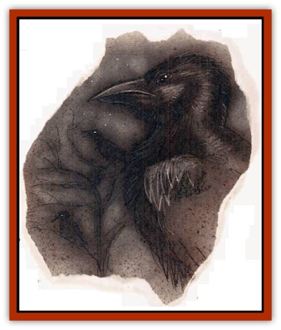

# Wastrel

| Statistic | **Wastrel** |
| --- | --- |
| **Activity Cycle:** | Day |
| **Alignment:** | Neutral evil |
| **Armor Class:** | 6 |
| **Climate/Terrain:** | Any forest, marsh, or swamp |
| **Damage/Attack:** | 1d3 |
| **Diet:** | Scavenger |
| **Frequency:** | Common |
| **Hit Dice:** | 1+1 |
| **Intelligence:** | Semi- (2-4) |
| **Magic Resistance:** | 50% |
| **Morale:** | Unreliable (2-4) |
| **Movement:** | 3, Fl 15 (C) |
| **No. Appearing:** | 10-100 |
| **No. of Attacks:** | 1 |
| **Organization:** | Flock |
| **Size:** | S (3' wingspan) |
| **Special Attacks:** | Ability drain |
| **Special Defenses:** | Nil |
| **THAC0:** | 19 |
| **Treasure:** | Nil |
| **XP Value:** | 270 |

Wastrels're dangerous [[Bird|bird]]like creatures that plague the loneliest and most inhospitable reaches of the planes. They're most often found in desolate woods, dismal swamps, or fetid marshes. Wastrels possess a powerful and deadly ability to slowly drain the life of creatures whose blood they've tasted, weakening and finally killing the poor sod through exhaustion, delirium, and thirst.

A wastrel appears innocuous enough at first. It looks like a large [[Raven_Crow|raven]] or [[Raven_Crow|crow]], but its plumage is unusually shabby and mottled with unhealthy streaks of gray, brown, and black. Its beak and legs are a rusty red, and its eyes are large and sinister. It's easy to take the wastrel as nothing more than a common bird suffering from some kind of wasting disease. They're lazy and awkward fliers, and their call is a rough sort of croaking noise. They usually travel in large flocks.

**Combat:** Wastrels aggressively attack even large parties during their initial encounter with potential prey, swooping in from all sides to dart and peck at their victims. The bird inflicts only 1d3 points of damage with its beak, but it's not very interested in trying to down its prey at this stage - it merely wants to establish a link between itself and its prey by drawing blood. Once a wastrel's wounded a victim, it retreats from the fight. Wastrels try to wound as many victims as possible, so a flock'll divide itself evenly among its potential prey. For example, if 60 wastrels attack a group of 6 PCs and 4 hirelings, each person present is attacked by 6 wastrels. Wastrels're hardly courageous, and if they don't score a hit within 1 or 2 rounds they're likely to fly off, only to return later and try again.

After their initial encounter, wastrels settle down into a pursuit phase. Each bird that wounded a character leeches life energy from its victim, but only if it can remain close - within 100 yards or so. The bird doesn't have to be exactly within 100 yards for the entire day, but it has to average 100 yards or less from its victim throughout the course of a 24-hour period. The wastrel flock tries to stay within range of its victims, individuals circling or flying ahead in short hops and waiting for the prey to travel past them again. Wastrels've got a special sense that unerringly locates their current victim, as long as the basher's within 1 mile. If he can get farther away from the wastrel, the bird loses him and the link is broken. The wastrel'd have to wound the character again to begin a new bond.

Victims who're being drained by a wastrel lose 1 point of Constitution each day the pursuit continues, and ½ point from all other ability scores. The victim can attempt a saving throw versus spell to reduce these losses to ½ point of Con and 0 points from other abilities. If any single ability score's reduced to 2 or less, the character can't travel without aid any longer. If any ability's drained to 0 or below, the victim dies. All penalties or restrictions based on ability scores apply, so a priest reduced from a 13 Wisdom to a 12 Wisdom by a wastrel's draining loses his bonus 1st-level spell and now suffers a 5% chance of spell failure. In addition, victims don't naturally heal any damage they may've suffered from the wastrel.

Wastrels that haven't established a link may make several mass attacks to wound victims of their own. However, once a wastrel's established its link, it doesn't join in any more attacks against its victim. It's content to glide lazily along, just out of reach. If its prey tries to attack it, the wastrel flies away, returning again as soon as the victims give up and resume their march. Missile attacks can be more effective, but the difficult terrain favored by wastrels often provides a -2 to -4 penalty to attacks made on them through the screening foliage and trees. (In open lands, the wastrels won't be able to use cover to stay out of the way of arrows or slingstones.)

Victims who've been partially drained but then break the link by killing the bird or escaping its range regain their lost ability scores at the rate of 1 point in each ability per day. A *heal* spell restores all lost points at once. If any ability score was drained to 2 or less, that ability is permanently reduced by 1, and the character'll never fully recover without the aid of a *restoration* spell.

**Habitat/Society:** Wastrel flocks gradually destroy the local flora and fauna of their surroundings by their foul leeching of energy. A stand of trees where a wastrel flock nests'll be dead and lifeless within a few weeks of the birds' arrival. Small wildlife rapidly disappears from the region. An exceptionally large flock can slowly kill several square miles of forest. Because of this, wastrel flocks are forced to migrate every 3 to 6 months just to find new food sources.

Wastrels aren't truly intelligent, but they are unusually cunning and seem to have an aptitude for wreaking harm. They're hateful, malicious creatures that delight in killing, often leaving their mundane victims uneaten. Flocks are noisy and quarrelsome, but wastrels don't actually break out into open fighting with each other.

**Ecology:** Wastrels aren't usually a problem if a cutter's not planning a prolonged overland expedition, or doesn't care if he stays somewhere a long time. On the other hand, they can be a mortal threat to a basher with a lot of miles to cover in wilderness areas, or a sod as happens to live where the flock�s decided to settle. Wastrels recognize that they won't often finish a meal if they set upon the victim too near civilization, so they prefer to haunt the more desolate regions of the planes.

Wastrels almost certainly originated somewhere in the Gray Waste, where life and hope are drained by the very land itself. Some bloods say that one of the grim powers inhabiting the Gray Waste created the wastrels for its own dire purposes. Whatever the truth of that, wastrels're common in the upper layers of that plane, and they're becoming more of a problem elsewhere on the planes.

No one's ever managed to explain how the wastrel draws energy from its victims, why it needs to wound the sod first, or why its range is so limited. Wastrels consume small insects and rodents to supplement their unusual diet.

---
## Discovery & Documentation

**Source Publication:** Planescape II (1996)
**Campaign Setting:** Planescape
**Author(s):** Rich Baker, Karen S. Boomgarden

### Other Creatures Found in This Source Book
   * [[Aasimar|Aasimar]]
   * [[Abrian|Abrian]]
   * [[Arcane|Arcane]]
   * [[Balaena|Balaena]]
   * [[Beholder-kin_Observer|Beholder-kin, Observer]]
   * [[Bloodthorn|Bloodthorn]]
   * [[Bonespear|Bonespear]]
   * [[Darkweaver|Darkweaver]]
   * [[Demarax|Demarax]]
   * [[Dhour|Dhour]]
   * [[Eater_of_Knowledge|Eater of Knowledge]]
   * [[Eladrin_Greater_Firre|Eladrin, Greater, Firre]]
   * [[Eladrin_Greater_Ghaele|Eladrin, Greater, Ghaele]]
   * [[Eladrin_Greater_Tulani|Eladrin, Greater, Tulani]]
   * [[Eladrin_Lesser_Bralani|Eladrin, Lesser, Bralani]]
   * [[Eladrin_Lesser_Coure|Eladrin, Lesser, Coure]]
   * [[Eladrin_Lesser_Noviere|Eladrin, Lesser, Noviere]]
   * [[Eladrin_Lesser_Shiere|Eladrin, Lesser, Shiere]]
   * [[Fhorge|Fhorge]]
   * [[Ghostlight|Ghostlight]]
   * [[Guardinal_Avoral|Guardinal, Avoral]]
   * [[Guardinal_Cervidal|Guardinal, Cervidal]]
   * [[Guardinal_General_Information|Guardinal, General Information]]
   * [[Guardinal_Equinal|Guardinal, Equinal]]
   * [[Guardinal_Leonal|Guardinal, Leonal]]
   * [[Guardinal_Lupinal|Guardinal, Lupinal]]
   * [[Guardinal_Ursinal|Guardinal, Ursinal]]
   * [[Hollyphant|Hollyphant]]
   * [[Incantifer|Incantifer]]
   * [[Ironmaw|Ironmaw]]
   * [[Keeper|Keeper]]
   * [[Khaasta|Khaasta]]
   * [[Leomarh|Leomarh]]
   * [[Monster_of_Legend|Monster of Legend]]
   * [[Mortai|Mortai]]
   * [[Noctral|Noctral]]
   * [[Quill|Quill]]
   * [[Razorvine|Razorvine]]
   * [[Reave|Reave]]
   * [[Retriever|Retriever]]
   * [[Rilmani_Abiorach|Rilmani, Abiorach]]
   * [[Rilmani_General_Information|Rilmani, General Information]]
   * [[Rilmani_Argenach|Rilmani, Argenach]]
   * [[Rilmani_Aurumach|Rilmani, Aurumach]]
   * [[Rilmani_Cuprilach|Rilmani, Cuprilach]]
   * [[Rilmani_Ferrumach|Rilmani, Ferrumach]]
   * [[Rilmani_Plumach|Rilmani, Plumach]]
   * [[Shadowdrake|Shadowdrake]]
   * [[Spellhaunt|Spellhaunt]]
   * [[Spider_Hook|Spider, Hook]]
   * [[Sunfly|Sunfly]]
   * [[Sword_Spirit|Sword Spirit]]
   * [[Tanar'ri_Lesser_Bulezau|Tanar'ri, Lesser, Bulezau]]
   * [[Tanar'ri_Lesser_Maurezhi|Tanar'ri, Lesser, Maurezhi]]
   * [[Tanar'ri_Lesser_Yochlol|Tanar'ri, Lesser, Yochlol]]
   * [[Tanar'ri_General_Information|Tanar'ri, General Information]]
   * [[Tanar'ri_True_Alkilith|Tanar'ri, True, Alkilith]]
   * [[Terlen|Terlen]]
   * [[Tso|Tso]]
   * [[T'uen-rin|T'uen-rin]]
   * [[Vaporighu|Vaporighu]]
   * [[Vorr|Vorr]]
   * [[Wraithworm|Wraithworm]]
   * [[Yugoloth_Lesser_Canoloth|Yugoloth, Lesser, Canoloth]]
   * [[Zoveri|Zoveri]]
