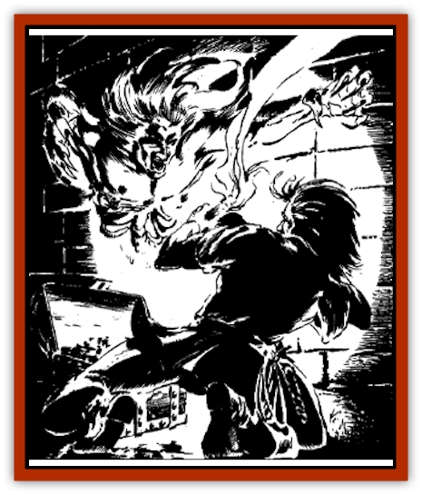

# Watchghost

| Statistic | **Watchghost** |
| --- | --- |
| **Activity Cycle:** | Any |
| **Alignment:** | Any lawful, see below |
| **Armor Class:** | 1 |
| **Climate/Terrain:** | Any land |
| **Damage/Attack:** | 2-16 |
| **Diet:** | None |
| **Frequency:** | Rare |
| **Hit Dice:** | 7+2 |
| **Intelligence:** | As in life (8-18) |
| **Magic Resistance:** | 25% |
| **Morale:** | Fearless (19-20) |
| **Movement:** | 9, Fl 9 (C) |
| **No. Appearing:** | 1-4 |
| **No. of Attacks:** | 1 |
| **Organization:** | Solitary or guard-groups |
| **Size:** | M (6' tall) |
| **Special Attacks:** | Chill ray |
| **Special Defenses:** | Insubstantial, pass through stone |
| **THAC0:** | 13 |
| **Treasure:** | Any possible (guardian) |
| **XP Value:** | 4,000 |

These undead, sometimes called "unsleeping guardians", appear as graceful, beautiful humans of either sex who drift or walk about silently. Their limbs and appendages sometimes retain chalk-white flesh, but their torsos and lower bodies are always skeletal, and their eyes are always dark, empty pits.

**Combat:** Watch[[Ghost|ghosts]] are intelligent, dangerous opponents. Unlike most undead, they cannot be turned due to the nature of their undeath. They normally attack with a *chilling touch*, which causes 2d8 damage to living flesh.

A watchghost can also attack with a *chill ray* once per round, using this power a maximum of 12 times every day. It points a finger, and a ray of cold light will glance from it towards a single target being. This ray can penetrate any magical protections and spell barriers of less than 4th level, and strikes with a THAC0 of 6. It has a maximum range of 90'. A victim must save vs. death magic or suffer 2d12 points of energy-draining damage. The victim must also make a saving throw vs. petrification or be *slowed* for 2d12 rounds - the character's level. The *slow* effects can be prematurely ended by *dispel magic* or *haste* spells.

Against spell attacks, a watchghost is immune to *charm*, *sleep*, and *hold* spells; all poison, petrification, polymorph, cold-based, and death magic attacks are also ineffective against a watchghost. Against all other spells, a watchghost applies its magic resistance. Holy water and holy symbols are also ineffective against watchghosts.

An unsleeping guardian can at will cause all magical items within 60' to glow with a cold, white radiance. This glow can be quelled by a *dispel magic*, but will otherwise last 2d4 turns. This radiance, while it increases visibilty for the characters, also attracts more wandering monsters.

Watchghosts can become wholly or partially insubstantial at will. In this state, they deal no damage, but suffer none from purely physical attacks. Magic weapons passing through the wraith-like form of a watchghost do it damage equal to twice their magical bonuses. Therefore, a *dagger +2* and a *longsword +2* both deal four points of damage to an insubstantial watchghost.

When insubstantial, watchghosts can pass through solid stone or earth. They can do this without pause or effort, and can attack or defend during the round they enter or exit the earth. Many watchghosts lurk within stone tombs or dungeon walls, only their eyes, nose, and fingertips protruding. They then reach out to grapple passing intruders, often taking them by surprise. Watchghosts also can fly when insubstantial.

**Habitat/Society:** Watchghosts are usually found as guardians, serving powerful undead lords such as [[Spectre|spectres]], [[Vampire_General_Information|vampires]], and [[Lich|liches]]. Often, watchghosts are set to guard a tomb, treasure vault, or other enclosed areas by powerful, evil priests or wizards, Usually solitary, they can meet in small groups if so ordered. Watchghosts may take part in sharp verbal exchanges with fellow watchghosts, but they never willingly fight each other, and work together loyally and smoothly as guardians.

Retaining intelligence and judgement, they can be given detailed and specific commands to follow. They can carry on intelligent conversations with their masters or, if given leave, with strangers. Unsleeping guardians speak as they did in life, but usually with a hint of hissing or whispering in their voices.

Free or "wild" watchghosts arise only by the destruction of the being who created them. They are often self-willed and capricious. Some aid living beings, and others seek to destroy the living or lead them astray. Many try to manipulate people (kings?) to achieve the power that eluded them in life. Many others retain enough of their humanity to guide and guard friends and relations, or perhaps befriend lone individuals such as a runaway or an isolated adventurer. Some retain only the pettiness of their past lives and take revenge upon their former enemies.

**Ecology:** Watchghosts consume nothing, have no offspring, and serve only to prevent incursions into the area they guard. In this role, they prey on monsters, adventurers, and other living beings. Other than to curb the numbers of these creatures and make carrion of them, watchghosts serve no function in the food chains of their surroundings. Only when freed do they exhibit a wide range of purposes and activities, as detailed above. Even then, the unsleeping guardians rarely affect or serve any function within the surrounding ecosystem.

The creation of a watchghost is similar to the process of summoning a [[Crypt_Thing|crypt thing]]. By casting an 8th-level spell, priests or necromancers can create and bind a watchghost into service.

Tales of watchghosts are widespread in Faer�n, especially in the North, There are persistent whispers in Scardale that Lashan Aumersair, the former Lord of Scardale, and the agents of Zhentil Keep and Sembia after him were thwarted in many local ambitions by The Silent One, a watchghost that roams the dale. Guarding its interests in undeath as it once did in life, the Silent One appears as a bearded, grim faced, thin man in archaic armor. Sages believe he is all that is left of the adventurer Orghalor Hawkgauntlet, once an important man in the dale, who fell in love with a mysterious, darkly beautiful woman - some say she was a vampire - and disappeared some forty winters ago.

In Waterdeep, the dungeons beneath Castle Waterdeep are said to be haunted by roaming watchghosts; bound into service by a long-dead Lord to guard the treasure vaults and Lords' tombs there, they now roam all of the crypts and passages. Some believe (correctly) that the Castle and Palace are connected by underground ways, and that the walls of both structures are honeycombed with secret passages where the watchghosts lurk and listen.

Once, as tavern-talk will report, these silent guardians supposedly roused a Lord and his wife from their bed to escape an assassination attempt. Watchghosts also allegedly slaughtered a band of Shadow Thieves who crept into the Palace from the sewers to poison the contents of the winecellars.

The wandering bard and Harper Elysree Csimaree "Silverharp", formerly of Berdusk, is widely held to have an unsleeping guardian who follows and watches over her in her travels. There is even a ballad about it - Elysree's Phantom Lover - but Elysree usually attacks those who sing or even hum notes from it in her presence.

---
## Discovery & Documentation

**Source Publication:** Ruins of Undermountain I (1994)
**Campaign Setting:** Forgotten Realms
**Author(s):** Ed Greenwood

### Other Creatures Found in This Source Book
   * [[Automaton_Scaladar|Automaton, Scaladar]]
   * [[Beholder-kin_Death_Kiss|Beholder-kin, Death Kiss]]
   * [[Beholder_Elder_Orb|Beholder, Elder Orb]]
   * [[Darktentacles|Darktentacles]]
   * [[Ibrandlin|Ibrandlin]]
   * [[Sharn|Sharn]]
   * [[Slithermorph|Slithermorph]]
   * [[Snake_Flying|Snake, Flying]]
   * [[Steel_Shadow|Steel Shadow]]
