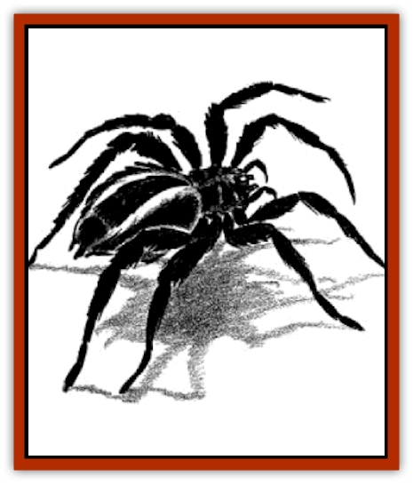

# Watchspider

| Statistic | **Watchspider** |
| --- | --- |
| **Activity Cycle:** | Any |
| **Alignment:** | Lawful neutral |
| **Armor Class:** | 6 |
| **Climate/Terrain:** | Any temperate |
| **Damage/Attack:** | 1-6 |
| **Diet:** | Carnivore |
| **Frequency:** | Rare; Uncommon (in Waterdeep) |
| **Hit Dice:** | 2+2 |
| **Intelligence:** | Low (5-7) |
| **Magic Resistance:** | Nil |
| **Morale:** | Fanatic (17) |
| **Movement:** | 18 |
| **No. Appearing:** | 1-8 |
| **No. of Attacks:** | 1 |
| **Organization:** | As trained and deployed |
| **Size:** | M (6' in diameter) |
| **Special Attacks:** | Poison (see below) |
| **Special Defenses:** | Nil |
| **THAC0:** | 19 |
| **Treasure:** | Any possible (guardian) |
| **XP Value:** | 420 |

Watchspiders are a specially-bred subspecies of [[Spider|huge spiders]], raised and trained in the Realms as guardians. Like any [[Spider|spider]], the watchspider has eight legs and eight eyes; specifically, it is a variant species of huge hunting spider, with a sleek body, large head and fangs, and excessively hairy body and legs. The watchspider does not spin webs, but it is a fast, aggressive predator with a poisonous bite.

**Combat:** Watchspiders tend to lurk in the dark shadows near the entrance to areas they are set to guard; from there, they can observe who enters, and attack before being spotted (surprise penalties of -6 for opponents) if the intruders are not among those allowed into its area. Watchspiders can leap up to 30 feet through the air at victims.

Watchspiders initially bite each intruder once, since they are trained to neutralize as many intruders as possible, and continue such attacks until all intruders are paralyzed. Watchspider bites cause 1-6 points of damage and contain a poisonous venom. Victims get a saving throw vs. poison with a +1 bonus against the watchspider's venom; if the saving throw fails, the venom causes paralysis for 2-8 turns after an onset time of 1-2 rounds (the victim can see and hear, but cannot move or speak until the venom wears off).

Watchspiders are otherwise identical to huge spiders, and never build their own webs (though they can climb walls and webs easily). If starved for long periods, they tend to devour paralyzed prey unless they are removed within three turns of becoming paralyzed.

**Habitat/Society:** In Waterdeep, watchspiders are fairly common in guild houses' and rich merchants' cellars and warehouses. They are trained to obey a single master, who can order them not to attack certain other beings. All watchspiders are schooled in disabling spellcasters and in avoiding weapons set against their leaping attack (spears and large piercing weapons). They have acquired intelligence through breeding, over the centuries, and can be trained for the specific needs of the buyer. The five watchspiders in the vault of the Phull villa are trained to attack in two pairs while the fifth rings a bell set on the wall near the cellar entrance. Likewise, permanent *web* spells drape the ceiling of a cellar of the Wands villa and a watchspider guards the artifact vault; if it counts more than two intruders, it is trained to drink from a basin above the webs that contains a unique *potion of heroism*, which grants the spider 3 extra Hit Dice (for hp and THAC0) for 1d10 turns, and then attack.

**Ecology:** This special breed of spiders was once indigenous only to Tharsult, where the dusky-skinned natives first trained this species as guards; the Mhairuun merchant family brought the spiders and their breeding and training processes north to Waterdeep, swiftly establishing a lucrative business with this rare commodity. After sixty years of breeding in the North, watchspiders can be found in Sword Coast cities from Neverwinter to Lantan, all purchased and shipped from Waterdeep; while originally a creature of more temperate climes, watchspiders have adapted to the Sword Coast with the growth of heavier hair (almost fur), but they still cannot survive the cold any further north than Neverwinter.

Recently, the last Mhairuun heir of Waterdeep, the lady Lythis Mhairuun, married Lord Urtos Phylund II, uniting their family fortunes. This move also opened up the possibilities for management and expansion of the watchspider business, since the Phylunds had long been trappers, breeders, and trainers of many different types of monsters. Lord and Lady Phylund had been experimenting with a number of variant breeds of huge spiders, rumors suggesting new forms of watchspiders will soon hit the market (such as those that spin webs coated with paralytic venom, or others that have the deadly edged limbs of the [[Spider|sword spider]] with the trained abilities of watchspiders).

---
## Discovery & Documentation

**Source Publication:** City of Splendors (1994)
**Campaign Setting:** Forgotten Realms
**Author(s):** Ed Greenwood, Elain Cunningham

### Other Creatures Found in This Source Book
   * [[Curst|Curst]]
   * [[Doppelganger_Greater|Doppelganger, Greater]]
   * [[Duhlarkin|Duhlarkin]]
   * [[Gulguthhydra|Gulguthhydra]]
   * [[Hakeashar|Hakeashar]]
   * [[Leucrotta_Greater|Leucrotta, Greater]]
   * [[Lycanthrope_Wereshark|Lycanthrope, Wereshark]]
   * [[Nyth|Nyth]]
   * [[Ooze_Slime_Jelly_Ghaunadan|Ooze/Slime/Jelly, Ghaunadan]]
   * [[Palimpsest|Palimpsest]]
   * [[Peltast|Peltast]]
   * [[Raggamoffyn|Raggamoffyn]]
   * [[Shadowrath|Shadowrath]]
   * [[Snake_Sewerm|Snake, Sewerm]]
