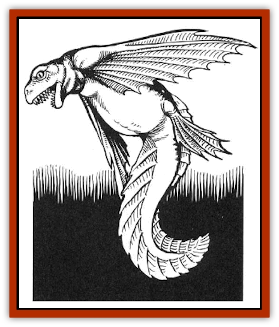

# Water Leaper

| Statistic | **Water Leaper** |
| --- | --- |
| **Activity Cycle:** | Day |
| **Alignment:** | Neutral (evil) |
| **Armor Class:** | 8 |
| **Climate/Terrain:** | Temperate lakes |
| **Damage/Attack:** | 1d4 |
| **Diet:** | Carnivore |
| **Frequency:** | Very rare |
| **Hit Dice:** | 1-1 |
| **Intelligence:** | Semi- (2-4) |
| **Magic Resistance:** | Nil |
| **Morale:** | Average (10) |
| **Movement:** | Sw 12 |
| **No. Appearing:** | 4d6 |
| **No. of Attacks:** | 1 |
| **Organization:** | Pack |
| **Size:** | S (3' long) |
| **Special Attacks:** | Shriek, Leap |
| **Special Defenses:** | Nil |
| **THAC0:** | 20 |
| **Treasure:** | Nil |
| **XP Value:** | 65 |

Water leapers, known as llamhigyn y dwr (pronounced "thlamheegin er door") in their native Wales, look something like a large toad with a fishlike tail instead of back legs and a pair of flying-fish style fin-wings instead of front legs. Their broad mouths are full of very sharp teeth. They will attack almost anything and regularly destroy the nets and lines of local fishermen. They also attack swimmers and livestock drinking at the lake's edge.
Water leapers can jump out of the water and glide up to 30' using their winglike fins. They have been known to try to knock fishermen out of their boats by deliberately leaping at them. They can also emit a piercing shriek which can startle an unwary fisherman or animal, making their attack easier.

**Combat:** Water leapers attack with their teeth. Up to 12 of the creatures can attack a human-sized victim at the same time. Their leap attack is treated as a normal melee attack, but instead of causing damage, a successful hit forces the victim to roll a successful Dexterity ability check or fall down. Characters sitting in a boat have a +2 bonus to this check, and characters standing up in boats have a �2 penalty. If the boat is a small one, there is a good chance that the character will fall overboard. The water leaper's shriek causes every creature within 30 yards to roll a successful saving throw vs. Spells or be unable to take any action for the next round. A water leaper may not take any other action in a round when it shrieks.

**Habitat/Society:** Water leapers live in small schools in the lakes of Wales. These schools operate like a wolf pack, showing a rudimentary organization in the hunt. For instance, they will spread out so as to attack a target from all sides at once, and one member may stand a little way off and shriek just as the others are leaping to the attack.

**Ecology:** Water leapers can live on lake fish, but their appetites are so voracious that they quickly deplete the fish stocks in anv lake thev inhabit. They seem to prefer the meat of sheep, cattle, and humans who wade into the shallows at the lake's edge and will even try to knock victims into the water from bridges and boats. Water leapers have no natural enemies apart from enraged fishermen and deadlier water monsters such as lake worms and [[Horse_Water-|water horses]].

---
## Discovery & Documentation

**Source Publication:** HR3 Celts Campaign (1992)
**Campaign Setting:** Advanced Dungeons & Dragons 2nd Edition
**Author(s):** Graeme Davis

### Other Creatures Found in This Source Book
   * [[Boobrie|Boobrie]]
   * [[Horse_Water-|Horse, Water-]]
   * [[Phouka|Phouka]]
