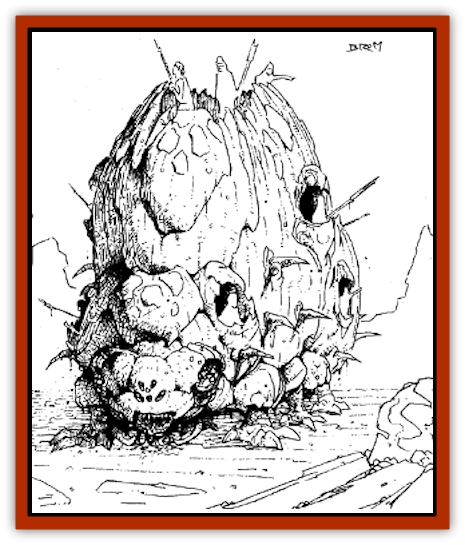

# Watroach

| Statistic | **Watroach** |
| --- | --- |
| **Activity Cycle:** | Night |
| **Alignment:** | Neutral |
| **Armor Class:** | 2 |
| **Climate/Terrain:** | Sandy wastes, salt flats |
| **Damage/Attack:** | 3-18/1-12/1-12 |
| **Diet:** | Insectivore |
| **Frequency:** | Rare |
| **Hit Dice:** | 15+10 |
| **Intelligence:** | Animal (1) |
| **Magic Resistance:** | Nil |
| **Morale:** | Elite (13-14) |
| **Movement:** | 9 |
| **No. Appearing:** | 1 |
| **No. of Attacks:** | 3 |
| **Organization:** | Nest |
| **Size:** | G (30' long) |
| **Special Attacks:** | Trample |
| **Special Defenses:** | Nil |
| **THAC0:** | 5 |
| **Treasure:** | Nil |
| **XP Value:** | 8,000 |

Watroaches (or war beetles) are enormous nomadic insects of the desert tablelands. Each adult is actually a gigantic, mobile hive filled with a multitude of drones.

An adult watroach is over 30' long, 20' wide, and 30' tall at the top of its central hive chamber. The three body sections - head, hive chamber, and thorax - are supported by six short legs extending from a central limb cluster. The head is very wide and low to the ground, the mouth ringed with sharp teeth and flanked by deadly pincers. The watroach?s neck and head agility is surprising, necessary for it to attack and consume its primary prey: large insects. The watroach's tongue is very sticky, trapping tiny insects found beneath rocks or in crevices. It is also hollow, so the watroach can suck small bugs directly into its gullet. The thorax is a storehouse of digested food and liquids for the adult watroach, and is connected to the central hive chamber. Inside the honeycombed chamber are millions of infant, drone watroaches, each less than 1" long, that serve the gestating proto-adult at the center of the hive. The watroach's exoskeleton is black or deep purple.

Watroaches have no language; adults in the wild take no notice of other adults they encounter. Other creatures can communicate with them using psionics or magic.

**Combat:** A watroach can attack with its bite/pincers and with its two forelegs every round. The bite/pincers inflict 3-18 hp damage. Each foreleg can inflict 1-12 hp damage.

When fighting creatures that are clearly slower than itself, a watroach may decide to trample its targets instead of making its normal attacks. When trampling attack, the watroach must be able to move over the target with the entire length of its body in that round. When it does so, the target must save vs. petrification six times (once for each leg). Each time the save is failed, the victim suffers 2-16 hp damage. The watroach can trample only one target per round.

**Habitat/Society:** Watroaches are solitary creatures in one sense and entire communities in another. Adults do not travel or hunt together, so it can be said that they are encountered only as individuals. However, in truth, each adult carries millions of drones and a proto-adult within its body, making it a complete walking community, self-sustaining and perpetuating.

**Ecology:** The adult watroach lives only to feed, so that its hive chamber is fruitful when it dies. The drones bath, feed, and otherwise maintain the proto-adult until such time as the adult gets too old to move. When the parent is immobilized and dying, the proto-adult begins a rapid growth to full size. Within three days, the proto-adult ingests the remaining nutrients from its parent's thorax and most of the hive materials, literally eating its way out of the hive chamber. The proto-adult bursts out of its hive chamber nearly full grown, with its own chamber filled with drones and a new protoadult inside. A few of the original drones go on to serve the new adult, but most perish in the open sun next to the carcass of the parent.

**Undead Watroach**

  Watroaches are favorites among the insect necromancers in the armies of the sorcerer kings. Their great size makes them ideal creatures to be slain, modified, then animated to serve the wickedness of their masters.

Typically, an adult watroach is sought out in the desert, surrounded, and killed. A psionic kill is preferred, leaving the corpse unmarred for future construction. Once taken back to a city (usually on a large wagon behind two or more mekillots or driks), the watroach's carcass is prepared. The brain and guts are removed, as is much of the honeycombed hive material. The drones are smoked out over large fires, and the dormant proto-adult is discarded. Usually, the top of the hive chamber is then opened and a platform installed, and a variety of other individual weapons positions are cut into all of the three body sections. Once finished, the beast is raised from the dead by templar magic. A typical undead war watroach has eight warriors in addition to its templar master. In its undead form, the watroach can move and fight just as in life.

Undead war watroaches are most commonly employed by the armies of Raam and Nibenay, though others have used them on occasion.

---
## Discovery & Documentation

**Source Publication:** Dragon185 (1992)
**Campaign Setting:** Dragon Magazine
**Author(s):** Timothy B. Brown, Brom

### Other Creatures Found in This Source Book
   * [[Cariad_Ysbryd|Cariad Ysbryd]]
