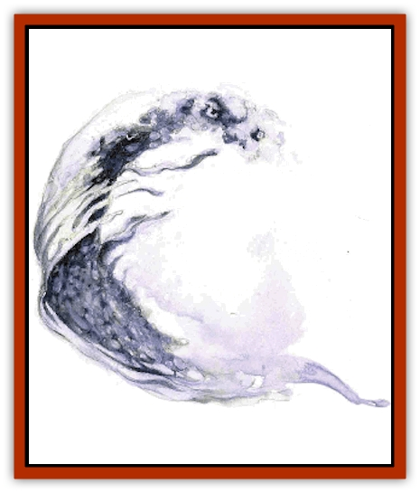

# Wavefire

| Statistic | **Wavefire** |
| --- | --- |
| **Activity Cycle:** | Any |
| **Alignment:** | Neutral |
| **Armor Class:** | 1 (6 out of water) |
| **Climate/Terrain:** | Quasiplane of Steam |
| **Damage/Attack:** | 3d6 |
| **Diet:** | Air |
| **Frequency:** | Uncommon |
| **Hit Dice:** | 8 |
| **Intelligence:** | Average (8-10) |
| **Magic Resistance:** | Nil |
| **Morale:** | Average (8) |
| **Movement:** | Sw 48 (3 out of water) |
| **No. Appearing:** | 1d3 |
| **No. of Attacks:** | 1 |
| **Organization:** | Solitary |
| **Size:** | L (12' tall) |
| **Special Attacks:** | Scalding |
| **Special Defenses:** | Struck only by +1 or better weapons, immunities |
| **THAC0:** | 13 |
| **Treasure:** | Nil |
| **XP Value:** | 4,000 |

Now *here's* a stretch - a body needs a wide-open mind to follow along. A few scholars and philosophers think that, long ago, the Inner Planes had a different configuration. They say that the four Elemental Planes (Air, Earth, Fire, and Water) were arranged in a different order, which produced different Paraelemental Planes than those that folks're familiar with. For example, the planes of Earth and Air mixed to create a very different Paraelemental (not Quasielemental) Plane of Dust - one full of choking, swirling sand-storms rather than disintegration and decay. Furthermore, the planes of Fire and Water shared a border, creating the Paraelemental Plane of Steam.

Well, this alternate plane of Steam was supposedly made up of a super-heated, infinitely deep ocean that boiled continuously, sending steam up off its surface into an endless sky filled with water vapor, And. bloods say, riding along the surface or this bubbling sea were the wavefires - boiling [[Elemental_Fire_Water|water elementals]], more or less.

Now, the wavefires exist, there's no doubting that. See, graybeards who hold to the "alternate planes" theory claim that the Inner Planes rearranged themselves (or were rearranged - but by whom or what?) eons ago, resulting in the pattern so well known today. Most everything that lived in the previous configuration passed from existence, but the wavefires somehow made the transition into the present multiverse.

Fact is, the controversial scholars point to the wavefires as proof of their claim - and the *only* proof, at that. They say that the mere existence of the strange creatures validates their theory. But it's more of a leap than a tumble, a body's got to admit. Sure, the wavefires don't seem to fit well with what's known about the quasiplane of Steam, but does that necessarily mean that they come from an alternate Steam that no longer exists? Isn't it more likely that some berks just don't know as much about the quasiplane as they'd like to think? What kind of gullies do these so-called philosophers take folks for, anyway?

Know this: If a blood can tumble to the angle or percentage these cony-catchers might get from perpetuating such a lie, he's come to the real dark of the matter.

**Combat:** The wavefire is as straightforward a combatant as they come. With its great swimming speed, it rushes upon its foes and bashes them with a forceful, boiling wave or water. Those struck by the wave suffer 3d6 points of damage and must make a saving throw versus breath weapon. A sod who fails his roll sustains an additional 2d6 points of damage from the scalding temperature of the water. A successful save indicates that the victim suffers only half the extra damage (1d6 points).

The wavefire's excellent Armor Class comes partly from its fluid form and partly from its great speed. If the creature somehow suddenly finds itself in a nonwatery environment (say, if a canny spellslinger teleports it elsewhere), its movement rate slows to 3 and its AC falls to 6.

Wavefires can be struck only by weapons of +1 or greater enchantment, and they're immune to heat and fire. Spells such as *part water* or *lower water* have no effect on them. A cold-based attack, however, such as a *cone of cold*, inflicts twice its normal damage on a wavefire, as it lowers the creature's temperature and robs it of its essence. Such attacks also reduce the wavefire's movement by half for 1d3 rounds.

**Habitat/Society:** As most any bark knows, the quasiplane of Steam is a cool, damp, misty place. The wavefire, however, is hot to the point of boiling and "swims" through the mists of the plane with speed and ferocity. They seem angry and alien creatures, out of place even in what appears to be their native environment (unless the previously mentioned sages are correct, of course). Rarely, the creatures appear on the Elemental Plane of Water, but they don't stay long - the cooler temperatures or the liquid there would eventually overcome and slay them.

Inner-planar travelers report having spotted small packs or wavefires flowing through the quasiplane of Steam, working in concert. Such groupings are almost always short-lived, however. Competition for food is so severe that, sooner or later, a wavefire must fend for itself. In other words, it tries to succeed instead of, rather than in addition to, its brethren.

Wavefires rarely interact with the few other creatures that live on Steam. The [[Quasielemental_Positive|quasielementals]] and [[Mephit_VIII_Mist_Steam|mephits]] usually give the boiling masses of water a wide berth, but little actual respect. The wavefires don't seem to mind this treatment - in fact, they hardly notice the other natives at all.

**Ecology:** The wavefire craves dry air, which it absorbs into its scalding mass. And since the lungs of most visitors to the quasiplane of Steam contain dry air (at least, dry by the plane's standards), they're an obvious source of sustenance for the creature. Other than seeking such prey, however, the wavefire spends its time searching for bubbles of pure air that've leaked onto the plane.

In the final analysis, though, are the so-called graybeards right? Could there have been at one time different Inner Planes with a different configuration? Well, sure - with all the oddities that already exist in the multiverse, it seems that anything's possible. What's really hard to swallow, though, is that the only basis for the theory is the existence of the wavefire - one single creature that doesn't seem to fit into the environment of its plane. Most folks don't call that sound analysis so much as storytelling.

---
## Discovery & Documentation

**Source Publication:** Planescape III (1996)
**Campaign Setting:** Planescape
**Author(s):** Monte Cook

### Other Creatures Found in This Source Book
   * [[Animental|Animental]]
   * [[Archomental_Evil|Archomental, Evil]]
   * [[Archomental_Good|Archomental, Good]]
   * [[Belker|Belker]]
   * [[Bzastra|Bzastra]]
   * [[Chososion|Chososion]]
   * [[Darklight|Darklight]]
   * [[Devete|Devete]]
   * [[Devourer_Planescape|Devourer (Planescape)]]
   * [[Dharum_Suhn|Dharum Suhn]]
   * [[Egarus|Egarus]]
   * [[Elemental_Athas_Lesser_Air_Earth|Elemental (Athas), Lesser, Air/Earth]]
   * [[Elemental_Athas_Lesser_Fire_Water|Elemental (Athas), Lesser, Fire/Water]]
   * [[Elemental_Fire_Kin_Salamander_II|Elemental, Fire Kin, Salamander II]]
   * [[Entrope|Entrope]]
   * [[Facet|Facet]]
   * [[Frost_Salamander|Frost Salamander]]
   * [[Fundamental_Air_Earth|Fundamental, Air/Earth]]
   * [[Fundamental_Fire_Water|Fundamental, Fire/Water]]
   * [[Fundamental_All_Elements|Fundamental, All Elements]]
   * [[Garmorm|Garmorm]]
   * [[Homunculus_Elemental|Homunculus, Elemental]]
   * [[Immoth|Immoth]]
   * [[Khargra|Khargra]]
   * [[Klyndes|Klyndes]]
   * [[Magran|Magran]]
   * [[Menglis|Menglis]]
   * [[Nathri|Nathri]]
   * [[Ooze_Sprite|Ooze Sprite]]
   * [[Paraelemental|Paraelemental]]
   * [[Phirblas|Phirblas]]
   * [[Psurlon|Psurlon]]
   * [[Quasielemental_Negative|Quasielemental, Negative]]
   * [[Quasielemental_Positive|Quasielemental, Positive]]
   * [[Rast|Rast]]
   * [[Ravid|Ravid]]
   * [[Ruvoka|Ruvoka]]
   * [[Scile|Scile]]
   * [[Shad|Shad]]
   * [[Shocker|Shocker]]
   * [[Sislan|Sislan]]
   * [[Suisseen|Suisseen]]
   * [[Terithran|Terithran]]
   * [[Thoqqua|Thoqqua]]
   * [[Trilloch|Trilloch]]
   * [[Tsnng|Tsnng]]
   * [[Ungulosin|Ungulosin]]
   * [[Vacuous|Vacuous]]
   * [[Xag-Ya_Xeg-Yi|Xag-Ya/Xeg-Yi]]
   * [[Xill|Xill]]
