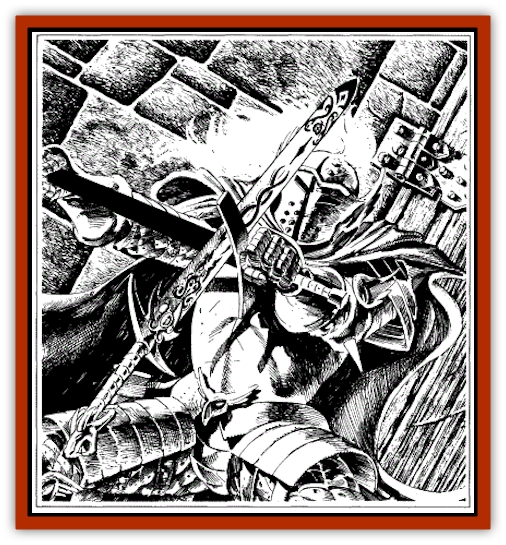

# Weapon - Living

| Statistic | **Weapon, Living** |
| --- | --- |
| **Activity Cycle:** | Any |
| **Alignment:** | Chaotic evil |
| **Armor Class:** | -1 |
| **Climate/Terrain:** | Any/Subterranean |
| **Damage/Attack:** | By weapon +4 |
| **Diet:** | Blood |
| **Frequency:** | Rare |
| **Hit Dice:** | 6 |
| **Intelligence:** | Low (5-7) |
| **Magic Resistance:** | 20% |
| **Morale:** | Elite (13-14) |
| **Movement:** | Fl 18 |
| **No. Appearing:** | 1 |
| **No. of Attacks:** | 2 |
| **Organization:** | Solitary |
| **Size:** | M (' long) |
| **Special Attacks:** | None |
| **Special Defenses:** | +1 or better weapon to hit |
| **THAC0:** | 15 |
| **Treasure:** | None |
| **XP Value:** | 2,000 |

Living weapons are conjured spirits that are bound into weapons by powerful magicians. They are highly evil creatures, capable of animating their weapons and attacking with them. They are typically used as guardians by the mages who made them.

**Combat:** Living weapons are swift and sure in combat. They fly through the air, attacking targets with a +4 bonus to their attack and damage rolls. The weapons they inhabit are otherwise normal; once the living weapon has suffered full damage, the bound spirit is dispersed, and the normal weapon falls harmlessly to the ground.

Living weapons are usually swords, but they can be any melee weapon. In any form they inflict the base damage of the weapon, with a +4 attack and damage roll bonus.

Living weapons may be turned as undead, with the same chance of success as in turning [[Vampire_General_Information|vampires]].

**Habitat/Society:** Living weapons are guardians. They have an attack range of 120 feet from the spot where they were bound. They are of low intelligence and obey simple commands from their masters.

**Ecology:** Living weapons are highly evil; they prefer to feed on the blood of sentient creatures, but they attack anything that gets within their attack range

---
## Discovery & Documentation

**Source Publication:** Wild Elves (1991)
**Campaign Setting:** Dragonlance
**Author(s):** Scott Bennie

### Other Creatures Found in This Source Book
   * [[Curotai|Curotai]]
   * [[Dragon_Spider|Dragon, Spider]]
   * [[Handmaiden_of_Takhisis|Handmaiden of Takhisis]]
   * [[Ice_Vampire|Ice Vampire]]
   * [[Spider_Horse|Spider Horse]]
