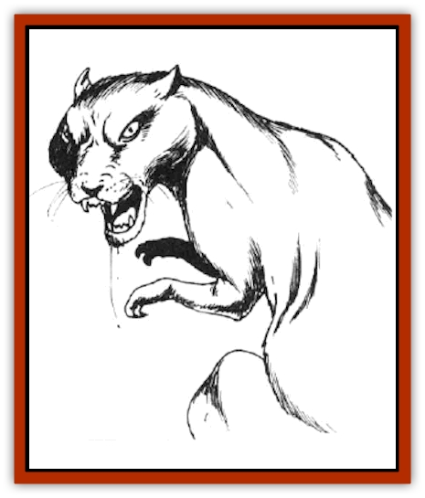

# Weasel

| Statistic | **Giant** | **Wild** |
| --- | --- | --- |
| **Activity Cycle:** | Night | Night |
| **Alignment:** | Neutral | Neutral |
| **Armor Class:** | 6 | 6 |
| **Climate/Terrain:** | Subterranean or forest | Subterranean or forest |
| **Damage/Attack:** | 2-12 | 1 |
| **Diet:** | Carnivore | Carnivore |
| **Frequency:** | Rare | Uncommon |
| **Hit Dice:** | 3+3 | � |
| **Intelligence:** | Animal (1) | Animal (1) |
| **Magic Resistance:** | Nil | Nil |
| **Morale:** | Average (10) | Unsteady (7) |
| **Movement:** | 15 | 15 |
| **No. Appearing:** | 1-8 | 1-2 |
| **No. of Attacks:** | 1 | 1 |
| **Organization:** | Pack | Solitary |
| **Size:** | M (7' or less) | T (2' or less) |
| **Special Attacks:** | Blood drain | Nil |
| **Special Defenses:** | Nil | Nil |
| **THAC0:** | 17 | 20 |
| **Treasure:** | Nil | Nil |
| **XP Value:** | 175 | 7 |

Weasels are abundant throughout the world's temperate forests and in many subterranean settings. There are numerous species, but they are all similar in appearance and habits.

The weasel is a lithe animal with a slender body and a long neck. The animal's head is small and triangular with a pointed snout and a mouth full of needle-sharp teeth. The various breeds of weasel range from five to 16 inches in length. Nearly all varieties are brown with white undersides, although the furs of those in colder climates turn white in winter.

**Combat:** As a rule, common weasels do not attack unless they are cornered or surprised. When they do strike, however, their great speed and darting movements can make them somewhat dangerous. In most cases, however, they bite once and then flee before their adversary recovers.

**Habitat/Society:** Weasels are solitary creatures that stalk rodents and similar small animals for food. When two animals are encountered, they are often a mated pair.

**Ecology:** When hunting, the weasel usually attacks animals that are larger than itself. A common target in settled regions are domesticated poultry and similar fowl. Despite this, the common weasel does a great service for farmers by feeding on small animall that might otherwise damage or destroy their crops.

Weasel pelts are highly prized and can fetch prices as high as 100 gold pieces if they are in good condition. It is for this reason that in many regions weasels have been hunted to the brink of extinction, despite their roles as rodent killers and their importance in the food chain of the forest. The most valuable pelts are those of the weasels that inhabit colder regions, as they have a very pleasing texture and are bright white in color.

Female weasels make their nests out of straw, leaves, and moss in hollow, trees or crevices in the ground. Here they give birth to a litter that generally contains four or five young.

Weasels that are taken when they are young can be trained to serve as hunting animals or tamed and kept as companions. Generally, however, they are too temperamental to make satisfactory pets.

**Giant Weasel**

  Giant weasels are giant-sized versions of this species that, although similar in many respects to normal weasels, are much more vicious and aggressive. Perhaps the most obvious difference is their tendency to live and hunt in packs. They attack men as often as any other prey and are relentless adversaries.

When a giant weasel bites, it locks its jaws onto its victim and refuses to let go. Instead, the weasel begins to suck the blood from its prey. Agents in the animal's saliva not only prevent the victim's blood from clotting, but actually promote the bleeding of the wound. The resulting blood loss is so rapid that it causes 2d6 points of damage per round. After the initial hit is scored, further rolls to inflict damage are not required.

When the lair of a pack of giant weasels is found, it often contains a minimum of four animals. There are young equal to the number of adults in the lair; the young are from 10% to 80% grown. They attack just as the adults would, inflicting damage appropriate to their degree of growth. If taken before they are half-grown, there is a 25% chance that giant weasels can be trained to serve as hunting or guard animals.

The pelts of giant weasels are valuable, as are those of their smaller cousins, and an intact one can fetch from 1,000 to 6,000 gold pieces on the open market. As a general rule, the most valuable pelts are those of the northern species, which are wholly white in color, or those of the rare black weasels.

---
## Discovery & Documentation

**Source Publication:** MC2 Volume II (1993)
**Campaign Setting:** Advanced Dungeons & Dragons 2nd Edition
**Author(s):** Jay Batista, Scott Bennie, Grant Boucher, William W. Connors, Steve Gilbert, Heike Kubasch, James Lowder, David Edward Martin, Bruce Nesmith, Jean Rabe, Rick Swan, John J. Terra, Gary L. Thomas

### Other Creatures Found in This Source Book
   * [[Ant|Ant]]
   * [[Ant_Lion_Giant|Ant Lion, Giant]]
   * [[Ape_Carnivorous|Ape, Carnivorous]]
   * [[Baboon|Baboon]]
   * [[Badger|Badger]]
   * [[Barracuda|Barracuda]]
   * [[Beetle_Giant|Beetle, Giant]]
   * [[Bulette|Bulette]]
   * [[Bullywug|Bullywug]]
   * [[Dwarf_Duergar|Dwarf, Duergar]]
   * [[Dwarf_Gully|Dwarf, Gully]]
   * [[Eagle|Eagle]]
   * [[Eel|Eel]]
   * [[Elemental_Air_Kin|Elemental, Air Kin]]
   * [[Elemental_Water_Kin|Elemental, Water Kin]]
   * [[Elemental_Water_Kin_Water_Weird|Elemental, Water Kin, Water Weird]]
   * [[Firestar|Firestar]]
   * [[Firetail|Firetail]]
   * [[Fish_Giant|Fish, Giant]]
   * [[Frog|Frog]]
   * [[Gorgon|Gorgon]]
   * [[Hawk|Hawk]]
   * [[Heucuva|Heucuva]]
   * [[Hippocampus|Hippocampus]]
   * [[Hippogriff|Hippogriff]]
   * [[Kelpie|Kelpie]]
   * [[Kenku|Kenku]]
   * [[Killmoulis|Killmoulis]]
   * [[Kuo-Toa|Kuo-Toa]]
   * [[Lamia|Lamia]]
   * [[Lammasu|Lammasu]]
   * [[Lamprey|Lamprey]]
   * [[Leech|Leech]]
   * [[Leprechaun|Leprechaun]]
   * [[Leucrotta|Leucrotta]]
   * [[Locathah|Locathah]]
   * [[Lycanthrope_Wereboar|Lycanthrope, Wereboar]]
   * [[Lycanthrope_Werefox|Lycanthrope, Werefox]]
   * [[Mammal_Minimal|Mammal, Minimal]]
   * [[Mammal_Small|Mammal, Small]]
   * [[Mimic|Mimic]]
   * [[Morkoth|Morkoth]]
   * [[Muckdweller|Muckdweller]]
   * [[Myconid|Myconid]]
   * [[Naga|Naga]]
   * [[Obliviax|Obliviax]]
   * [[Octopus_Giant|Octopus, Giant]]
   * [[Otyugh|Otyugh]]
   * [[Piranha|Piranha]]
   * [[Plant_Dangerous_I|Plant, Dangerous I]]
   * [[Plant_Intelligent|Plant, Intelligent]]
   * [[Poltergeist|Poltergeist]]
   * [[Porcupine|Porcupine]]
   * [[Rat_Osquip|Rat, Osquip]]
   * [[Roc|Roc]]
   * [[Roper|Roper]]
   * [[Rot_Grub|Rot Grub]]
   * [[Rust_Monster|Rust Monster]]
   * [[Sahuagin|Sahuagin]]
   * [[Sea_Lion|Sea Lion]]
   * [[Sea_Horse_Giant|Sea Horse, Giant]]
   * [[Shambling_Mound|Shambling Mound]]
   * [[Shark|Shark]]
   * [[Sphinx|Sphinx]]
   * [[Squid_Giant|Squid, Giant]]
   * [[Stirge|Stirge]]
   * [[Swanmay|Swanmay]]
   * [[Tarrasque|Tarrasque]]
   * [[Tasloi|Tasloi]]
   * [[Triton|Triton]]
   * [[Troglodyte|Troglodyte]]
   * [[Urchin|Urchin]]
   * [[Urd|Urd]]
   * [[Wolverine|Wolverine]]
   * [[Yellow_Musk_Creeper|Yellow Musk Creeper]]
