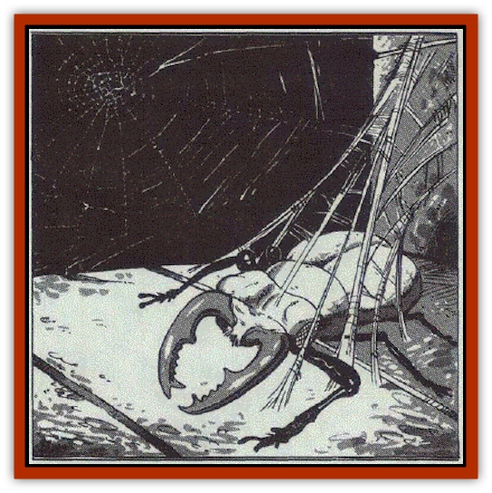

# Web - Living

| Statistic | **Living Web** | **Memory Web** |
| --- | --- | --- |
| **Activity Cycle:** | Any | Any |
| **Alignment:** | Neutral | Neutral |
| **Armor Class:** | 9 | 2 |
| **Climate/Terrain:** | Caverns, ruins | Caverns, ruins |
| **Damage/Attack:** | See below | 1d6 |
| **Diet:** | Carnivore | Carnivore |
| **Frequency:** | Very rare | Very rare |
| **Hit Dice:** | ½ to 6 | 6 |
| **Intelligence:** | Semi- (2-4) | Very (11-12) |
| **Magic Resistance:** | Nil | Nil |
| **Morale:** | Average (8-10) | Elite (13-14) |
| **Movement:** | 6 | 3 (leap 18) |
| **No. Appearing:** | 1-8 | 1 |
| **No. of Attacks:** | 1 | 1 |
| **Organization:** | Pack | Solitary |
| **Size:** | S (1-7') | See below |
| **Special Attacks:** | Lightning | Nil |
| **Special Defenses:** | See below | Half damage from nonmagical weapons or fire |
| **THAC0:** | to 2 HD: 19 / 3-4 HD: 17 / 5-6 HD: 15 | 15 |
| **Treasure:** | Nil | Nil |
| **XP Value:** | 650 to 2,000 | 3,000 |

Living webs, also known as *carnivorous webs* or *duleep*, are omnivores that roam subterranean caverns and deserted ruins.

These small, amorphous creatures resemble thick gray sheets, strands, and filaments of dusty cobwebbing. They lack visible sensory organs and specialized body parts. They appear to consist of colonies of microscopic, identical cells.

**Combat:** The touch of a living web delivers an electrical shock. This attack causes a minimum of 1d4 points of damage. Webs of 3 to 5 Hit Dice inflict 1d6 points of damage, while those of 6 Hit Dice inflict 2d4 points of damage.

Living webs can fire a miniature *lightning bolt* (20 yard range, 3d4 points of damage) up to twice per turn. Living webs with less than 9 hit points can fire only one *lightning bolt* per turn. All web fragments have this power, thus a living web cut in two can fire four such bolts per turn. Living webs absorb all electrical energy, whether natural or magical, and permanently gain 1 Hit Die for each 8 hit points of electricity absorbed. Such energy causes the web to visibly grow.

They are unaffected by fire, water, heat, and cold attacks. Blows from edged weapons inflict full damage upon these creatures; such blows divide them into two smaller wisps. Each has half the parent's remaining hit points and will continue to advance on the prey Blunt weapons cause only half damage as the living web strrtches to absorb the damage without tearing. Note that separation occurs only as a result of an opponent's attack or an accident: living webs cannot voluntarily divide.

Living webs attack instinctively; they are unaffected by *fear*, *repulsion*, or similar spells.

**Habitat/Society:** These creatures are nomadic omnivores that perpetually roam subterranean and wilderness areas. They prefer locations such as caverns and ruins, places full of normal webs that living webs can hide among. They spend their lives in endless search of plant life, carrion, and live prey. Ingested matter is converted into the electrical energy they use for movement and attacks.

Despite a lack of visible sensory organs, the living web can sense vibrations, variations in heat, and the presence of other living webs. Such senses have a maximum range of 90 feet.

They seem to flow over surfaces, moving like caterpillars on millions of tiny filaments. The filaments can fuse together into a larger, denser mass. Living webs can climb walls and ceilings of any material. They never slip, and they grasp a surface so strongly that they cannot be removed by any physical or magical attack that fails to slay them.

Though living webs move and act independently, they sense the direction and size of other living webs within 90 feet. If a living web detects another web with less than 9 hit points, it attempts to join together with the weaker web. If successful, it adds the hit points and Hit Dice to its own total, up to a maximum total of 6 Hit Dice.

**Ecology:** Living webs are useful for their role in killing vermin. They may be caught and used for guards in normally unused section of habitats and caverns.

**Memory Web**

  This creature is a mass of fibers resembling those created by a web spell; it has similar but not identical attributes. It can hide by compressing itself into a tight ball. It attacks by leaping up to 180 feet, spreading out into a circular web 20 feet in diameter. The web does not need anchor points. Anyone caught by the memory web has the same chance of breaking free as if escaping a normal web. As the web constricts, enwrapped creatures suffer 1d6 points of damage per round until they escape, die, or the web is destroyed, A memory web suffers only half damage from nonmagical weapons or fire.

Memories of slain victims are absorbed by the memory web. If the web is destroyed, it will emit all the memories gained during the previous day in the form of a telepathic shock wave. The memories lodge in the minds of all creatures up to 200 feet from the web and take the form of dreamlike recollections. Some details will be clear, others beyond recall.

---
## Discovery & Documentation

**Source Publication:** MC3 Volume III Forgotten Realms Appendix I (1989)
**Campaign Setting:** Forgotten Realms
**Author(s):** William Connors, David Martin, Rick Swan, Gary Thomas

### Other Creatures Found in This Source Book
   * [[Asperii|Asperii]]
   * [[Belabra|Belabra]]
   * [[Berbalang|Berbalang]]
   * [[Bhaergala|Bhaergala]]
   * [[Bichir|Bichir]]
   * [[Bunyip|Bunyip]]
   * [[Burbur|Burbur]]
   * [[Cloaker|Cloaker]]
   * [[Crawling_Claw|Crawling Claw]]
   * [[Darkenbeast|Darkenbeast]]
   * [[Dracolich|Dracolich]]
   * [[Dragon_Oriental_Carp_Yu_Lung|Dragon, Oriental, Carp (Yu Lung)]]
   * [[Dragon_Oriental_Celestial_T'ien_Lung|Dragon, Oriental, Celestial (T'ien Lung)]]
   * [[Dragon_Oriental_Coiled_Pan_Lung|Dragon, Oriental, Coiled (Pan Lung)]]
   * [[Dragon_Oriental_Earth_Li_Lung|Dragon, Oriental, Earth (Li Lung)]]
   * [[Dragon_Oriental_Lung_General_Information|Dragon, Oriental (Lung), General Information]]
   * [[Dragon_Oriental_River_Chiang_Lung|Dragon, Oriental, River (Chiang Lung)]]
   * [[Dragon_Oriental_Sea_Lung_Wang|Dragon, Oriental, Sea (Lung Wang)]]
   * [[Dragon_Oriental_Spirit_Shen_Lung|Dragon, Oriental, Spirit (Shen Lung)]]
   * [[Dragon_Oriental_Typhoon_Tun_Mi_Lung|Dragon, Oriental, Typhoon (Tun Mi Lung)]]
   * [[Dragonet_Faerie_Dragon|Dragonet, Faerie Dragon]]
   * [[Firenewt|Firenewt]]
   * [[Firestar|Firestar]]
   * [[Fish_Ascallion|Fish, Ascallion]]
   * [[Fish_Vurgens|Fish, Vurgens]]
   * [[Meazel|Meazel]]
   * [[Medusa_Maedar|Medusa, Maedar]]
   * [[Mist_Crimson_Death|Mist, Crimson Death]]
   * [[Revenant|Revenant]]
   * [[Rhaumbusun|Rhaumbusun]]
   * [[Strider_Giant|Strider, Giant]]
   * [[Thessalmonster|Thessalmonster]]
   * [[Wemic|Wemic]]
