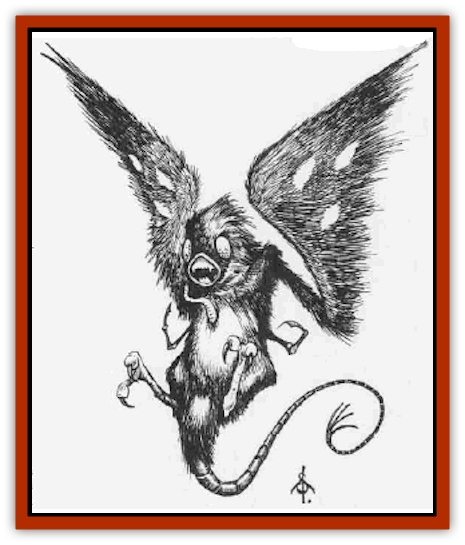

# Webbird

| Statistic | **Webbird** |
| --- | --- |
| **Activity Cycle:** | Day |
| **Alignment:** | Neutral |
| **Armor Class:** | 8 |
| **Climate/Terrain:** | Temperate and subtropical forests and caves |
| **Damage/Attack:** | 1 |
| **Diet:** | Carnivore |
| **Frequency:** | Very rare |
| **Hit Dice:** | ½ |
| **Intelligence:** | Semi- (2-4) |
| **Magic Resistance:** | Nil |
| **Morale:** | Unsteady (5-7) |
| **Movement:** | 3, Fl 18 (B) |
| **No. Appearing:** | 12-48 |
| **No. of Attacks:** | 1 |
| **Organization:** | Flock |
| **Size:** | S (5&rdquo; long, 1' wingspan) |
| **Special Attacks:** | Webs, egg insertion |
| **Special Defenses:** | Nil |
| **THAC0:** | 20 |
| **Treasure:** | Nil |
| **XP Value:** | 65 |

The name "webbird" is actually a misnomer resulting from this creature's feathered appearance and ability to fly. The webbird is actually closer to an arachnid or insect in its biological make-up.

A webbird has two wings, two lower legs used for perching, and two smaller hooked appendages for grasping. In addition, it has a five inch whip-like tail, and a two-inch, featherless egg-laying appendage which sprouts from its chest. The webbird's slitted mouth holds bony ridges that serve the same purpose as teeth.

A webbird's tough, hairlike feathers are black, except on the underside of the creature's wings, where they form "eyes". These feather patterns, three per wing, are sightleds and bright green; they have developed as a protective measure to make the webbird appear larger to predators.

**Combat:** Although capable of inflicting only one point of damage with their mouths, webbirds are formidable opponents. Webbirds attack in large groupr (12 to 48 individuals), and will assail even large or well-armed creatures.

Webbirds fear fire and will not attack anyone carrying an open flame such as a torch. A flock of webbirds will also refuse to approach larger blazes such as bonfires.

When attacking, a webbird emits a strand of webbing from its tail. This sticky strand, 1d6+6 feet long, is extremely strong and capable of immobilizing even human-sized creatures. When a flock of these creatures attack with their webbing, each victim must save vs. paralysis or become entangled and immobilized. For every three webbirds attacking an individual, that victim's saving throw is reduced by one. For example, if nine webbirds attack a victim, that individual must save vs. paralyzation with a -3 penalty to the roll.

Entrapment lasts 1d4+4 rounds, though a being with a Strength of 18 or more can break free in one round. A webbird's webs are immune to fire, but wine (or other alcoholic liquid) will dissolve the material in one round. A standard wineskin holds enough wine to free one human-sized creature, or two of smaller than man size. Entrapped creatures cannot attack or cast spells, and they lose all Dexterity bonuses tu Armor Class.

After webbirds have immobilized a victim, members of the flock will land on their victim to feed and lay eggs. Generally speaking, 1 to 3 webbirds will land and begin nibbling on the victim, each causing 1 hit pint of damage per round. In addition, 1 or 2 webbirds will land and insert their chest appendages into any exposed flesh on the victim, injecting 2d4 eggs. This causes no damage to the victim but in 1d4+2 turns the eggs hatch, becoming grubs which immediately begin feeding voraciously. Each grub causes 1 hit point of damage per round, eventually killing the host. Excruciating pain results from the feeding process, preventing the victim from taking any action, including attacking, defending, or using spells or psionics.

Within seven turns after the victim's death, fledgling webbirds (with the same statistics as adults) emerge from the carcass. A *cure disease* spell will kill the grubs, as will burning the body before the fledglings emerge.

**Habitat/Society:** Webbirds build nests of webbing, forming lairs in cave mouths or trees. They are always found in large groups because they prefer the safety of numbers.

Webbirds often inhabit the same cave as a community of [[Stirge|stirges]]. Since webbirds are active by day, and stirges are nocturnal, one group is always alert. During dawn and dusk, both groups tend to be active, and attacks on travelers are most likely to occur at these times. Such combination attacks are always exceedingly hazardous to passersby.

Each webbird is both male and female, so is able to produce eggs. The life cycle of the webbird is short and vicious. Its lifespan is no more than one year, and it spends almost all of its energy in the search for food and hosts for their eggs.

**Ecology:** Webbirds are carnivores who feed primarily on carrion, including the remains of the hosts for their grubs. Their small, sharp mouth ridges are perfectly adapted for rending flesh. Often a flock of webbirds will leave only a pile of bones as evidence that an attack has occurred.

It is rumored that some [[Elf_Drow|drow elves]] keep webbirds as guards and as a means of disposing of the bodies of the dead.

Mages are known to covet the tails of webbirds for use as components for *web* spells.

---
## Discovery & Documentation

**Source Publication:** Monstrous Compendium, 1995 Annual, Volume 2 (1995)
**Campaign Setting:** Advanced Dungeons & Dragons 2nd Edition
**Author(s):** Jon Pickens

### Other Creatures Found in This Source Book
   * [[Aboleth_Savant|Aboleth, Savant]]
   * [[Addazahr|Addazahr]]
   * [[Amiq_Rasol|Amiq Rasol]]
   * [[Arch-Shadow|Arch-Shadow]]
   * [[Automaton_Scaladar|Automaton, Scaladar]]
   * [[Automaton_Trobriand's|Automaton, Trobriand's]]
   * [[Bat_Sporebat|Bat, Sporebat]]
   * [[Beetle_Dragon|Beetle, Dragon]]
   * [[Bi-nou|Bi-nou]]
   * [[Boggle|Boggle]]
   * [[Brownie_Dobie|Brownie, Dobie]]
   * [[Brownie_Quickling|Brownie, Quickling]]
   * [[Cat_Crypt|Cat, Crypt]]
   * [[Cat_Great_Cath_Shee|Cat, Great, Cath Shee]]
   * [[Centaur-kin_Dorvesh|Centaur-kin, Dorvesh]]
   * [[Centaur-kin_Gnoat|Centaur-kin, Gnoat]]
   * [[Centaur-kin_Ha'pony|Centaur-kin, Ha'pony]]
   * [[Centaur-kin_Zebranaur|Centaur-kin, Zebranaur]]
   * [[Chronolily|Chronolily]]
   * [[Curst|Curst]]
   * [[Darktentacles|Darktentacles]]
   * [[Dinosaur_Aquatic|Dinosaur, Aquatic]]
   * [[Dinosaur_II|Dinosaur II]]
   * [[Dinosaur_III|Dinosaur III]]
   * [[Doppelganger_Greater|Doppelganger, Greater]]
   * [[Dragon_Brine|Dragon, Brine]]
   * [[Dragon_Half-|Dragon, Half-]]
   * [[Dragon-kin_Sea_Wyrm|Dragon-kin, Sea Wyrm]]
   * [[Dwarf_Wild|Dwarf, Wild]]
   * [[Ekimmu|Ekimmu]]
   * [[Elemental_Nature|Elemental, Nature]]
   * [[Elf_Winged|Elf, Winged]]
   * [[Fish_Great_Glacier|Fish (Great Glacier)]]
   * [[Fish_Subterranean|Fish, Subterranean]]
   * [[Fish_Toril|Fish (Toril)]]
   * [[Flareater|Flareater]]
   * [[Flumph|Flumph]]
   * [[Froghemoth|Froghemoth]]
   * [[Ghost_Casurua|Ghost, Casurua]]
   * [[Ghost_Ker|Ghost, Ker]]
   * [[Ghul|Ghul]]
   * [[Ghul-Kin|Ghul-Kin]]
   * [[Giant_Half-giant|Giant, Half-giant]]
   * [[Golem_Burning_Man|Golem, Burning Man]]
   * [[Golem_Phantom_Flyer|Golem, Phantom Flyer]]
   * [[Gulguthhydra|Gulguthhydra]]
   * [[Hakeashar|Hakeashar]]
   * [[Horse_Moon-|Horse, Moon-]]
   * [[Human_Dragonslayer|Human, Dragonslayer]]
   * [[Human_Vistana|Human, Vistana]]
   * [[Jellyfish_Giant|Jellyfish, Giant]]
   * [[Kalin|Kalin]]
   * [[Kholiathra|Kholiathra]]
   * [[Laerti|Laerti]]
   * [[Leucrotta_Greater|Leucrotta, Greater]]
   * [[Lich_Suel|Lich, Suel]]
   * [[Lurker_Shadow|Lurker, Shadow]]
   * [[Lycanthrope_Werepanther|Lycanthrope, Werepanther]]
   * [[Lycanthrope_Wereshark|Lycanthrope, Wereshark]]
   * [[Mammal_Herd_II|Mammal, Herd II]]
   * [[Marl|Marl]]
   * [[Meenlock|Meenlock]]
   * [[Mimic_Greater|Mimic, Greater]]
   * [[Mold_II|Mold II]]
   * [[Mummy_Creature|Mummy, Creature]]
   * [[Nyth|Nyth]]
   * [[Ooze_Slime_Jelly_Ghaunadan|Ooze/Slime/Jelly, Ghaunadan]]
   * [[Palimpsest|Palimpsest]]
   * [[Peltast|Peltast]]
   * [[Plant_Dangerous_II|Plant, Dangerous II]]
   * [[Pleistocene_Animal|Pleistocene Animal]]
   * [[Pudding_Subterranean|Pudding, Subterranean]]
   * [[Raggamoffyn|Raggamoffyn]]
   * [[Snake_Serpent|Snake, Serpent]]
   * [[Snake_Serpent_Vine|Snake, Serpent Vine]]
   * [[Sphinx_Draco-|Sphinx, Draco-]]
   * [[Sprite_Seelie_Faerie|Sprite, Seelie Faerie]]
   * [[Sprite_Unseelie_Faerie|Sprite, Unseelie Faerie]]
   * [[Squealer|Squealer]]
   * [[Turtle_Giant|Turtle, Giant]]
   * [[Umpleby|Umpleby]]
   * [[Vizier's_Turban|Vizier's Turban]]
   * [[Wall_Walker|Wall Walker]]
   * [[Yak-Man|Yak-Man]]
   * [[Zorbo|Zorbo]]
