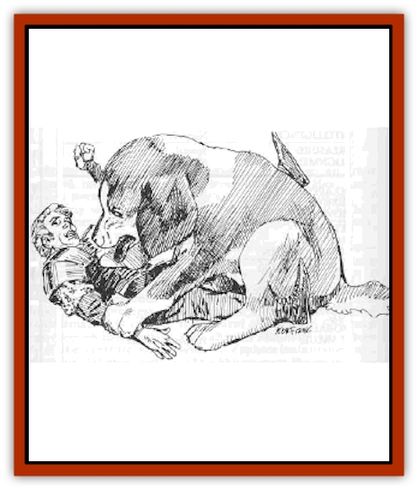

# Weisshund

| Statistic | **Weisshund** |
| --- | --- |
| **Activity Cycle:** | Any |
| **Alignment:** | Neutral good |
| **Armor Class:** | 4 |
| **Climate/Terrain:** | Any |
| **Damage/Attack:** | 3-8/3-8/3-12 |
| **Diet:** | Omnivore |
| **Frequency:** | Very rare |
| **Hit Dice:** | 4+8 |
| **Intelligence:** | Average (10) |
| **Magic Resistance:** | Nil |
| **Morale:** | Champion (15-16) |
| **Movement:** | 15 |
| **No. Appearing:** | Varies |
| **No. of Attacks:** | 3 |
| **Organization:** | Solitary |
| **Size:** | Variable (see below) |
| **Special Attacks:** | See below |
| **Special Defenses:** | See below |
| **THAC0:** | 15 |
| **Treasure:** | Nil |
| **XP Value:** | 650 |

These rare creatures are encountered only in temples and shrines of St. Cuthbert. They are the result of centuries of breeding and training by specialized clerics of St. Cuthbert.

Weisshund appear as beautiful [[Dog|dogs]] with thick white fur. They have heavy, loose skin which provides protection and agility. Even when grappled by an opponent or by another animal's jaws, their loose skin allows them to twist and turn toward an opponent in order to continue the attack. Their thick fur makes it difficult for other animals to hold them with their jaws.

Weisshund stand approximately 2' high at the shoulder. They are agile, lean, and strong, although their appearance belies this. Their thick skin and fur makes them appear chubby and harmless. They sleep most of the time, enhancing their facade of harmlessness. Weisshund appear to be completely docile lapdogs until they are provoked into a fight.

**Combat:** Weisshund have a limited empathic sense that allows them to recognize evil and hostility. They can sense these elements at a range of 60'. A sleeping weisshund will awaken if an evil or hostile creature comes within 60' of it. When a weisshund senses evil or hostility, it becomes extremely agitated, growls at its suspect, and will attempt to alert one of its masters. It will not allow the suspect out of its sight. If a master is not within range (if the weisshund would be forced to leave its suspect in order to locate a master) it will always opt to guard its prey rather than find a master. It will bark until a master arrives or will attack if necessary.

A weisshund is always cautious about whom it attacks. It will not attack merely because it senses evil or hostility, but will guard such persons, maintaining a distance of roughly 20', while growling at its captive. As long as its captive does not threaten or attack the weisshund, its masters, or persons whom it has been trained to protect, the weisshund will not attack. As soon as the suspect makes an agressive move, however, the weisshund will begin its transformation into temple guardian.

Upon viewing an act of agression by a suspect or upon command by a recognized master, a weisshund will grow in size until it is approximately 4' high at the shoulder and 6' long. Its skin and fur maintain their thickness and protective qualities, and an enlarged weisshund looks exactly the same as it did in its smaller form.

This transformation requires five segments, after which the weisshund may attack with full force. The weisshund may not attack during the transformation, and those attacking it must roll a 7 or greater on Idlo to avoid being surprised by the transformation. Those who are surprised may not attack during that round. The weisshund is not any easier or more difficult to hit during its transformation.

A weisshund attacks with its front paws and its bite. Its paws have dull claws, but damage from the paws is due to the size and force that the paws exert. This damage compares to a victim being struck by a 10-pound rock: the sheer force and impact cause the injury.

A weisshunds bite is similar to that of any other large dog, but it will attempt to knock its opponent to the ground and hold the victim's neck in its jaws, pinning him to the ground. It may also sit on its victim in order to subdue him. If the victim ceases its struggle, it will simply hold him, but if the victim attempts to continue his attack, the weisshund will attack in whatever manner is necessary to hold or subdue him. The weisshund is so finely trained that if a pinned victim offers no struggle, it can hold the victim without so much as a toothmark.

If more than one target is encountered, a weisshund will alternate between victims in an attempt to scare them into submission. The weisshund will not attempt to pin a victim if more than one attacker is present. Weisshund work well in teams and understand their own fighting techniques so well that even two unfamiliar weisshund can work together as a well-orchestrated team.

**Habitat/Society:** Weisshund are found only in temples of St. Cuthbert. They are bred by the clerics in a secret location. Most weisshund that are encounterd in temples are males, although females are encountered 5% of the time. Females are generally kept for breeding purposes, and pregnant females are especially protected. Females that become pregnant outside the sanctuary are immediately sent to the sanctuary for their protection and care.

Females are able to become pregnant only twice per year, and litters are never larger than two puppies.

**Ecology:** Weisshund live as any normal house dog. When a puppy becomes six months old, it enters training for its future as a temple guardian.

---
## Discovery & Documentation

**Source Publication:** WGA2 Falconmaster (1990)
**Campaign Setting:** Greyhawk
**Author(s):** Richard W and Anne Brown

### Other Creatures Found in This Source Book
   * [[Strangleweed|Strangleweed]]
   * [[Yphoz|Yphoz]]
