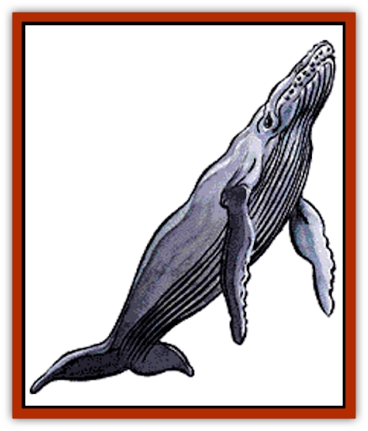
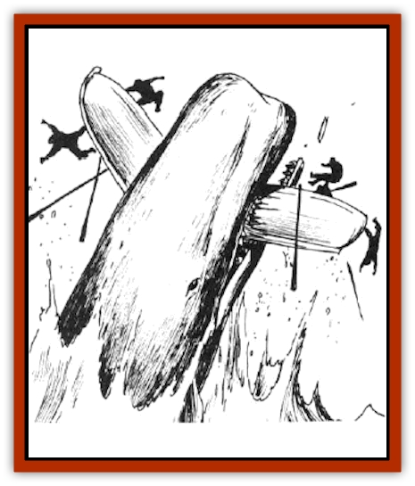

# Whale

| Statistic | **Common** | **Giant** | **Killer** | **Leviathan** | **Narwhal** |
| --- | --- | --- | --- | --- | --- |
| **Activity Cycle:** | Any | Any | Any | Any | Any |
| **Alignment:** | Neutral | Neutral | Neutral | Neutral | Neutral |
| **Armor Class:** | 4 | 3 | 4 | 1 | 6 |
| **Climate/Terrain:** | Oceans | Oceans | Oceans | Oceans | Oceans |
| **Damage/Attack:** | See below | See below | 5-20 | See below | 2-24 |
| **Diet:** | Plankton | Omnivore | Carnivore | Omnivore | Fish |
| **Frequency:** | Common | Very rare | Common | Very rare | Rare |
| **Hit Dice:** | 12 to 36 | 18 to 54 | 9 to 12 | 36 to 72 | 4+4 to 6+6 |
| **Intelligence:** | Low (5-7) | Average (8-10) | Average (8-10) | Exceptional (15-16) | Animal (1) |
| **Magic Resistance:** | Nil | Nil | Nil | Nil | Nil |
| **Morale:** | Champion (15) | Champion (15) | Elite (14) | Champion (15) | Steady (12) |
| **Movement:** | Sw 18 | Sw 18 | Sw 30 | Sw 18 | Sw 21 |
| **No. Appearing:** | 1-8 | 1-2 | 5-40 | 1 | 1-6 |
| **No. of Attacks:** | 1 | 1 | 1 | 1 | 1 |
| **Organization:** | Pod | Pair | Pod | Solitary | Pod |
| **Size:** | G | G | H-G | G | H-G |
| **Special Attacks:** | Tail | See below | See below | See below | Nil |
| **Special Defenses:** | Nil | Nil | Nil | Nil | Nil |
| **THAC0:** | 12 HD: 9 / 13-14 HD: 7 / 15+ HD: 5 | 5 | 9-10 HD: 11 / 11-12 HD: 9 | 5 | 4+4 - 5+5 HD: 15 / 6+6 HD: 13 |
| **Treasure:** | Nil | See below | Nil | See below | Nil |
| **XP Value:** | 2,000 + 1,000 per HD over 12 | 8,000 + 1,000 per HD over 18 | 9 HD: 975 / 10 HD: 1,400 / 11-12 HD: 2,000 | 26,000 + 1,000 per HD over 36 | 4+4 HD: 175 / 5+5 HD: 270 / 6+6 HD: 420 |

Whales are the largest sea mammals. They are highly intelligent creatures that occupy a number of ecological niches. The common whales include plankton eaters like blue or hump-backed whales and carnivores like sperm whales.

Common whales range in size from a 10-foot-long calf to 110-foot-long blue whales. The skin is normally blue-gray. Whales share a common language that is difficult for land creatures to learn since it uses tones below human hearing.

**Combat:** All common whales can attack with their tails. These can deliver a crushing blow that inflicts damage equal to half the whale's Hit Dice.

Plankton-feeding whales can attack with either of their flukes (fins). Whales of 12-17 HD cause 1d8 points of damage, those of 18-24 HD inflict 3d8 points, and those of 24-36 HD cause 5d8 points.

Carnivorous whales can bite. Whales of 12-17 HD inflict 5d4 points of damage, those of 18-24 HD cause 1d4x10 points, and those of 24-36 HD inflict 3d4x5 points.

Whales are vulnerable to surface ships only when the whales are on the surface.

**Habitat/Society:** Whales live in tribal gatherings called pods. They maintain strong personal and family ties. Their culture is based on complex songs that can be heard for miles underwater. Whales are curious about humanoids but if attacked they can become deadly foes. Whales rarely initiate combat. Whales are curious about other intelligent beings. They welcome communication with other beings. They do not lie, but they may not reveal everything they know.

Most whales feed on a variety of plankton, shrimp, and small fish that they suck up as they swim along. Sperm whales feed on larger fish, octopi, and especially [[Squid_Giant|giant squids]].

Whale cows normally give birth to a single calf. Twins occur in 5% of births. The calf remains with the cow for the next five to ten years, depending on the species. After five years, the cow may give birth again. The calves are protected and taught by all members of the pod.

**Ecology:** Although they are neutral in alignment toward humanoids, their alignment toward sea life is generally lawful good. With their great size, power, and diversity, they are the masters of the sea. They preserve order through their conflicts with evilly inclined sea monsters.

Unfortunately, their relations with seafarers are less certain. Because of the value placed on parts of the whale's body, the creatures are hunted to excess by greedy whalers. Despite the hostility of the humanoids, whales remain curious and basically friendly toward non-whaling seafarers.

The carcass of a common whale is worth 100 gp per Hit Die, both for its meat and blubber. Whales possess a stinking, yellow mass called ambergris that is valuable for making perfumes; they vomit this up when ill. The ambergris is worth 1d20 x 1,000 gp.

**Giant Whale**

Giant whales are immense versions of sperm whales, 100' to 400' long. In the cetacean culture, they serve functions similar to knights or barons by protecting common whales against evil sea monsters and whalers. Giant whales are attended by 2d4 common whales.

Giant whales attack by biting or crushing. Whales of 18-25 HD inflict 1d4x10 points of damage, those of 26-35 HD cause 2d4x10 points, and those of 36-54 HD inflict 3d4x10 points. The tail can deliver a crushing blow that inflicts damage equal to half the whale's Hit Dice. Giant whales can ram the sides of surface ships, delivering a crushing blow that, if successful, sinks the ship. They can also leap halfway out of the water and fall onto a target vessel (50% chance of success). If successful, the ship is immediately driven under the surface. If a giant whale is facing an opponent under 20 feet long, it can swallow the target intact on an attack roll that is 4 or more greater than it needs to hit.

Their stomachs contain large air chambers in which a victim might survive until he escapes or is digested. The stomach acid is diluted by seawater; characters or objects trapped in the stomach gain a +1 bonus to saving throws vs. this acid. A swallowed character suffers 2 points of damage per round (1 if the saving throw is successful each round) from the acid. The stomach might contain undigested possessions of previous meals. Each type of treasure has a 1% chance per Hit Die (of the whale) of being present in the giant whale's gullet. There may be 1,000-3,000 coins of each type, 1d20 gems, or 1d4 magical items.

The carcass of a giant whale is worth 100 gp per Hit Die. The ambergris is worth 2d20 x 1,000 gp.

**Leviathan**

The leviathan is an almost unimaginably immense whale, 500 to 1,000 feet long. It is the lord of all whales and the intermediary between cetaceans and the gods. Under normal conditions, only one leviathan dwells in each ocean. The leviathan is not always active. It may hibernate for years on the ocean floor. During these long sleeps, the leviathan is attended and protected by its entourage of other whales. The leviathan awakens if summoned by the needs of other whales or in answer to a divine request. Leviathans are awesome foes with a variety of attacks. Their bite damage is determined by their Hit Dice. Leviathans of 24-35 HD inflict 3d4x5 points of damage, those of 36-47 HD cause 3d4x10 points, and those of 48-72 HD inflict 3d4x15 points. The tail can deliver a crushing blow that causes damage equal to half the whale's Hit Dice. On an attack roll that is 4 or more greater than it needs to hit, a leviathan is capable of swallowing a target up to 80 feet long. When attacking a mass of surface vessels, the leviathan creates a powerful wave by swimming deep, rushing to the surface, and leaping halfway out of the water. The resulting wave causes every ship within 500 feet to roll a saving throw vs. crushing blow and every ship within 500 to 2,000 feet to roll a saving throw vs. normal blow. Ships that fail a saving throw immediately sink.

Once each century, leviathans gather in arctic waters to confer and to mate. This gathering lasts six months. Each leviathan is attended by 2d10 giant whales and 10d10 whales of other species.

The stomach of a leviathan contains air pockets that are capable of sustaining a victim until he escapes or is digested. The stomach may also contain undigested possessions of previous meals or even sea vessels. Each type of treasure has a 1% chance per Hit Die (of the whale) of being present in the giant whale's gullet. There may be 2,000-6,000 coins of each type, 5d20 gems, or 1d8 magical items.

The carcass of a leviathan is worth 100 gp per Hit Die. The ambergris is worth 4d20 x 1,000 gp. However, the killing of a leviathan will result in every whale within that ocean converging on the killer to avenge their lord's death.

**Killer Whale (Orca)**

The killer whale is one of the largest predatory sea mammals. It is a deadly killer able to hold its own against all but the most powerful sea monsters. A killer whale is likely to attack humanoids; it is capable of swallowing a man whole, should the need arise.

Killer whales measure 15 to 30 feet long. Their black bodies are marked by a brilliant white belly and markings that vary from individual to individual.

Killer whales are not inherently hostile and do not attack unless hungry or provoked. There is a 20% chance that encountered killer whales are hungry. If they are communicated with rather than attacked, killer whales may prefer to talk rather than feed.

The killer whale's diet consists of both fish and warm-blooded animals. It is a crafty hunter that can recognize the shadows and sounds made by animals atop ice floes. It will break through the ice to visually confirm the presence of prey. Smaller ice floes are rammed and shattered to force the prey into the water. When the killer whale smashes into the ice, every being on the ice must roll a saving throw vs. paralyzation. Failure means the being has slipped into the water and can be attacked the following round.

When a killer whale makes a successful hit, its prey is held in its jaws where it can automatically bite each round. Victims risk drowning in two to four rounds and the loss of 1 point of Strength and Dexterity per round, due to the numbing effect of the icy water. When either Strength or Dexterity reaches 0, the victim dies.

The killer whale's main weapon is its terrible bite. Killer whales of 9-10 HD inflict 4d6 points of damage, while those of 11-12 HD cause 6d4 points.

When hunting larger creatures, the pod acts together to bring down prey of up to 100 feet in length.

Most pods consist only of adults, but 25% of encountered pods also have 1d8 calves (2-5 HD, swim 15, bite for 2d4). Adults defend their calves to the death. They also assist each other.

Although killer whales prey on other whales, they also act as their protectors by battling other sea monsters that might decimate the entire cetacean family. Killer whales may enter into alliances with [[Elf_Aquatic|aquatic elves]].

The carcass of a killer whale is worth 100 gp per Hit Die. The ambergris is worth 1d10 x 500 gp.

**Narwhal**

The narwhal is common to cold, subarctic waters. It is called the "[[Unicorn|unicorn]] of the sea" because of the 6- to 12-foot-long spiral horn that the narwhal uses to dig into the sea floor for shellfish. If a narwhal is provoked, the horn can also be used like a lance to attack. When a narwhal attacks with its horn, its Hit Dice determine the damage caused. A narwhal of 4+4 HD inflicts 2d12 points of damage, one of 5+5 HD causes 6d4 points, and one of 6+6 HD inflicts 7d4 points. Only a male can develop this horn. A female attacks by ramming headfirst into its target, inflicting 2d4 points of damage.

Narwhals are basically peaceful creatures. They may serve as companions or guards for dolphins. They may also be trained and used by aquatic elves.

 The carcass of a narwhal is worth 100 gp per Hit Die. The ivory is worth 1d4x10 gp. The ambergris is worth 1d10 x 200 gp.

---
## Discovery & Documentation

**Source Publication:** Monstrous Manual (1995)
**Campaign Setting:** Advanced Dungeons & Dragons 2nd Edition
**Author(s):** Tim Beach

### Other Creatures Found in This Source Book
   * [[Aarakocra|Aarakocra]]
   * [[Aboleth|Aboleth]]
   * [[Ankheg|Ankheg]]
   * [[Arcane|Arcane]]
   * [[Argos|Argos]]
   * [[Aurumvorax|Aurumvorax]]
   * [[Baatezu_Lesser_Abishai|Baatezu, Lesser, Abishai]]
   * [[Baatezu_General_Information|Baatezu, General Information]]
   * [[Baatezu_Greater_Pit_Fiend|Baatezu, Greater, Pit Fiend]]
   * [[Banshee|Banshee]]
   * [[Basilisk|Basilisk]]
   * [[Bat|Bat]]
   * [[Bear|Bear]]
   * [[Beetle_Giant|Beetle, Giant]]
   * [[Behir|Behir]]
   * [[Beholder_and_Beholder-kin_I|Beholder and Beholder-kin I]]
   * [[Beholder_and_Beholder-kin_II|Beholder and Beholder-kin II]]
   * [[Bird|Bird]]
   * [[Brain_Mole|Brain Mole]]
   * [[Broken_One|Broken One]]
   * [[Brownie|Brownie]]
   * [[Bugbear|Bugbear]]
   * [[Bulette|Bulette]]
   * [[Bullywug|Bullywug]]
   * [[Carrion_Crawler|Carrion Crawler]]
   * [[Cat_Great|Cat, Great]]
   * [[Catoblepas|Catoblepas]]
   * [[Cat_Small|Cat, Small]]
   * [[Cave_Fisher|Cave Fisher]]
   * [[Centaur|Centaur]]
   * [[Centipede|Centipede]]
   * [[Chimera|Chimera]]
   * [[Cloaker|Cloaker]]
   * [[Cockatrice|Cockatrice]]
   * [[Couatl|Couatl]]
   * [[Crabman|Crabman]]
   * [[Crawling_Claw|Crawling Claw]]
   * [[Crocodile|Crocodile]]
   * [[Crustacean_Giant|Crustacean, Giant]]
   * [[Crypt_Thing|Crypt Thing]]
   * [[Death_Knight|Death Knight]]
   * [[Deepspawn|Deepspawn]]
   * [[Dinosaur_I|Dinosaur I]]
   * [[Displacer_Beast|Displacer Beast]]
   * [[Dog|Dog]]
   * [[Dog_Moon|Dog, Moon]]
   * [[Dolphin|Dolphin]]
   * [[Doppelganger|Doppelganger]]
   * [[Dracolich|Dracolich]]
   * [[Dragon_Brown|Dragon, Brown]]
   * [[Dragon_Chromatic_Black|Dragon, Chromatic, Black]]
   * [[Dragon_Chromatic_Blue|Dragon, Chromatic, Blue]]
   * [[Dragon_Chromatic_Green|Dragon, Chromatic, Green]]
   * [[Dragon_Cloud|Dragon, Cloud]]
   * [[Dragon_Chromatic_Red|Dragon, Chromatic, Red]]
   * [[Dragon_Chromatic_White|Dragon, Chromatic, White]]
   * [[Dragon_Deep|Dragon, Deep]]
   * [[Dragon_Gem_Amethyst|Dragon, Gem, Amethyst]]
   * [[Dragon_Gem_Crystal|Dragon, Gem, Crystal]]
   * [[Dragon_Gem_Emerald|Dragon, Gem, Emerald]]
   * [[Dragon_Gem_Sapphire|Dragon, Gem, Sapphire]]
   * [[Dragon_Gem_Topaz|Dragon, Gem, Topaz]]
   * [[Dragon_Metallic_Brass|Dragon, Metallic, Brass]]
   * [[Dragon_Metallic_Bronze|Dragon, Metallic, Bronze]]
   * [[Dragon_Metallic_Copper|Dragon, Metallic, Copper]]
   * [[Dragon_Mercury|Dragon, Mercury]]
   * [[Dragon_Metallic_Gold|Dragon, Metallic, Gold]]
   * [[Dragon_Mist|Dragon, Mist]]
   * [[Dragon_Metallic_Silver|Dragon, Metallic, Silver]]
   * [[Dragon_General_Information|Dragon, General Information]]
   * [[Dragon_Shadow|Dragon, Shadow]]
   * [[Dragon_Steel|Dragon, Steel]]
   * [[Dragon_Yellow|Dragon, Yellow]]
   * [[Dragonne|Dragonne]]
   * [[Dragon_Turtle|Dragon Turtle]]
   * [[Dragonet_Faerie_Dragon|Dragonet, Faerie Dragon]]
   * [[Dragonet_Fire_Drake|Dragonet, Fire Drake]]
   * [[Dragonet_Pseudodragon|Dragonet, Pseudodragon]]
   * [[Dryad|Dryad]]
   * [[Dwarf_Derro|Dwarf, Derro]]
   * [[Dwarf|Dwarf]]
   * [[Elemental_Athas_General_Information|Elemental (Athas), General Information]]
   * [[Elemental_Air_Kin|Elemental, Air Kin]]
   * [[Elemental_Earth_Kin|Elemental, Earth Kin]]
   * [[Elemental_Fire_Kin|Elemental, Fire Kin]]
   * [[Elemental_Water_Kin|Elemental, Water Kin]]
   * [[Elemental_of_Chaos_Air_Earth|Elemental of Chaos, Air/Earth]]
   * [[Elemental_of_Chaos_Fire_Water|Elemental of Chaos, Fire/Water]]
   * [[Elemental_Composite|Elemental, Composite]]
   * [[Elemental_Air_Earth|Elemental, Air/Earth]]
   * [[Elemental_Fire_Water|Elemental, Fire/Water]]
   * [[Elemental_General_Information|Elemental, General Information]]
   * [[Elephant|Elephant]]
   * [[Elf|Elf]]
   * [[Elf_Aquatic|Elf, Aquatic]]
   * [[Elf_Drow|Elf, Drow]]
   * [[Ettercap|Ettercap]]
   * [[Eyewing|Eyewing]]
   * [[Feyr|Feyr]]
   * [[Fish|Fish]]
   * [[Frog|Frog]]
   * [[Fungus|Fungus]]
   * [[Galeb_Duhr|Galeb Duhr]]
   * [[Gargantua|Gargantua]]
   * [[Gargoyle_I|Gargoyle I]]
   * [[Genie|Genie]]
   * [[Ghost|Ghost]]
   * [[Ghoul|Ghoul]]
   * [[Giant_Cloud|Giant, Cloud]]
   * [[Giant_Cyclops|Giant, Cyclops]]
   * [[Giant_Desert|Giant, Desert]]
   * [[Giant_Ettin|Giant, Ettin]]
   * [[Giant_Firbolg|Giant, Firbolg]]
   * [[Giant_Fire|Giant, Fire]]
   * [[Giant_Fog|Giant, Fog]]
   * [[Giant_Fomorian|Giant, Fomorian]]
   * [[Giant_Frost|Giant, Frost]]
   * [[Giant_Hill|Giant, Hill]]
   * [[Giant_Jungle|Giant, Jungle]]
   * [[Giant_Mountain|Giant, Mountain]]
   * [[Giant_Reef|Giant, Reef]]
   * [[Giant_Stone|Giant, Stone]]
   * [[Giant_Storm|Giant, Storm]]
   * [[Giant_Verbeeg|Giant, Verbeeg]]
   * [[Giant_Wood|Giant, Wood]]
   * [[Gibberling|Gibberling]]
   * [[Giff|Giff]]
   * [[Gith|Gith]]
   * [[Gith_Pirate_of|Gith, Pirate of]]
   * [[Githyanki|Githyanki]]
   * [[Githzerai|Githzerai]]
   * [[Gloomwing|Gloomwing]]
   * [[Gnoll|Gnoll]]
   * [[Gnome|Gnome]]
   * [[Gnome_Spriggan|Gnome, Spriggan]]
   * [[Goblin|Goblin]]
   * [[Golem_General_Information|Golem, General Information]]
   * [[Golem_I_Greater_Golem|Golem I (Greater Golem)]]
   * [[Golem_II_Lesser_Golem|Golem II (Lesser Golem)]]
   * [[Golem_III|Golem III]]
   * [[Golem_IV|Golem IV]]
   * [[Golem_V|Golem V]]
   * [[Golem_VI_Stone_Variants|Golem VI (Stone Variants)]]
   * [[Gorgon|Gorgon]]
   * [[Grell_Colonial|Grell, Colonial]]
   * [[Gremlin_Jermlaine|Gremlin, Jermlaine]]
   * [[Gremlin|Gremlin]]
   * [[Griffon|Griffon]]
   * [[Grimlock|Grimlock]]
   * [[Grippli|Grippli]]
   * [[Hag|Hag]]
   * [[Halfling|Halfling]]
   * [[Harpy|Harpy]]
   * [[Hatori|Hatori]]
   * [[Haunt|Haunt]]
   * [[Hell_Hound|Hell Hound]]
   * [[Heucuva|Heucuva]]
   * [[Hippocampus|Hippocampus]]
   * [[Hippogriff|Hippogriff]]
   * [[Hobgoblin|Hobgoblin]]
   * [[Homunculus|Homunculus]]
   * [[Hook_Horror|Hook Horror]]
   * [[Horse|Horse]]
   * [[Human|Human]]
   * [[Hydra|Hydra]]
   * [[Imp|Imp]]
   * [[Insect_Giant|Insect, Giant]]
   * [[Insect_Swarm|Insect Swarm]]
   * [[Intellect_Devourer|Intellect Devourer]]
   * [[Invisible_Stalker|Invisible Stalker]]
   * [[Ixitxachitl|Ixitxachitl]]
   * [[Jackalwere|Jackalwere]]
   * [[Kenku|Kenku]]
   * [[Ki-rin|Ki-rin]]
   * [[Kirre|Kirre]]
   * [[Kobold|Kobold]]
   * [[Kuo-Toa|Kuo-Toa]]
   * [[Lamia|Lamia]]
   * [[Lammasu|Lammasu]]
   * [[Leech|Leech]]
   * [[Leprechaun|Leprechaun]]
   * [[Leucrotta|Leucrotta]]
   * [[Lich|Lich]]
   * [[Living_Wall|Living Wall]]
   * [[Lizard|Lizard]]
   * [[Lizard_Man|Lizard Man]]
   * [[Locathah|Locathah]]
   * [[Lurker|Lurker]]
   * [[Lycanthrope_General_Information|Lycanthrope, General Information]]
   * [[Lycanthrope_Seawolf|Lycanthrope, Seawolf]]
   * [[Lycanthrope_Werebear|Lycanthrope, Werebear]]
   * [[Lycanthrope_Wereboar|Lycanthrope, Wereboar]]
   * [[Lycanthrope_Werebat|Lycanthrope, Werebat]]
   * [[Lycanthrope_Werefox|Lycanthrope, Werefox]]
   * [[Lycanthrope_Wererat|Lycanthrope, Wererat]]
   * [[Lycanthrope_Wereraven|Lycanthrope, Wereraven]]
   * [[Lycanthrope_Weretiger|Lycanthrope, Weretiger]]
   * [[Lycanthrope_Werewolf|Lycanthrope, Werewolf]]
   * [[Mammal|Mammal]]
   * [[Mammal_Giant|Mammal, Giant]]
   * [[Mammal_Herd_I|Mammal, Herd I]]
   * [[Mammal_Small|Mammal, Small]]
   * [[Manscorpion|Manscorpion]]
   * [[Manticore|Manticore]]
   * [[Medusa_Maedar|Medusa, Maedar]]
   * [[Medusa|Medusa]]
   * [[Mephit_General_Information|Mephit, General Information]]
   * [[Merman|Merman]]
   * [[Mimic|Mimic]]
   * [[Mind_Flayer|Mind Flayer]]
   * [[Minotaur|Minotaur]]
   * [[Mist_Crimson_Death|Mist, Crimson Death]]
   * [[Mist_Vampiric|Mist, Vampiric]]
   * [[Mold_I|Mold I]]
   * [[Moldman|Moldman]]
   * [[Mongrelman|Mongrelman]]
   * [[Morkoth|Morkoth]]
   * [[Muckdweller|Muckdweller]]
   * [[Mudman|Mudman]]
   * [[Mummy_Greater|Mummy, Greater]]
   * [[Mummy|Mummy]]
   * [[Myconid|Myconid]]
   * [[Naga|Naga]]
   * [[Naga_Dark|Naga, Dark]]
   * [[Neogi|Neogi]]
   * [[Nightmare|Nightmare]]
   * [[Nymph|Nymph]]
   * [[Octopus_Giant|Octopus, Giant]]
   * [[Ogre|Ogre]]
   * [[Ogre_Half-|Ogre, Half-]]
   * [[Ooze_Slime_Jelly_I|Ooze/Slime/Jelly I]]
   * [[Ooze_Slime_Jelly_II|Ooze/Slime/Jelly II]]
   * [[Ooze_Slime_Jelly_Slithering_Tracker|Ooze/Slime/Jelly, Slithering Tracker]]
   * [[Orc|Orc]]
   * [[Otyugh|Otyugh]]
   * [[Owlbear_I|Owlbear I]]
   * [[Pegasus|Pegasus]]
   * [[Peryton|Peryton]]
   * [[Phantom|Phantom]]
   * [[Phoenix|Phoenix]]
   * [[Piercer|Piercer]]
   * [[Plant_Dangerous_I|Plant, Dangerous I]]
   * [[Plant_Intelligent|Plant, Intelligent]]
   * [[Poltergeist|Poltergeist]]
   * [[Pudding_Deadly|Pudding, Deadly]]
   * [[Quaggoth|Quaggoth]]
   * [[Rakshasa|Rakshasa]]
   * [[Rat|Rat]]
   * [[Rat_Osquip|Rat, Osquip]]
   * [[Remorhaz|Remorhaz]]
   * [[Revenant|Revenant]]
   * [[Roc|Roc]]
   * [[Roper|Roper]]
   * [[Rust_Monster|Rust Monster]]
   * [[Sahuagin|Sahuagin]]
   * [[Satyr|Satyr]]
   * [[Scorpion|Scorpion]]
   * [[Sea_Lion|Sea Lion]]
   * [[Selkie|Selkie]]
   * [[Shadow|Shadow]]
   * [[Shedu|Shedu]]
   * [[Sirine|Sirine]]
   * [[Skeleton|Skeleton]]
   * [[Skeleton_Giant|Skeleton, Giant]]
   * [[Skeleton_Warrior|Skeleton, Warrior]]
   * [[Slaad|Slaad]]
   * [[Slug_Giant|Slug, Giant]]
   * [[Snake|Snake]]
   * [[Snake_Winged|Snake, Winged]]
   * [[Spectre|Spectre]]
   * [[Sphinx|Sphinx]]
   * [[Spider|Spider]]
   * [[Sprite|Sprite]]
   * [[Squid_Giant|Squid, Giant]]
   * [[Stirge|Stirge]]
   * [[Su-Monster|Su-Monster]]
   * [[Swanmay|Swanmay]]
   * [[Tabaxi|Tabaxi]]
   * [[Tako|Tako]]
   * [[Tanar'ri_True_Balor|Tanar'ri, True, Balor]]
   * [[Tanar'ri_True_Marilith|Tanar'ri, True, Marilith]]
   * [[Tarrasque|Tarrasque]]
   * [[Tasloi|Tasloi]]
   * [[Thought_Eater|Thought Eater]]
   * [[Thri-kreen|Thri-kreen]]
   * [[Titan|Titan]]
   * [[Toad_Giant|Toad, Giant]]
   * [[Treant|Treant]]
   * [[Triton|Triton]]
   * [[Troglodyte|Troglodyte]]
   * [[Troll|Troll]]
   * [[Umber_Hulk|Umber Hulk]]
   * [[Unicorn|Unicorn]]
   * [[Urchin|Urchin]]
   * [[Vampire|Vampire]]
   * [[Wemic|Wemic]]
   * [[Wight|Wight]]
   * [[Will_O'Wisp|Will O'Wisp]]
   * [[Wolf|Wolf]]
   * [[Wolfwere|Wolfwere]]
   * [[Worm|Worm]]
   * [[Wraith|Wraith]]
   * [[Wyvern|Wyvern]]
   * [[Xorn|Xorn]]
   * [[Yeti|Yeti]]
   * [[Yuan-ti_Histachii|Yuan-ti, Histachii]]
   * [[Yuan-ti|Yuan-ti]]
   * [[Yugoloth_Guardian|Yugoloth, Guardian]]
   * [[Zaratan|Zaratan]]
   * [[Zombie|Zombie]]
