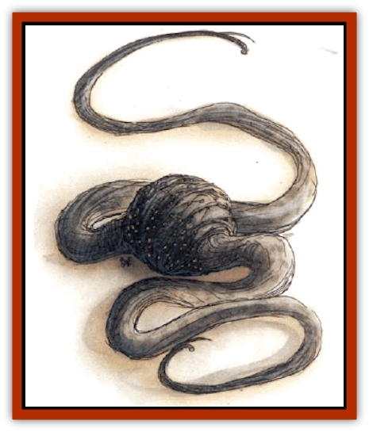

# Whipsting

| Statistic | **Whipsting** |
| --- | --- |
| **Activity Cycle:** | Any |
| **Alignment:** | Neutral |
| **Armor Class:** | 7 |
| **Climate/Terrain:** | Rocky, subterranean |
| **Damage/Attack:** | 1-2/1 &times;2 |
| **Diet:** | Carnivore, scavenger |
| **Frequency:** | Uncommon |
| **Hit Dice:** | 1+4 |
| **Intelligence:** | Varies (1-12) |
| **Magic Resistance:** | Nil |
| **Morale:** | Steady (11-12) |
| **Movement:** | 9, Fl 9 (D) |
| **No. Appearing:** | 1d6 |
| **No. of Attacks:** | 3 |
| **Organization:** | Solitary or small pack |
| **Size:** | S-L (tentacles 5-20' long) |
| **Special Attacks:** | Venom |
| **Special Defenses:** | Nil |
| **THAC0:** | 19 (15 if springing) |
| **Treasure:** | Nil |
| **XP Value:** | 175 |

The whipsting is a vicious predator found on rocky ledges, in caverns, and among ruins. The strike of a whipsting makes a loud, whiplike crack audible up to 70 feet away. Whipstings have wrinkled, spherical bodies 6 to 12 inches in diameter. From opposing sides of a whipsting's ball-like form protrude two dexterous, tapering tentacles anywhere from 5 to 20 feet long. Both tentacles end in sticky tips that aid the whipsting in grasping and climbing, and each has a fixed, bony stinger protruding at an angle just beside the leathery tentacle tip. Amid the "wrinkles" (skin flaps) of the muddy-gray body are many eyes. A whipsting has both normal and infravision, effective to 120 feet.

On the underside of a whipsting is a sucking mouth dominated by three sharklike teeth, set in a triangle. The teeth can move independently of one another and are capable of gnawing through armor plate. When they close together, they meet to completely seal the whipsting's mouth.

**Combat:** A whipsting usually waits for prey with one tentacle curled underneath itself to form a natural spring. If facing a large foe, it avoids attacking or seeks to flee altogether by using this curled tentacle to leap about like a pogo stick. Otherwise, its initial attack consists of suddenly straightening this tentacle to propel itself in a wild spring that ends in a lashing whip of the body, driving its envenomed stinger deep into an opponent (+4 attack bonus). The whipsting then tries to constrict, smother, or strangle prey by remaining attached to it, slapping keith its tentacles to drive home its two stings. A whipsting's stinger strikes for 1 point of damage and also injects venom into or onto its prey. The prey must successfully save vs. poison with a -2 penalty to avoid the venom's effects. If the save fails, the prey shudders uncontrollably on the round following the sting. Nausea and weakness ruin all attacks and spellcasting attempts by the victim in that round, and cause the automatic dropping of all wielded or carried objects; tasks requiring high dexterity are impossible. The victim also suffers a one-round Armor Class penalty of 1. On subsequent rounds, the victim can move normally, but remains weak - attack and damage rolls suffer -3 penalties in that round, then -2 penalties the following round, -1 penalties on the next round, and return to normal thereafter. Every successful sting results in another round of shuddering (barring a successful save).

**Habitat/Society:** Little is known about these predators. They are believed to be hermaphroditic and to vary widely in intelligence. They lay eggs (large and rubbery, like turtle eggs, often green-white or dun in color) in caves or dark crevices. These eggs are edible, but have no market value. Whipstings are more often found in groups than alone, and they peacefully coexist with each other. They are thought to live many years.

**Ecology:** A whipsting eats any meat it can find, living or dead, gorging itself tirelessly. Its elastic body can expand to contain meals of up to 10 times its own size.

Whipstings have been occasionally domesticated as pets or guards. [[Peryton|Perytons]] and [[Griffon|griffons]] are known to eat whipstings, biting off the stings with their first attacks to avoid the venom. Whipstings are themselves immune to the effects of their own venom, which is an ingredient in the making of *rings of weakness* and nausea-inducing medicines.

**Stingwings**

  Approximately 10% of whipstings have gauzy, fragile wings that allow them to glide down from heights or jump farther than wingless whipstings - up to 60 feet horizontally. Such wings regenerate in 1d3 days if damaged. The wings cannot be targeted in combat, but a captured stingwing could have its wings cut off (AC 10, 1 hp), and they will automatically be destroyed by any sort of area-effect fire spell.

---
## Discovery & Documentation

**Source Publication:** Monstrous Compendium, 1994 Annual, Volume 1 (1995)
**Campaign Setting:** Advanced Dungeons & Dragons 2nd Edition
**Author(s):** David Wise

### Other Creatures Found in This Source Book
   * [[Abyss_Ant|Abyss Ant]]
   * [[Achaierai|Achaierai]]
   * [[Afanc|Afanc]]
   * [[Al-Jahar|Al-Jahar]]
   * [[Baelnorn|Baelnorn]]
   * [[Baneguard|Baneguard]]
   * [[Banelar|Banelar]]
   * [[Bird_Talking|Bird, Talking]]
   * [[Blazing_Bones|Blazing Bones]]
   * [[Campestri|Campestri]]
   * [[Caniquine|Caniquine]]
   * [[Cat_Winged|Cat, Winged]]
   * [[Crypt_Servant|Crypt Servant]]
   * [[Death's_Head_Tree|Death's Head Tree]]
   * [[Dog_Saluqi|Dog, Saluqi]]
   * [[Dragon_Electrum|Dragon, Electrum]]
   * [[Dragon_Fang|Dragon, Fang]]
   * [[Dragon_Linnorm_Corpse_Tearer|Dragon, Linnorm, Corpse Tearer]]
   * [[Dragon_Linnorm_Dread|Dragon, Linnorm, Dread]]
   * [[Dragon_Linnorm_Flame|Dragon, Linnorm, Flame]]
   * [[Dragon_Linnorm_Forest|Dragon, Linnorm, Forest]]
   * [[Dragon_Linnorm_Frost|Dragon, Linnorm, Frost]]
   * [[Dragon_Linnorm_Gray|Dragon, Linnorm, Gray]]
   * [[Dragon_Linnorm_Land|Dragon, Linnorm, Land]]
   * [[Dragon_Linnorm_Midgard|Dragon, Linnorm, Midgard]]
   * [[Dragon_Linnorm_Rain|Dragon, Linnorm, Rain]]
   * [[Dragon_Linnorm_Sea|Dragon, Linnorm, Sea]]
   * [[Dragon_Neutral_Jacinth|Dragon, Neutral, Jacinth]]
   * [[Dragon_Neutral_Jade|Dragon, Neutral, Jade]]
   * [[Dragon_Neutral_Pearl|Dragon, Neutral, Pearl]]
   * [[Dread|Dread]]
   * [[Dragon-kin|Dragon-kin]]
   * [[Elemental_Earth_Kin_Chrysmal|Elemental, Earth Kin, Chrysmal]]
   * [[Elemental_Earth_Kin_Earth_Weird|Elemental, Earth Kin, Earth Weird]]
   * [[Elemental_Fire_Kin_Azer|Elemental, Fire Kin, Azer]]
   * [[Elemental_Sandman|Elemental, Sandman]]
   * [[Elemental_Wind_Walker|Elemental, Wind Walker]]
   * [[Elemental_Vermin|Elemental Vermin]]
   * [[Feystag|Feystag]]
   * [[Flame_Skull|Flame Skull]]
   * [[Foulwing|Foulwing]]
   * [[Gambado|Gambado]]
   * [[Garbug|Garbug]]
   * [[Genie_Tasked_Administrator|Genie, Tasked, Administrator]]
   * [[Genie_Tasked_Deceiver|Genie, Tasked, Deceiver]]
   * [[Genie_Tasked_Harim_Servant|Genie, Tasked, Harim Servant]]
   * [[Genie_Tasked_Messenger|Genie, Tasked, Messenger]]
   * [[Genie_Tasked_Miner|Genie, Tasked, Miner]]
   * [[Genie_Tasked_Oathbinder|Genie, Tasked, Oathbinder]]
   * [[Gibbering_Mouther|Gibbering Mouther]]
   * [[Gnasher|Gnasher]]
   * [[Gnasher_Winged|Gnasher, Winged]]
   * [[Golem_Brain|Golem, Brain]]
   * [[Golem_Hammer|Golem, Hammer]]
   * [[Golem_Metagolem|Golem, Metagolem]]
   * [[Golem_Spiderstone|Golem, Spiderstone]]
   * [[Gorynych|Gorynych]]
   * [[Greelox|Greelox]]
   * [[Helmed_Horror|Helmed Horror]]
   * [[Jarbo|Jarbo]]
   * [[Laraken|Laraken]]
   * [[Lich_Psionic|Lich, Psionic]]
   * [[Living_Steel|Living Steel]]
   * [[Lock_Lurker|Lock Lurker]]
   * [[Loxo|Loxo]]
   * [[Lycanthrope_Loup_de_Noir|Lycanthrope, Loup de Noir]]
   * [[Lycanthrope_Werebadger|Lycanthrope, Werebadger]]
   * [[Lycanthrope_Werejaguar|Lycanthrope, Werejaguar]]
   * [[Lythlyx|Lythlyx]]
   * [[Magebane|Magebane]]
   * [[Marrashi|Marrashi]]
   * [[Metalmaster|Metalmaster]]
   * [[Mimic_House_Hunter|Mimic, House Hunter]]
   * [[Naga_Bone|Naga, Bone]]
   * [[Nautilus_Giant|Nautilus, Giant]]
   * [[Nightshade_Toril|Nightshade (Toril)]]
   * [[Nishruu|Nishruu]]
   * [[Noran|Noran]]
   * [[Opinicus|Opinicus]]
   * [[Ormyrr|Ormyrr]]
   * [[Parasite|Parasite]]
   * [[Pasari-Niml|Pasari-Niml]]
   * [[Plant_Vampire_Moss|Plant, Vampire Moss]]
   * [[Pteraman|Pteraman]]
   * [[Rautym|Rautym]]
   * [[Shadeling|Shadeling]]
   * [[Skum|Skum]]
   * [[Snake_Giant_Cobra|Snake, Giant Cobra]]
   * [[Snake_Stone|Snake, Stone]]
   * [[Spectral_Wizard|Spectral Wizard]]
   * [[Spell_Weaver|Spell Weaver]]
   * [[Spider_Brain|Spider, Brain]]
   * [[Suwyze|Suwyze]]
   * [[Tatalla|Tatalla]]
   * [[Tick_Heart|Tick, Heart]]
   * [[Tree_Dark|Tree, Dark]]
   * [[Tree_Singing|Tree, Singing]]
   * [[Tressym|Tressym]]
   * [[Troll_Snow|Troll, Snow]]
   * [[Tuyewera|Tuyewera]]
   * [[Ulitharid|Ulitharid]]
   * [[Undead_Dwarf|Undead Dwarf]]
   * [[Undead_Lake_Monster|Undead Lake Monster]]
   * [[Windghost|Windghost]]
   * [[Wolf_Dread|Wolf, Dread]]
   * [[Wolf_Stone|Wolf, Stone]]
   * [[Wolf_Vampiric|Wolf, Vampiric]]
   * [[Wraith_Shimmering|Wraith, Shimmering]]
   * [[Xantravar|Xantravar]]
   * [[Xaver|Xaver]]
