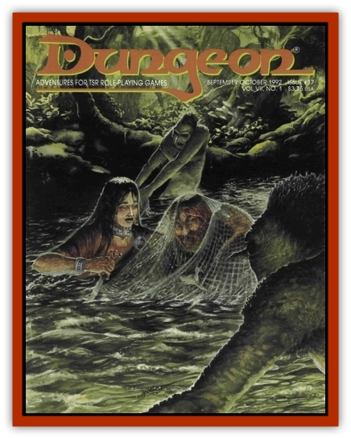

# White Boar - The

| Statistic | **White Boar, The** |
| --- | --- |
| **Activity Cycle:** | Any |
| **Alignment:** | Neutral |
| **Armor Class:** | -2 |
| **Climate/Terrain:** | Woodland/Any |
| **Damage/Attack:** | 3d6 |
| **Diet:** | Omnivore |
| **Frequency:** | Unique |
| **Hit Dice:** | 9 (72 hit points) |
| **Intelligence:** | High (14) |
| **Magic Resistance:** | 50% |
| **Morale:** | Fearless (20) |
| **Movement:** | 18 |
| **No. Appearing:** | 1 |
| **No. of Attacks:** | 1 |
| **Organization:** | Solitary |
| **Size:** | M (5' tall at shoulder) |
| **Special Attacks:** | Nil |
| **Special Defenses:** | +2 or better weapon to hit |
| **THAC0:** | 11 |
| **Treasure:** | Nil |
| **XP Value:** | 5,000 |

The white boar was specially created by the Celtic deities to house the spirit of a godlike avatar sent to destroy Shivnar and his monstrous creation, the [[Bulette-Mutation_The|bulette-mutation]]. It resembles a huge member of the [[Boar|boar]] family, though it remains a solitary creature and normal boars will have nothing to do with it, even attacking their keepers to run away from it if necessary.

**Combat:** The white boar attacks in the manner of its form, biting and ripping with its tusks, though it does not share the wild boar's ability to fight into negative hit points. However, it requires a +2 or better magical weapon to cut through the monster's hide, so it is somewhat better off than the creature it was modeled after. It uses its humanlike intelligence to progress toward its goal - the destruction of Shivnar's creation - and the DM should play it accordingly when the PCs encounter it.

**Habitat/Society:** The white boar remains a solitary creature in this adventure. If the spirit inhabiting its body has another social order on its own plane, that is a matter beyond the scope of this module.

**Ecology:** The white boar, being a unique creature, exists only as long as the bulette-mutation remains alive, or until the boar itself is slain in combat. It has no place in the natural order of the forest.

---
## Discovery & Documentation

**Source Publication:** Dungeon #37 (1992)
**Campaign Setting:** Dungeon Magazine
**Author(s):** 

### Other Creatures Found in This Source Book
   * [[Bulette-Mutation_The|Bulette-Mutation, The]]
