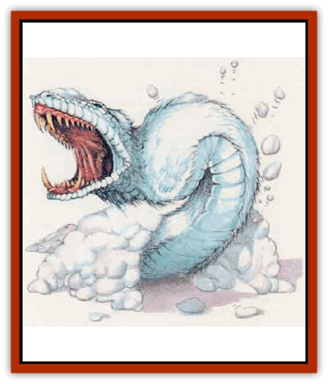

# White Fang

| Statistic | **White Fang** |
| --- | --- |
| **Activity Cycle:** | Any |
| **Alignment:** | Neutral |
| **Armor Class:** | 4 |
| **Climate/Terrain:** | Arctic |
| **Damage/Attack:** | 2d6 (bite)/2d6 (tail lash) |
| **Diet:** | Carnivore |
| **Frequency:** | Rare |
| **Hit Dice:** | 6 |
| **Intelligence:** | Semi- (2-4) |
| **Magic Resistance:** | Nil |
| **Morale:** | Champion (16) |
| **Movement:** | 18, Br 9, Sw 12 |
| **No. Appearing:** | 1d3 |
| **No. of Attacks:** | 2 |
| **Organization:** | Solitary |
| **Size:** | H (15-2O' long) |
| **Special Attacks:** | Poison |
| **Special Defenses:** | Camouflage |
| **THAC0:** | 15 |
| **Treasure:** | Nil |
| **XP Value:** | 975 |

These carnivorous [[Snow_Serpent|snow serpents]] are distantly related to [[Dragon_Chromatic_White|white dragons]], though they have no wings or legs. Their bodies are covered with soft white fur, except for their heads, which are encased in scalelike plates of white ivory.

**Combat:** A white fang can control the surface temperature of its body so as to be nearly undetectable to infravision. There is only a 20% chance that infravision will reveal a white fang even if the viewer is searching for the creature or looking directly at it. Furthermore, the creature's white fur serves as excellent camouflage when the snow [[Snake|serpent]] is in its native environment. When a white fang attacks from hiding, its opponents suffer a -4 penalty to their surprise rolls.

Althougb they can move well over open ground, white fangs prefer to move unseen and attack from concealment. They can easily burrow through snow and can tunnel through ice at a rate of 6. They have keen infravision with a range of 120 feet and can sense heat and vibration from prey as far away as 120 feet or through as much as 30 feet of solid ice.

A white fang attacks by biting with its needle-sharp fangs and by slapping with its flattened tail. The fangs carry a deadly venom. When bitten, a creature must make a successful saving throw vs. poison or immediately become chilled to the bone and rigidly paralyzed. During the next round, the victim's blood literally begins to freeze. The victim's skin turns blue and he or she suffers 1d8 points of damage each round until death occurs or the venom is neutralized. A *neutralize poison* spell or similar magic removes the paralysis, stops further damage, and restores the victim's color but does not cure any damage already received. A *remove paralysis* spell frees the victim from the paralysis but does not halt the damage or restore the victim's color.

Even if the saving throw vs. poison is successful, the victim still feels chilly and numb, suffering a -2 penalty to Strength and Dexterity for 2d6 rounds. Characters with extraordinary Strength lose 20% of the percentile score; if the score drops below 01, the character's Strength drops to 17. Further bites extend the duration of the ability score loss but do not cause the scores to drop lower.

**Habitat/Society:** White fangs are equally at home in the depths of icy caverns, in the freezing waters of arctic seas, or in the windswept, snowbound wilderness. Thev have no social organuzation, not even family ties, but a few of them might live together if the hunting is good. If food is scarce, the white fangs in an area instinctively draw apart; they do not waste energy by fighting among themselves for territory.

**Ecology:** White fangs hunt all manner of warm-blooded prey. Ocean-dwelling specimens hunt primarily sea mammals, but they aren't adverse to attacking the occasional unwary hunter or fisherman. Land-dwelling white fangs prey on just about any large creature that comes within their range. It is not uncommon for white fangs to move between the sea, floating ice, and dry land - white fangs go where their prey waits.

Once every five years or so, large numbers of white fangs gather in large ice caverns to mate. Each gathering lasts about a month. Afterward, the pregnant females go forth on their own and seek some isolated locale in which to bear their young. Usually, the female makes a burrow in a snowdrift or glacier, but a lonely spot on the sea floor will do just as well. Six months after mating, the female gives birth to 2d12 live young, each about 4 feet long. The young white fangs have 2 Hit Dice; their bite and tail slap do no damage, but their venom is fully potent. The young mature in about 25 years.

An intact pelt from an adult white fang can fetch as much as 500 gold pieces on the open market, and its ivory head plates can bring another 100 gold pieces. The pelt of a young white fang is worth about 4 gold pieces. A young white fang's ivory  has no market value.

A white fang's venom quickly loses its potency if it is extracted from the creature. If the poison sacs are carefully removed and frozen, however, the venom is useful as an ingredient for a *potion of fire resistance*.

---
## Discovery & Documentation

**Source Publication:** Mystara Appendix (1994)
**Campaign Setting:** Mystara
**Author(s):** John Nephew, Teeuwynn Woodruff, John Terra, Skip Williams

### Other Creatures Found in This Source Book
   * [[Actaeon|Actaeon]]
   * [[Agarat|Agarat]]
   * [[Ash_Crawler|Ash Crawler]]
   * [[Baldandar|Baldandar]]
   * [[Bargda|Bargda]]
   * [[Bhut|Bhut]]
   * [[Bird_Mystara|Bird (Mystara)]]
   * [[Blackball|Blackball]]
   * [[Choker|Choker]]
   * [[Coltpixie|Coltpixie]]
   * [[Crone_of_Chaos|Crone of Chaos]]
   * [[Darkhood|Darkhood]]
   * [[Darkwing|Darkwing]]
   * [[Decapus|Decapus]]
   * [[Deep_Glaurant|Deep Glaurant]]
   * [[Diabolus|Diabolus]]
   * [[Dimensional_Warper|Dimensional Warper]]
   * [[Dragon_Mystara_Crystalline|Dragon (Mystara), Crystalline]]
   * [[Dragon_Mystara_Jade|Dragon (Mystara), Jade]]
   * [[Dragon_Mystara_Onyx|Dragon (Mystara), Onyx]]
   * [[Dragon_Mystara_Ruby|Dragon (Mystara), Ruby]]
   * [[Drake_Mystara|Drake (Mystara)]]
   * [[Dragonfly|Dragonfly]]
   * [[Dusanu|Dusanu]]
   * [[Elemental_of_Chaos_Air_Earth|Elemental of Chaos, Air/Earth]]
   * [[Elemental_of_Chaos_Fire_Water|Elemental of Chaos, Fire/Water]]
   * [[Elemental_of_Law_Air_Earth|Elemental of Law, Air/Earth]]
   * [[Elemental_of_Law_Fire_Water|Elemental of Law, Fire/Water]]
   * [[Familiar_Mystara|Familiar (Mystara)]]
   * [[Frost_Salamander|Frost Salamander]]
   * [[Fundamental_Air_Earth|Fundamental, Air/Earth]]
   * [[Fundamental_Fire_Water|Fundamental, Fire/Water]]
   * [[Gargantua_Mystara|Gargantua (Mystara)]]
   * [[Geonid|Geonid]]
   * [[Ghostly_Horde|Ghostly Horde]]
   * [[Giant_Athach|Giant, Athach]]
   * [[Giant_Hephaeston|Giant, Hephaeston]]
   * [[Golem_Drolem|Golem, Drolem]]
   * [[Golem_Mystara_I|Golem (Mystara) I]]
   * [[Golem_Mystara_II|Golem (Mystara) II]]
   * [[Golem_Mystara_III|Golem (Mystara) III]]
   * [[Gray_Philosopher|Gray Philosopher]]
   * [[Guardian_Warrior|Guardian Warrior]]
   * [[Gyerian|Gyerian]]
   * [[Herex|Herex]]
   * [[Hivebrood|Hivebrood]]
   * [[Horde|Horde]]
   * [[Hsiao|Hsiao]]
   * [[Huptzeen|Huptzeen]]
   * [[Hutaakan|Hutaakan]]
   * [[Imp_Mystara|Imp (Mystara)]]
   * [[Jellyfish_Giant_Mystara|Jellyfish, Giant (Mystara)]]
   * [[Kna|Kna]]
   * [[Kopru|Kopru]]
   * [[Lizard_Mystara|Lizard (Mystara)]]
   * [[Lizard-kin_Mystara|Lizard-kin (Mystara)]]
   * [[Lupin|Lupin]]
   * [[Lycanthrope_Werejaguar_Mystara|Lycanthrope, Werejaguar (Mystara)]]
   * [[Lycanthrope_Wereswine|Lycanthrope, Wereswine]]
   * [[Magen|Magen]]
   * [[Manikin|Manikin]]
   * [[Mek|Mek]]
   * [[Mujina|Mujina]]
   * [[Nagpa|Nagpa]]
   * [[Neh-thalggu|Neh-thalggu]]
   * [[Nightshade_Mystara|Nightshade (Mystara)]]
   * [[Nuckalavee|Nuckalavee]]
   * [[Pegataur|Pegataur]]
   * [[Phanaton|Phanaton]]
   * [[Plant_Dangerous_Mystara|Plant, Dangerous (Mystara)]]
   * [[Plasm|Plasm]]
   * [[Rakasta|Rakasta]]
   * [[Rock_Man|Rock Man]]
   * [[Sabreclaw|Sabreclaw]]
   * [[Sacrol|Sacrol]]
   * [[Scamille|Scamille]]
   * [[Shapeshifter|Shapeshifter]]
   * [[Shargugh|Shargugh]]
   * [[Shark-kin|Shark-kin]]
   * [[Sollux|Sollux]]
   * [[Spectral_Death|Spectral Death]]
   * [[Spectral_Hound|Spectral Hound]]
   * [[Spider-kin|Spider-kin]]
   * [[Spirit_Mystara|Spirit (Mystara)]]
   * [[Statue_Living|Statue, Living]]
   * [[Surtaki|Surtaki]]
   * [[Tabi|Tabi]]
   * [[Thoul|Thoul]]
   * [[Thunderhead|Thunderhead]]
   * [[Tiger_Ebon|Tiger, Ebon]]
   * [[Topi|Topi]]
   * [[Tortle|Tortle]]
   * [[Vampire_Velya|Vampire, Velya]]
   * [[Worm_Mystara|Worm (Mystara)]]
   * [[Wyrd|Wyrd]]
   * [[Yowler|Yowler]]
   * [[Zombie_Lightning|Zombie, Lightning]]
