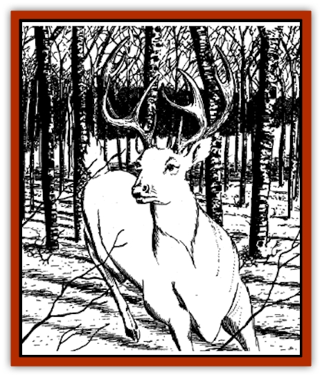
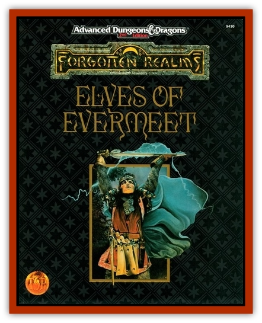

# White Stag - The

| Statistic | **White Stag, The** |
| --- | --- |
| **Activity Cycle:** | Day |
| **Alignment:** | Chaotic good |
| **Armor Class:** | 5 |
| **Climate/Terrain:** | Forest (Evermeet) |
| **Damage/Attack:** | 2-8/1-4/1-4 |
| **Diet:** | Herbivore |
| **Frequency:** | Unique |
| **Hit Dice:** | 6 (48 hp) |
| **Intelligence:** | High (14) |
| **Magic Resistance:** | 10% |
| **Morale:** | Fearless (20) |
| **Movement:** | 36 |
| **No. Appearing:** | 1 |
| **No. of Attacks:** | 3 |
| **Organization:** | Solitary |
| **Size:** | L |
| **Special Attacks:** | Nil |
| **Special Defenses:** | Mislead |
| **THAC0:** | 14 |
| **Treasure:** | Nil |
| **XP Value:** | 650 |

The White Stag of Labelas Enoreth is the special servant of the [[Elf|elven]] god of longevity. Physically, it is a huge, snow white animal, with massive muscles and red, glowing eyes. Observers say that the creature's divine aura is literally tangible and felt by all those who see it. The [[Stag|stag's]] appearance is considered to be an omen of great events, for it invariably leads any who follow it to a place where a vision or direct divine message is given.

**Combat:** The stag fights normally, goring with its horns and kicking with its front hooves. As a divine being, the stag is in no danger on Evermeet, but should the unthinkable ever happen, and the beast be pursued by enemies, it is fully capable of defending itself.

**Habitat/Society:** The white stag appears wherever elves are in need of guidance and wisdom. Some claim that it spends the remainder of its time on the plane of Olympus, and is sent to the prime material plane only when elves are in danger or require its services. As a supernatural creature, the stag has no real role in the ecology of the worlds it visits.

---
## Discovery & Documentation

**Source Publication:** FOR5 Elves of Evermeet (1993)
**Campaign Setting:** Forgotten Realms
**Author(s):** Anthony Prior

### Other Creatures Found in This Source Book
   * [[Cat_Great_Cath_Shee|Cat, Great, Cath Shee]]
   * [[Horse_Moon-|Horse, Moon-]]
   * [[Kholiathra|Kholiathra]]
   * [[Lycanthrope_Lythari|Lycanthrope, Lythari]]
   * [[Reverend_One|Reverend One]]
