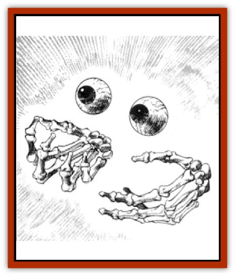

# Wichtlin

| Statistic | **Wichtlin** |
| --- | --- |
| **Activity Cycle:** | Any |
| **Alignment:** | Chaotic evil |
| **Armor Class:** | 2 |
| **Climate/Terrain:** | Any |
| **Damage/Attack:** | See below |
| **Diet:** | None |
| **Frequency:** | Very rare |
| **Hit Dice:** | 4+4 |
| **Intelligence:** | Semi- (2-4) |
| **Magic Resistance:** | See below |
| **Morale:** | Steady (12) |
| **Movement:** | 9 |
| **No. Appearing:** | 1 |
| **No. of Attacks:** | 2 |
| **Organization:** | Solitary |
| **Size:** | M (5' tall) |
| **Special Attacks:** | See below |
| **Special Defenses:** | +1 or better weapon to hit |
| **THAC0:** | 15 |
| **Treasure:** | Nil |
| **XP Value:** | 1,400 |

Wichtlin are [[Elf|elven]] undead. They are relentless killers and deadly adversaries.

Wichtlin appear as a pair of floating eyeballs and a pair of floating, skeletal hands. Both the eyeballs and the hands glow with a greenish color. Those using *detect invisibility*, *true seeing*, or a similar spell can see the wichtlin's entire form: a blackened elven [[Skeleton|skeleton]] draped with shards of rotting flesh.

Wichtlin are a result of an ancient curse on the court of Queen Sylvyana, a [[Elf_High_Silvanesti|Silvanesti elf]] also known as the [[Ghoul|Ghoul]] Queen. All known records of her reign were destroyed by the Silvanesti, and only fragments of rumors remain. When an elf of evil alignment dies violently, there is a 1% chance that Chemosh, the Lord of the Undead, in conjunction with the spirit of Queen Sylvyana, claims his spirit and resurrects him as a wichtlin.

**Combat:** A wichtlin's sole motivation is to kill victims in order for Chemosh to attempt to claim their spirits. Wichtlin are unaffected by poison and paralyzation. They are immune to *sleep*, *charm*, *hold*, and cold-based spells; fire scores normal damage. They can only be hit with +1 or better magical weapons. Holy water causes 2d4 points of damage per vial. Opponents who can see the entire wichtlin with *detect invisibility* or similar spells make their attack rolls normally; all others suffer a -2 penalty to their attack roll. Wichtlin are turned as spectres.

Wichtlin do not use weapons. Their left hands cause victims to become paralyzed for 2d4 rounds unless their victims roll successful saving throws vs. paralyzation. Their right hands inflict 2d6 points of poison damage unless their victims roll successful saving throws vs. poison (victims protected by *slow poison* or its equivalent are unaffected by the wichtlin's poison attack).

These creatures also have the following properties:

<ul><li>A wichtlin that was a spellcaster in its previous life retains its spellcasting abilities at half its prior level of ability (for instance, a 7th-level evil mage would cast spells as a 4th-level mage when resurrected as a wichtlin).</li><li>It a wichtlin successfully paralyzes an elf, the wichtlin's gaze can implant a *suggestion* (as the 3rd-level wizard spell) in the elf, unless the elf rolls a successful saving throw vs. spell.</li><li>An elf killed by a wichtlin becomes a wichtlin in seven days unless the elf is *resurrected* or otherwise revived. The body develops a faint glow during that time and begins to fade, except for the eyes and hands.</li><li>When a wichtlin slays any opponent, the wichtlin becomes fully visible for 1d4 rounds. However, it remains noncorporeal, with the exception of its hands and eyes.</li></ul>**Habitat/Society:** Wichtlin can be found anywhere; they can even be seen trudging along the ocean floor. So rare are wichtlin that they are never encountered in groups. Wichtlin have no interest in treasure.

**Ecology:** As with other undead, wichtlin do not eat, sleep, or perform any other physiological functions. They are occasionally employed by the evil gods or powerful evil wizards as assassins or warriors.

**Kagonesti Wichtlin and Wichtlin Wild Stags**

  If an evil [[Elf_Wild_Kagonesti|Kagonesti elf]] meets a violent death while riding a [[Stag|wild stag]] mount, the spirit of the wild stag may also be claimed by Chemosh and resurrected along with the elf. The wichtlin wild stag appears as a pair of eyes and antlers, both glowing green; in most other respects, it is similar to a living wild stag (AC 7; MV 24; HD 3; #AT 1 or 2; Dmg 2d4 or 1d3/1d3; THAC0 17). However, the wichtlin stag can only be hit by +1 or better magical weapons. If a victim is struck by an antler attack, he must roll a successful saving throw vs. paralyzation or become paralyzed for 2d4 rounds. The wichtlin wild stag obeys all commands of its wichtlin rider; however, if the stag is separated from its wichtlin by more than 20 yards for a full round, it disappears, never to return. It also disappears if its wichtlin rider is killed.

---
## Discovery & Documentation

**Source Publication:** MC4 Dragonlance Appendix (w/binder #2) (1989)
**Campaign Setting:** Dragonlance
**Author(s):** Rick Swan

### Other Creatures Found in This Source Book
   * [[Anemone_Giant_Sea|Anemone, Giant Sea]]
   * [[Bear_Ice|Bear, Ice]]
   * [[Beast_Undead|Beast, Undead]]
   * [[Bird_Krynn|Bird (Krynn)]]
   * [[Disir|Disir]]
   * [[Draconian_Aurak|Draconian, Aurak]]
   * [[Draconian_Baaz|Draconian, Baaz]]
   * [[Draconian_Bozak|Draconian, Bozak]]
   * [[Draconian_Kapak|Draconian, Kapak]]
   * [[Draconian_General_Information|Draconian, General Information]]
   * [[Draconian_Sivak|Draconian, Sivak]]
   * [[Draconian_Proto-_Traag|Draconian, Proto-, Traag]]
   * [[Dragon_Amphi|Dragon, Amphi]]
   * [[Dragon_Astral|Dragon, Astral]]
   * [[Dragon_Kodragon|Dragon, Kodragon]]
   * [[Dragon_Krynn_Othlorx_General_Information|Dragon (Krynn), Othlorx, General Information]]
   * [[Dragon_Krynn_General_Information|Dragon (Krynn), General Information]]
   * [[Dragon_Sea|Dragon, Sea]]
   * [[Dreamshadow|Dreamshadow]]
   * [[Dreamwraith|Dreamwraith]]
   * [[Dwarf_Daergar|Dwarf, Daergar]]
   * [[Dwarf_Hill_Neidar|Dwarf, Hill, Neidar]]
   * [[Dwarf_Mountain_Hylar|Dwarf, Mountain, Hylar]]
   * [[Dwarf_Theiwar|Dwarf, Theiwar]]
   * [[Dwarf_Zakhar|Dwarf, Zakhar]]
   * [[Elf_Half-|Elf, Half-]]
   * [[Elf_High_Qualinesti|Elf, High, Qualinesti]]
   * [[Elf_High_Silvanesti|Elf, High, Silvanesti]]
   * [[Elf_Sea_Dargonesti|Elf, Sea, Dargonesti]]
   * [[Elf_Sea_Dimernesti|Elf, Sea, Dimernesti]]
   * [[Elf_Wild_Kagonesti|Elf, Wild, Kagonesti]]
   * [[Eyewing|Eyewing]]
   * [[Fetch|Fetch]]
   * [[Fire_Minion|Fire Minion]]
   * [[Fireshadow|Fireshadow]]
   * [[Gnome_Tinker|Gnome, Tinker]]
   * [[Gurik_Cha'ahl|Gurik Cha'ahl]]
   * [[Haunt_Knight|Haunt, Knight]]
   * [[Horax|Horax]]
   * [[Human_Krynn|Human (Krynn)]]
   * [[Imp_Blood_Sea|Imp, Blood Sea]]
   * [[Kalothagh|Kalothagh]]
   * [[Kani_Doll|Kani Doll]]
   * [[Kender|Kender]]
   * [[Kyrie|Kyrie]]
   * [[Lizard_Man_Krynn|Lizard Man (Krynn)]]
   * [[Minotaur_Krynn|Minotaur, Krynn]]
   * [[Ogre_High|Ogre, High]]
   * [[Ogre_Krynn|Ogre (Krynn)]]
   * [[Phaethon|Phaethon]]
   * [[Saqualaminoi|Saqualaminoi]]
   * [[Shadowperson|Shadowperson]]
   * [[Shimmerweed|Shimmerweed]]
   * [[Skrit|Skrit]]
   * [[Spectral_Minion|Spectral Minion]]
   * [[Spider_Krynn|Spider (Krynn)]]
   * [[Stag|Stag]]
   * [[Tayling|Tayling]]
   * [[Thanoi|Thanoi]]
   * [[Tylor|Tylor]]
   * [[Wyndlass|Wyndlass]]
   * [[Yaggol|Yaggol]]
