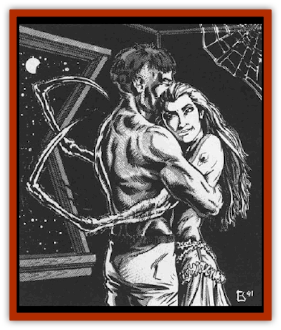

# Widow - Red

| Statistic | **Widow, Red** |
| --- | --- |
| **Activity Cycle:** | Any |
| **Alignment:** | Neutral evil |
| **Armor Class:** | 4 |
| **Climate/Terrain:** | Any temperate land |
| **Damage/Attack:** | 1d3 |
| **Diet:** | Blood and bodily fluids |
| **Frequency:** | Very rare |
| **Hit Dice:** | 6+3 |
| **Intelligence:** | High (13-14) |
| **Magic Resistance:** | Nil |
| **Morale:** | Average (8-10) |
| **Movement:** | 9, Wb 12 |
| **No. Appearing:** | 1 |
| **No. of Attacks:** | 1 |
| **Organization:** | Solitary |
| **Size:** | M (5-6' tall) |
| **Special Attacks:** | See below |
| **Special Defenses:** | Nil |
| **THAC0:** | 13 |
| **Treasure:** | W (Z) |
| **XP Value:** | 3,000 |

The red widow, or *spider queen*, is an evil and deadly shape changer. Spinning a web of evil to all the lands about its lair, this foul creature derives a vile pleasure in the murder of those lured to it by its many charms and promises of delight.

The red widow has two physical forms. The first, and that in which it is most commonly encountered, is a human one. In this guise, the red widow appears as a fantastically beautiful and alluring woman with long, flowing red hair. The creature's dress will vary to enable it to blend in with the human society around it, but will always be provocative and inviting. In this form, the creature is treated as a 0-level human, for the statistics listed above are those for its spider form (see below).

The red widow will adopt its true form, that of a [[Spider|giant spider]], only when it is about to make a kill. In this shape, the creature has a bright crimson body with a black, hourglass pattern on its back. In effect, it looks like a giant version of the common black widow spider, save that the colors are reversed.

Red widows seem to have no natural language of their own, but are always fluent in the languages of those cultures with which they come into contact.

**Combat:** Red widows seldom engage in open combat. Rather, they lure unsuspecting victims near and draw them into a passionate embrace. Once this is done, they transform into their true form. Those who witness this change (usually only the doomed victim) must make an immediate horror check. The transformation into a giant spider takes a full round, during which the creature never releases its hold on its victim. Attempting to escape the powerful grip of the red widow requires the victim to attempt a roll to bend bars. Failure indicates that escape is impossible at this time, although a new attempt is allowed each round.

Once in its spider shape, the red widow will bite its victim. While the bite itself inflicts only 1d3 points of damage, it allows the creature to inject a deadly poison (Class E, Immediate, Death/20). If the creature is striking at someone it is holding, it automatically hits. If it is trying to kill someone that has eluded its deadly embrace, a normal attack roll is required.

The red widow is capable of releasing a jet of webbing when in its spider form. This is handled just as if the creature were casting a *web* spell.

When the creature is in its spider form, it has the ability to climb sheer surfaces (just as if using a *spider climb* spell) and to command spiders. In the latter case, it will be able to summon 10-100 (10d10) [[Spider|spiders]]. Of these, 65% will be normal spiders, 20% will be [[Spider|large spiders]], 10% will be [[Spider|huge spiders]], and 5% will be giant spiders. These creatures adore the red widow and will do all that they can to protect her from harm, even at the cost of their own lives; no morale checks are ever required of them.

**Habitat/Society:** The red widow often makes its home in the cities and towns of men. Here, it moves about in its human guise and seduces its victims under cover of darkness. It is not uncommon for a red widow to love and then destroy a new victim every week.

**Ecology:** Red widows live by draining the blood and other bodily fluids from those they kill. A slain lover is hidden away somewhere in the creature's lair and can supply the widow with nourishment for up to a week. When the monster finishes with a corpse, it discards the partially decomposed and dehydrated body far from its lair. In this way, it hopes that its home will escape detection.

The red widow breeds by mating with a normal human. Following the consummation of their love, the widow kills her mate and implants the now fertilized eggs in its body. Within a week, these eggs hatch and consume the fluids in the corpse. Each "litter" of spiders consists of 2-8 young. These remain in spider form (being treated as large spiders) for one year. At the end of that time, they gain the ability to assume a human form and become adults. Only in rare cases will young remain with their mother at this time.

Assuming they do not die through violence or accident, the average red widow lives to be 20 to 30 years old.

---
## Discovery & Documentation

**Source Publication:** MC10 Ravenloft Appendix I (1989)
**Campaign Setting:** Planescape
**Author(s):** William W. Connors

### Other Creatures Found in This Source Book
   * [[Bastellus|Bastellus]]
   * [[Bat_Ravenloft|Bat (Ravenloft)]]
   * [[Bowlyn|Bowlyn]]
   * [[Broken_One|Broken One]]
   * [[Bussengeist|Bussengeist]]
   * [[Darkling|Darkling]]
   * [[Doom_Guard|Doom Guard]]
   * [[Doppelganger_Plant|Doppelganger Plant]]
   * [[Elemental_Ravenloft|Elemental (Ravenloft)]]
   * [[Ermordenung|Ermordenung]]
   * [[Ghoul_Lord|Ghoul Lord]]
   * [[Goblyn|Goblyn]]
   * [[Golem_III|Golem III]]
   * [[Golem_IV|Golem IV]]
   * [[Golem_Ravenloft|Golem (Ravenloft)]]
   * [[Grim_Reaper|Grim Reaper]]
   * [[Human_Abber_Nomad|Human, Abber Nomad]]
   * [[Human_Ravenloft|Human (Ravenloft)]]
   * [[Imp_Assassin|Imp, Assassin]]
   * [[Impersonator|Impersonator]]
   * [[Lycanthrope_Werebat|Lycanthrope, Werebat]]
   * [[Lycanthrope_Wereraven|Lycanthrope, Wereraven]]
   * [[Mist_Horror|Mist Horror]]
   * [[Mummy_Greater|Mummy, Greater]]
   * [[Quevari|Quevari]]
   * [[Quickwood|Quickwood]]
   * [[Ravenkin|Ravenkin]]
   * [[Reaver|Reaver]]
   * [[Scarecrow_Ravenloft|Scarecrow (Ravenloft)]]
   * [[Shadow_Fiend|Shadow Fiend]]
   * [[Skeleton_Giant|Skeleton, Giant]]
   * [[Strahd's_Skeletal_Steed|Strahd's Skeletal Steed]]
   * [[Treant_Evil|Treant, Evil]]
   * [[Treant_Undead|Treant, Undead]]
   * [[Valpurgeist|Valpurgeist]]
   * [[Vampire_Dwarf|Vampire, Dwarf]]
   * [[Vampire_Elf|Vampire, Elf]]
   * [[Vampire_Gnome|Vampire, Gnome]]
   * [[Vampire_Halfling|Vampire, Halfling]]
   * [[Vampire_General_Information|Vampire, General Information]]
   * [[Vampire_Kender|Vampire, Kender]]
   * [[Vampyre|Vampyre]]
   * [[Wolfwere_Greater|Wolfwere, Greater]]
   * [[Zombie_Lord|Zombie Lord]]
