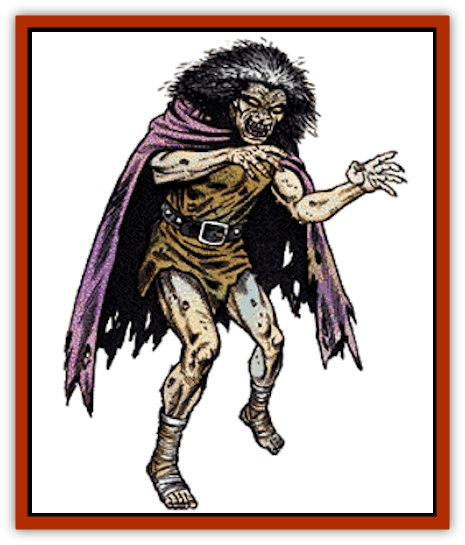

# Wight

| Statistic | **Wight** |
| --- | --- |
| **Activity Cycle:** | Night |
| **Alignment:** | Lawful evil |
| **Armor Class:** | 5 |
| **Climate/Terrain:** | Any land |
| **Damage/Attack:** | 1-4 |
| **Diet:** | See below |
| **Frequency:** | Uncommon |
| **Hit Dice:** | 4+3 |
| **Intelligence:** | Average (8-10) |
| **Magic Resistance:** | See below |
| **Morale:** | Elite (14) |
| **Movement:** | 12 |
| **No. Appearing:** | 2-16 (2d8) |
| **No. of Attacks:** | 1 |
| **Organization:** | Solitary |
| **Size:** | M (4-7') |
| **Special Attacks:** | Energy drain |
| **Special Defenses:** | Hit only by silver or +1 or better magical weapon |
| **THAC0:** | 15 |
| **Treasure:** | B |
| **XP Value:** | 1,400 |

In ages long past, the word "wight" meant simply "man". As the centuries have passed, though, it has come to be associated only with those undead that typically inhabit barrow mounds and catacombs.

From a distance, wights can easily be mistaken for any number of humanoid races. Upon closer examination, however, their true nature becomes apparent. As undead creatures, wights are nightmarish reflections of their former selves, with cruel, burning eyes set in mummified flesh over a twisted skeleton with hands that end in sharp claws.

**Combat:** Wights are fierce and deadly foes in combat. When attacked, they are unharmed by any weapons that are not forged from silver or enchanted in some manner.

The wight attacks with its jagged claws and powerful blows, inflicting 1-4 points of damage with each successful strike. In addition to this physical harm, the wight is able to feed on the life essence of its foes. Each blow that the wight lands drains one level from the victim, reducing Hit Dice, class bonuses, spell abilities, and so forth. Thus, a 9th-level wizard struck by a wight loses 1-4 hit points and becomes an 8th-level wizard; he has the spells and hit points of an 8th-level wizard and he fights as an 8th-level wizard.

Persons who are slain by the energy draining powers of a wight are doomed to rise again as wights under the direct control of their slayer. In their new form, they have the powers and abilities of a normal wight but half their experience levels, class abilities, and Hit Dice. If the wight who "created" them is slain, they will instantly be freed of its control and gain a portion of its power, acquiring the normal 4+3 Hit Dice of their kind. Once a character becomes a wight, recovery is nearly impossible, requiring a special quest.

Wights are unaffected by *sleep*, *charm*, *hold* or cold-based spells. In addition, they are not harmed by poisons or paralyzation attacks.

Wights can be engaged and defeated by individuals who are well prepared for battle with them. Physical contact with holy water is deadly to wights and each vial splashed on one burns it for 2-8 points of damage. In addition, a *raise dead* spell becomes a powerful weapon if used against the wight. Such magic is instantly fatal to the creature, utterly annihilating it.

Wights cannot tolerate bright light, including sunlight, and avoid it at all costs. It is important to note, however, that wights are not harmed by exposure to sunlight as [[Vampire_General_Information|vampires]] are.

**Habitat/Society:** Like the other undead that infest the world, wights live in barrow mounds, catacombs, and other sepulchral places. They despise light and places which are vibrant with living things. As a rule, the wight is hateful and evil, seeking to satisfy its hatred of life by killing all those it encounters.

Although wights are often found in small groups, they are actually solitary creatures. Without exception, encounters with multiple wights will be a single leader and a number of lesser creatures which it has created to serve it. In these cases, the leader of the group will be more than willing to sacrifice some or all of its minions to assure its own survival or victory.

**Ecology:** Like all undead, wights exist on both the Prime Material and Negative Material planes simultaneously. It is this powerful link to the negative world that gives them their fearsome level-draining ability. Further, it is this draining which provides them with sustenance.

As they are not living creatures and have no rightful place in our world, many animals can sense the wight's presence. [[Dog|Dogs]] will growl or howl with alarm, [[Horse|horses]] will refuse to enter an area which wights inhabit, and [[Bird|birds]] and insects will grow silent when the creature passes near them. In addition, their presence will gradually cause the plant life around their lairs to wither and die, marking the region as unclean.

---
## Discovery & Documentation

**Source Publication:** MC1 Volume I (w/binder #1) (1991)
**Campaign Setting:** Advanced Dungeons & Dragons 2nd Edition
**Author(s):** Jay Batista, Scott Bennie, Grant Boucher, William W. Connors, Steve Gilbert, Heike Kubasch, James Lowder, David Edward Martin, Bruce Nesmith, Jean Rabe, Rick Swan, John J. Terra, Gary L. Thomas

### Other Creatures Found in This Source Book
   * [[Bat|Bat]]
   * [[Bear|Bear]]
   * [[Behir|Behir]]
   * [[Boar|Boar]]
   * [[Bookworm|Bookworm]]
   * [[Brownie|Brownie]]
   * [[Bugbear|Bugbear]]
   * [[Carrion_Crawler|Carrion Crawler]]
   * [[Cat_Great|Cat, Great]]
   * [[Catoblepas|Catoblepas]]
   * [[Dragon_General_Information|Dragon, General Information]]
   * [[Dragonfish|Dragonfish]]
   * [[Elemental_Air_Kin_Aerial_Servant|Elemental, Air Kin, Aerial Servant]]
   * [[Elemental_Earth_Kin_Sandling|Elemental, Earth Kin, Sandling]]
   * [[Elephant|Elephant]]
   * [[Gnoll|Gnoll]]
   * [[Hobgoblin|Hobgoblin]]
   * [[Homunculus|Homunculus]]
   * [[Hornet_Giant|Hornet, Giant]]
   * [[Horse|Horse]]
   * [[Hyena|Hyena]]
   * [[Jackal|Jackal]]
   * [[Jackalwere|Jackalwere]]
   * [[Korred|Korred]]
   * [[Lich|Lich]]
   * [[Lizard|Lizard]]
   * [[Lizard_Man|Lizard Man]]
   * [[Lycanthrope_General_Information|Lycanthrope, General Information]]
   * [[Lycanthrope_Seawolf|Lycanthrope, Seawolf]]
   * [[Lycanthrope_Werebear|Lycanthrope, Werebear]]
   * [[Lycanthrope_Weretiger|Lycanthrope, Weretiger]]
   * [[Lycanthrope_Werewolf|Lycanthrope, Werewolf]]
   * [[Manticore|Manticore]]
   * [[Medusa|Medusa]]
   * [[Mind_Flayer|Mind Flayer]]
   * [[Minotaur|Minotaur]]
   * [[Mudman|Mudman]]
   * [[Mummy|Mummy]]
   * [[Nixie|Nixie]]
   * [[Nymph|Nymph]]
   * [[Ogre|Ogre]]
   * [[Ooze_Slime_Jelly_I|Ooze/Slime/Jelly I]]
   * [[Ooze_Slime_Jelly_II|Ooze/Slime/Jelly II]]
   * [[Orc|Orc]]
   * [[Owl|Owl]]
   * [[Owlbear_I|Owlbear I]]
   * [[Pegasus|Pegasus]]
   * [[Piercer|Piercer]]
   * [[Pudding_Deadly|Pudding, Deadly]]
   * [[Rakshasa|Rakshasa]]
   * [[Rat|Rat]]
   * [[Ray|Ray]]
   * [[Remorhaz|Remorhaz]]
   * [[Satyr|Satyr]]
   * [[Scorpion|Scorpion]]
   * [[Selkie|Selkie]]
   * [[Shadow|Shadow]]
   * [[Skeleton|Skeleton]]
   * [[Skunk|Skunk]]
   * [[Snake|Snake]]
   * [[Spectre|Spectre]]
   * [[Spider|Spider]]
   * [[Sprite|Sprite]]
   * [[Toad_Giant|Toad, Giant]]
   * [[Treant|Treant]]
   * [[Troll|Troll]]
   * [[Umber_Hulk|Umber Hulk]]
   * [[Unicorn|Unicorn]]
   * [[Vampire|Vampire]]
   * [[Will_O'Wisp|Will O'Wisp]]
   * [[Wolf|Wolf]]
   * [[Wolfwere|Wolfwere]]
   * [[Wraith|Wraith]]
   * [[Wyvern|Wyvern]]
   * [[Yeti|Yeti]]
   * [[Yuan-ti|Yuan-ti]]
   * [[Zombie|Zombie]]
