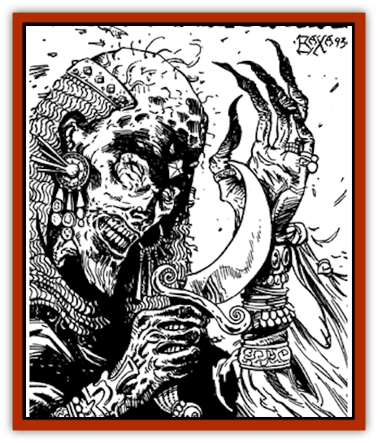

# Wight - King

| Statistic | **Wight, King-** |
| --- | --- |
| **Activity Cycle:** | Night |
| **Alignment:** | Lawful evil |
| **Armor Class:** | -1 |
| **Climate/Terrain:** | Any, usually subterranean |
| **Damage/Attack:** | 1d8+5 |
| **Diet:** | Carnivore (living beings) |
| **Frequency:** | Very rare |
| **Hit Dice:** | 12+23 (77 hp) |
| **Intelligence:** | Exceptional (15) |
| **Magic Resistance:** | Nil |
| **Morale:** | Fearless (20) |
| **Movement:** | 12 |
| **No. Appearing:** | 1 |
| **No. of Attacks:** | 3/2 by weapon type or 1 by touch |
| **Organization:** | Solitary, but may have followers |
| **Size:** | M (6-7') |
| **Special Attacks:** | Energy drain, wight control, spellcasting, earthquake, magical items |
| **Special Defenses:** | Immunity to some weapons and spells |
| **THAC0:** | 4 |
| **Treasure:** | A |
| **XP Value:** | 30,000 |

A king-[[Wight|wight]] was once a powerful evil king. When he died, he became undead, continuing to rule the ranks of the walking dead. His death is often voluntary, a self-sacrifice made to gain a prolonged existence.

A king-wight looks like a well-preserved corpse. At nighttime, in artificial light, it can even be mistaken for a living being. It wears its favorite armor and carries its favorite weapons, and is often decorated with expensive jewelry. While a king-wight can appear almost alive, the stench of the grave follows it and gives it away.

**Combat:** A king-wight fights much the same after death as it did in life. It wears *chain mail +3* and wields a *sword +2* (any type possible). A king-wight was an exceptional human and continues to have excellent attributes even in death. Its attribute statistics are: S 18/50, D 17, C 16, I 15, W 13, Ch 15 (to undead only). These scores and the magical items are already calculated into the king-wight's statistics.

When it becomes undead, a king-wight gains many special abilities. A successful attack can drain two life levels from a victim, as per a [[Vampire_General_Information|vampire]]. Any victim completely drained of life points by the king+wight becomes a full-strength wight under the control of the king-wight.

A king-wight also has the ability to cast *spectral force* and *confusion* spells, one spell per round, without limit. It can *teleport* once per day, but only to or from its barrow home. When the king-wight is destroyed, the action causes an *earthquake* (as per the clerical spell, at the 14th-level of effect), centered on the king-wight's body, in 4-16 rounds. Since a king-wight is often encountered in its underground barrow, such an earthquake can be especially deadly.

A king-wight is so powerful that any individual of a level lower than the kingwight must make a saving throw vs. spells or flee in panic from fear. The following spells or attack forms have no effect on a king-wight: *charm*, *sleep*, *enfeeblement*, *polymorph*, cold, electricity, insanity, and death magic. A *raise dead* spell turns the king-wight into a normal 12th-level fighter unless a saving throw vs. spells is made.

A cleric attempting to turn a king-wight should use the "special" column. A king wight can be harmed only by magical weapons.

**Habitat/Society:** A king-wight retains its court, even after death. It is often surrounded by its faithful warriors, who were turned into wights by the king-wight and remain under their master's control. A king-wight encountered in its barrow usually controls 4-32 normal wights.

A king-wight delights in tricking the living. It often travels to someone's abode to flaunt its treasure and tempt heroes into searching out its lair. A king-wight may appear gracious and hospitable at times, but such appearances are illusory. In reality, the king-wight hates to give up any part of its hoarded treasure and tempts heroes only as a ploy to trap them in its underground barrow, to either slay the heroes by the sword or turn them into wight slaves.

---
## Discovery & Documentation

**Source Publication:** Dragon198 (1993)
**Campaign Setting:** Dragon Magazine
**Author(s):** 

### Other Creatures Found in This Source Book
   * [[Angreden|Angreden]]
   * [[Ghoul_Goop|Ghoul, Goop]]
   * [[Ka|Ka]]
   * [[Vartha|Vartha]]
   * [[Wraith-King|Wraith-King]]
