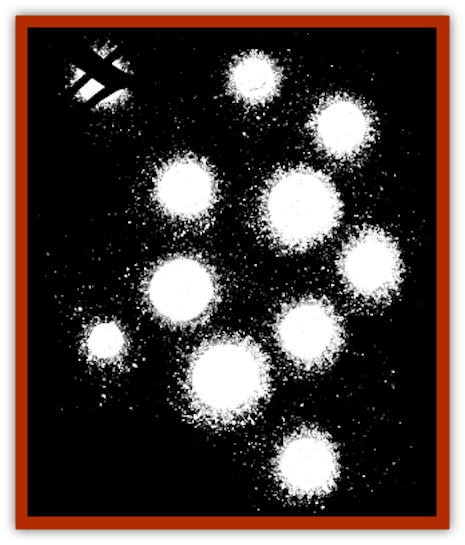

# Will O'Dawn

| Statistic | **Will O'Dawn** |
| --- | --- |
| **Activity Cycle:** | Dawn |
| **Alignment:** | Chaotic good |
| **Armor Class:** | -6 |
| **Climate/Terrain:** | Ravenloft |
| **Damage/Attack:** | Nil |
| **Diet:** | See below |
| **Frequency:** | Very rare |
| **Hit Dice:** | 6 |
| **Intelligence:** | Exceptional (15-16) |
| **Magic Resistance:** | Nil |
| **Morale:** | Champion (15-16) |
| **Movement:** | Fl 18 (A) |
| **No. Appearing:** | 1 or 1-2 |
| **No. of Attacks:** | One spell |
| **Organization:** | Solitary |
| **Size:** | T (1-2' diameter) |
| **Special Attacks:** | <i>Color spray</i>, <i>hypnotic pattern</i> |
| **Special Defenses:** | Spell immunity, invisibility |
| **THAC0:** | 15 |
| **Treasure:** | Nil |
| **XP Value:** | 1,400 |

The will o'dawn (or *feu follet*, as it is also called) is perhaps the most mysterious of all [[Will_O'Wisp|will o'wisp]] variants, and it is certainly the most helpful. The tiny energy form most frequently appears at dawn, and during this brief period it attempts to aid adventurers and others who are afraid, in pain, lost, or otherwise in trouble. In the dark and troubled land of the Mists, such a creature is truly remarkable.

A will o'dawn normally appears as a faintly glowing ball of light. Although generally smaller than its malevolent cousin, it is almost impossible to distinguish between the two. A will o'dawn can somewhat alter its shape and coloring and can easily be mistaken for a lantern, *light* spell, or other artificial illumination. The creature can become invisible at will, although it can only dampen its glow for 2d6 rounds at a time. A will o'dawn cannot cast its spells while invisible. Only beings that can sense invisible objects can spot a hidden will o'dawn.

Will o'dawns seem to communicate with each other via changes in color and brightness. Given enough time in the presence of these creatures, a person might interpret their language. In most cases, however, the best that can be achieved is a basic understanding of concepts like "red means danger" or "blue means safe".

**Combat:** Will o'dawns loathe combat. There are no known instances of a feu follet intentionally harming a living being. The only time will o'dawns enter battle is to protect themselves or those individuals who merit their assistance.

When in combat, a will o'dawn normally uses its *color spray* or *hypnotic pattern* to either stun or lull its opponents into quiescence. It can use either spell an unlimited number of times, but it can cast only one of either per melee round. The will o'dawn casts both spells and makes all saving throws as a 9th level wizard.

The will o'dawn is also fond of leading opponents on a merry chase, attempting to use the natural surroundings to delay or entrap its foes long enough for the will o'dawn, or those it is helping, to escape. The will o'dawn is not averse to miring its enemies in a bog or the like, but the creature will not purposely harm even its foes.

The will o'dawn is immune to all spells except *darkness* and *continual darkness*. The former stuns the creature for 1d6 rounds if cast directly at it, while the latter is instantly fatal unless a successful saving throw vs. death is made. The will o'dawn, like all will o'wisp variants, is vulnerable to normal weapons.

**Habitat/Society:** Will o'dawns are almost always encountered alone. On very rare occasions (5% chance per encounter), two such creatures are encountered together. The will o'dawn appears only during sunrise and remains active for no more than 20 minutes. After this time, the will o'dawn normally renders itself invisible and flees the area. On rare occasions when a will o'dawn has been captured, the creature's golden glow dims and slowly dissipates.

No one knows where the mysterious will o'dawn goes when it is not aiding others. What is known is that the will o'dawn aids anyone of good alignment that it meets, although it seldom stays with the beneficiary of its aid for more than a brief period of time. The will o'dawa can sense good creatures in pain or trouble and will attempt to aid them if at all possible. The aid a will o'dawn can offer includes leading adventurers to a treasure cache or secret door, helping lost travelers find their way out of a swamp, or distracting evil creatures in a fight. Unfortunately, many people that the will o'dawn attempts to help do not follow the creature, mistaking it for its evil cousin, the will o'wisp.

As mentioned above, will o'dawns communicate through rapid light flashes usually too subtle for humans and demihumans to understand. However, if a will o'dawn hypnotizes a subject, it can communicate directly with his mind. A will o'dawn can communicate in this manner with only one individual at a time.

**Ecology:** The will o'dawn seems to feed on the energies generated by excited, happy, or otherwise exhilarated minds. Thus, the will o'dawn attempts to create conditions which cause relief, excitement, or happiness. This apparent feeding on positive emotions renders the will o'dawn remarkably different from all other will o'wisp variants.

---
## Discovery & Documentation

**Source Publication:** Ravenloft Appendix III (1991)
**Campaign Setting:** Ravenloft
**Author(s):** Kirk Botulla

### Other Creatures Found in This Source Book
   * [[Akikage|Akikage]]
   * [[Animator_Common|Animator, Common]]
   * [[Animator_Greater|Animator, Greater]]
   * [[Animator_Minor|Animator, Minor]]
   * [[Animator_General_Information|Animator, General Information]]
   * [[Bakhna_Rakhna|Bakhna Rakhna]]
   * [[Baobhan_Sith|Baobhan Sith]]
   * [[Beetle_Scarab|Beetle, Scarab]]
   * [[Boneless|Boneless]]
   * [[Boowray|Boowray]]
   * [[Bruja|Bruja]]
   * [[Carrionette|Carrionette]]
   * [[Carrion_Stalker|Carrion Stalker]]
   * [[Cat_Midnight|Cat, Midnight]]
   * [[Cat_Skeletal|Cat, Skeletal]]
   * [[Cloaker_Resplendent|Cloaker, Resplendent]]
   * [[Cloaker_Shadow|Cloaker, Shadow]]
   * [[Cloaker_Undead|Cloaker, Undead]]
   * [[Corpse_Candle|Corpse Candle]]
   * [[Death's_Head_Tree|Death's Head Tree]]
   * [[Doppelganger_Ravenloft|Doppelganger (Ravenloft)]]
   * [[Familiar_Pseudo-|Familiar, Pseudo-]]
   * [[Familiar_Undead|Familiar, Undead]]
   * [[Feathered_Serpent|Feathered Serpent]]
   * [[Fenhound|Fenhound]]
   * [[Figurine_Ceramic|Figurine, Ceramic]]
   * [[Figurine_Crystal|Figurine, Crystal]]
   * [[Figurine_Ivory|Figurine, Ivory]]
   * [[Figurine_Obsidian|Figurine, Obsidian]]
   * [[Figurine_Porcelain|Figurine, Porcelain]]
   * [[Figurine_General_Information|Figurine, General Information]]
   * [[Fleas_of_Madness|Fleas of Madness]]
   * [[Furies|Furies]]
   * [[Geist|Geist]]
   * [[Ghost_Animal|Ghost, Animal]]
   * [[Golem_Flesh_Ravenloft|Golem, Flesh (Ravenloft)]]
   * [[Golem_Mist_Ravenloft|Golem, Mist (Ravenloft)]]
   * [[Golem_Wax_Ravenloft|Golem, Wax (Ravenloft)]]
   * [[Gremishka|Gremishka]]
   * [[Hag_Spectral|Hag, Spectral]]
   * [[Head_Hunter|Head Hunter]]
   * [[Hearth_Fiend|Hearth Fiend]]
   * [[Hebi-No-Onna|Hebi-No-Onna]]
   * [[Hound_Phantom|Hound, Phantom]]
   * [[Hound_Skeletal|Hound, Skeletal]]
   * [[Imp_Wishing|Imp, Wishing]]
   * [[Ivy_Crawling|Ivy, Crawling]]
   * [[Jack_Frost|Jack Frost]]
   * [[Jolly_Roger|Jolly Roger]]
   * [[Kizoku|Kizoku]]
   * [[Lashweed|Lashweed]]
   * [[Leech_Magical|Leech, Magical]]
   * [[Leech_Psionic|Leech, Psionic]]
   * [[Lich_Defiler|Lich, Defiler]]
   * [[Lich_Drow|Lich, Drow]]
   * [[Lich_Elemental|Lich, Elemental]]
   * [[Lich_Psionic|Lich, Psionic]]
   * [[Living_Tattoo|Living Tattoo]]
   * [[Lycanthrope_Loup-garou|Lycanthrope, Loup-garou]]
   * [[Lycanthrope_Werejackal|Lycanthrope, Werejackal]]
   * [[Lycanthrope_Werejaguar_Ravenloft|Lycanthrope, Werejaguar (Ravenloft)]]
   * [[Lycanthrope_Wereleopard|Lycanthrope, Wereleopard]]
   * [[Lycanthrope_Wereray|Lycanthrope, Wereray]]
   * [[Mist_Ferryman|Mist Ferryman]]
   * [[Moor_Man|Moor Man]]
   * [[Obedient|Obedient]]
   * [[Odem|Odem]]
   * [[Paka|Paka]]
   * [[Plant_Blood_Rose|Plant, Blood Rose]]
   * [[Plant_Fearweed|Plant, Fearweed]]
   * [[Radiant_Spirit|Radiant Spirit]]
   * [[Recluse|Recluse]]
   * [[Remnant_Aquatic|Remnant, Aquatic]]
   * [[Rushlight|Rushlight]]
   * [[Sea_Spawn_Master|Sea Spawn, Master]]
   * [[Sea_Spawn_Minion|Sea Spawn, Minion]]
   * [[Shadow_Asp|Shadow Asp]]
   * [[Shattered_Brethren|Shattered Brethren]]
   * [[Skeleton_Archer|Skeleton, Archer]]
   * [[Skeleton_Insectoid|Skeleton, Insectoid]]
   * [[Skin_Thief|Skin Thief]]
   * [[Spirit_Psionic|Spirit, Psionic]]
   * [[Strahd_Skeleton|Strahd Skeleton]]
   * [[Strahd_Zombie|Strahd Zombie]]
   * [[Unicorn_Shadow|Unicorn, Shadow]]
   * [[Vampire_Drow|Vampire, Drow]]
   * [[Vampire_Nosferatu|Vampire, Nosferatu]]
   * [[Vampire_Oriental|Vampire, Oriental]]
   * [[Virus_General_Information|Virus, General Information]]
   * [[Virus_I|Virus I]]
   * [[Virus_II|Virus II]]
   * [[Virus_III|Virus III]]
   * [[Vorlog|Vorlog]]
   * [[Will_O'Deep|Will O'Deep]]
   * [[Will_O'Mist|Will O'Mist]]
   * [[Will_O'Sea|Will O'Sea]]
   * [[Zombie_Cannibal|Zombie, Cannibal]]
   * [[Zombie_Desert|Zombie, Desert]]
   * [[Zombie_Wolf|Zombie Wolf]]
   * [[Zombie_Fog|Zombie Fog]]
