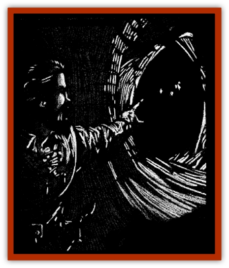

# Will O'Deep

| Statistic | **Will O'Deep** |
| --- | --- |
| **Activity Cycle:** | Night |
| **Alignment:** | Neutral evil |
| **Armor Class:** | 0 |
| **Climate/Terrain:** | Subterranean |
| **Damage/Attack:** | 1d4 &times;4 |
| **Diet:** | See below |
| **Frequency:** | Rare |
| **Hit Dice:** | 5 |
| **Intelligence:** | High (13-14) |
| **Magic Resistance:** | Nil |
| **Morale:** | Champion (15-16) |
| **Movement:** | Fl 12 (A) |
| **No. Appearing:** | 1-4 |
| **No. of Attacks:** | 4 |
| **Organization:** | Clan |
| **Size:** | T (1' diameter) |
| **Special Attacks:** | Burning sparks |
| **Special Defenses:** | Spell immunity, invisibility |
| **THAC0:** | 15 |
| **Treasure:** | W |
| **XP Value:** | 1,000 |

The least powerful of all [[Will_O'Wisp|will o'wisp]] variants, the will o'deep is found only within the most remote tunnels and caverns. Whimsically evil, the will o'deep relishes leading unwary explorers into terrible predicaments far away from even the slight comfort and protection of the cloudy skies of Ravenloft.

The will o'deep is a tiny, flickering energy being. Normally golden or reddish in hue, the will o'deep can take on a variety of colors. Although capable of altering its shape, the will o'deep most commonly takes on a rippling, teardrop shape very reminiscent of the flames of a small torch. As with most will o'wisp variants, if the will o'deep does not attack it can temporarily dampen its glow for 2-8 (2d4) rounds, rendering the creature undetectable to all who cannot sense invisible objects.

These creatures communicate with each other through changes in color and intensity. Any human being able to survive in the company of these creatures for an extended period of time might be able to pick up their language, but so far there is no known case of this. There are reports, however, of [[Elf_Drow|drow]] and similar folk who have the ability to understand the conversations of these terrible monsters.

**Combat:** The will o'deep does not seek out direct combat, instead attempting to either trap its victims or lead them into ambushes and other dangers. Although not as physically dangerous as many of its cousins, the will o'deep is a crafty opponent and difficult to damage. Adventurers who find themselves the object of a will o'deep's attentions are wise to be on their guard or, better yet, retreat to the surface as soon as possible.

Will o'deep strategies often involve luring adventurers into complex labyrinths or the lairs of dangerous creatures. Often found in small groups or clans, will o'deeps work together to accomplish such goals.

Although the results of the will o'deep's lure is often deadly, more often than not the creature is merely attempting to wear down the adventurers so that it can trap its victims deep underground. For example, a will o'deep might search out an area where only a small nudge is needed to cause a cave-in or trigger an old trap. Once this is done, the creature's victims are available for long-term feeding.

Will o'deeps can physically attack with a series of small, white-hot sparks. Such sparks have enough force to knock small rocks over or push doors closed. When used as an attack each spark does 1-4 points of damage. Will o'deeps can form up to four such sparks per round.

Additionally, a will o'deep often knows where small pockets of cave gasses have built up. If the will o'deep feels it is in danger it will attempt to lead its pursuers to such a pocket and use one of its sparks to cause an explosion. Anyone within 10' of such an explosion takes 1-10 points of damage. Such explosions often cause cave-ins as well.

Will o'deeps are vulnerable to normal weapons; however, most magical attacks are useless against them. A *lightning bolt* or *chain lightning* spell will harm them, but all other known spells fail utterly against the will o'deep.

**Habitat/Society:** Will o'deeps prefer to travel and live in small clans of 2-4 individuals, but are also often encountered alone. Will o'deeps never appear above the surface, preferring to remain as far underground as their feeding needs allow.

The will o'deep is highly self-protective and will attempt to flee if reduced to 25% of its original hit points. If pressed, the will o'deep may lead its pursuers to some underground treasure in the hopes of distracting them while it makes good its escape.

**Ecology:** The will o'deep seems to feed on the energies given off by humanoid brains, particularly the impulses emitted by the brain when it is consumed by either fear or desperation. Will o'deeps can feed for weeks, even months, on humanoids they have managed to trap since the creatures sometimes go so far as to herd [[Rat|rats]] and the like to their captives' cells. They will keep their captives alive until apathy and despair set in, conditions on which the monsters seem incapable of feeding.

Will o'deeps have been known to turn such captives over to drow or other creatures of the darkness in return for gold, gems, or fresh victims.

---
## Discovery & Documentation

**Source Publication:** Ravenloft Appendix III (1991)
**Campaign Setting:** Ravenloft
**Author(s):** Kirk Botulla

### Other Creatures Found in This Source Book
   * [[Akikage|Akikage]]
   * [[Animator_Common|Animator, Common]]
   * [[Animator_Greater|Animator, Greater]]
   * [[Animator_Minor|Animator, Minor]]
   * [[Animator_General_Information|Animator, General Information]]
   * [[Bakhna_Rakhna|Bakhna Rakhna]]
   * [[Baobhan_Sith|Baobhan Sith]]
   * [[Beetle_Scarab|Beetle, Scarab]]
   * [[Boneless|Boneless]]
   * [[Boowray|Boowray]]
   * [[Bruja|Bruja]]
   * [[Carrionette|Carrionette]]
   * [[Carrion_Stalker|Carrion Stalker]]
   * [[Cat_Midnight|Cat, Midnight]]
   * [[Cat_Skeletal|Cat, Skeletal]]
   * [[Cloaker_Resplendent|Cloaker, Resplendent]]
   * [[Cloaker_Shadow|Cloaker, Shadow]]
   * [[Cloaker_Undead|Cloaker, Undead]]
   * [[Corpse_Candle|Corpse Candle]]
   * [[Death's_Head_Tree|Death's Head Tree]]
   * [[Doppelganger_Ravenloft|Doppelganger (Ravenloft)]]
   * [[Familiar_Pseudo-|Familiar, Pseudo-]]
   * [[Familiar_Undead|Familiar, Undead]]
   * [[Feathered_Serpent|Feathered Serpent]]
   * [[Fenhound|Fenhound]]
   * [[Figurine_Ceramic|Figurine, Ceramic]]
   * [[Figurine_Crystal|Figurine, Crystal]]
   * [[Figurine_Ivory|Figurine, Ivory]]
   * [[Figurine_Obsidian|Figurine, Obsidian]]
   * [[Figurine_Porcelain|Figurine, Porcelain]]
   * [[Figurine_General_Information|Figurine, General Information]]
   * [[Fleas_of_Madness|Fleas of Madness]]
   * [[Furies|Furies]]
   * [[Geist|Geist]]
   * [[Ghost_Animal|Ghost, Animal]]
   * [[Golem_Flesh_Ravenloft|Golem, Flesh (Ravenloft)]]
   * [[Golem_Mist_Ravenloft|Golem, Mist (Ravenloft)]]
   * [[Golem_Wax_Ravenloft|Golem, Wax (Ravenloft)]]
   * [[Gremishka|Gremishka]]
   * [[Hag_Spectral|Hag, Spectral]]
   * [[Head_Hunter|Head Hunter]]
   * [[Hearth_Fiend|Hearth Fiend]]
   * [[Hebi-No-Onna|Hebi-No-Onna]]
   * [[Hound_Phantom|Hound, Phantom]]
   * [[Hound_Skeletal|Hound, Skeletal]]
   * [[Imp_Wishing|Imp, Wishing]]
   * [[Ivy_Crawling|Ivy, Crawling]]
   * [[Jack_Frost|Jack Frost]]
   * [[Jolly_Roger|Jolly Roger]]
   * [[Kizoku|Kizoku]]
   * [[Lashweed|Lashweed]]
   * [[Leech_Magical|Leech, Magical]]
   * [[Leech_Psionic|Leech, Psionic]]
   * [[Lich_Defiler|Lich, Defiler]]
   * [[Lich_Drow|Lich, Drow]]
   * [[Lich_Elemental|Lich, Elemental]]
   * [[Lich_Psionic|Lich, Psionic]]
   * [[Living_Tattoo|Living Tattoo]]
   * [[Lycanthrope_Loup-garou|Lycanthrope, Loup-garou]]
   * [[Lycanthrope_Werejackal|Lycanthrope, Werejackal]]
   * [[Lycanthrope_Werejaguar_Ravenloft|Lycanthrope, Werejaguar (Ravenloft)]]
   * [[Lycanthrope_Wereleopard|Lycanthrope, Wereleopard]]
   * [[Lycanthrope_Wereray|Lycanthrope, Wereray]]
   * [[Mist_Ferryman|Mist Ferryman]]
   * [[Moor_Man|Moor Man]]
   * [[Obedient|Obedient]]
   * [[Odem|Odem]]
   * [[Paka|Paka]]
   * [[Plant_Blood_Rose|Plant, Blood Rose]]
   * [[Plant_Fearweed|Plant, Fearweed]]
   * [[Radiant_Spirit|Radiant Spirit]]
   * [[Recluse|Recluse]]
   * [[Remnant_Aquatic|Remnant, Aquatic]]
   * [[Rushlight|Rushlight]]
   * [[Sea_Spawn_Master|Sea Spawn, Master]]
   * [[Sea_Spawn_Minion|Sea Spawn, Minion]]
   * [[Shadow_Asp|Shadow Asp]]
   * [[Shattered_Brethren|Shattered Brethren]]
   * [[Skeleton_Archer|Skeleton, Archer]]
   * [[Skeleton_Insectoid|Skeleton, Insectoid]]
   * [[Skin_Thief|Skin Thief]]
   * [[Spirit_Psionic|Spirit, Psionic]]
   * [[Strahd_Skeleton|Strahd Skeleton]]
   * [[Strahd_Zombie|Strahd Zombie]]
   * [[Unicorn_Shadow|Unicorn, Shadow]]
   * [[Vampire_Drow|Vampire, Drow]]
   * [[Vampire_Nosferatu|Vampire, Nosferatu]]
   * [[Vampire_Oriental|Vampire, Oriental]]
   * [[Virus_General_Information|Virus, General Information]]
   * [[Virus_I|Virus I]]
   * [[Virus_II|Virus II]]
   * [[Virus_III|Virus III]]
   * [[Vorlog|Vorlog]]
   * [[Will_O'Dawn|Will O'Dawn]]
   * [[Will_O'Mist|Will O'Mist]]
   * [[Will_O'Sea|Will O'Sea]]
   * [[Zombie_Cannibal|Zombie, Cannibal]]
   * [[Zombie_Desert|Zombie, Desert]]
   * [[Zombie_Wolf|Zombie Wolf]]
   * [[Zombie_Fog|Zombie Fog]]
