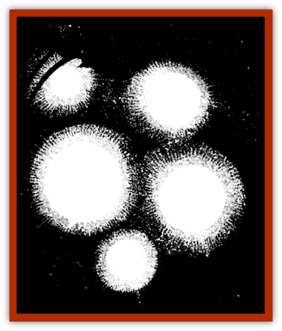

# Will O'Mist

| Statistic | **Will O'Mist** |
| --- | --- |
| **Activity Cycle:** | Night |
| **Alignment:** | Chaotic neutral |
| **Armor Class:** | -6 |
| **Climate/Terrain:** | Ravenloft |
| **Damage/Attack:** | 2-16 (2d8) |
| **Diet:** | See below |
| **Frequency:** | Rare |
| **Hit Dice:** | 7 |
| **Intelligence:** | High (13-14) |
| **Magic Resistance:** | See below |
| **Morale:** | Champion (15-16) |
| **Movement:** | Fl 18 (A) |
| **No. Appearing:** | 1 |
| **No. of Attacks:** | 1 |
| **Organization:** | Solitary |
| **Size:** | S (2-4' diameter) |
| **Special Attacks:** | Electric burst |
| **Special Defenses:** | Spell immunity, invisibility |
| **THAC0:** | 13 |
| **Treasure:** | Z |
| **XP Value:** | 2,000 |

The will o'mist is a variant of the [[Will_O'Wisp|will o'wisp]] that makes its home only in the misty borders of Ravenloft. While most people have good cause to fear these creatures, the mysterious [[Human_Vistana|Vistani]] seem to have found some way of controlling them. This is an especially helpful skill when one considers the fact that a will o'mist is able to unerringly navigate the swirling vapors of Ravenloft's borders.

A will o'mist appears as a diffuse strip of radiant energy some 2 to 4 inches thick and 3 to 5 feet in length. Although normally icy blue in color, the will o'mist has been reported to range in color from golden-white to a very deep green. The will o'mist can alter its shape and size to some extent, and can easily be mistaken for a lantern, *light* spell, or similar source of illumination. If they do not attack, will o'mists are able to temporarily mask their glow, rendering them undetectable to all those who cannot sense invisible objects for 2-8 (2d4) melee rounds.

Unlike the other will o'wisp variants, the will o'mist does not seem to rely upon changes in color and intensity to communicate. However, the exact method by which they converse remains a mystery. Whatever this is, at least a few of the vistani seem to have mastered it.

**Combat:** Capable of travelling through the mysterious borders of Ravenloft unhindered, will o'mists are almost never placed in a situation requiring direct physical confrontation. Nevertheless, when combat does become necessary, they are fearsome opponents and not to be taken lightly.

Will o'mists are agile fliers who can hover in place without effort, move with sudden bursts of speed, or drift slowly, as if bobbing on the wind itself.

When in battle, will o'mists attack with a burst of electricity. Will o'mists can strike in this manner every third round, causing 2-16 (2d8) points of damage to anyone within 30' of the attacking creature. A successful saving throw vs. spell reduces this damage by half. Victims wearing metal armor have a +4 bonus to their saving throws due to the exceptional conductivity of metal and its natural grounding effects.

Physical weapons affect will o'mists normally; however, most magical attacks are useless against them. Of all known spells, only *vampiric touch* and *energy drain* work against these monsters.

**Habitat/Society:** Will o'mists are always encountered alone. Capable of manipulating the mists and gaining access even to a domain whose lord has sealed its borders, will o'mists have unparalleled freedom in the Land of the Mists.

Only the Vistani know the secret of summoning and commanding such creatures. It is unknown whether the ability to command will o'mists is inherited or whether the knowledge is passed from generation to generation. In fact, it is generally believed that this command of these creatures is what enables the Vistani to pass through the mists and travel freely through the domains of Ravenloft.

**Ecology:** As with other variants of the will o'wisp, it appears that will o'mists feed off of the electrical energy generated by human and demihuman brains. It is thought that the will o'mist in particular can only leech such energy from people when they are actually crossing the misty borders of Ravenloft. This may account for reports that some people claim to have been struck by a wave of disorientation and nausea upon stumbling out of the mists.

Since will o'mists are incapable of straying more than a few yards from the mists themselves, they must lure humans and demihumans into the mists in order to feed. It is probable that the specific energy on which will o'mists feed is the fear and disorientation felt by many travelers in the mists. It has even been theorized that such creatures are part of a bizarre network that funnels living energy into the Land, helping it to maintain itself and draw more unwitting souls across its dark borders.

---
## Discovery & Documentation

**Source Publication:** Ravenloft Appendix III (1991)
**Campaign Setting:** Ravenloft
**Author(s):** Kirk Botulla

### Other Creatures Found in This Source Book
   * [[Akikage|Akikage]]
   * [[Animator_Common|Animator, Common]]
   * [[Animator_Greater|Animator, Greater]]
   * [[Animator_Minor|Animator, Minor]]
   * [[Animator_General_Information|Animator, General Information]]
   * [[Bakhna_Rakhna|Bakhna Rakhna]]
   * [[Baobhan_Sith|Baobhan Sith]]
   * [[Beetle_Scarab|Beetle, Scarab]]
   * [[Boneless|Boneless]]
   * [[Boowray|Boowray]]
   * [[Bruja|Bruja]]
   * [[Carrionette|Carrionette]]
   * [[Carrion_Stalker|Carrion Stalker]]
   * [[Cat_Midnight|Cat, Midnight]]
   * [[Cat_Skeletal|Cat, Skeletal]]
   * [[Cloaker_Resplendent|Cloaker, Resplendent]]
   * [[Cloaker_Shadow|Cloaker, Shadow]]
   * [[Cloaker_Undead|Cloaker, Undead]]
   * [[Corpse_Candle|Corpse Candle]]
   * [[Death's_Head_Tree|Death's Head Tree]]
   * [[Doppelganger_Ravenloft|Doppelganger (Ravenloft)]]
   * [[Familiar_Pseudo-|Familiar, Pseudo-]]
   * [[Familiar_Undead|Familiar, Undead]]
   * [[Feathered_Serpent|Feathered Serpent]]
   * [[Fenhound|Fenhound]]
   * [[Figurine_Ceramic|Figurine, Ceramic]]
   * [[Figurine_Crystal|Figurine, Crystal]]
   * [[Figurine_Ivory|Figurine, Ivory]]
   * [[Figurine_Obsidian|Figurine, Obsidian]]
   * [[Figurine_Porcelain|Figurine, Porcelain]]
   * [[Figurine_General_Information|Figurine, General Information]]
   * [[Fleas_of_Madness|Fleas of Madness]]
   * [[Furies|Furies]]
   * [[Geist|Geist]]
   * [[Ghost_Animal|Ghost, Animal]]
   * [[Golem_Flesh_Ravenloft|Golem, Flesh (Ravenloft)]]
   * [[Golem_Mist_Ravenloft|Golem, Mist (Ravenloft)]]
   * [[Golem_Wax_Ravenloft|Golem, Wax (Ravenloft)]]
   * [[Gremishka|Gremishka]]
   * [[Hag_Spectral|Hag, Spectral]]
   * [[Head_Hunter|Head Hunter]]
   * [[Hearth_Fiend|Hearth Fiend]]
   * [[Hebi-No-Onna|Hebi-No-Onna]]
   * [[Hound_Phantom|Hound, Phantom]]
   * [[Hound_Skeletal|Hound, Skeletal]]
   * [[Imp_Wishing|Imp, Wishing]]
   * [[Ivy_Crawling|Ivy, Crawling]]
   * [[Jack_Frost|Jack Frost]]
   * [[Jolly_Roger|Jolly Roger]]
   * [[Kizoku|Kizoku]]
   * [[Lashweed|Lashweed]]
   * [[Leech_Magical|Leech, Magical]]
   * [[Leech_Psionic|Leech, Psionic]]
   * [[Lich_Defiler|Lich, Defiler]]
   * [[Lich_Drow|Lich, Drow]]
   * [[Lich_Elemental|Lich, Elemental]]
   * [[Lich_Psionic|Lich, Psionic]]
   * [[Living_Tattoo|Living Tattoo]]
   * [[Lycanthrope_Loup-garou|Lycanthrope, Loup-garou]]
   * [[Lycanthrope_Werejackal|Lycanthrope, Werejackal]]
   * [[Lycanthrope_Werejaguar_Ravenloft|Lycanthrope, Werejaguar (Ravenloft)]]
   * [[Lycanthrope_Wereleopard|Lycanthrope, Wereleopard]]
   * [[Lycanthrope_Wereray|Lycanthrope, Wereray]]
   * [[Mist_Ferryman|Mist Ferryman]]
   * [[Moor_Man|Moor Man]]
   * [[Obedient|Obedient]]
   * [[Odem|Odem]]
   * [[Paka|Paka]]
   * [[Plant_Blood_Rose|Plant, Blood Rose]]
   * [[Plant_Fearweed|Plant, Fearweed]]
   * [[Radiant_Spirit|Radiant Spirit]]
   * [[Recluse|Recluse]]
   * [[Remnant_Aquatic|Remnant, Aquatic]]
   * [[Rushlight|Rushlight]]
   * [[Sea_Spawn_Master|Sea Spawn, Master]]
   * [[Sea_Spawn_Minion|Sea Spawn, Minion]]
   * [[Shadow_Asp|Shadow Asp]]
   * [[Shattered_Brethren|Shattered Brethren]]
   * [[Skeleton_Archer|Skeleton, Archer]]
   * [[Skeleton_Insectoid|Skeleton, Insectoid]]
   * [[Skin_Thief|Skin Thief]]
   * [[Spirit_Psionic|Spirit, Psionic]]
   * [[Strahd_Skeleton|Strahd Skeleton]]
   * [[Strahd_Zombie|Strahd Zombie]]
   * [[Unicorn_Shadow|Unicorn, Shadow]]
   * [[Vampire_Drow|Vampire, Drow]]
   * [[Vampire_Nosferatu|Vampire, Nosferatu]]
   * [[Vampire_Oriental|Vampire, Oriental]]
   * [[Virus_General_Information|Virus, General Information]]
   * [[Virus_I|Virus I]]
   * [[Virus_II|Virus II]]
   * [[Virus_III|Virus III]]
   * [[Vorlog|Vorlog]]
   * [[Will_O'Dawn|Will O'Dawn]]
   * [[Will_O'Deep|Will O'Deep]]
   * [[Will_O'Sea|Will O'Sea]]
   * [[Zombie_Cannibal|Zombie, Cannibal]]
   * [[Zombie_Desert|Zombie, Desert]]
   * [[Zombie_Wolf|Zombie Wolf]]
   * [[Zombie_Fog|Zombie Fog]]
