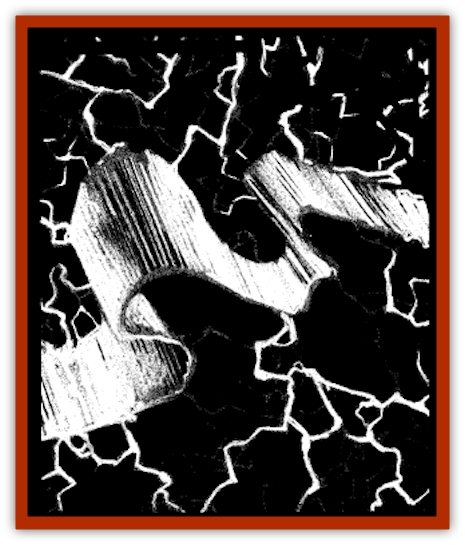

# Will O'Sea

| Statistic | **Will O'Sea** |
| --- | --- |
| **Activity Cycle:** | Night |
| **Alignment:** | Neutral evil |
| **Armor Class:** | -4 |
| **Climate/Terrain:** | Sea of Sorrows |
| **Damage/Attack:** | 10-60 (10d6) |
| **Diet:** | See below |
| **Frequency:** | Rare |
| **Hit Dice:** | 10 |
| **Intelligence:** | Very (11-12) |
| **Magic Resistance:** | Nil |
| **Morale:** | Fanatic (17-18) |
| **Movement:** | Fl 18 (A) |
| **No. Appearing:** | 1 |
| **No. of Attacks:** | 1 |
| **Organization:** | Solitary |
| **Size:** | H (12-20' long) |
| **Special Attacks:** | <i>Lightning bolt</i> |
| **Special Defenses:** | Spell immunity |
| **THAC0:** | 11 |
| **Treasure:** | E |
| **XP Value:** | 6,000 |

The will o'sea is a variant of the [[Will_O'Wisp|will o'wisp]] that makes its home on and around the seas of Ravenloft. Even more dangerous than its better known cousins, the will o'sea lures sailors to watery graves.

As beautiful as it is deadly, the will o'sea generally appears as a long, shifting cascade of glowing energy. The will o'sea is often almost indistinguishable from St. Elmo's fire, matching even the luxuriant displays of color of that mystifying phenomenon. The largest of all the will o'wisp variants, the will o'sea can alter its size and shape somewhat. These creatures have shown themselves to be adept at mimicking the shape of a ship or lighthouse. The will o'sea, unlike the will o'wisp. is unable to turn invisible, but can dampen its glow somewhat.

The will o'sea communicates with a combination of visual elements and electrical snaps, clicks, and hums. Some aged seafarers tell stories of aquatic folk who can understand this unusual dialect, but few reliable examples of this can be cited.

**Combat:** More aggressive than other forms of will o'wisp, the will o'sea often attempts to lure ships of all kinds into dangerous waters where they are likely to become beached or sink. The will o'sea is an extremely agile flier, capable of maneuvers ranging from hovering in place to sudden, wildly jerking flight patterns, an ability it uses well when taunting victims.

Normally, the will o'sea will not waste its energies attacking directly if it can trick its victims into crashing their ship onto rocks or an underwater reef. Appearing at dusk or in the evening, the will o'sea uses a variety of tactics to lure its intended victims into treacherous waters. One of its most common ploys is to form itself into the shape of a burning ship and then hover on top of some sharp boulders or other hazard in the hopes its intended prey will investigate. This tactic works particularly well during storms when visibility is reduced. The will o'sea may also lie beneath the surface of seaweed infested waders, attempting to lure sailors with its shimmering appearance hinting of sunken treasures.

If it appears as if the inhabitants of a vessel are going to escape with their lives, the will o'sea will take a more direct approach, using its vast energies to attack with a powerful *lightning bolt*. The evil entity can release such a stroke once every three rounds. The bolt does 10-60 (10d6) points of damage and has a 50% chance of setting wooden vessels alight if a saving throw vs. lightning fails.

Physical weapons affect the will o'sea normally; however, most magical attacks are useless against the creature. Of all spells, only the *ice storm* and *cone of cold* spells work against this monster.

**Habitat/Society:** A will o'sea is always encountered alone. These creatures make their homes along almost any rough coastline, but avoid arctic waters in favor of the brilliant blue of a tropical sea. Such a creature almost always dwells amid one or more of the shipwrecks it has caused, being just as comfortable above as below the water. The will o'sea will not, however, use its lightning attack while submerged.

Will o'seas are normally found just off common sea routes, so that they can more easily find sailors to lure to their untimely ends. Whenever hunting becomes scarce, will o'seas will simply move to a more viable hunting ground.

**Ecology:** As with other will o'wisp variants, the will o'sea seems to feed off the electrical energy generated by human and demihuman brains. The horrified, scrambling panic of a drowning victim seems to be particularly satisfying as the creature will often go out of its way to sink a ship while itself killing as few people as possible. The will o'sea then hovers over the struggling sailors, foiling any attempts its victims make to reach land.

[[Ghost|Ghosts]] and [[Zombie_Sea|sea zombies]] are particularly common in the hunting grounds of a will o'sea. There have been reports of both individual spirits and entire ghost ships wandering the waters near a will o'sea's lair. The will o'sea is unaffected by such spirits, unless they keep other sailors from entering the area.

---
## Discovery & Documentation

**Source Publication:** Ravenloft Appendix III (1991)
**Campaign Setting:** Ravenloft
**Author(s):** Kirk Botulla

### Other Creatures Found in This Source Book
   * [[Akikage|Akikage]]
   * [[Animator_Common|Animator, Common]]
   * [[Animator_Greater|Animator, Greater]]
   * [[Animator_Minor|Animator, Minor]]
   * [[Animator_General_Information|Animator, General Information]]
   * [[Bakhna_Rakhna|Bakhna Rakhna]]
   * [[Baobhan_Sith|Baobhan Sith]]
   * [[Beetle_Scarab|Beetle, Scarab]]
   * [[Boneless|Boneless]]
   * [[Boowray|Boowray]]
   * [[Bruja|Bruja]]
   * [[Carrionette|Carrionette]]
   * [[Carrion_Stalker|Carrion Stalker]]
   * [[Cat_Midnight|Cat, Midnight]]
   * [[Cat_Skeletal|Cat, Skeletal]]
   * [[Cloaker_Resplendent|Cloaker, Resplendent]]
   * [[Cloaker_Shadow|Cloaker, Shadow]]
   * [[Cloaker_Undead|Cloaker, Undead]]
   * [[Corpse_Candle|Corpse Candle]]
   * [[Death's_Head_Tree|Death's Head Tree]]
   * [[Doppelganger_Ravenloft|Doppelganger (Ravenloft)]]
   * [[Familiar_Pseudo-|Familiar, Pseudo-]]
   * [[Familiar_Undead|Familiar, Undead]]
   * [[Feathered_Serpent|Feathered Serpent]]
   * [[Fenhound|Fenhound]]
   * [[Figurine_Ceramic|Figurine, Ceramic]]
   * [[Figurine_Crystal|Figurine, Crystal]]
   * [[Figurine_Ivory|Figurine, Ivory]]
   * [[Figurine_Obsidian|Figurine, Obsidian]]
   * [[Figurine_Porcelain|Figurine, Porcelain]]
   * [[Figurine_General_Information|Figurine, General Information]]
   * [[Fleas_of_Madness|Fleas of Madness]]
   * [[Furies|Furies]]
   * [[Geist|Geist]]
   * [[Ghost_Animal|Ghost, Animal]]
   * [[Golem_Flesh_Ravenloft|Golem, Flesh (Ravenloft)]]
   * [[Golem_Mist_Ravenloft|Golem, Mist (Ravenloft)]]
   * [[Golem_Wax_Ravenloft|Golem, Wax (Ravenloft)]]
   * [[Gremishka|Gremishka]]
   * [[Hag_Spectral|Hag, Spectral]]
   * [[Head_Hunter|Head Hunter]]
   * [[Hearth_Fiend|Hearth Fiend]]
   * [[Hebi-No-Onna|Hebi-No-Onna]]
   * [[Hound_Phantom|Hound, Phantom]]
   * [[Hound_Skeletal|Hound, Skeletal]]
   * [[Imp_Wishing|Imp, Wishing]]
   * [[Ivy_Crawling|Ivy, Crawling]]
   * [[Jack_Frost|Jack Frost]]
   * [[Jolly_Roger|Jolly Roger]]
   * [[Kizoku|Kizoku]]
   * [[Lashweed|Lashweed]]
   * [[Leech_Magical|Leech, Magical]]
   * [[Leech_Psionic|Leech, Psionic]]
   * [[Lich_Defiler|Lich, Defiler]]
   * [[Lich_Drow|Lich, Drow]]
   * [[Lich_Elemental|Lich, Elemental]]
   * [[Lich_Psionic|Lich, Psionic]]
   * [[Living_Tattoo|Living Tattoo]]
   * [[Lycanthrope_Loup-garou|Lycanthrope, Loup-garou]]
   * [[Lycanthrope_Werejackal|Lycanthrope, Werejackal]]
   * [[Lycanthrope_Werejaguar_Ravenloft|Lycanthrope, Werejaguar (Ravenloft)]]
   * [[Lycanthrope_Wereleopard|Lycanthrope, Wereleopard]]
   * [[Lycanthrope_Wereray|Lycanthrope, Wereray]]
   * [[Mist_Ferryman|Mist Ferryman]]
   * [[Moor_Man|Moor Man]]
   * [[Obedient|Obedient]]
   * [[Odem|Odem]]
   * [[Paka|Paka]]
   * [[Plant_Blood_Rose|Plant, Blood Rose]]
   * [[Plant_Fearweed|Plant, Fearweed]]
   * [[Radiant_Spirit|Radiant Spirit]]
   * [[Recluse|Recluse]]
   * [[Remnant_Aquatic|Remnant, Aquatic]]
   * [[Rushlight|Rushlight]]
   * [[Sea_Spawn_Master|Sea Spawn, Master]]
   * [[Sea_Spawn_Minion|Sea Spawn, Minion]]
   * [[Shadow_Asp|Shadow Asp]]
   * [[Shattered_Brethren|Shattered Brethren]]
   * [[Skeleton_Archer|Skeleton, Archer]]
   * [[Skeleton_Insectoid|Skeleton, Insectoid]]
   * [[Skin_Thief|Skin Thief]]
   * [[Spirit_Psionic|Spirit, Psionic]]
   * [[Strahd_Skeleton|Strahd Skeleton]]
   * [[Strahd_Zombie|Strahd Zombie]]
   * [[Unicorn_Shadow|Unicorn, Shadow]]
   * [[Vampire_Drow|Vampire, Drow]]
   * [[Vampire_Nosferatu|Vampire, Nosferatu]]
   * [[Vampire_Oriental|Vampire, Oriental]]
   * [[Virus_General_Information|Virus, General Information]]
   * [[Virus_I|Virus I]]
   * [[Virus_II|Virus II]]
   * [[Virus_III|Virus III]]
   * [[Vorlog|Vorlog]]
   * [[Will_O'Dawn|Will O'Dawn]]
   * [[Will_O'Deep|Will O'Deep]]
   * [[Will_O'Mist|Will O'Mist]]
   * [[Zombie_Cannibal|Zombie, Cannibal]]
   * [[Zombie_Desert|Zombie, Desert]]
   * [[Zombie_Wolf|Zombie Wolf]]
   * [[Zombie_Fog|Zombie Fog]]
