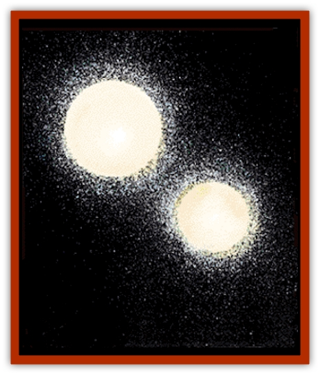
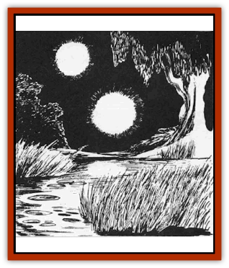

# Will O'Wisp

| Statistic | **Will O'Wisp** |
| --- | --- |
| **Activity Cycle:** | Night |
| **Alignment:** | Chaotic evil |
| **Armor Class:** | -8 |
| **Climate/Terrain:** | Any swamp |
| **Damage/Attack:** | 2-16 |
| **Diet:** | See below |
| **Frequency:** | Uncommon |
| **Hit Dice:** | 9 |
| **Intelligence:** | Exceptional (15-16) |
| **Magic Resistance:** | See below |
| **Morale:** | Fanatic (17) |
| **Movement:** | Fl 18 (A) |
| **No. Appearing:** | 1 or 1-3 |
| **No. of Attacks:** | 1 |
| **Organization:** | Solitary |
| **Size:** | S (2-4') |
| **Special Attacks:** | See below |
| **Special Defenses:** | See below |
| **THAC0:** | 11 |
| **Treasure:** | Z |
| **XP Value:** | 3,000 |

The will o'wisp is a malevolent entity that makes its home in swamps, bogs, and moors. It subsists by luring unsuspecting creatures to their deaths amid the natural hazards of such places and feeding on the energies which their death struggles release.

When encountered in the wild, will o'wisps normally appear as faintly glowing balls of light. They can alter their own color, shape, and size to some extent and can be easily mistaken for lanterns, *light* spells, and similar sources of artificial illumination.

If they do not attack, will o'wisps are able to utterly blank out their glows, rendering them invisible to all those who cannot spot invisible objects, for 2-8 melee rounds.

The will o'wisp language is a most unusual one, being purely optical in nature. All communication between will o'wisps is by means of changes in color or brightness, many of which are far too subtle for the average observer to notice. Because this form of exchange is almost impossible to mimic, it is very difficult for travelers to communicate with these creatures. Exceptional examples of this race have mastered a very simple sound-based language. They produce sounds by vibrating very rapidly and thus have a shallow and ghostly-sounding voice when they "speak".

**Combat:** As a rule, will o'wisps seek to avoid physical combat with other creatures, preferring to lead them to their deaths in the swamps around them instead. When pressed, however, they are dangerous adversaries who must be attacked with the greatest care. In combat, they glow blue, violet, or pale green.

Will o'wisps are very versatile flyers. They can hover in place without effort, often looking like lanterns or similar beacons to lure others toward them. When they decide to move, they can do so with rapid bursts of speed or slow drifting movements.

A will o'wisp's main weapon in combat is its ability to manifest a powerful electric charge. In melee, it swoops at its foe and attempts to brush against the victim, discharging the stored energy. A successful strike by one of these creatures will cause 2-16 points of damage.

Those attacking a will o'wisp with any form of physical weapon are able to inflict damage normally. Persons making use of magical attacks, however, will find their powers almost ineffective against them. As a rule, the only spells which have any effect on the will o'wisp are *protection from evil*, *magic missile*, and *maze*. A will o'wisp which is reduced to 5 or fewer hit points will attempt to escape. If it is unable to flee, the creature will surrender to its attackers and attempt to buy its safety by offering up any treasure which it may have. It is important to note, however, that the chaotic alignment of the will o'wisp can make any agreement with the creature uncertain.

**Habitat/Society:** For the most part, will o'wisps will be found on their own. On rare occasions (10% of the time) groups of up to three may be found near a particularly fertile hunting ground. In the latter case, they will work together to trick victims into the traps which they have arranged.

**Ecology:** Although difficult to say with certainty, evidence indicates that the will o'wisp feeds on the fury of electrical activity given off by the brains of panic stricken individuals as they realize that death is inescapable. In order to prolong the suffering of their victims and increase the amount of "food" which they give off, will o'wisps will typically lure their victims into areas like quicksand pits which promise a slow and frightening death.

It seems certain that the unusual environment found in bogs and swamps is important to the creature's existence in some way, but the exact nature of this link is uncertain. It seems probable that the ominous and haunting nature of these places increases the fear and dread which their victims feel, and thus the energy which they give off prior to death.

---
## Discovery & Documentation

**Source Publication:** MC1 Volume I (w/binder #1) (1991)
**Campaign Setting:** Advanced Dungeons & Dragons 2nd Edition
**Author(s):** Jay Batista, Scott Bennie, Grant Boucher, William W. Connors, Steve Gilbert, Heike Kubasch, James Lowder, David Edward Martin, Bruce Nesmith, Jean Rabe, Rick Swan, John J. Terra, Gary L. Thomas

### Other Creatures Found in This Source Book
   * [[Bat|Bat]]
   * [[Bear|Bear]]
   * [[Behir|Behir]]
   * [[Boar|Boar]]
   * [[Bookworm|Bookworm]]
   * [[Brownie|Brownie]]
   * [[Bugbear|Bugbear]]
   * [[Carrion_Crawler|Carrion Crawler]]
   * [[Cat_Great|Cat, Great]]
   * [[Catoblepas|Catoblepas]]
   * [[Dragon_General_Information|Dragon, General Information]]
   * [[Dragonfish|Dragonfish]]
   * [[Elemental_Air_Kin_Aerial_Servant|Elemental, Air Kin, Aerial Servant]]
   * [[Elemental_Earth_Kin_Sandling|Elemental, Earth Kin, Sandling]]
   * [[Elephant|Elephant]]
   * [[Gnoll|Gnoll]]
   * [[Hobgoblin|Hobgoblin]]
   * [[Homunculus|Homunculus]]
   * [[Hornet_Giant|Hornet, Giant]]
   * [[Horse|Horse]]
   * [[Hyena|Hyena]]
   * [[Jackal|Jackal]]
   * [[Jackalwere|Jackalwere]]
   * [[Korred|Korred]]
   * [[Lich|Lich]]
   * [[Lizard|Lizard]]
   * [[Lizard_Man|Lizard Man]]
   * [[Lycanthrope_General_Information|Lycanthrope, General Information]]
   * [[Lycanthrope_Seawolf|Lycanthrope, Seawolf]]
   * [[Lycanthrope_Werebear|Lycanthrope, Werebear]]
   * [[Lycanthrope_Weretiger|Lycanthrope, Weretiger]]
   * [[Lycanthrope_Werewolf|Lycanthrope, Werewolf]]
   * [[Manticore|Manticore]]
   * [[Medusa|Medusa]]
   * [[Mind_Flayer|Mind Flayer]]
   * [[Minotaur|Minotaur]]
   * [[Mudman|Mudman]]
   * [[Mummy|Mummy]]
   * [[Nixie|Nixie]]
   * [[Nymph|Nymph]]
   * [[Ogre|Ogre]]
   * [[Ooze_Slime_Jelly_I|Ooze/Slime/Jelly I]]
   * [[Ooze_Slime_Jelly_II|Ooze/Slime/Jelly II]]
   * [[Orc|Orc]]
   * [[Owl|Owl]]
   * [[Owlbear_I|Owlbear I]]
   * [[Pegasus|Pegasus]]
   * [[Piercer|Piercer]]
   * [[Pudding_Deadly|Pudding, Deadly]]
   * [[Rakshasa|Rakshasa]]
   * [[Rat|Rat]]
   * [[Ray|Ray]]
   * [[Remorhaz|Remorhaz]]
   * [[Satyr|Satyr]]
   * [[Scorpion|Scorpion]]
   * [[Selkie|Selkie]]
   * [[Shadow|Shadow]]
   * [[Skeleton|Skeleton]]
   * [[Skunk|Skunk]]
   * [[Snake|Snake]]
   * [[Spectre|Spectre]]
   * [[Spider|Spider]]
   * [[Sprite|Sprite]]
   * [[Toad_Giant|Toad, Giant]]
   * [[Treant|Treant]]
   * [[Troll|Troll]]
   * [[Umber_Hulk|Umber Hulk]]
   * [[Unicorn|Unicorn]]
   * [[Vampire|Vampire]]
   * [[Wight|Wight]]
   * [[Wolf|Wolf]]
   * [[Wolfwere|Wolfwere]]
   * [[Wraith|Wraith]]
   * [[Wyvern|Wyvern]]
   * [[Yeti|Yeti]]
   * [[Yuan-ti|Yuan-ti]]
   * [[Zombie|Zombie]]
