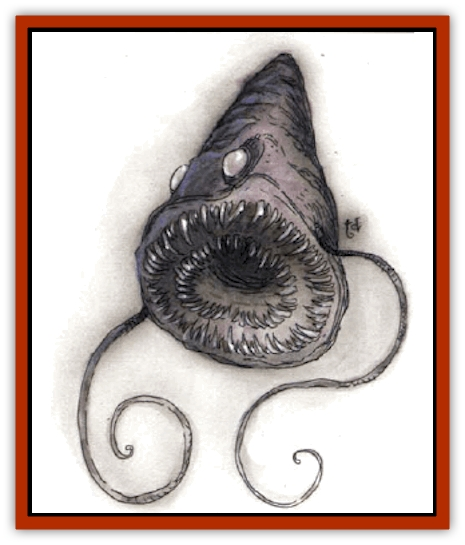

# Windghost

| Statistic | **Windghost** |
| --- | --- |
| **Activity Cycle:** | Any |
| **Alignment:** | Lawful neutral |
| **Armor Class:** | -2 |
| **Climate/Terrain:** | Any (airborne) |
| **Damage/Attack:** | 3d4 |
| **Diet:** | Omnivore |
| **Frequency:** | Very rare |
| **Hit Dice:** | 9+9 |
| **Intelligence:** | Exceptional (15-16) |
| **Magic Resistance:** | 45% |
| **Morale:** | Fearless (19-20) |
| **Movement:** | Fl 18 (B) |
| **No. Appearing:** | 1d12 |
| **No. of Attacks:** | 1 + special |
| **Organization:** | Servant group |
| **Size:** | H (conical 8' diameter, tapering to 24' long) |
| **Special Attacks:** | <i>Windsong</i>, swoop, swallow whole |
| **Special Defenses:** | <i>Warp dweomer</i> |
| **THAC0:** | 11 |
| **Treasure:** | Nil |
| **XP Value:** | 12,000 |

Windghosts may be native to another plane. They are flying cones, the large base (their head) foremost. A windghost has a rough, mottled, flexible, smoky-gray to purple body, white pupil-less eyes (120-foot infravision and vision into the Astral and Ethereal Planes), and a many-fanged mouth. It has two retractable 4- to 20-foot tentacle-arms on either side of its mouth; these carry items or hold prey, inflicting no damage.

Windghosts speak in hissing, rumbling, birdlike voices, and know the Common tongue. They can make their eyes and bodies glow with a faerie fire radiance; this effect, seen by night, has given them their name.

**Combat:** Windghosts fight by swooping out of the sky to gobble up foes. Against nonflying foes, the force of their swoop increases their bite damage by 1d4+1 hp. Once engaged, a windghost can't swoop again until it has broken off attack and climbed aloft for one round. If a swoop attack roll on an M-sized or smaller creature is 19 or 20, the windghost swallows its prey whole. Swallowed prey is whirled about in corrosive fluids for 2d6 damage and then spat out; all possessions must save vs. acid. The prey must make Strength, Dexterity, and Intelligence checks. If the Intelligence check fails, the prey is blinded for 1d6+1 rounds and can't attack until spat out. If all three checks succeed and the prey has a weapon ready when ingested, it gets one maximum-damage attack while inside.

When two or more windghosts are within 90 feet of each other, they can emit harmonizing drones known as *windsong*, which makes reading, spellcasting, and even hearing normal speech impossible. *Windsong* takes effect 1-2 rounds after it is begun and lasts 1d8 rounds before it must be broken off for at least 1d4+3 rounds.

Windghosts are immune to mind-reading or affecting magic, and resistant to psionic probes and attacks. (Apply their magic resistance against all attempts; any saving throws still apply.)

A windghost's most dangerous ability is the *warp dweomer*, or "magic shift". It can move magic-dead areas to envelop itself or enemy spellcasters, or it can throw out a field that intercepts incoming dweomers and moves their areas of effect before they are manifested - a wizard casting *fireball* at a windghost may find it takes effect around himself. This ability works against only one magical attack per round, but the windghost can choose which magic to intercept and what to do with it. A surprise attack won't be intercepted unless the windghost is alert. It can let beneficial magic through, but its magic resistance is involuntary, and must still be overcome.

When a windghost chooses to *warp dweomer*, roll 1d12. On a roll of 3 or less, it fails to affect the magic. On a roll of 4-6, it is unable to seize control and redirect it, so it deflects it in a random direction. To find distance, roll 4d20 and consider the total to be feet. On a roll of 7 or greater, the windghost has control and can put the magic where it desires, so long as the chosen spot is within a range of 144 feet. Relocated magic has full effects; if the source has magical protections that reflect magic, the magic jumps back to where the caster first aimed it.

Windghosts regenerate 1 hp/turn. Their nature protects them against attacks that involve whirling winds; against such spells and all air elemental attacks, they suffer only half damage. A *wind wall* spell is no barrier to a windghost.

**Habitat/Society:** Windghosts seem both bisexual and long-lived. They enjoy drifting along, watching life and beauty below. They neither have nor value treasure.

**Ecology:** Windghosts have no known natural enemies. They eat creatures they slay, but do not attack for food. They also consume carrion and whole leafy plants, "drink" by immersing themselves in water, and absorb heat by basking in the sun.

---
## Discovery & Documentation

**Source Publication:** Monstrous Compendium, 1994 Annual, Volume 1 (1995)
**Campaign Setting:** Advanced Dungeons & Dragons 2nd Edition
**Author(s):** David Wise

### Other Creatures Found in This Source Book
   * [[Abyss_Ant|Abyss Ant]]
   * [[Achaierai|Achaierai]]
   * [[Afanc|Afanc]]
   * [[Al-Jahar|Al-Jahar]]
   * [[Baelnorn|Baelnorn]]
   * [[Baneguard|Baneguard]]
   * [[Banelar|Banelar]]
   * [[Bird_Talking|Bird, Talking]]
   * [[Blazing_Bones|Blazing Bones]]
   * [[Campestri|Campestri]]
   * [[Caniquine|Caniquine]]
   * [[Cat_Winged|Cat, Winged]]
   * [[Crypt_Servant|Crypt Servant]]
   * [[Death's_Head_Tree|Death's Head Tree]]
   * [[Dog_Saluqi|Dog, Saluqi]]
   * [[Dragon_Electrum|Dragon, Electrum]]
   * [[Dragon_Fang|Dragon, Fang]]
   * [[Dragon_Linnorm_Corpse_Tearer|Dragon, Linnorm, Corpse Tearer]]
   * [[Dragon_Linnorm_Dread|Dragon, Linnorm, Dread]]
   * [[Dragon_Linnorm_Flame|Dragon, Linnorm, Flame]]
   * [[Dragon_Linnorm_Forest|Dragon, Linnorm, Forest]]
   * [[Dragon_Linnorm_Frost|Dragon, Linnorm, Frost]]
   * [[Dragon_Linnorm_Gray|Dragon, Linnorm, Gray]]
   * [[Dragon_Linnorm_Land|Dragon, Linnorm, Land]]
   * [[Dragon_Linnorm_Midgard|Dragon, Linnorm, Midgard]]
   * [[Dragon_Linnorm_Rain|Dragon, Linnorm, Rain]]
   * [[Dragon_Linnorm_Sea|Dragon, Linnorm, Sea]]
   * [[Dragon_Neutral_Jacinth|Dragon, Neutral, Jacinth]]
   * [[Dragon_Neutral_Jade|Dragon, Neutral, Jade]]
   * [[Dragon_Neutral_Pearl|Dragon, Neutral, Pearl]]
   * [[Dread|Dread]]
   * [[Dragon-kin|Dragon-kin]]
   * [[Elemental_Earth_Kin_Chrysmal|Elemental, Earth Kin, Chrysmal]]
   * [[Elemental_Earth_Kin_Earth_Weird|Elemental, Earth Kin, Earth Weird]]
   * [[Elemental_Fire_Kin_Azer|Elemental, Fire Kin, Azer]]
   * [[Elemental_Sandman|Elemental, Sandman]]
   * [[Elemental_Wind_Walker|Elemental, Wind Walker]]
   * [[Elemental_Vermin|Elemental Vermin]]
   * [[Feystag|Feystag]]
   * [[Flame_Skull|Flame Skull]]
   * [[Foulwing|Foulwing]]
   * [[Gambado|Gambado]]
   * [[Garbug|Garbug]]
   * [[Genie_Tasked_Administrator|Genie, Tasked, Administrator]]
   * [[Genie_Tasked_Deceiver|Genie, Tasked, Deceiver]]
   * [[Genie_Tasked_Harim_Servant|Genie, Tasked, Harim Servant]]
   * [[Genie_Tasked_Messenger|Genie, Tasked, Messenger]]
   * [[Genie_Tasked_Miner|Genie, Tasked, Miner]]
   * [[Genie_Tasked_Oathbinder|Genie, Tasked, Oathbinder]]
   * [[Gibbering_Mouther|Gibbering Mouther]]
   * [[Gnasher|Gnasher]]
   * [[Gnasher_Winged|Gnasher, Winged]]
   * [[Golem_Brain|Golem, Brain]]
   * [[Golem_Hammer|Golem, Hammer]]
   * [[Golem_Metagolem|Golem, Metagolem]]
   * [[Golem_Spiderstone|Golem, Spiderstone]]
   * [[Gorynych|Gorynych]]
   * [[Greelox|Greelox]]
   * [[Helmed_Horror|Helmed Horror]]
   * [[Jarbo|Jarbo]]
   * [[Laraken|Laraken]]
   * [[Lich_Psionic|Lich, Psionic]]
   * [[Living_Steel|Living Steel]]
   * [[Lock_Lurker|Lock Lurker]]
   * [[Loxo|Loxo]]
   * [[Lycanthrope_Loup_de_Noir|Lycanthrope, Loup de Noir]]
   * [[Lycanthrope_Werebadger|Lycanthrope, Werebadger]]
   * [[Lycanthrope_Werejaguar|Lycanthrope, Werejaguar]]
   * [[Lythlyx|Lythlyx]]
   * [[Magebane|Magebane]]
   * [[Marrashi|Marrashi]]
   * [[Metalmaster|Metalmaster]]
   * [[Mimic_House_Hunter|Mimic, House Hunter]]
   * [[Naga_Bone|Naga, Bone]]
   * [[Nautilus_Giant|Nautilus, Giant]]
   * [[Nightshade_Toril|Nightshade (Toril)]]
   * [[Nishruu|Nishruu]]
   * [[Noran|Noran]]
   * [[Opinicus|Opinicus]]
   * [[Ormyrr|Ormyrr]]
   * [[Parasite|Parasite]]
   * [[Pasari-Niml|Pasari-Niml]]
   * [[Plant_Vampire_Moss|Plant, Vampire Moss]]
   * [[Pteraman|Pteraman]]
   * [[Rautym|Rautym]]
   * [[Shadeling|Shadeling]]
   * [[Skum|Skum]]
   * [[Snake_Giant_Cobra|Snake, Giant Cobra]]
   * [[Snake_Stone|Snake, Stone]]
   * [[Spectral_Wizard|Spectral Wizard]]
   * [[Spell_Weaver|Spell Weaver]]
   * [[Spider_Brain|Spider, Brain]]
   * [[Suwyze|Suwyze]]
   * [[Tatalla|Tatalla]]
   * [[Tick_Heart|Tick, Heart]]
   * [[Tree_Dark|Tree, Dark]]
   * [[Tree_Singing|Tree, Singing]]
   * [[Tressym|Tressym]]
   * [[Troll_Snow|Troll, Snow]]
   * [[Tuyewera|Tuyewera]]
   * [[Ulitharid|Ulitharid]]
   * [[Undead_Dwarf|Undead Dwarf]]
   * [[Undead_Lake_Monster|Undead Lake Monster]]
   * [[Whipsting|Whipsting]]
   * [[Wolf_Dread|Wolf, Dread]]
   * [[Wolf_Stone|Wolf, Stone]]
   * [[Wolf_Vampiric|Wolf, Vampiric]]
   * [[Wraith_Shimmering|Wraith, Shimmering]]
   * [[Xantravar|Xantravar]]
   * [[Xaver|Xaver]]
