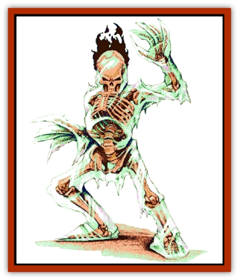

# Winter-Wight

| Statistic | **Winter-Wight** |
| --- | --- |
| **Activity Cycle:** | Any |
| **Alignment:** | Chaotic evil |
| **Armor Class:** | 0 |
| **Climate/Terrain:** | City of Moil |
| **Damage/Attack:** | 5d4/5d4 (claw/claw) |
| **Diet:** | None |
| **Frequency:** | Uncommon |
| **Hit Dice:** | 16 |
| **Intelligence:** | Average (8-10) |
| **Magic Resistance:** | 30% |
| **Morale:** | Fearless (20) |
| **Movement:** | 9 |
| **No. Appearing:** | 1 |
| **No. of Attacks:** | 2 |
| **Organization:** | Solitary |
| **Size:** | M (6' tall) |
| **Special Attacks:** | Blackfire |
| **Special Defenses:** | Regeneration, half damage from physical attacks |
| **THAC0:** | 5 |
| **Treasure:** | Nil |
| **XP Value:** | 14,000 |

Winter-[[Wight|wights]] are undead creatures of tremendous power. They appear as humanoid skeletons shethed in thick casings of clear ice, save for their skulls. When provoked, their skulls ignite with coronas of black flame. The ice acts as frigid "flesh" for the creatures, and huge shards of jagged ice act like claws. Despite the ice, these creatures can move normally, flexing their icy limbs as if unhindered by their frozen shells.

**Combat:** A winter-wight's razor-sharp ice claws allow the creature two attacks a round for 5d4 points of damage with each swipe.

While a winter-wight's physical attacks are not to be ignored, the real threat this creature possesses is that its touch causes *blackfire*. In the same way that a conventional fire burns and propagates by consuming combustible fuel, *blackfire* burns on the fuel of a living being's life force. Those touched in combat are engulfed in cold flames the color of midnight. The afflicted character must immediately make a check to determine what happens. On a roll of 11 or more on 1d20, the character suffers no damage that round, and the *blackfire* burns lower; the target's hit point adjustment from Constitution applies as a bonus or penalty to the roll (all characters can claim the warrior adjustment for purposes of the roll). If three successful checks are made in three successive rounds, the *blackfire* gutters out. If the check fails, the target temporarily loses 1d2 points of Constitution, losing any associated hit points and special abilities. Each round that the *blackfire* burns on the victim's life force, another check must be made. If the creature's Constitution score reaches 0, it dies. Those killed by *blackfire* are irretrievably consumed. Nothing but a blackened, crumbling skeleton clad in undamaged clothes remains of the victim. Not even a *wish* can restore them.

If any other living being comes within 2 feet of a victim engulfed in *blackfire*, that being must make a successful saving throw vs. death magic or face the same effects described above.

*Blackfire* cannot be smothered by conventional means. However, *blackfire* will not burn in an *anti-magic shell* or on a being protected by a *negative plane protection* spell, and it can be blown out by the force of a *fireball*, *lightning bolt*, or similar energetic spell (the victim suffers damage from these normally) of at least 8 dice. Those who survive *blackfire* recover lost Constitution at the rate of one point per hour.

Winter-wights can sublimate moisture from the air to repair damage to their icy flesh, regenerating 1d19+3 hit points a round. If these creatures are brought to -10 hit points or below, they cease to regenerate. The enchanted nature of their physical forms allows them to take only half damage from physical attacks, however fire and heat attacks cause double damage.

Winter-wights are turned as special undead. They are immune to *charm*, *hold*, *sleep*, cold, poison, and death magic.

**Habitat/Society:** Acererak created winter-wights in his quest for knowledge and power. Because these undead could potentially burn away the life of a foe with but a touch, Acererak initially felt that he had reached the pinnacle of undead manifestation. However, the evil lord soon realized that these creatures were too corporeal for his hidden purposes. The winter-wights he had created he placed within the City That Waits and within his own lair to act as sentries.

**Ecology:** Acererak creates winter-wights from lower forms of undead in a special process. This process involves the immersion of the undead in a bath of amplified radiation from the Negative Energy Plane, in conjunction with powerful rites of binding and animation.

---
## Discovery & Documentation

**Source Publication:** Return to the Tomb of Horrors (1998)
**Campaign Setting:** Greyhawk
**Author(s):** Bruce R. Cordell, Gary Gygax

### Other Creatures Found in This Source Book
   * [[Bone_Weird|Bone Weird]]
   * [[Elemental_Negative_Energy|Elemental, Negative Energy]]
   * [[Fundamental_Negative|Fundamental, Negative]]
   * [[Moilian_Heart|Moilian Heart]]
   * [[Moilian_Zombie|Moilian Zombie]]
   * [[Vestige|Vestige]]
