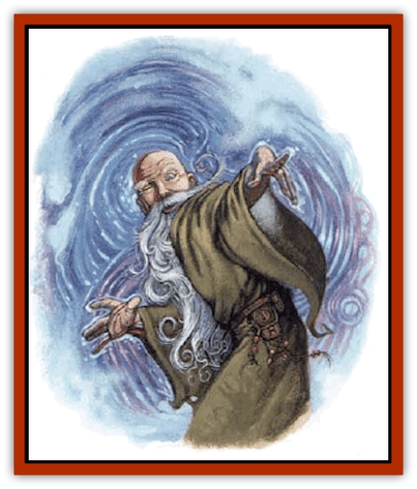
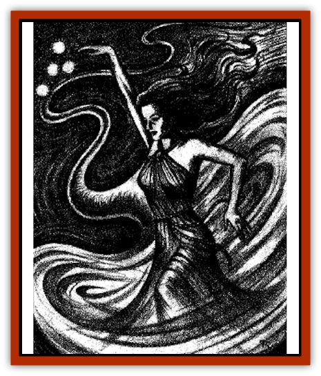
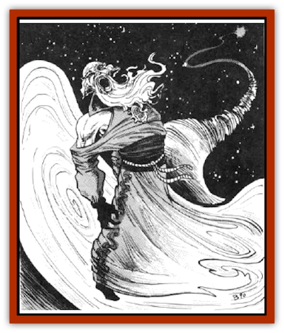

# Wizshade

| Statistic | **Wizshade** |
| --- | --- |
| **Activity Cycle:** | Any |
| **Alignment:** | Chaotic neutral |
| **Armor Class:** | 0 |
| **Climate/Terrain:** | Any |
| **Damage/Attack:** | Nil |
| **Diet:** | Magic and phlogiston |
| **Frequency:** | Rare |
| **Hit Dice:** | 10 |
| **Intelligence:** | Supra-genius (19-20) |
| **Magic Resistance:** | 25% |
| **Morale:** | Champion (15) |
| **Movement:** | 12, Fl 24 (C) |
| **No. Appearing:** | 1 (occasionally 1d4) |
| **No. of Attacks:** | 0 |
| **Organization:** | Solitary |
| **Size:** | M (usually 5-6' tall) |
| **Special Attacks:** | Random wizard spellcasting |
| **Special Defenses:** | Immune to normal weapons; spells successfully cast at a wizshade have a special effect and do no normal damage; successful magic resistance against a spell has special results |
| **THAC0:** | 0 |
| **Treasure:** | Nil |
| **XP Value:** | 13,000 |

A wizshade (or spellshade) appears as an undulating, rushing snake of force in the air that slows and widens into a swirling, many-colored vortex about 8 feet in diameter. Out of this (ignoring gravity, such as which direction is down) rises a humanlike form in flowing robes. The form is usually bald and has a long beard, if male, or has a conical hat and long hair, if female. The hat and robes swirl into the vortex and are of the same (usually bright) color - a hue shared with the form's pupilless eyes, which blaze like flames. This form can part from the vortex, walking on air, however, to avoid capture, wizshades seldom leave their vortices.

A wizshade and its vortex are composed of mists akin to the phlogiston, and the vortex is connected to the phlogiston outside the crystal sphere of Realmspace by means of a tunnel no larger than a hair. The tunnel can be traversed by those daring to enter the vortex in order to reach the swirling phlogiston outside Realmspace. A wizshade can sink back into its vortex and depart at will, but the vortex cannot move when the shade has stepped out of it. A vortex collapses if its wizshade is destroyed, and it retreats from the Prime Material plane, taking the wizshade with it, if struck by spells that deal it more than 70 points of damage.

Wizshades are whimsical in nature and may use their spells to aid or harm those they encounter. Wizshades speak common or any other frequently encountered tongue (elvish, dwarvish, etc.) when they wish, but their utterance do not often make sense.

**Combat:** The misty bodies of wizshades offer little resistance to weapons, which pass through them without seemingly doing harm. Wizshades cannot attack physically, and they suffer no damage from physical attacks. Magical weapons deal wizshades their usual damage; all weapon and strength bonuses apply, and wizshades are considered enchanted creatures for damage purposes. However, no special weapon effects (such as vorpal or life-draining properties) function against a spellshade.

Wizhades are creatures of magic, and both do and take harm from magic. They use only wizard spells, can never cast spells on themselves, and wield all spells as instantaneous-effect magics requiring only the final somatic gestures for casting. For each round of combat, roll 1d10. The result is the level of spell the wizshade can cast. (A "10" means the DM chooses the level.) Then roll d100 to determine the spell cast. If the result is higher than the number of spells listed in the *Player's Handbook* for that level, the DM chooses a spell of the appropriate level from any relevant source. Regardless of how inappropriate the spell may be for the situation, the wizshade casts it. Spells that boost a caster's hit points or energy by taking it from a target creature *do* benefit a wizshade. Wizshades save as a 10th-level wizards or uses their own prewizshade saving throws (whichever are better, provided their prewizshade level and class are known).

Any spell or magical attack successfully cast on a wizshade does no physical damage to the wizshade, but eliminates the equivalent spell level from its use for that combat. In other words, if a *cloudkill* is successfully cast on a wizshade, it cannot cast 5th-level spells for the rest of that combat. If this spell level is rolled for wizshade use in a later combat round, the shade casts no spell that round. A spellshade checks morale at each loss of a spell level; failure means it vanishes back into its vortex and departs.

If a wizshade's magic resistance succeeds against any magical attack, it captures the attack's energy, and suffers no spell level loss. Instead, roll 1d10. If the result is a spell level previously closed to the wizshade, it regains the use of that spell level in future rounds.

**Habitat/Society:** Wizshades do not vary in powers, but they have a distinct ranking among themselves by color. Hues denote how long a particular wizshade has existed and ascend like a rainbow from violet through indigo, blue, green, yellow, orange, and red. Wizshades are whimsical, willful, chaotic creatures who seem to delight in teasing others and in spectacular displays of magic. They have no natural allies or foes, but delight especially in annoying powerful wizards, other spell-using, or psionic-using beings when they encounter them. Rumors occasionally surface of extremely rare instances of the appearance of priestly spellshades, but their sightings have never been confirmed.

**Ecology:** Wizshades never carry anything tangible; their garments are part of them. To heal, they absorb phlogiston. It is rumored the most powerful wizshades achieve life in other bodies on other planes or manage to regain their normal physical state and reappear on Toril, not having aged during their time as wizshades.

---
## Discovery & Documentation

**Source Publication:** MC7 Spelljammer Appendix I (1990)
**Campaign Setting:** Advanced Dungeons & Dragons 2nd Edition
**Author(s):** various

### Other Creatures Found in This Source Book
   * [[Aartuk|Aartuk]]
   * [[Albari|Albari]]
   * [[Ancient_Mariner|Ancient Mariner]]
   * [[Argos|Argos]]
   * [[Beholder_Abomination_Astereater|Beholder (Abomination), Astereater]]
   * [[Blazozoid|Blazozoid]]
   * [[Chattur|Chattur]]
   * [[Chevall|Chevall]]
   * [[Clockwork_Horror|Clockwork Horror]]
   * [[Colossus|Colossus]]
   * [[Delphinid|Delphinid]]
   * [[Dizantar|Dizantar]]
   * [[Dog|Dog]]
   * [[Dog_Bog_Hound|Dog, Bog Hound]]
   * [[Esthetic|Esthetic]]
   * [[Focoid|Focoid]]
   * [[Fractine|Fractine]]
   * [[Giant_Spacesea|Giant, Spacesea]]
   * [[Golem_Furnace|Golem, Furnace]]
   * [[Golem_Radiant|Golem, Radiant]]
   * [[Gravislayer|Gravislayer]]
   * [[Grommam|Grommam]]
   * [[Hadozee|Hadozee]]
   * [[Hamster_Giant_Space|Hamster, Giant Space]]
   * [[Jammer_Leech|Jammer Leech]]
   * [[Lakshu|Lakshu]]
   * [[Lumineaux|Lumineaux]]
   * [[Lutum|Lutum]]
   * [[Mimic_Space|Mimic, Space]]
   * [[Misi|Misi]]
   * [[Moon_Rogue|Moon, Rogue]]
   * [[Mortiss|Mortiss]]
   * [[Murderoid|Murderoid]]
   * [[Nay-Churr|Nay-Churr]]
   * [[Phlog-Crawler|Phlog-Crawler]]
   * [[Plasman|Plasman]]
   * [[Plasmoid_DeGleash|Plasmoid, DeGleash]]
   * [[Plasmoid_DelNoric|Plasmoid, DelNoric]]
   * [[Plasmoid_General_Information|Plasmoid, General Information]]
   * [[Plasmoid_Ontalak|Plasmoid, Ontalak]]
   * [[Puffer|Puffer]]
   * [[Q'nidar|Q'nidar]]
   * [[Rastipede|Rastipede]]
   * [[Reigar|Reigar]]
   * [[Rock_Hopper|Rock Hopper]]
   * [[Slinker|Slinker]]
   * [[Spider_Asteroid|Spider, Asteroid]]
   * [[Spiritjam|Spiritjam]]
   * [[Survivor|Survivor]]
   * [[Syllix|Syllix]]
   * [[Symbiont_Power|Symbiont, Power]]
   * [[Vine_Infinity|Vine, Infinity]]
   * [[Wiggle|Wiggle]]
   * [[Wryback|Wryback]]
   * [[Zard|Zard]]
   * [[Zodar|Zodar]]
