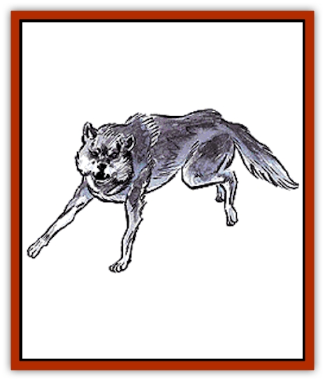

# Wolf

| Statistic | **Dire** | **Winter** | **Wolf** | **Worg** |
| --- | --- | --- | --- | --- |
| **Activity Cycle:** | Any | Any | Any | Any |
| **Alignment:** | Neutral | Neutral evil | Neutral | Neutral evil |
| **Armor Class:** | 6 | 5 | 7 | 6 |
| **Climate/Terrain:** | Any forest | Arctic | Non-tropical | Any forest |
| **Damage/Attack:** | 2-8 | 2-8 | 2-5 | 2-8 |
| **Diet:** | Carnivore | Carnivore | Carnivore | Carnivore |
| **Frequency:** | Rare | Very rare | Uncommon | Rare |
| **Hit Dice:** | 4+4 | 6 | 3 | 3+3 |
| **Intelligence:** | Semi- (2-4) | Average (8-10) | Semi- (2-4) | Low (5-7) |
| **Magic Resistance:** | Nil | Nil | Nil | Nil |
| **Morale:** | Average (10) | Elite (13) | Average (10) | Steady (11) |
| **Movement:** | 18 | 18 | 18 | 18 |
| **No. Appearing:** | 3-12 | 2-8 | 2-12 (1/1%) | 3-12 |
| **No. of Attacks:** | 1 | 1 | 1 | 1 |
| **Organization:** | Pack | Pack | Family | Pack |
| **Size:** | L (7-12') | L (7-12') | S (3-4') | M (4-7') |
| **Special Attacks:** | Nil | Frost | Nil | Nil |
| **Special Defenses:** | Nil | Nil | Nil | Nil |
| **THAC0:** | 15 | 15 | 18 | 17 |
| **Treasure:** | Nil | I | Nil | Nil |
| **XP Value:** | 175 | 975 | 65 | 120 |

The wolf is a very active, cunning carnivore, capable of surviving in nearly every climate. Shrouded in mystery and suspicion, they are viewed as vicious killers that slaughter men and animals alike for the lack of better things to do. The truth is that never in recorded history has a non-rabid or non-charmed wolf attacked any creature having an equal or higher intellect than itself. (The chance of encountering a rabid wolf that would attack anything is 1%, if a lone wolf is encountered.)

Northern wolves exhibit colors from pure white, to grey, to black. Southern wolves are reddish and brown in color. Although fur coloration vary with climate, all wolves have various features in common. They are characterized by powerful jaws; wide strong teeth; bushy tails; tall, strong ears; and round pupils. Their eyes, a gold or amber color, seem to have an almost empathic ability.

**Combat:** Wolves hunt in packs during winter and late fall when only large herbivores are available. Wolves prefer small prey over the larger variety, because of the amount of energy required to run them down. Even then, they catch only the weak and sickly animals. Wolves usually hunt only one large quarry per week, per pack, going without food for days at a time. During summer months, a single wolf can consume over 30 mice in a single day.

If a wolf or wolf pack is attacked by humans, they run away, looking back momentarily to make sure they are not being followed. If backed into an inescapable location, they will attack by tearing at clothing or legs and arms until they have an opening to escape.

**Habitat/Society:** Wolves, like humans and demi-humans, are social animals. They live, hunt and play in families. There is a very strict social structure in these family groups that is continually followed. Each pack is led by an alpha male; his mate is the alpha female. Only the alpha male and alpha female breed, but the second ranking female often helps in whelping and nursing duties.

Wolves prefer areas not inhabited by other large predators. Their domain has many terrain features in which they can play. Large rocks, fallen trees, and brooks play an important part in their recreational activities. Wolves will leave an area once humans move in.

**Ecology:** Wolves are valuable hunters in the wild. Fear of the wolf has resulted in their extinction in many areas. This genocide results in a marked increase in rodents and deer population that has nearly demolished the surrounding ecosystems.

**Dire Wolf**

The dire wolf is an ancestor of the modern species. Though larger in size, they are otherwise similar to their descendants.

**Worg**

Worgs are an offshoot of dire wolf stock that have attained a degree of intelligence and a tendency toward evil. Worgs have a primitive language and often serve as mounts of [[Goblin|goblins]].

**Winter Wolf**

The most dangerous member of the species, the winter wolf is known for its great size and foul disposition. Living only in chill regions, they can unleash a stream of frost from their lungs once every 10 rounds, causing 6d4 points of damage to everything within 10 feet. A save vs. breath weapon is allowed for half damage. Cold-based attacks to not harm the winter wolf, but fire-based attacks cause an additional point of damage, per die of damage.

Winter wolves are more intelligent than their cousins and, in addition to being able to communicate with worgs, have a fairly sophisticated language of their own.

The winter wolf is beautiful, with glistening white or silver fur and eyes of pale blue or silver. If in good condition, a pelt is worth 5,000 gold pieces.

---
## Discovery & Documentation

**Source Publication:** MC1 Volume I (w/binder #1) (1991)
**Campaign Setting:** Advanced Dungeons & Dragons 2nd Edition
**Author(s):** Jay Batista, Scott Bennie, Grant Boucher, William W. Connors, Steve Gilbert, Heike Kubasch, James Lowder, David Edward Martin, Bruce Nesmith, Jean Rabe, Rick Swan, John J. Terra, Gary L. Thomas

### Other Creatures Found in This Source Book
   * [[Bat|Bat]]
   * [[Bear|Bear]]
   * [[Behir|Behir]]
   * [[Boar|Boar]]
   * [[Bookworm|Bookworm]]
   * [[Brownie|Brownie]]
   * [[Bugbear|Bugbear]]
   * [[Carrion_Crawler|Carrion Crawler]]
   * [[Cat_Great|Cat, Great]]
   * [[Catoblepas|Catoblepas]]
   * [[Dragon_General_Information|Dragon, General Information]]
   * [[Dragonfish|Dragonfish]]
   * [[Elemental_Air_Kin_Aerial_Servant|Elemental, Air Kin, Aerial Servant]]
   * [[Elemental_Earth_Kin_Sandling|Elemental, Earth Kin, Sandling]]
   * [[Elephant|Elephant]]
   * [[Gnoll|Gnoll]]
   * [[Hobgoblin|Hobgoblin]]
   * [[Homunculus|Homunculus]]
   * [[Hornet_Giant|Hornet, Giant]]
   * [[Horse|Horse]]
   * [[Hyena|Hyena]]
   * [[Jackal|Jackal]]
   * [[Jackalwere|Jackalwere]]
   * [[Korred|Korred]]
   * [[Lich|Lich]]
   * [[Lizard|Lizard]]
   * [[Lizard_Man|Lizard Man]]
   * [[Lycanthrope_General_Information|Lycanthrope, General Information]]
   * [[Lycanthrope_Seawolf|Lycanthrope, Seawolf]]
   * [[Lycanthrope_Werebear|Lycanthrope, Werebear]]
   * [[Lycanthrope_Weretiger|Lycanthrope, Weretiger]]
   * [[Lycanthrope_Werewolf|Lycanthrope, Werewolf]]
   * [[Manticore|Manticore]]
   * [[Medusa|Medusa]]
   * [[Mind_Flayer|Mind Flayer]]
   * [[Minotaur|Minotaur]]
   * [[Mudman|Mudman]]
   * [[Mummy|Mummy]]
   * [[Nixie|Nixie]]
   * [[Nymph|Nymph]]
   * [[Ogre|Ogre]]
   * [[Ooze_Slime_Jelly_I|Ooze/Slime/Jelly I]]
   * [[Ooze_Slime_Jelly_II|Ooze/Slime/Jelly II]]
   * [[Orc|Orc]]
   * [[Owl|Owl]]
   * [[Owlbear_I|Owlbear I]]
   * [[Pegasus|Pegasus]]
   * [[Piercer|Piercer]]
   * [[Pudding_Deadly|Pudding, Deadly]]
   * [[Rakshasa|Rakshasa]]
   * [[Rat|Rat]]
   * [[Ray|Ray]]
   * [[Remorhaz|Remorhaz]]
   * [[Satyr|Satyr]]
   * [[Scorpion|Scorpion]]
   * [[Selkie|Selkie]]
   * [[Shadow|Shadow]]
   * [[Skeleton|Skeleton]]
   * [[Skunk|Skunk]]
   * [[Snake|Snake]]
   * [[Spectre|Spectre]]
   * [[Spider|Spider]]
   * [[Sprite|Sprite]]
   * [[Toad_Giant|Toad, Giant]]
   * [[Treant|Treant]]
   * [[Troll|Troll]]
   * [[Umber_Hulk|Umber Hulk]]
   * [[Unicorn|Unicorn]]
   * [[Vampire|Vampire]]
   * [[Wight|Wight]]
   * [[Will_O'Wisp|Will O'Wisp]]
   * [[Wolfwere|Wolfwere]]
   * [[Wraith|Wraith]]
   * [[Wyvern|Wyvern]]
   * [[Yeti|Yeti]]
   * [[Yuan-ti|Yuan-ti]]
   * [[Zombie|Zombie]]
