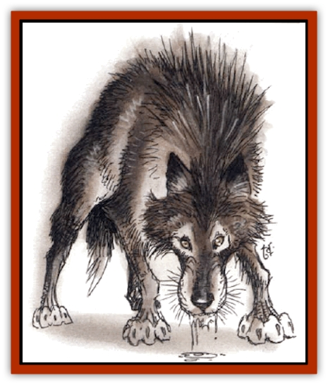

# Wolf - Dread

| Statistic | **Wolf, Dread** |
| --- | --- |
| **Activity Cycle:** | Any |
| **Alignment:** | Neutral evil |
| **Armor Class:** | 6 |
| **Climate/Terrain:** | Any land |
| **Damage/Attack:** | 1d10 |
| **Diet:** | None |
| **Frequency:** | Very rare |
| **Hit Dice:** | 4+4 |
| **Intelligence:** | Average (8-10) |
| **Magic Resistance:** | Nil |
| **Morale:** | Fanatic (17-18) |
| **Movement:** | 18 |
| **No. Appearing:** | 3d4 |
| **No. of Attacks:** | 1 |
| **Organization:** | Pack or special |
| **Size:** | S (2-4' long) |
| **Special Attacks:** | Disease |
| **Special Defenses:** | Regeneration, immunity and resistance to spells |
| **THAC0:** | 15 |
| **Treasure:** | Nil |
| **XP Value:** | 650 |

These creatures were originally created by a renegade mage, but word of how to create these horrid creatures seems to have spread across the Prime Material Plane. These undead beasts are the eyes and ears of any mage who creates them.

**Combat:** A dread wolf fights like any other [[Wolf|wolf]], biting and tearing with its fangs, but if a group of dread wolves is within its 50-mile control limit (see "EcoIogy"), it will fight under the direction of the controlling mage. If a group is outside this limit, the wolves will fight using normal pack tactics.

Dread wolves cause a nasty rotting disease that can infect a bitten opponent who fails a save vs. poison within one hour of the fight - he loses 1 hp per hour until death. Treatment within the first hour by someone with the herbalist nonweapon proficiency adds +2 to the saving throw. A *cure disease* spell stops the disease.

During combat, a dread wolf regenerates like a [[Troll|troll]], regaining 3 hp per round after the first combat round. Only acid, fire, or total dismemberment will inflict permanent damage. It is immune to *charm*, *hold*, and cold-based spells. Electricity-based spells cause only half damage.

Total dismemberment occurs when the creature's negative hit-point total is equal to or greater than its full positive hit-point total. However, the creature continues to fight until it reaches -10 hp. It then goes down until it regenerates to at least 0 hit points.

**Habitat/Society:** As undead creatures, dread wolves have no society. They reach a state of rotten decay soon after they are made. Their fur falls out and they stink so badly that they can be smelled 120 feet downwind.

A mage can have no more than one group of wolves (see "Ecology") under control at a time and cannot give over control of his dread wolves to anyone else. To try either action causes the cessation of the spells animating the wolves and leads immediately to their permanent destruction.

Dread wolves have no interest in treasure, but the controlling mage can order them to find and bring back anything one of them can carry away in its mouth.

**Ecology:** As magically animated undead, dread wolves have no natural place in any ecosystem. To create these servants, a mage must be evil and at least 9th level, and he must have 3d4 wolves that have been dead for no more than a day. The spellcaster begins an incantation over the dead wolves that combines modified versions of *animate dead*, *summon shadow*, and *dismissal*. By doing this, the mage summons a [[Shadow|shadow]] from the Negative Energy Plane and breaks it into parts which are infused into the wolves, creating the dread wolves.

The spellcasting takes an hour. If the spell is interrupted, the energies of the shadow's separate parts are unleashed. When this happens, the mage suffers 3d10 points of damage (no save) from the other-worldly energy blast.

At the end of the hour, the mage will have 3d4 servants that can travel up to 50 miles away and enable him to see and hear everything they see and hear. The wolves are directly under the control of the mage's mind within this distance.

The wolves can venture outside the 50-mile limit, but they lose contact with the controlling mage. Unless previous commands prevent this, the wolves will immediately try to get back within the limit to regain contact. The dread wolves can be given a command of up to three short sentences (a total of 30 words), which they will cover any distance to fulfill. This command will always be fulfilled unless the dread wolves are destroyed first.

For some unknown reason, the spell that makes dread wolves will not work on [[Dog|dogs]]. A mage who attempts this on dogs suffers 3d10 points of damage as described earlier.

---
## Discovery & Documentation

**Source Publication:** Monstrous Compendium, 1994 Annual, Volume 1 (1995)
**Campaign Setting:** Advanced Dungeons & Dragons 2nd Edition
**Author(s):** David Wise

### Other Creatures Found in This Source Book
   * [[Abyss_Ant|Abyss Ant]]
   * [[Achaierai|Achaierai]]
   * [[Afanc|Afanc]]
   * [[Al-Jahar|Al-Jahar]]
   * [[Baelnorn|Baelnorn]]
   * [[Baneguard|Baneguard]]
   * [[Banelar|Banelar]]
   * [[Bird_Talking|Bird, Talking]]
   * [[Blazing_Bones|Blazing Bones]]
   * [[Campestri|Campestri]]
   * [[Caniquine|Caniquine]]
   * [[Cat_Winged|Cat, Winged]]
   * [[Crypt_Servant|Crypt Servant]]
   * [[Death's_Head_Tree|Death's Head Tree]]
   * [[Dog_Saluqi|Dog, Saluqi]]
   * [[Dragon_Electrum|Dragon, Electrum]]
   * [[Dragon_Fang|Dragon, Fang]]
   * [[Dragon_Linnorm_Corpse_Tearer|Dragon, Linnorm, Corpse Tearer]]
   * [[Dragon_Linnorm_Dread|Dragon, Linnorm, Dread]]
   * [[Dragon_Linnorm_Flame|Dragon, Linnorm, Flame]]
   * [[Dragon_Linnorm_Forest|Dragon, Linnorm, Forest]]
   * [[Dragon_Linnorm_Frost|Dragon, Linnorm, Frost]]
   * [[Dragon_Linnorm_Gray|Dragon, Linnorm, Gray]]
   * [[Dragon_Linnorm_Land|Dragon, Linnorm, Land]]
   * [[Dragon_Linnorm_Midgard|Dragon, Linnorm, Midgard]]
   * [[Dragon_Linnorm_Rain|Dragon, Linnorm, Rain]]
   * [[Dragon_Linnorm_Sea|Dragon, Linnorm, Sea]]
   * [[Dragon_Neutral_Jacinth|Dragon, Neutral, Jacinth]]
   * [[Dragon_Neutral_Jade|Dragon, Neutral, Jade]]
   * [[Dragon_Neutral_Pearl|Dragon, Neutral, Pearl]]
   * [[Dread|Dread]]
   * [[Dragon-kin|Dragon-kin]]
   * [[Elemental_Earth_Kin_Chrysmal|Elemental, Earth Kin, Chrysmal]]
   * [[Elemental_Earth_Kin_Earth_Weird|Elemental, Earth Kin, Earth Weird]]
   * [[Elemental_Fire_Kin_Azer|Elemental, Fire Kin, Azer]]
   * [[Elemental_Sandman|Elemental, Sandman]]
   * [[Elemental_Wind_Walker|Elemental, Wind Walker]]
   * [[Elemental_Vermin|Elemental Vermin]]
   * [[Feystag|Feystag]]
   * [[Flame_Skull|Flame Skull]]
   * [[Foulwing|Foulwing]]
   * [[Gambado|Gambado]]
   * [[Garbug|Garbug]]
   * [[Genie_Tasked_Administrator|Genie, Tasked, Administrator]]
   * [[Genie_Tasked_Deceiver|Genie, Tasked, Deceiver]]
   * [[Genie_Tasked_Harim_Servant|Genie, Tasked, Harim Servant]]
   * [[Genie_Tasked_Messenger|Genie, Tasked, Messenger]]
   * [[Genie_Tasked_Miner|Genie, Tasked, Miner]]
   * [[Genie_Tasked_Oathbinder|Genie, Tasked, Oathbinder]]
   * [[Gibbering_Mouther|Gibbering Mouther]]
   * [[Gnasher|Gnasher]]
   * [[Gnasher_Winged|Gnasher, Winged]]
   * [[Golem_Brain|Golem, Brain]]
   * [[Golem_Hammer|Golem, Hammer]]
   * [[Golem_Metagolem|Golem, Metagolem]]
   * [[Golem_Spiderstone|Golem, Spiderstone]]
   * [[Gorynych|Gorynych]]
   * [[Greelox|Greelox]]
   * [[Helmed_Horror|Helmed Horror]]
   * [[Jarbo|Jarbo]]
   * [[Laraken|Laraken]]
   * [[Lich_Psionic|Lich, Psionic]]
   * [[Living_Steel|Living Steel]]
   * [[Lock_Lurker|Lock Lurker]]
   * [[Loxo|Loxo]]
   * [[Lycanthrope_Loup_de_Noir|Lycanthrope, Loup de Noir]]
   * [[Lycanthrope_Werebadger|Lycanthrope, Werebadger]]
   * [[Lycanthrope_Werejaguar|Lycanthrope, Werejaguar]]
   * [[Lythlyx|Lythlyx]]
   * [[Magebane|Magebane]]
   * [[Marrashi|Marrashi]]
   * [[Metalmaster|Metalmaster]]
   * [[Mimic_House_Hunter|Mimic, House Hunter]]
   * [[Naga_Bone|Naga, Bone]]
   * [[Nautilus_Giant|Nautilus, Giant]]
   * [[Nightshade_Toril|Nightshade (Toril)]]
   * [[Nishruu|Nishruu]]
   * [[Noran|Noran]]
   * [[Opinicus|Opinicus]]
   * [[Ormyrr|Ormyrr]]
   * [[Parasite|Parasite]]
   * [[Pasari-Niml|Pasari-Niml]]
   * [[Plant_Vampire_Moss|Plant, Vampire Moss]]
   * [[Pteraman|Pteraman]]
   * [[Rautym|Rautym]]
   * [[Shadeling|Shadeling]]
   * [[Skum|Skum]]
   * [[Snake_Giant_Cobra|Snake, Giant Cobra]]
   * [[Snake_Stone|Snake, Stone]]
   * [[Spectral_Wizard|Spectral Wizard]]
   * [[Spell_Weaver|Spell Weaver]]
   * [[Spider_Brain|Spider, Brain]]
   * [[Suwyze|Suwyze]]
   * [[Tatalla|Tatalla]]
   * [[Tick_Heart|Tick, Heart]]
   * [[Tree_Dark|Tree, Dark]]
   * [[Tree_Singing|Tree, Singing]]
   * [[Tressym|Tressym]]
   * [[Troll_Snow|Troll, Snow]]
   * [[Tuyewera|Tuyewera]]
   * [[Ulitharid|Ulitharid]]
   * [[Undead_Dwarf|Undead Dwarf]]
   * [[Undead_Lake_Monster|Undead Lake Monster]]
   * [[Whipsting|Whipsting]]
   * [[Windghost|Windghost]]
   * [[Wolf_Stone|Wolf, Stone]]
   * [[Wolf_Vampiric|Wolf, Vampiric]]
   * [[Wraith_Shimmering|Wraith, Shimmering]]
   * [[Xantravar|Xantravar]]
   * [[Xaver|Xaver]]
