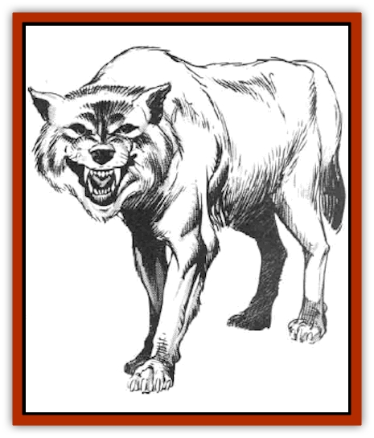

# Wolf - Mist

| Statistic | **Wolf, Mist** |
| --- | --- |
| **Activity Cycle:** | Night |
| **Alignment:** | Lawful good |
| **Armor Class:** | 6 |
| **Climate/Terrain:** | Subartic and temperate/Non-desert |
| **Damage/Attack:** | 2-6 (bite) |
| **Diet:** | Carnivore |
| **Frequency:** | Very rare |
| **Hit Dice:** | 3+3 |
| **Intelligence:** | Average (8-10) |
| **Magic Resistance:** | 10% |
| **Morale:** | Elite (13-14) |
| **Movement:** | 18 |
| **No. Appearing:** | 2-20 |
| **No. of Attacks:** | 1 |
| **Organization:** | Pack |
| **Size:** | M (4' at the shoulder) |
| **Special Attacks:** | Nil |
| **Special Defenses:** | Breath weapon |
| **THAC0:** | 17 |
| **Treasure:** | Nil |
| **XP Value:** | 175 |

Mist wolves are cousins of normal [[Wolf|wolves]], but they are larger and have some magical abilities. Although they're lawful good in alignment, mankind's innate fear and hatred of wolves ensure that these creatures are treated with distrust.

Mist wolves are almost identical to their nonmagical cousins, except that they're taller at the shoulder and their fur is gray with white tips on the hackles. They're slim and muscular, with fearsome-looking teeth. Their eyes are black, without the red tinge often seen in wild wolves.

**Combat:** Mist wolves attack in packs like common wolves, often using the sheer weight of numbers to drag down opponents. They're more intelligent than their cousins, so they are less likely to continue an obviously losing battle.

Mist wolves have a magical ability that makes it easier for them to disengage from stronger opponents. Each mist wolf can exhale clouds of thick mist (similar to a *wall of fog* spell) blocking all vision, filling a volume ten feet on a side (1,000 cubic feet) and lasting five rounds unless blown away. The mist is purely defensive, since it's as opaque to the wolves as it is to their opponents. This ability can be used twice per day.

Mist wolves have an innate ability to *detect evil*. This power operates continuously, without conscious volition. They're implacable enemies of evil and defenders of goodness and law. They'll often go to great lengths - even giving up their lives - to protect humans and demihumans.

**Habitat/Society:** Because of their alignment, mist wolves attack only humans or demihumans who have been acting in a flagrantly evil manner. Normally, mist wolves protect travelers from evil creatures that may wish them harm. Unfortunately, fear and hatred of wolves are taught from the cradle and are embodied in everything from children's tales to common expressions ("a wolf in the fold", "the wolf at the door", etc.). The fact that mist wolves are frequently seen where evil is abroad doesn't help; people never realize - or refuse to believe - that the wolves only appear when evil is near in order to fight it. Therefore, mist wolves are often slain by the very people they're trying to protect.

Mist wolf society is based around the pack. Packs consist of up to 20 adult wolves, with an equal numbers of males and females. The leader of the pack is the strongest individual (usually male, but not necessarily so), who gains and defends the position by challenge and non-lethal combat.

Mist wolves have their own rich language consisting of yips, barks, and growls. They understand the common tongue, but they are unable to speak it for anatomical reasons.

These creatures are most common in forests with evil reputations, because that's where they can do the most good. (Of course, this doesn't help the wolves' reputation at all&hellip;) There are large populations of mist wolves in Dreadwood and in the Burneal Forest, although they aren't limited to these areas.

**Ecology:** If a pack of mist wolves is encountered in its own territory (usually wilderness forests), there are half as many cubs present as there are females in the pack. Mist wolves are monogamous and mate for life, and both parents share the responsibility of caring for cubs. Cubs grow rapidly, reaching full maturity at the age of 12 months. They gain their breath weapon ability at half that age.

Mist wolves are highly efficient predators with few natural enemies. They're intelligent enough to select their victims and control their hunting with care, making sure never to over-hunt an area.

---
## Discovery & Documentation

**Source Publication:** MC5 Greyhawk Appendix (1989)
**Campaign Setting:** Advanced Dungeons & Dragons 2nd Edition
**Author(s):** Grant Boucher, William W. Connors, Steve Gilbert, Bruce Nesmith, Chris Mortika, Skip Williams

### Other Creatures Found in This Source Book
   * [[Aspis|Aspis]]
   * [[Beastman|Beastman]]
   * [[Bonesnapper|Bonesnapper]]
   * [[Booka|Booka]]
   * [[Brownie_Buckawn|Brownie, Buckawn]]
   * [[Brownie_Quickling|Brownie, Quickling]]
   * [[Crystalmist|Crystalmist]]
   * [[Dragon_Cloud|Dragon, Cloud]]
   * [[Dragon_Oerth_Greyhawk|Dragon (Oerth), Greyhawk]]
   * [[Dragonfly_Giant|Dragonfly, Giant]]
   * [[Dragonnel|Dragonnel]]
   * [[Elf_Grugach|Elf, Grugach]]
   * [[Elf_Valley|Elf, Valley]]
   * [[Golem_Necrophidius|Golem, Necrophidius]]
   * [[Grell_Wild|Grell, Wild]]
   * [[Grung|Grung]]
   * [[Hobgoblin_Norker|Hobgoblin, Norker]]
   * [[Hook_Horror|Hook Horror]]
   * [[Horgar|Horgar]]
   * [[Hound_Yeth|Hound, Yeth]]
   * [[Iguana_Giant|Iguana, Giant]]
   * [[Ingundi|Ingundi]]
   * [[Kech|Kech]]
   * [[Kyuss_Son_of|Kyuss, Son of]]
   * [[Mite|Mite]]
   * [[Needleman|Needleman]]
   * [[Plant_Carnivorous_Oerth|Plant, Carnivorous (Oerth)]]
   * [[Plant_Carnivorous_Vampire_Cactus|Plant, Carnivorous, Vampire Cactus]]
   * [[Plasmoid_General_Information|Plasmoid, General Information]]
   * [[Rat_Oerth|Rat (Oerth)]]
   * [[Raven_Crow|Raven/Crow]]
   * [[Scarecrow|Scarecrow]]
   * [[Shadow_Slow|Shadow, Slow]]
   * [[Skulk|Skulk]]
   * [[Snail|Snail]]
   * [[Sprite|Sprite]]
   * [[Taer|Taer]]
   * [[Tentamort|Tentamort]]
   * [[Turtle_Giant|Turtle, Giant]]
   * [[Tyrg|Tyrg]]
   * [[Wraith_Oerth|Wraith (Oerth)]]
   * [[Zygom|Zygom]]
