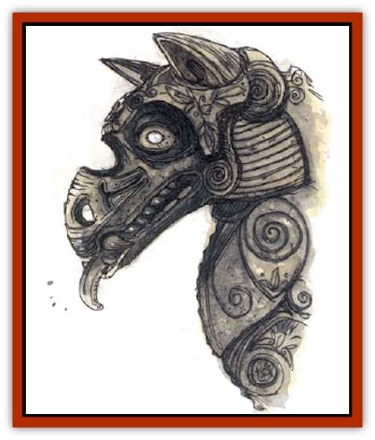

# Wolf - Stone

| Statistic | **Wolf, Stone** |
| --- | --- |
| **Activity Cycle:** | Any |
| **Alignment:** | Neutral |
| **Armor Class:** | 0 |
| **Climate/Terrain:** | Any land |
| **Damage/Attack:** | 2d4 |
| **Diet:** | None |
| **Frequency:** | Very rare |
| **Hit Dice:** | 5+4 |
| **Intelligence:** | Animal (1) |
| **Magic Resistance:** | Nil |
| **Morale:** | Fearless (19-20) |
| **Movement:** | 9 |
| **No. Appearing:** | 1d4 |
| **No. of Attacks:** | 1 |
| **Organization:** | Solitary |
| **Size:** | S (5-6' long) |
| **Special Attacks:** | Initiative bonus, pounce |
| **Special Defenses:** | Resistance and immunity to certain spells and weapons |
| **THAC0:** | 15 |
| **Treasure:** | Nil |
| **XP Value:** | 1,400 |

As these creatures are animated stone, their appearances can vary widely along a [[Wolf|wolf]] theme. The only similarity between all stone wolves is the use of white-hot fire opals for eyes.

**Combat:** Melee with stone wolves can be tricky. The change from motionless statue to moving creature is almost unnoticeable, giving them a +4 initiative bonus in the first round of combat. On a natural 20 attack roll, the wolf has made a successful leap and pounce, pinning its opponent and inflicting an extra 1d6 points of crushing damage. A successful bend bars/lift gates roll is needed to escape (one roll per five rounds is allowed). All Dexterity and shield bonuses are canceled for the period of time the victim is trapped, and the stone wolf gets a +4 attack bonus.

Missile fire inflicts only 1 point of damage per arrow, stone, or bolt to a stone wolf; edged weapons cause only half damage; blunt, smashing weapons visit full damage; and magical weapons always get their full bonuses.

Stone wolves have one particular weakness: their eyes. If a character uses the called-shot optional rules from *The Complete Fighter's Handbook*, he can go for a stone wolf's eyes. Should the character succeed, he may roll a second 1d20. On a roll of 1 or 2, the character has succeeded in smashing both fire-opal eyes, immediately destroying the wolf. Otherwise, he has destroyed one eye, imposing a -4 attack penalty on its blind side.

Stone wolves are immune to *sleep*, *hold*, *charm*, and all cold- or paralysis-based spells. They suffer half or no damage from fire- or electricity-based spells, depending upon whether they successfully save vs. spell. A *stone to flesh* spell makes them vulnerable to all weapons and gives them AC 10 if they fail a save vs. spell. A *transmute rock to mud* or *disintegrate* spell destroys a stone wolf instantly if it fails a save vs. spell. An *earthquake* spell inflicts 6d8 points of damage (half damage if a save vs. spell is successful). A *move earth* spell turns one stone wolf into a statue permanently if the creature fails a save vs. spell (but since the creature is animated, it gets a saving throw). A *wall of stone* spell disperses the creature's mass into the newly created wall if the stone wolf fails a save vs. spell; if it successfully makes its saving throw, there is a 50% chance that the creature is on the same side of the new wall as the caster. A *magic missile* spell causes normal damage.

**Habitat/Society:** As animated creatures, stone wolves have no true society other than their relationship with the mage who created them. He can call the wolves to him at any time. They will find him immediately, even though they cannot track by smell. They can track by sight or hearing if necessary.

Since stone wolves are created beings, they have no treasure of their own. However, they are often set to guard objects that mages value, so it's reasonable to assume that there is something worthwhile nearby when they are encountered.

**Ecology:** As artificial creatures, stone wolves are not part of the natural order. These creatures are created by a mage of the 9th level or higher, using a specially modified *stone shape* spell, followed the next day by a specially modified *animate dead* spell. The recipients of these two spells are up to four large lumps of purified clay. Embedded within each clay lump must be the skull of a wolf and two 1,000-gp fire opals that will serve as the glowing eyes once the wolf shape is formed. During the one-day period between the formation of the wolf shape and the casting of the *animate dead* spell variant, the mage may cast no other spells of any kind.

After the second spell is cast, the mage will have up to four guardians that he can set to guard any item or room he chooses. Stone wolves never sleep. They stand as still as statues until a stranger gets close to the item or enters the room.

---
## Discovery & Documentation

**Source Publication:** Monstrous Compendium, 1994 Annual, Volume 1 (1995)
**Campaign Setting:** Advanced Dungeons & Dragons 2nd Edition
**Author(s):** David Wise

### Other Creatures Found in This Source Book
   * [[Abyss_Ant|Abyss Ant]]
   * [[Achaierai|Achaierai]]
   * [[Afanc|Afanc]]
   * [[Al-Jahar|Al-Jahar]]
   * [[Baelnorn|Baelnorn]]
   * [[Baneguard|Baneguard]]
   * [[Banelar|Banelar]]
   * [[Bird_Talking|Bird, Talking]]
   * [[Blazing_Bones|Blazing Bones]]
   * [[Campestri|Campestri]]
   * [[Caniquine|Caniquine]]
   * [[Cat_Winged|Cat, Winged]]
   * [[Crypt_Servant|Crypt Servant]]
   * [[Death's_Head_Tree|Death's Head Tree]]
   * [[Dog_Saluqi|Dog, Saluqi]]
   * [[Dragon_Electrum|Dragon, Electrum]]
   * [[Dragon_Fang|Dragon, Fang]]
   * [[Dragon_Linnorm_Corpse_Tearer|Dragon, Linnorm, Corpse Tearer]]
   * [[Dragon_Linnorm_Dread|Dragon, Linnorm, Dread]]
   * [[Dragon_Linnorm_Flame|Dragon, Linnorm, Flame]]
   * [[Dragon_Linnorm_Forest|Dragon, Linnorm, Forest]]
   * [[Dragon_Linnorm_Frost|Dragon, Linnorm, Frost]]
   * [[Dragon_Linnorm_Gray|Dragon, Linnorm, Gray]]
   * [[Dragon_Linnorm_Land|Dragon, Linnorm, Land]]
   * [[Dragon_Linnorm_Midgard|Dragon, Linnorm, Midgard]]
   * [[Dragon_Linnorm_Rain|Dragon, Linnorm, Rain]]
   * [[Dragon_Linnorm_Sea|Dragon, Linnorm, Sea]]
   * [[Dragon_Neutral_Jacinth|Dragon, Neutral, Jacinth]]
   * [[Dragon_Neutral_Jade|Dragon, Neutral, Jade]]
   * [[Dragon_Neutral_Pearl|Dragon, Neutral, Pearl]]
   * [[Dread|Dread]]
   * [[Dragon-kin|Dragon-kin]]
   * [[Elemental_Earth_Kin_Chrysmal|Elemental, Earth Kin, Chrysmal]]
   * [[Elemental_Earth_Kin_Earth_Weird|Elemental, Earth Kin, Earth Weird]]
   * [[Elemental_Fire_Kin_Azer|Elemental, Fire Kin, Azer]]
   * [[Elemental_Sandman|Elemental, Sandman]]
   * [[Elemental_Wind_Walker|Elemental, Wind Walker]]
   * [[Elemental_Vermin|Elemental Vermin]]
   * [[Feystag|Feystag]]
   * [[Flame_Skull|Flame Skull]]
   * [[Foulwing|Foulwing]]
   * [[Gambado|Gambado]]
   * [[Garbug|Garbug]]
   * [[Genie_Tasked_Administrator|Genie, Tasked, Administrator]]
   * [[Genie_Tasked_Deceiver|Genie, Tasked, Deceiver]]
   * [[Genie_Tasked_Harim_Servant|Genie, Tasked, Harim Servant]]
   * [[Genie_Tasked_Messenger|Genie, Tasked, Messenger]]
   * [[Genie_Tasked_Miner|Genie, Tasked, Miner]]
   * [[Genie_Tasked_Oathbinder|Genie, Tasked, Oathbinder]]
   * [[Gibbering_Mouther|Gibbering Mouther]]
   * [[Gnasher|Gnasher]]
   * [[Gnasher_Winged|Gnasher, Winged]]
   * [[Golem_Brain|Golem, Brain]]
   * [[Golem_Hammer|Golem, Hammer]]
   * [[Golem_Metagolem|Golem, Metagolem]]
   * [[Golem_Spiderstone|Golem, Spiderstone]]
   * [[Gorynych|Gorynych]]
   * [[Greelox|Greelox]]
   * [[Helmed_Horror|Helmed Horror]]
   * [[Jarbo|Jarbo]]
   * [[Laraken|Laraken]]
   * [[Lich_Psionic|Lich, Psionic]]
   * [[Living_Steel|Living Steel]]
   * [[Lock_Lurker|Lock Lurker]]
   * [[Loxo|Loxo]]
   * [[Lycanthrope_Loup_de_Noir|Lycanthrope, Loup de Noir]]
   * [[Lycanthrope_Werebadger|Lycanthrope, Werebadger]]
   * [[Lycanthrope_Werejaguar|Lycanthrope, Werejaguar]]
   * [[Lythlyx|Lythlyx]]
   * [[Magebane|Magebane]]
   * [[Marrashi|Marrashi]]
   * [[Metalmaster|Metalmaster]]
   * [[Mimic_House_Hunter|Mimic, House Hunter]]
   * [[Naga_Bone|Naga, Bone]]
   * [[Nautilus_Giant|Nautilus, Giant]]
   * [[Nightshade_Toril|Nightshade (Toril)]]
   * [[Nishruu|Nishruu]]
   * [[Noran|Noran]]
   * [[Opinicus|Opinicus]]
   * [[Ormyrr|Ormyrr]]
   * [[Parasite|Parasite]]
   * [[Pasari-Niml|Pasari-Niml]]
   * [[Plant_Vampire_Moss|Plant, Vampire Moss]]
   * [[Pteraman|Pteraman]]
   * [[Rautym|Rautym]]
   * [[Shadeling|Shadeling]]
   * [[Skum|Skum]]
   * [[Snake_Giant_Cobra|Snake, Giant Cobra]]
   * [[Snake_Stone|Snake, Stone]]
   * [[Spectral_Wizard|Spectral Wizard]]
   * [[Spell_Weaver|Spell Weaver]]
   * [[Spider_Brain|Spider, Brain]]
   * [[Suwyze|Suwyze]]
   * [[Tatalla|Tatalla]]
   * [[Tick_Heart|Tick, Heart]]
   * [[Tree_Dark|Tree, Dark]]
   * [[Tree_Singing|Tree, Singing]]
   * [[Tressym|Tressym]]
   * [[Troll_Snow|Troll, Snow]]
   * [[Tuyewera|Tuyewera]]
   * [[Ulitharid|Ulitharid]]
   * [[Undead_Dwarf|Undead Dwarf]]
   * [[Undead_Lake_Monster|Undead Lake Monster]]
   * [[Whipsting|Whipsting]]
   * [[Windghost|Windghost]]
   * [[Wolf_Dread|Wolf, Dread]]
   * [[Wolf_Vampiric|Wolf, Vampiric]]
   * [[Wraith_Shimmering|Wraith, Shimmering]]
   * [[Xantravar|Xantravar]]
   * [[Xaver|Xaver]]
