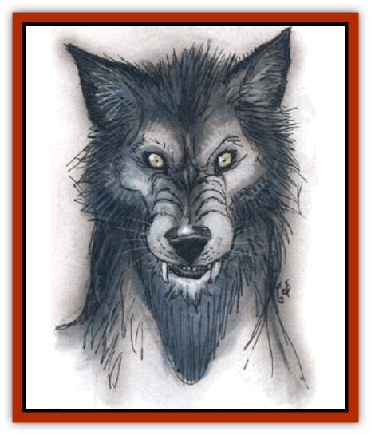

# Wolf - Vampiric

| Statistic | **Wolf, Vampiric** |
| --- | --- |
| **Activity Cycle:** | Night |
| **Alignment:** | Any evil |
| **Armor Class:** | 2 |
| **Climate/Terrain:** | Any land |
| **Damage/Attack:** | 3d4 |
| **Diet:** | Blood |
| **Frequency:** | Very rare |
| **Hit Dice:** | 6+4 |
| **Intelligence:** | Low (5-7) |
| **Magic Resistance:** | Nil |
| **Morale:** | Elite (13-14) |
| **Movement:** | 24 |
| **No. Appearing:** | 3d6 |
| **No. of Attacks:** | 1 |
| **Organization:** | Pack |
| **Size:** | S (2-3½' long) |
| **Special Attacks:** | Cause falling, grasping bite, high initiative |
| **Special Defenses:** | Regeneration, immunity to certain spells and weapons |
| **THAC0:** | 13 |
| **Treasure:** | Nil |
| **XP Value:** | 2,000 |

These foul undead creatures are the result of corrupting ceremonies used on normal [[Wolf|wolf]] pups by evil clerics. Vampiric wolves are uniformly black, with feral, glowing orange eyes.

**Combat:** When vampiric wolves hunt, they follow normal pack tactics until their victim is unable to escape. In game terms, a bite attack will cause a running or standing victim to fall if the victim fails a saving throw vs. paralysis. Once the prey falls, the wolves continue to attack, shifting to the victim's arms so that he can no longer use a weapon. This involves a called-shot attack in which a vampiric wolf has a -4 penalty to hit; success means the wolf has grasped an arm in its mouth, and the victim cannot get free unless he makes a successful Strength check (one attempt per round). A victim's legs may be similarly grasped. Once a grasping bite is made, damage is continually inflicted each round as the wolf gnaws on the limb.

Once the victim is helpless, the vampiric wolves close in and drink the spilled blood, an act that takes as long as the victim lives, plus 1d4+1 rounds. This causes the wolves' eyes to glow a deep red for the next 12 hours.

Since they share some of the nature of [[Vampire_General_Information|vampires]], these wolves are extremely agile, giving them a bonus of +2 on initiative rolls. Vampiric wolves are immune to *sleep*, *charm*, *hold*, and paralysis-based spells. Only silver weapons or magical weapons of +1 value or better can do actual damage in melee. They also regenerate, instantly gaining the same number of hit points they inflict as damage on an opponent.

Unlike a vampire, these wolves can move about in daylight, though they normally choose not to do so. When attacking in daylight, they suffer a -2 penalty.

**Habitat/Society:** Vampiric wolves regard the cleric who created them as their leader, accepting no other except their own, strongest member. Any other who tries to command them is attacked. As pack leader, the cleric has complete control over them. The pack can understand simple commands of up to four words and will obey them even when left on their own for long periods. But, as pack leader, the cleric also faces some danger: Wolves do not accept weakness in their leader, and should he show any sign of unfitness, the pack will turn on him. Should the wolves kill the cleric, they will run free. They will avoid contact with humans or demihumans unless the latter are hunting the vampiric wolves.

Vampiric wolves have no interest in treasure. However, the cleric often uses them as guards. It is a better than even chance that there is a concealed portal of some sort nearby if the wolves are found near what appears to be a wolf den.

**Ecology:** Being undead, these creatures have no place in the natural order. They destroy things and give back nothing.

In order to create these foul corruptions, a cleric must be evil and at least 9th level. He can use 3d6 pups from one or more wolf dens. The pups must be very close to being weaned, but cannot have tasted meat or they will be useless.

The cleric first performs a ceremony using what amounts to the opposite of an *atonement* spell. Then, every day he must hand-feed the pups. The food can be no more than one day old and it must be infused with one or two drops of blood from a living human, or dust from a vampire and cursed using a *reversed bless* spell. This must continue every day for three months or the pups die. At the end of the three-month period, the pups are fully grown and must then be slain by poisoning; they then arise as vampiric wolves. If they are not slain at this time, the wolves must each make a saving throw vs. death magic or become greatly weakened (1 hp per Hit Die), living on as bloodthirsty but otherwise normal wolves.

It is impossible to create vampiric [[Dog|dogs]].

---
## Discovery & Documentation

**Source Publication:** Monstrous Compendium, 1994 Annual, Volume 1 (1995)
**Campaign Setting:** Advanced Dungeons & Dragons 2nd Edition
**Author(s):** David Wise

### Other Creatures Found in This Source Book
   * [[Abyss_Ant|Abyss Ant]]
   * [[Achaierai|Achaierai]]
   * [[Afanc|Afanc]]
   * [[Al-Jahar|Al-Jahar]]
   * [[Baelnorn|Baelnorn]]
   * [[Baneguard|Baneguard]]
   * [[Banelar|Banelar]]
   * [[Bird_Talking|Bird, Talking]]
   * [[Blazing_Bones|Blazing Bones]]
   * [[Campestri|Campestri]]
   * [[Caniquine|Caniquine]]
   * [[Cat_Winged|Cat, Winged]]
   * [[Crypt_Servant|Crypt Servant]]
   * [[Death's_Head_Tree|Death's Head Tree]]
   * [[Dog_Saluqi|Dog, Saluqi]]
   * [[Dragon_Electrum|Dragon, Electrum]]
   * [[Dragon_Fang|Dragon, Fang]]
   * [[Dragon_Linnorm_Corpse_Tearer|Dragon, Linnorm, Corpse Tearer]]
   * [[Dragon_Linnorm_Dread|Dragon, Linnorm, Dread]]
   * [[Dragon_Linnorm_Flame|Dragon, Linnorm, Flame]]
   * [[Dragon_Linnorm_Forest|Dragon, Linnorm, Forest]]
   * [[Dragon_Linnorm_Frost|Dragon, Linnorm, Frost]]
   * [[Dragon_Linnorm_Gray|Dragon, Linnorm, Gray]]
   * [[Dragon_Linnorm_Land|Dragon, Linnorm, Land]]
   * [[Dragon_Linnorm_Midgard|Dragon, Linnorm, Midgard]]
   * [[Dragon_Linnorm_Rain|Dragon, Linnorm, Rain]]
   * [[Dragon_Linnorm_Sea|Dragon, Linnorm, Sea]]
   * [[Dragon_Neutral_Jacinth|Dragon, Neutral, Jacinth]]
   * [[Dragon_Neutral_Jade|Dragon, Neutral, Jade]]
   * [[Dragon_Neutral_Pearl|Dragon, Neutral, Pearl]]
   * [[Dread|Dread]]
   * [[Dragon-kin|Dragon-kin]]
   * [[Elemental_Earth_Kin_Chrysmal|Elemental, Earth Kin, Chrysmal]]
   * [[Elemental_Earth_Kin_Earth_Weird|Elemental, Earth Kin, Earth Weird]]
   * [[Elemental_Fire_Kin_Azer|Elemental, Fire Kin, Azer]]
   * [[Elemental_Sandman|Elemental, Sandman]]
   * [[Elemental_Wind_Walker|Elemental, Wind Walker]]
   * [[Elemental_Vermin|Elemental Vermin]]
   * [[Feystag|Feystag]]
   * [[Flame_Skull|Flame Skull]]
   * [[Foulwing|Foulwing]]
   * [[Gambado|Gambado]]
   * [[Garbug|Garbug]]
   * [[Genie_Tasked_Administrator|Genie, Tasked, Administrator]]
   * [[Genie_Tasked_Deceiver|Genie, Tasked, Deceiver]]
   * [[Genie_Tasked_Harim_Servant|Genie, Tasked, Harim Servant]]
   * [[Genie_Tasked_Messenger|Genie, Tasked, Messenger]]
   * [[Genie_Tasked_Miner|Genie, Tasked, Miner]]
   * [[Genie_Tasked_Oathbinder|Genie, Tasked, Oathbinder]]
   * [[Gibbering_Mouther|Gibbering Mouther]]
   * [[Gnasher|Gnasher]]
   * [[Gnasher_Winged|Gnasher, Winged]]
   * [[Golem_Brain|Golem, Brain]]
   * [[Golem_Hammer|Golem, Hammer]]
   * [[Golem_Metagolem|Golem, Metagolem]]
   * [[Golem_Spiderstone|Golem, Spiderstone]]
   * [[Gorynych|Gorynych]]
   * [[Greelox|Greelox]]
   * [[Helmed_Horror|Helmed Horror]]
   * [[Jarbo|Jarbo]]
   * [[Laraken|Laraken]]
   * [[Lich_Psionic|Lich, Psionic]]
   * [[Living_Steel|Living Steel]]
   * [[Lock_Lurker|Lock Lurker]]
   * [[Loxo|Loxo]]
   * [[Lycanthrope_Loup_de_Noir|Lycanthrope, Loup de Noir]]
   * [[Lycanthrope_Werebadger|Lycanthrope, Werebadger]]
   * [[Lycanthrope_Werejaguar|Lycanthrope, Werejaguar]]
   * [[Lythlyx|Lythlyx]]
   * [[Magebane|Magebane]]
   * [[Marrashi|Marrashi]]
   * [[Metalmaster|Metalmaster]]
   * [[Mimic_House_Hunter|Mimic, House Hunter]]
   * [[Naga_Bone|Naga, Bone]]
   * [[Nautilus_Giant|Nautilus, Giant]]
   * [[Nightshade_Toril|Nightshade (Toril)]]
   * [[Nishruu|Nishruu]]
   * [[Noran|Noran]]
   * [[Opinicus|Opinicus]]
   * [[Ormyrr|Ormyrr]]
   * [[Parasite|Parasite]]
   * [[Pasari-Niml|Pasari-Niml]]
   * [[Plant_Vampire_Moss|Plant, Vampire Moss]]
   * [[Pteraman|Pteraman]]
   * [[Rautym|Rautym]]
   * [[Shadeling|Shadeling]]
   * [[Skum|Skum]]
   * [[Snake_Giant_Cobra|Snake, Giant Cobra]]
   * [[Snake_Stone|Snake, Stone]]
   * [[Spectral_Wizard|Spectral Wizard]]
   * [[Spell_Weaver|Spell Weaver]]
   * [[Spider_Brain|Spider, Brain]]
   * [[Suwyze|Suwyze]]
   * [[Tatalla|Tatalla]]
   * [[Tick_Heart|Tick, Heart]]
   * [[Tree_Dark|Tree, Dark]]
   * [[Tree_Singing|Tree, Singing]]
   * [[Tressym|Tressym]]
   * [[Troll_Snow|Troll, Snow]]
   * [[Tuyewera|Tuyewera]]
   * [[Ulitharid|Ulitharid]]
   * [[Undead_Dwarf|Undead Dwarf]]
   * [[Undead_Lake_Monster|Undead Lake Monster]]
   * [[Whipsting|Whipsting]]
   * [[Windghost|Windghost]]
   * [[Wolf_Dread|Wolf, Dread]]
   * [[Wolf_Stone|Wolf, Stone]]
   * [[Wraith_Shimmering|Wraith, Shimmering]]
   * [[Xantravar|Xantravar]]
   * [[Xaver|Xaver]]
