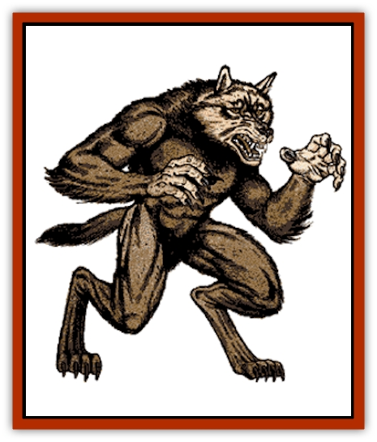
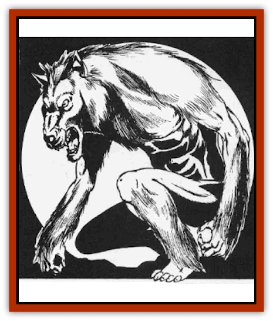

# Wolfwere

| Statistic | **Wolfwere** |
| --- | --- |
| **Activity Cycle:** | Any |
| **Alignment:** | Chaotic evil |
| **Armor Class:** | 3 |
| **Climate/Terrain:** | Any forest |
| **Damage/Attack:** | 2-12 and weapon |
| **Diet:** | Carnivore |
| **Frequency:** | Rare |
| **Hit Dice:** | 5+1 |
| **Intelligence:** | High to exceptional (13-16) |
| **Magic Resistance:** | 10% |
| **Morale:** | Elite (14) |
| **Movement:** | 15 |
| **No. Appearing:** | 1-3 |
| **No. of Attacks:** | 1 or 2 |
| **Organization:** | Solitary |
| **Size:** | M (4-7') |
| **Special Attacks:** | Singing brings on lethargy |
| **Special Defenses:** | Iron or +1 or better weapon to hit |
| **THAC0:** | 15 |
| **Treasure:** | B,50% of S,T |
| **XP Value:** | 1,400 |

The wolfwere is an evil and hateful creature that delights in the brutal slaying of humans and demihumans alike. In many cases, the wolfwere is able to attack its victims with utter surprise because of its ability to assume the shape of a human of exceptional charisma.

The wolfwere is able to assume a wide variety of shapes at will. Transformation from one form to another takes only a single round. Its true shape, and that in which it prefers to spend the vast majority of its time, is that of a large [[Wolf|wolf]]. When in this state, it is almost indistinguishable from a [[Wolf|dire wolf]].

When a wolfwere is attempting to lure humans or demihumans into an ambush, it will assume the shape of member of their race. Almost without exception, the new persona will not be of the same sex as the potential victim. Thus, a wolfwere which is stalking a male [[Elf|elf]] will transform itself into a female elf. In all cases, the newly disguised wolfwere will have exceptional physical beauty.

**Combat:** The wolfwere is a sly and dangerous adversary. In addition to its great fury and fighting prowess, its high intelligence must not be overlooked or underestimated.

When a wolfwere first spots unsuspecting humans or demihumans in its territory, it will change into its fully humanoid form and assume the guise of a pilgrim, minstrel, or similar wanderer. The wolfwere will normally carry some form of stringed instrument which it seems to absent-mindedly play at while it travels. The true nature of its song, however, is terrible and often fatal. Anyone who hears the wolfwere's song and then fails a saving throw vs. spell will be overcome with lethargy. The effects of this enchantment are the same as those of the *slow* spell. Once this effect begins, it cannot be countered and lasts for 5-8 rounds.

When a wolfwere is ready to attack, the creature again changes its shape. Now, in a form which is half-wolf and half-human (or demihuman), it strikes. The wolfwere will almost always change into this form when it engages in combat because it has the ability to bite like a wolf and also wield a weapon of some type.

In any form but its fully humanoid one, the creature can deliver a savage bite with its powerful jaws. It is this mode of attack which the monster prefers to employ above all others.

When in its humanoid or half-humanoid state, it is also able to carry and employ weapons. Although the exact type of weapon used will depend upon the specific tastes of the creature encountered, wolfweres tend toward axes, swords, and similar cutting edges.

If the creature is forced to engage in battle while in its humanoid form, it will be forced to rely wholly on its weapons for defense. In such cases, it normally seeks to escape and transform into its half-humanoid state before returning to battle.

The magical nature of the wolfwere makes it immune to damage inflicted by any weapon which is not made from cold wrought iron or enchanted to +1 or better. All other weapons are simply turned aside by the creature's hide.

It is possible to protect oneself from attacks by wolfweres, however, for they are disgusted by wolfsbane and will avoid it whenever possible.

**Habitat/Society:** The wolfwere is generally fairly solitary in nature. When encountered in the wild, it is rare that more than three of these creatures will be found. In almost all cases, encounters with more than one wolfwere will be with a mated pair or a group which has decided to work together to increase the success of their hunting.

**Ecology:** There is a 75% chance that any encountered wolfwere will be running with a pack of wild wolves. In such cases, the animals will be [[Wolf|worgs]] 70% of the time. If they are not worgs, they will be common wolves. In all cases, the influence of the wolfwere will make the creatures far more vicious and evil than they might normally be.

Despite their fondness for wolves and worgs, wolfweres loathe the company of [[Lycanthrope_Werewolf|werewolves]]. The enmity between these two monsters is so great that they will often attack each other on sight.

---
## Discovery & Documentation

**Source Publication:** MC1 Volume I (w/binder #1) (1991)
**Campaign Setting:** Advanced Dungeons & Dragons 2nd Edition
**Author(s):** Jay Batista, Scott Bennie, Grant Boucher, William W. Connors, Steve Gilbert, Heike Kubasch, James Lowder, David Edward Martin, Bruce Nesmith, Jean Rabe, Rick Swan, John J. Terra, Gary L. Thomas

### Other Creatures Found in This Source Book
   * [[Bat|Bat]]
   * [[Bear|Bear]]
   * [[Behir|Behir]]
   * [[Boar|Boar]]
   * [[Bookworm|Bookworm]]
   * [[Brownie|Brownie]]
   * [[Bugbear|Bugbear]]
   * [[Carrion_Crawler|Carrion Crawler]]
   * [[Cat_Great|Cat, Great]]
   * [[Catoblepas|Catoblepas]]
   * [[Dragon_General_Information|Dragon, General Information]]
   * [[Dragonfish|Dragonfish]]
   * [[Elemental_Air_Kin_Aerial_Servant|Elemental, Air Kin, Aerial Servant]]
   * [[Elemental_Earth_Kin_Sandling|Elemental, Earth Kin, Sandling]]
   * [[Elephant|Elephant]]
   * [[Gnoll|Gnoll]]
   * [[Hobgoblin|Hobgoblin]]
   * [[Homunculus|Homunculus]]
   * [[Hornet_Giant|Hornet, Giant]]
   * [[Horse|Horse]]
   * [[Hyena|Hyena]]
   * [[Jackal|Jackal]]
   * [[Jackalwere|Jackalwere]]
   * [[Korred|Korred]]
   * [[Lich|Lich]]
   * [[Lizard|Lizard]]
   * [[Lizard_Man|Lizard Man]]
   * [[Lycanthrope_General_Information|Lycanthrope, General Information]]
   * [[Lycanthrope_Seawolf|Lycanthrope, Seawolf]]
   * [[Lycanthrope_Werebear|Lycanthrope, Werebear]]
   * [[Lycanthrope_Weretiger|Lycanthrope, Weretiger]]
   * [[Lycanthrope_Werewolf|Lycanthrope, Werewolf]]
   * [[Manticore|Manticore]]
   * [[Medusa|Medusa]]
   * [[Mind_Flayer|Mind Flayer]]
   * [[Minotaur|Minotaur]]
   * [[Mudman|Mudman]]
   * [[Mummy|Mummy]]
   * [[Nixie|Nixie]]
   * [[Nymph|Nymph]]
   * [[Ogre|Ogre]]
   * [[Ooze_Slime_Jelly_I|Ooze/Slime/Jelly I]]
   * [[Ooze_Slime_Jelly_II|Ooze/Slime/Jelly II]]
   * [[Orc|Orc]]
   * [[Owl|Owl]]
   * [[Owlbear_I|Owlbear I]]
   * [[Pegasus|Pegasus]]
   * [[Piercer|Piercer]]
   * [[Pudding_Deadly|Pudding, Deadly]]
   * [[Rakshasa|Rakshasa]]
   * [[Rat|Rat]]
   * [[Ray|Ray]]
   * [[Remorhaz|Remorhaz]]
   * [[Satyr|Satyr]]
   * [[Scorpion|Scorpion]]
   * [[Selkie|Selkie]]
   * [[Shadow|Shadow]]
   * [[Skeleton|Skeleton]]
   * [[Skunk|Skunk]]
   * [[Snake|Snake]]
   * [[Spectre|Spectre]]
   * [[Spider|Spider]]
   * [[Sprite|Sprite]]
   * [[Toad_Giant|Toad, Giant]]
   * [[Treant|Treant]]
   * [[Troll|Troll]]
   * [[Umber_Hulk|Umber Hulk]]
   * [[Unicorn|Unicorn]]
   * [[Vampire|Vampire]]
   * [[Wight|Wight]]
   * [[Will_O'Wisp|Will O'Wisp]]
   * [[Wolf|Wolf]]
   * [[Wraith|Wraith]]
   * [[Wyvern|Wyvern]]
   * [[Yeti|Yeti]]
   * [[Yuan-ti|Yuan-ti]]
   * [[Zombie|Zombie]]
