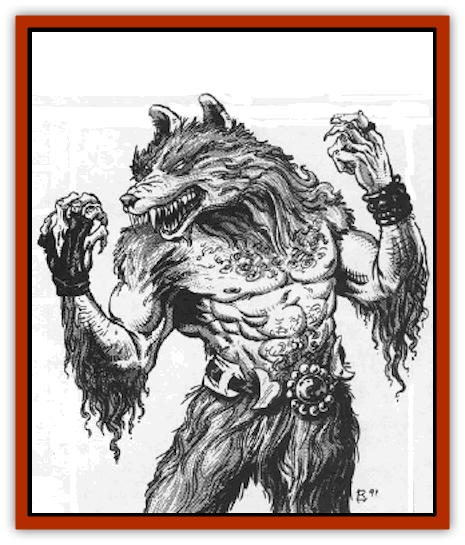

# Wolfwere - Greater

| Statistic | **Wolfwere, Greater** |
| --- | --- |
| **Activity Cycle:** | Any (especially night) |
| **Alignment:** | Neutral evil |
| **Armor Class:** | 2 |
| **Climate/Terrain:** | Any/Forest |
| **Damage/Attack:** | 2d8, 1d6/1d6/2d6, or 2d6/weapon +6 (see below) |
| **Diet:** | Carnivore |
| **Frequency:** | Very rare |
| **Hit Dice:** | 8+2 |
| **Intelligence:** | Exceptional (15-16) |
| **Magic Resistance:** | 50% |
| **Morale:** | Champion (15) |
| **Movement:** | 18 |
| **No. Appearing:** | 1-4 |
| **No. of Attacks:** | 1, 3, or 2 |
| **Organization:** | Solitary |
| **Size:** | M-L (4-9') |
| **Special Attacks:** | See below |
| **Special Defenses:** | See below |
| **THAC0:** | 11 |
| **Treasure:** | 20% U (B) |
| **XP Value:** | 8,000 |

Greater [[Wolfwere|wolfweres]] are a bane of evil to all who live. They are able to assume three shapes at will, taking only a single round to alter forms. Theis natural shape is that of a giant [[Wolf|dire wolf]] standing a full 5' to 6' at the shoulder. They can also assume a half-wolf/half-human form. In this state they are 8-9' tall with massive long arms equipped with talon-like nails. Finally, they may assume the form of any humanoid of either sex whoch is between 4' amd 9' in height.

Greater wolfweres speak common, as well as the language of forest animals.

**Combat:** Greater wolfweres often employ the same strategies used by typical wolfweres when hunting. They will change into a humanoid of opposite sex to that of their victim. Then, using their Charisma and singing ability, they will get close to their victim and sing their special song. Anyone failing a save versus spells will be overcome with *lethargy*. The effects of this are the same as those for a *slow* spell and last for 1d6+4 rounds.

In dire wolf form, they will bite with their savage jaws, inflicting 2d8 points of damage with each successful attack.

In demi-wolf form, they can strike with each of their clawed hands (causing 1d6 points of damage each) and also bite for 2d6 points. In lieu of their claw attacks, greater wolfweres in this form may employ weapons (gaining a bonus of +6 on their damage rolls).

In humanoid form, they are forced to fight with weapons only and are assumed to have a strength of 18/00 (+6 to damage).

Greater wolfweres have infravision with a 120' range, and, in all forms except human, their eyes glow red in the dark.

Greater wolfweres have all the abilities of a first level bard and can climb walls (55%), detect noise (25%), pick pockets (15%), and read languages (10%).

Some exceptional individuals may be of greater level. As a rule, 1 in 10 creatures will be of level 2-5 (1d4+1) and 1 in 20 will be of level 6-11 (1d6+5).

Iron weapons (or those of a +1 enchantment) are required to harm a greater wolfwere. However, unless the blow is instantly fatal, the wound will quickly repair itself as the wolfwere is able to regenerate all of its lost hit points at the end of any given round. It is important to note, however, that severed limbs and such are not regenerated in this fashion.

Greater wolfweres are somewhat more resistant to wolfsbane than their lesser cousins and can stand the presence of that herb if they make a saving throw versus poison. If they fail, they must avoid it at all costs.

The howl of a greater wolfwere can summon 4d6 wolves or 2d6 dire wolves to its aid, if such creatures are in the area. These wolves will fight most loyally on behalf of the greater wolfwere with a +2 moral bonus.

**Habitat/Society:** Greater wolfweres are nearly indistinguishable from typical wolfweres. They often team up with the latter (assuming positions of leadership), but seldom travel with others of their own breed. When more than one greater wolfwere is encountered, they will be working together on some scheme which requires both their efforts.

**Ecology:** Greater wolfweres were originally the offspring of Harkon Lukas, Lord of Kartakass. So great was his evil power that the children he had by female wolfweres turned out to be of incredible power. Greater wolfweres never mate with each other; rather, they mate with typical wolfweres. Only 10% of the children produced by such matings result in a greater wolfwere, the others being typical.

When the victims of a greater wolfwere attack are left to rot and not eaten or buried properly, there is a 50% chance that a Meekulbern plant will sprout from the corpse. The berries from this bush are used in making Meekulbrau, a special wine of Kartakass.

They seem to have a near empathic link with wolves of all types, but despise [[Lycanthrope_Werewolf|werewolves]] and will attack them on sight.

---
## Discovery & Documentation

**Source Publication:** MC10 Ravenloft Appendix I (1989)
**Campaign Setting:** Planescape
**Author(s):** William W. Connors

### Other Creatures Found in This Source Book
   * [[Bastellus|Bastellus]]
   * [[Bat_Ravenloft|Bat (Ravenloft)]]
   * [[Bowlyn|Bowlyn]]
   * [[Broken_One|Broken One]]
   * [[Bussengeist|Bussengeist]]
   * [[Darkling|Darkling]]
   * [[Doom_Guard|Doom Guard]]
   * [[Doppelganger_Plant|Doppelganger Plant]]
   * [[Elemental_Ravenloft|Elemental (Ravenloft)]]
   * [[Ermordenung|Ermordenung]]
   * [[Ghoul_Lord|Ghoul Lord]]
   * [[Goblyn|Goblyn]]
   * [[Golem_III|Golem III]]
   * [[Golem_IV|Golem IV]]
   * [[Golem_Ravenloft|Golem (Ravenloft)]]
   * [[Grim_Reaper|Grim Reaper]]
   * [[Human_Abber_Nomad|Human, Abber Nomad]]
   * [[Human_Ravenloft|Human (Ravenloft)]]
   * [[Imp_Assassin|Imp, Assassin]]
   * [[Impersonator|Impersonator]]
   * [[Lycanthrope_Werebat|Lycanthrope, Werebat]]
   * [[Lycanthrope_Wereraven|Lycanthrope, Wereraven]]
   * [[Mist_Horror|Mist Horror]]
   * [[Mummy_Greater|Mummy, Greater]]
   * [[Quevari|Quevari]]
   * [[Quickwood|Quickwood]]
   * [[Ravenkin|Ravenkin]]
   * [[Reaver|Reaver]]
   * [[Scarecrow_Ravenloft|Scarecrow (Ravenloft)]]
   * [[Shadow_Fiend|Shadow Fiend]]
   * [[Skeleton_Giant|Skeleton, Giant]]
   * [[Strahd's_Skeletal_Steed|Strahd's Skeletal Steed]]
   * [[Treant_Evil|Treant, Evil]]
   * [[Treant_Undead|Treant, Undead]]
   * [[Valpurgeist|Valpurgeist]]
   * [[Vampire_Dwarf|Vampire, Dwarf]]
   * [[Vampire_Elf|Vampire, Elf]]
   * [[Vampire_Gnome|Vampire, Gnome]]
   * [[Vampire_Halfling|Vampire, Halfling]]
   * [[Vampire_General_Information|Vampire, General Information]]
   * [[Vampire_Kender|Vampire, Kender]]
   * [[Vampyre|Vampyre]]
   * [[Widow_Red|Widow, Red]]
   * [[Zombie_Lord|Zombie Lord]]
