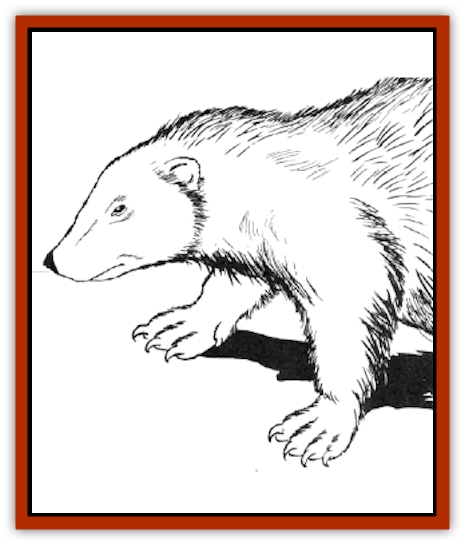

# Wolverine

| Statistic | **Giant** | **Normal** |
| --- | --- | --- |
| **Activity Cycle:** | Night | Night |
| **Alignment:** | Neutral (evil) | Neutral (evil) |
| **Armor Class:** | 4 | 5 |
| **Climate/Terrain:** | Arctic/Forest | Arctic/Forest |
| **Damage/Attack:** | 1d4+1/1d4+1/2d4 | 1d4/1d4/1d4+1 |
| **Diet:** | Carnivore | Carnivore |
| **Frequency:** | Rare | Uncommon |
| **Hit Dice:** | 4+4 | 3 |
| **Intelligence:** | Semi- (2-4) | Semi- (2-4) |
| **Magic Resistance:** | Nil | Nil |
| **Morale:** | Steady (11) | Steady (11) |
| **Movement:** | 15 | 12 |
| **No. Appearing:** | 1 | 1 |
| **No. of Attacks:** | 3 | 3 |
| **Organization:** | Solitary | Solitary |
| **Size:** | M (4-7') | S (2-4') |
| **Special Attacks:** | Musk | Musk |
| **Special Defenses:** | Nil | Nil |
| **THAC0:** | 17 | 17 |
| **Treasure:** | Nil | Nil |
| **XP Value:** | 270 | 120 |

Known also as the carcajou, quickhatch, and glutton, this fierce animal has been the scourge of many arctic cultures since the dawn of time.

The wolverine is closely related to the [[Weasel|weasel]], but in habit and physiology it has much more in common with the [[Badger|badger]]. The body of a wolverine is heavyset with short, thick legs. Its claws are long and curved, making it a very dangerous hunter. The wolverine's head is blunt and rounded with wide-set eyes and a short sharp snout. Its body has a coat of brown fur with a light stripe running down each side. Its skeleton carries the head and tail low with an arch in the back.

**Combat:** When engaging in battle, the wolverine becomes a most fearsome adversary. Its great speed makes it difficult to strike (thus its decent Armor Class) and gives it a +4 bonus on its attack roll.

The wolverine normally attacks with a combination of its wicked claws and needle-like teeth. Its great speed enables it to strike once with each of its front claws and then follow that up with a ripping bite.

Enemies who are behind the wolverine are subject to attack by its musk gland. Like a [[Skunk|skunk]], this animal can release an oil that is disgusting to most other life forms. This spray takes the form of a cloud 10 feet wide by 10 feet high and 30 feet long. A victim of the musk must roll a successful saving throw vs. poison or be blinded for 1d4 hours. Even if the saving throw is successful, the victim instinctively draws back from the animal by half of its normal movement rate and loses 25% of his Strength and Dexterity for 1d4 turns due to nausea. Anyone who comes into the slightest contact with the wolverine's musk is tainted by its foul stench and is shunned by all animals until he can be thoroughly cleaned.

**Habitat/Society:** Wolverines are loners that range throughout the forests of colder climates. Occasionally they are found in more temperate woodlands as well. Sometimes two wolverines may be encountered together, but they are almost always a mated pair that will go their own ways before long.

Female wolverines who have mated generally give birth to one to four pups in the late winter or early spring months. These animals are nurtured by the mother and remain with her until they are able to survive on their own.

**Ecology:** For the most part, wolverines are carnivores that take small mammals and rodents as prey. In times when food is short, they feed on carrion if unable to make their own kills. In addition, wolverines are clever, adept at looting the traps set for them by men.

In many regions where wolverines co-exist with man, they are hunted to the brink of destruction. The reasons for this are two-fold. Primarily, the animals are seen as a threat and as competitors for small game. Secondly, the pelt of a wolverine is exceptionally resistant to cold and frost, making it very useful in the manufacture of winter clothing.

**Giant Wolverines**

  These fiendish creatures are vicious beasts that, like their more common cousins, take whatever prey they can. Unlike common wolverines, the giants often attack human travelers.

Creatures subjected to the creature's musk find thar it is even more fearsome than that of the common wolverine. Because of its more vile nature and the greater quantity released, the musk of a giant wolverine is twice as potent as normal wolverine musk. For example, the cloud formed is 20 feet by 20 feet by 60 feet and those in it may be blinded for 1d8 hours. In addition to these effects, however, the oil has several other properties that must be taken into account. The victim must retreat at full speed for one round, and he loses 50% of his Strength and Dexterity for 1d8 turns. All cloth items contacted by the spray rot and become useless in a matter of hours (including magical cloth or parchment items that fail their saving throws vs. acid).

---
## Discovery & Documentation

**Source Publication:** MC2 Volume II (1993)
**Campaign Setting:** Advanced Dungeons & Dragons 2nd Edition
**Author(s):** Jay Batista, Scott Bennie, Grant Boucher, William W. Connors, Steve Gilbert, Heike Kubasch, James Lowder, David Edward Martin, Bruce Nesmith, Jean Rabe, Rick Swan, John J. Terra, Gary L. Thomas

### Other Creatures Found in This Source Book
   * [[Ant|Ant]]
   * [[Ant_Lion_Giant|Ant Lion, Giant]]
   * [[Ape_Carnivorous|Ape, Carnivorous]]
   * [[Baboon|Baboon]]
   * [[Badger|Badger]]
   * [[Barracuda|Barracuda]]
   * [[Beetle_Giant|Beetle, Giant]]
   * [[Bulette|Bulette]]
   * [[Bullywug|Bullywug]]
   * [[Dwarf_Duergar|Dwarf, Duergar]]
   * [[Dwarf_Gully|Dwarf, Gully]]
   * [[Eagle|Eagle]]
   * [[Eel|Eel]]
   * [[Elemental_Air_Kin|Elemental, Air Kin]]
   * [[Elemental_Water_Kin|Elemental, Water Kin]]
   * [[Elemental_Water_Kin_Water_Weird|Elemental, Water Kin, Water Weird]]
   * [[Firestar|Firestar]]
   * [[Firetail|Firetail]]
   * [[Fish_Giant|Fish, Giant]]
   * [[Frog|Frog]]
   * [[Gorgon|Gorgon]]
   * [[Hawk|Hawk]]
   * [[Heucuva|Heucuva]]
   * [[Hippocampus|Hippocampus]]
   * [[Hippogriff|Hippogriff]]
   * [[Kelpie|Kelpie]]
   * [[Kenku|Kenku]]
   * [[Killmoulis|Killmoulis]]
   * [[Kuo-Toa|Kuo-Toa]]
   * [[Lamia|Lamia]]
   * [[Lammasu|Lammasu]]
   * [[Lamprey|Lamprey]]
   * [[Leech|Leech]]
   * [[Leprechaun|Leprechaun]]
   * [[Leucrotta|Leucrotta]]
   * [[Locathah|Locathah]]
   * [[Lycanthrope_Wereboar|Lycanthrope, Wereboar]]
   * [[Lycanthrope_Werefox|Lycanthrope, Werefox]]
   * [[Mammal_Minimal|Mammal, Minimal]]
   * [[Mammal_Small|Mammal, Small]]
   * [[Mimic|Mimic]]
   * [[Morkoth|Morkoth]]
   * [[Muckdweller|Muckdweller]]
   * [[Myconid|Myconid]]
   * [[Naga|Naga]]
   * [[Obliviax|Obliviax]]
   * [[Octopus_Giant|Octopus, Giant]]
   * [[Otyugh|Otyugh]]
   * [[Piranha|Piranha]]
   * [[Plant_Dangerous_I|Plant, Dangerous I]]
   * [[Plant_Intelligent|Plant, Intelligent]]
   * [[Poltergeist|Poltergeist]]
   * [[Porcupine|Porcupine]]
   * [[Rat_Osquip|Rat, Osquip]]
   * [[Roc|Roc]]
   * [[Roper|Roper]]
   * [[Rot_Grub|Rot Grub]]
   * [[Rust_Monster|Rust Monster]]
   * [[Sahuagin|Sahuagin]]
   * [[Sea_Lion|Sea Lion]]
   * [[Sea_Horse_Giant|Sea Horse, Giant]]
   * [[Shambling_Mound|Shambling Mound]]
   * [[Shark|Shark]]
   * [[Sphinx|Sphinx]]
   * [[Squid_Giant|Squid, Giant]]
   * [[Stirge|Stirge]]
   * [[Swanmay|Swanmay]]
   * [[Tarrasque|Tarrasque]]
   * [[Tasloi|Tasloi]]
   * [[Triton|Triton]]
   * [[Troglodyte|Troglodyte]]
   * [[Urchin|Urchin]]
   * [[Urd|Urd]]
   * [[Weasel|Weasel]]
   * [[Yellow_Musk_Creeper|Yellow Musk Creeper]]
